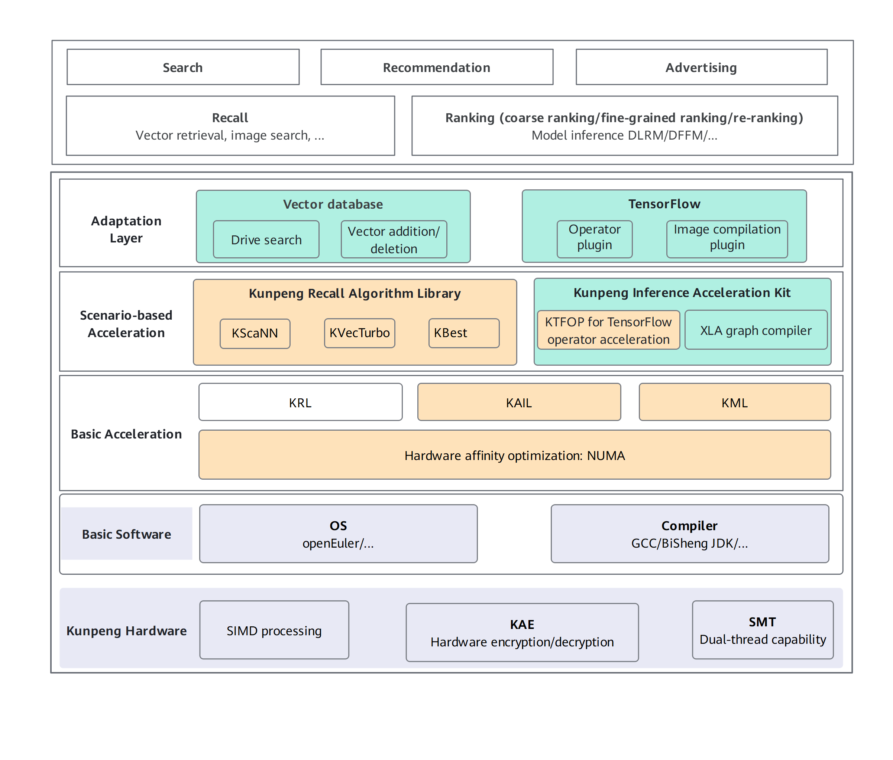

# BoostSRA

## Project Introduction

### Overview

The BoostSRA suite delivers high-performance application-layer acceleration for search, recommendation, and advertising (SRA) services. It features advanced retrieval algorithms for recall scenarios and optimized model inference frameworks to enhance ranking performance.

### Architecture

## Community

[BoostSRA](https://www.hikunpeng.com/document/detail/en/SRA/overview/kunpengsra.html)

## Recall Algorithms

| Algorithm| Description| Repository Path|
| :---| :--- | :--- |
| KBest| Kunpeng Blazing-fast embedding similarity search thruster (KBest) is a proprietary, efficient graph-based retrieval algorithm. It is designed for large-scale embedding similarity search scenarios.| [KBest documentation](./docs/en/kbest/README.md) **Only the documentation repository path is provided. The code repository will be released as open source at a later stage.**|
| KScaNN| Kunpeng Scalable Nearest Neighbors (KScaNN) is an inverted index-based vector retrieval algorithm that deeply optimizes index layout, algorithmic logic, and computing process to fully unlock the chip potential.| [KScaNN documentation](./docs/en/kscann/README.md) **Only the documentation repository path is provided. The code repository will be released as open source at a later stage.**|
| KRL| Kunpeng Retrieval Library (KRL) is an operator library optimized for the Kunpeng platform to accelerate vector retrieval. KRL operators can be enabled to accelerate algorithms such as HNSW, PQFS, IVFPQ, and IVFPQFS—implemented in the open-source Facebook AI Similarity Search (Faiss) library.| [KRL documentation](./docs/en/krl/README.md) **Only the documentation repository path is provided. The code repository will be released as open source at a later stage.**|
| KVecTurbo| KVecTurbo is a proprietary vector retrieval acceleration component and can work with the openGauss vector database. It quantifies and compresses high-dimensional vectors to quickly obtain the near neighbors of a query. In addition, KVecTurbo uses the SIMD instructions to accelerate distance calculation for multidimensional Nearest Neighbor Search (NNS).|[KVecTurbo](https://gitcode.com/boostkit/kvecturbo) |

## Recall Algorithm Extensions

| Algorithm| Description| Repository Path|
| :---| :--- | :--- |
| PforDelta extension| Engineered for the recall pipeline, it uses Kunpeng SIMD instructions to accelerate decompression of inverted index lists compressed with PForDelta.| <ul><li>[Source code repository](https://github.com/diegocaro/compression)</li><li>[Extension repository](https://gitcode.com/boostkit/knewpfordelta)</li></ul> |
| hnswlib extension| Optimized for Kunpeng processors, it supports FP16 data type through vectorization and leverages optimization policies such as prefetching and instruction rescheduling.| <ul><li>[Source code repository](https://github.com/nmslib/hnswlib)</li><li>[Expansion repository](https://gitcode.com/boostkit/hnswlib)</li></ul> |
| Faiss extension| Tailored to the Kunpeng architecture, it integrates vectorization, dimension-interleaved lookup and accumulation, and vector filtering and compression.| <ul><li>[Source code repository](https://github.com/facebookresearch/faiss/releases/tag/v1.8.0)</li><li>[Extension repository](https://gitcode.com/boostkit/faiss)</li></ul> |
| RaBitQ extension| It adapts the RaBitQ algorithm for the Arm Architecture 64-bit (AArch64) architecture, introducing FP16 precision optimization, NEON SIMD vectorization, assembly-level Lookup Table (LUT) acceleration, Spilling with Orthogonality-Amplified Residuals (SOAR) vector allocation, and ML-based adaptive nprobe.| <ul><li>[Source code repository](https://github.com/gaoj0017/RaBitQ)</li><li>[Extension repository](https://gitcode.com/boostkit/rabitq)</li></ul> |

## Real-time Inference Extensions

| Algorithm| Description| Repository Path|
| :---| :--- | :--- |
| EmbeddingLookup extension| It reduces the lookup latency in the core modules of real-time recommendation systems through key techniques such as compiler option tuning, spinlock optimization, memory alignment optimization, and Arm SIMD vectorization.| <ul><li>[Source code repository](https://github.com/bytedance/monolith)</li><li>[Extension repository](https://gitcode.com/boostkit/monolith)</li></ul>|

## Ranking Inference

| Algorithm| Description| Repository Path|
| :---| :--- | :--- |
| KDNN| Based on the microarchitecture features of the Kunpeng processor, Kunpeng Deep Neural Network Library (KDNN) enhances the performance of core DNN operators through vectorization, assembly-level optimizations, and algorithmic improvements.| [KDNN documentation](./docs/en/kdnn/README.md)  **Only the documentation repository path is provided. The code repository will be released as open source at a later stage.**|
| ANNC| Accelerated Neural Network Compiler (ANNC) speeds up neural network computing. It accelerates inference for recommendation systems and foundation models by optimizing computational graphs, generating and integrating high-performance fused operators, and applying efficient code generation and optimization. In addition, ANNC works with popular open-source inference frameworks.| [ANNC repository](https://gitee.com/src-openeuler/ANNC)|

## Ranking Inference Extensions

| Algorithm| Description| Repository Path|
| :---| :--- | :--- |
| TensorFlow extension| Optimized the TensorFlow framework for the Kunpeng platform, including native TensorFlow (TF) operator optimizations.| <ul><li>[Source code repository](https://github.com/tensorflow/tensorflow)</li><li>[Extension repository](https://gitcode.com/boostkit/tensorflow)</li></ul>|
| TensorFlow Serving extension| Optimized the TensorFlow Serving framework for the Kunpeng platform, including thread scheduling optimizations.| <ul><li>[Source code repository](https://github.com/tensorflow/serving)</li><li>[Extension repository](https://gitcode.com/boostkit/tensorflow-serving)</li></ul>|
| TVM extension| Optimized the TVM framework for the Kunpeng platform, including softmax operator optimizations.| <ul><li>[Source code repository](https://github.com/apache/tvm)</li><li>[Extension repository](https://gitee.com/openeuler/sra_tvm_adapter)</li></ul>|
| oneDNN extension| KDNN can be integrated into the open-source oneDNN as a plugin to provide full DNN capabilities.| <ul><li>[Source code repository](https://github.com/uxlfoundation/oneDNN)</li><li>[Expansion repository](https://gitee.com/openeuler/kail_dnn_adapter)</li></ul>|
| TensorRT-LLM extension| It includes features such as operator optimizations, memory access optimizations, and parameter configuration features.| <ul><li>[Source code repository](https://github.com/NVIDIA/TensorRT-LLM)</li><li>[Extension repository](https://gitcode.com/boostkit/tensorrt-llm)</li></ul>|

## Tools

### Benchmark

[SRA benchmark](https://gitee.com/openeuler/sra_benchmark): includes the ranking inference performance benchmarks for multiple models, such as DLRM and Wide & Deep.

## Documents

Kunpeng BoostKit for SRA [Feature List](https://www.hikunpeng.com/document/detail/en/SRA/overview/kunpengsra.html).

## Discussions

If you encounter any issues, join the [discussion](https://gitcode.com/BoostKit/BoostSRA/discussions) and contact us.

## License Agreement

By using the source code and its accompanying software, you acknowledge that you have read, understood, and agreed to be bound by the terms and conditions of the software license agreement.
