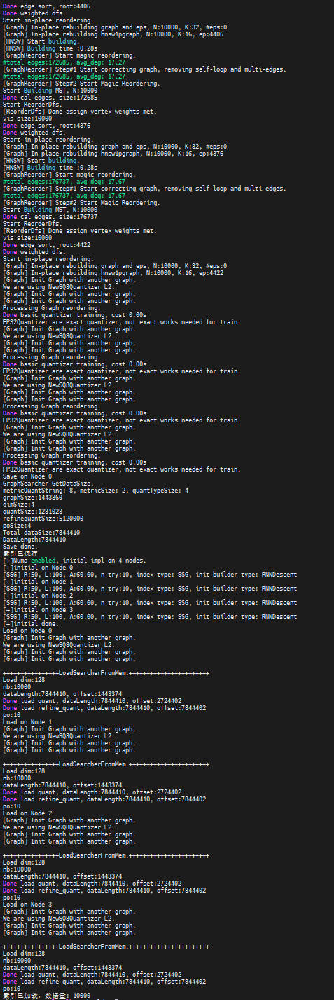

# Quick Start

This document provides a quick start guide for KBest.

## Core Concepts

KBest is a graph-based approximate nearest neighbor (ANN) search algorithm. Its core is the graph index, which constructs neighbor relationships among vectors to enable efficient similarity search.

- Vectors: KBest supports float32 vectors.
- Index types: KBest implements ANN search using graph structures and supports multiple neighbor selection strategies (HNSW, NSG, TSDG, and SSG). The HNSW strategy is recommended for beginners.
- Core workflow: Create an index → Add vectors and build a graph index → Build a searcher → Execute similarity search.

## Example

The following example demonstrates the core usage scenarios of KBest, with inline comments and result parsing.

### Python

```python
import numpy as np
import kbest

# 1. Prepare data.
d = 128                                       # Vector dimension
nb = 10000                                    # Number of database vectors
nq = 5                                        # Number of query vectors

np.random.seed(42)
db_vectors = np.random.random((nb, d)).astype(np.float32) # Database vectors
query_vectors = np.random.random((nq, d)).astype(np.float32) # Query vectors

# 2. Create an index.
# Parameter description: dimension, number of neighbors R, graph construction candidate list L, angle threshold A, and number of iterations for graph optimization
#          Distance type, graph construction algorithm, neighbor policy, NUMA option, and number of NUMA nodes.
index = kbest.KBest(d, 32, 200, 60, 2, "L2", "RNNDescent", "HNSW", False, 1)

# 3. Add vectors and build a graph index.
# Parameter description: vectors, data, block size, reordering option, and quantization level (0=FP32)
index.add(nb, db_vectors, 16, 1, 0)
print(f"Number of vectors in the index: {index.getNTotal()}")  # Output: 10000

# 4. Build a searcher (must be called before search).
index.buildSearcher()

# 5. (Optional) Set search parameters.
index.setEf(100)

# 6. Perform the search.
k = 4 #                                         Return top four nearest vectors.
distances = np.zeros((nq, k), dtype=np.float32)
indices = np.zeros((nq, k), dtype=np.int64)

index.search(nq, query_vectors, k, distances, indices, 4)

# 7. Parse the result.
print("Nearest neighbor indices and distances:")
for i in range(nq):
    result = " ".join([f"{indices[i,j]}({distances[i,j]:.4f})" for j in range(k)])
    print(f"Query {i}: {result}")
```

The expected output is as follows:


### C++

```c++
#include <iostream>
#include <vector>
#include <random>
#include "kbest.h"

int main() {
    // 1. Prepare data.
    int d = 128;                              // Vector dimension
    int nb = 10000;                           // Number of database vectors
    int nq = 5;                               // Number of query vectors

    std::vector<float> db_vectors(nb * d);    // Database vectors
    std::vector<float> query_vectors(nq * d); // Query vectors

    // Randomly generate vector data.
    std::mt19937 rng(42);
    std::uniform_real_distribution<float> dist(0.0f, 1.0f);
    for (auto& v : db_vectors) v = dist(rng);
    for (auto& v : query_vectors) v = dist(rng);

    // 2. Create an index.
    // Parameter description: dimension = 128, number of neighbors R = 32, graph construction candidate list L = 200, angle threshold A = 60
    //          Number of iterations for graph optimization = 2, distance type = L2, graph construction algorithm = RNNDescent, neighbor policy = HNSW
    KBest index(d, 32, 200, 60, 2, "L2", "RNNDescent", "HNSW");

    // 3. Add vectors and build a graph index.
    //Parameter description: data volume, data pointer, block size = 16, reordering = 1, quantization level = 0 (FP32)
    index.Add(nb, db_vectors.data(), 16, 1, 0);
    std::cout << "Number of vectors in the index: " << index.GetNTotal() << std::endl;  // Output: 10000

    // 4. Build a searcher (must be called before search).
    index.BuildSearcher();

    // 5. (Optional) Set search parameters. A larger ef value indicates higher accuracy but slower search.
    index.SetEf(100);

    // 6. Perform the search (returning k nearest neighbors for each query).
    int k = 4;                                // Return top four nearest vectors.
    std::vector<float> distances(nq * k);    // Store the distance result.
    std::vector<int64_t> indices(nq * k);    // Store the index result.

    index.Search(nq, query_vectors.data(), k, distances.data(), indices.data(), 4);

    // 7. Parse the result.
    std::cout << "Nearest neighbor indices and distances: " << std::endl;
    for (int i = 0; i < nq; i++) {
        std::cout << "Query " << i << ": ";
        for (int j = 0; j < k; j++) {
            std::cout << indices[i * k + j] << "(" << distances[i * k + j] << ") ";
        }
        std::cout << std::endl;
    }

    return 0;
}
```

The expected output is as follows:


## Advanced Extension

The advanced example demonstrates functions such as index persistence and quantization acceleration.

### Python

```python
import numpy as np
import kbest

d = 128
nb = 10000

db_vectors = np.random.random((nb, d)).astype(np.float32)

# ===== Build an index with quantization acceleration =====
index = kbest.KBest(d, 32, 200, 60, 2, "L2", "RNNDescent", "HNSW", False, 1)

# Quantization levels: 0=FP32 (highest accuracy); 1=SQ8U; 2=SQ4U; and 3=FP16
level = 1 # Use SQ8U quantization.
index.add(nb, db_vectors, 16, 1, level)
index.buildSearcher()

# ===== Save the index to a file =====
index.save("./kbest_index.bin")
print("Index saved successfully")

# ===== Load the index and perform search directly =====
loaded_index = kbest.KBest(False, 1)          # Special constructor for loading (numa_enabled, numa_nodes)
loaded_index.load("./kbest_index.bin")
print(f"Index loaded, total vectors: {loaded_index.getNTotal()}")

# After setting the search parameters, perform the search directly without rebuilding the index.
loaded_index.setEf(100)
nq, k = 1, 4
query = np.random.random((nq, d)).astype(np.float32)
distances = np.zeros((nq, k), dtype=np.float32)
indices = np.zeros((nq, k), dtype=np.int64)
loaded_index.search(nq, query, k, distances, indices, 4)

print("Search results after loading:")
for i in range(nq):
    result = " ".join([f"{indices[i,j]}({distances[i,j]:.4f})" for j in range(k)])
    print(f"  Query {i}: {result}")
```

The expected output is as follows:


### C++

```c++
#include <iostream>
#include <vector>
#include "kbest.h"

int main() {
    int d = 128;
    int nb = 10000;

    std::vector<float> db_vectors(nb * d);
    // ... Populate data ...

    // ===== Build an index with quantization acceleration =====
    KBest index(d, 32, 200, 60, 2, "L2", "RNNDescent", "HNSW");

    // Quantization level: 0=FP32 (highest accuracy); 1=SQ8U; 2=SQ4U; and 3=FP16
    int level = 1;  // Use SQ8U quantization to balance performance and accuracy.
    index.Add(nb, db_vectors.data(), 16, 1, level);
    index.BuildSearcher();

    // ===== Save the index to a file =====
    index.Save("./kbest_index.bin");
    std::cout << "Index saved successfully" << std::endl;

    // ===== Load the index and perform search directly =====
    KBest loaded_index;                       // Default constructor
    loaded_index.Load("./kbest_index.bin");   // Load the searcher.
    std::cout << "Index loaded, total vectors: " << loaded_index.GetNTotal() << std::endl;

    // After setting the search parameters, perform the search directly without the need to rebuild the index.
    loaded_index.SetEf(100);
    int nq = 1, k = 4;
    std::vector<float> query(d), distances(k);
    std::vector<int64_t> indices(k);
    loaded_index.Search(nq, query.data(), k, distances.data(), indices.data(), 4);

    return 0;
}
```

The expected output is as follows:



## Advanced Parameter Tuning Guide <a name="ZH-CN_TOPIC_0000002522066588"></a>

This section provides the advanced tuning guide for parameters related to the KBest APIs, which applies to both C++ and Python APIs.

**Constructor API <a name="section8200133234918"></a>**

<a name="table1366255115497"></a>
<table><thead align="left"><tr id="row66786517499"><th class="cellrowborder" valign="top" width="8.95%" id="mcps1.1.5.1.1"><p id="p66781551124917"><a name="p66781551124917"></a><a name="p66781551124917"></a><strong id="b76781251184911"><a name="b76781251184911"></a><a name="b76781251184911"></a>ParameterName</strong></p>
</th>
<th class="cellrowborder" valign="top" width="15.36%" id="mcps1.1.5.1.2"><p id="p46781651164920"><a name="p46781651164920"></a><a name="p46781651164920"></a><strong id="b146785514496"><a name="b146785514496"></a><a name="b146785514496"></a>Value Range</strong></p>
</th>
<th class="cellrowborder" valign="top" width="11.28%" id="mcps1.1.5.1.3"><p id="p14678205194912"><a name="p14678205194912"></a><a name="p14678205194912"></a><strong id="b867895112493"><a name="b867895112493"></a><a name="b867895112493"></a>Recommended Value</strong></p>
</th>
<th class="cellrowborder" valign="top" width="64.41%" id="mcps1.1.5.1.4"><p id="p19678125114915"><a name="p19678125114915"></a><a name="p19678125114915"></a>Tuning Description</p>
</th>
</tr>
</thead>
<tbody><tr id="row0678115116491"><td class="cellrowborder" valign="top" width="8.95%" headers="mcps1.1.5.1.1 "><p id="p10678175124917"><a name="p10678175124917"></a><a name="p10678175124917"></a>R</p>
</td>
<td class="cellrowborder" valign="top" width="15.36%" headers="mcps1.1.5.1.2 "><p id="p16678151194911"><a name="p16678151194911"></a><a name="p16678151194911"></a>[11, 499]</p>
</td>
<td class="cellrowborder" valign="top" width="11.28%" headers="mcps1.1.5.1.3 "><p id="p0678165110491"><a name="p0678165110491"></a><a name="p0678165110491"></a>50</p>
</td>
<td class="cellrowborder" valign="top" width="64.41%" headers="mcps1.1.5.1.4 "><p id="p9678951174913"><a name="p9678951174913"></a><a name="p9678951174913"></a>Number of neighboring nodes, which affects the graph build time and final index quality. The value <code>50</code> is recommended. A larger value prolongs the build time and compromises the search performance. A smaller value reduces the search accuracy.</p>
</td>
</tr>
<tr id="row12678115134918"><td class="cellrowborder" valign="top" width="8.95%" headers="mcps1.1.5.1.1 "><p id="p8678351104913"><a name="p8678351104913"></a><a name="p8678351104913"></a>L</p>
</td>
<td class="cellrowborder" valign="top" width="15.36%" headers="mcps1.1.5.1.2 "><p id="p136781451144916"><a name="p136781451144916"></a><a name="p136781451144916"></a>[11, 1999]</p>
</td>
<td class="cellrowborder" valign="top" width="11.28%" headers="mcps1.1.5.1.3 "><p id="p176785511495"><a name="p176785511495"></a><a name="p176785511495"></a>100 or 200</p>
</td>
<td class="cellrowborder" valign="top" width="64.41%" headers="mcps1.1.5.1.4 "><p id="p267813517498"><a name="p267813517498"></a><a name="p267813517498"></a>Size of the candidate node list during graph build, which affects the graph build time and final index quality. The value <code>100</code> is recommended. A larger value prolongs the build time.</p>
</td>
</tr>
<tr id="row8678951164919"><td class="cellrowborder" valign="top" width="8.95%" headers="mcps1.1.5.1.1 "><p id="p1367855144915"><a name="p1367855144915"></a><a name="p1367855144915"></a>A</p>
</td>
<td class="cellrowborder" valign="top" width="15.36%" headers="mcps1.1.5.1.2 "><p id="p167815519497"><a name="p167815519497"></a><a name="p167815519497"></a>[1, 360]</p>
</td>
<td class="cellrowborder" valign="top" width="11.28%" headers="mcps1.1.5.1.3 "><p id="p76788512492"><a name="p76788512492"></a><a name="p76788512492"></a>60 or 120</p>
</td>
<td class="cellrowborder" valign="top" width="64.41%" headers="mcps1.1.5.1.4 "><p id="p06781351134912"><a name="p06781351134912"></a><a name="p06781351134912"></a>Angle threshold for pruning during graph build. For an IP dataset, the value <code>120</code> is used, while for the L2 dataset, <code>60</code>.</p>
</td>
</tr>
<tr id="row11894754132116"><td class="cellrowborder" valign="top" width="8.95%" headers="mcps1.1.5.1.1 "><p id="p1589414545217"><a name="p1589414545217"></a><a name="p1589414545217"></a>graph_opt_iter</p>
</td>
<td class="cellrowborder" valign="top" width="15.36%" headers="mcps1.1.5.1.2 "><p id="p118941454192120"><a name="p118941454192120"></a><a name="p118941454192120"></a>[0, 30]</p>
</td>
<td class="cellrowborder" valign="top" width="11.28%" headers="mcps1.1.5.1.3 "><p id="p0894105410210"><a name="p0894105410210"></a><a name="p0894105410210"></a>29</p>
</td>
<td class="cellrowborder" valign="top" width="64.41%" headers="mcps1.1.5.1.4 "><p id="p8894954162112"><a name="p8894954162112"></a><a name="p8894954162112"></a>Number of self-iterations of the graph index. A larger value prolongs the build process.</p>
</td>
</tr>
</tbody>
</table>

**Add<a name="section9524192295015"></a>**

<a name="table13386938135011"></a>
<table><thead align="left"><tr id="row4398638195017"><th class="cellrowborder" valign="top" width="9.89%" id="mcps1.1.5.1.1"><p id="p14398143815014"><a name="p14398143815014"></a><a name="p14398143815014"></a><strong id="b73981038135019"><a name="b73981038135019"></a><a name="b73981038135019"></a> Parameter Name</strong></p>
</th>
<th class="cellrowborder" valign="top" width="14.360000000000001%" id="mcps1.1.5.1.2"><p id="p20398183825020"><a name="p20398183825020"></a><a name="p20398183825020"></a><strong id="b15398193811506"><a name="b15398193811506"></a><a name="b15398193811506"></a>Value Range</strong></p>
</th>
<th class="cellrowborder" valign="top" width="11.17%" id="mcps1.1.5.1.3"><p id="p03986387506"><a name="p03986387506"></a><a name="p03986387506"></a><strong id="b143981138175013"><a name="b143981138175013"></a><a name="b143981138175013"></a>Recommended Value</strong></p>
</th>
<th class="cellrowborder" valign="top" width="64.58%" id="mcps1.1.5.1.4"><p id="p12398113814500"><a name="p12398113814500"></a><a name="p12398113814500"></a>Tuning Description</p>
</th>
</tr>
</thead>
<tbody><tr id="row16398133816503"><td class="cellrowborder" valign="top" width="9.89%" headers="mcps1.1.5.1.1 "><p id="p19398938175019"><a name="p19398938175019"></a><a name="p19398938175019"></a>level</p>
</td>
<td class="cellrowborder" valign="top" width="14.360000000000001%" headers="mcps1.1.5.1.2 "><p id="p143981138165019"><a name="p143981138165019"></a><a name="p143981138165019"></a>[0, 3]</p>
</td>
<td class="cellrowborder" valign="top" width="11.17%" headers="mcps1.1.5.1.3 "><p id="p1992794810503"><a name="p1992794810503"></a><a name="p1992794810503"></a>1 or 2</p>
</td>
<td class="cellrowborder" valign="top" width="64.58%" headers="mcps1.1.5.1.4 "><p id="p19398173875010"><a name="p19398173875010"></a><a name="p19398173875010"></a>Quantization level. <code>1</code>: SQ8U quantization; <code>2</code>: SQ4U quantization. <code>1</code> is used for the IP dataset, while <code>2</code> for the L2 dataset.</p>
</td>
</tr>
</tbody>
</table>

**SetEf<a name="section2981160145118"></a>**

<a name="table133713875113"></a>
<table><thead align="left"><tr id="row45010812514"><th class="cellrowborder" valign="top" width="9.979002099790021%" id="mcps1.1.4.1.1"><p id="p165012816514"><a name="p165012816514"></a><a name="p165012816514"></a><strong id="b3508855110"><a name="b3508855110"></a><a name="b3508855110"></a>Parameter</strong></p>
</th>
<th class="cellrowborder" valign="top" width="25.537446255374462%" id="mcps1.1.4.1.2"><p id="p0509813518"><a name="p0509813518"></a><a name="p0509813518"></a><strong id="b185019819512"><a name="b185019819512"></a><a name="b185019819512"></a>Value Range</strong></p>
</th>
<th class="cellrowborder" valign="top" width="64.48355164483553%" id="mcps1.1.4.1.3"><p id="p1850184510"><a name="p1850184510"></a><a name="p1850184510"></a>Tuning Description</p>
</th>
</tr>
</thead>
<tbody><tr id="row185012810519"><td class="cellrowborder" valign="top" width="9.979002099790021%" headers="mcps1.1.4.1.1 "><p id="p1550188195117"><a name="p1550188195117"></a><a name="p1550188195117"></a>ef</p>
</td>
<td class="cellrowborder" valign="top" width="25.537446255374462%" headers="mcps1.1.4.1.2 "><p id="p1667165924518"><a name="p1667165924518"></a><a name="p1667165924518"></a>[1, nb], where <span class="parmname" id="parmname336535516614"><a name="parmname336535516614"></a><a name="parmname336535516614"></a><code>nb</code></span> indicates the number of data entries in the vector database.</p>
</td>
<td class="cellrowborder" valign="top" width="64.48355164483553%" headers="mcps1.1.4.1.3 "><p id="p75010812517"><a name="p75010812517"></a><a name="p75010812517"></a>Size of the candidate node list during search. For small-scale datasets, the recommended value range is [10, 500]. A larger <code>ef</code> value leads to higher search accuracy but slower search. Therefore, once the required accuracy is reached, <code>ef</code> should be kept smaller to preserve efficiency.</p>
</td>
</tr>
</tbody>
</table>

**SetEarlyStoppingParams<a name="section158341126132613"></a>**

<a name="table158341026202611"></a>
<table><thead align="left"><tr id="row083442632614"><th class="cellrowborder" valign="top" width="10.048995100489948%" id="mcps1.1.4.1.1"><p id="p138349263265"><a name="p138349263265"></a><a name="p138349263265"></a><strong id="b98342263261"><a name="b98342263261"></a><a name="b98342263261"></a>Parameter</strong></p>
</th>
<th class="cellrowborder" valign="top" width="25.68743125687431%" id="mcps1.1.4.1.2"><p id="p178349264263"><a name="p178349264263"></a><a name="p178349264263"></a><strong id="b1283432682617"><a name="b1283432682617"></a><a name="b1283432682617"></a>Value Range</strong></p>
</th>
<th class="cellrowborder" valign="top" width="64.26357364263573%" id="mcps1.1.4.1.3"><p id="p4834926162617"><a name="p4834926162617"></a><a name="p4834926162617"></a>Tuning Description </p>
</th>
</tr>
</thead>
<tbody><tr id="row983432622611"><td class="cellrowborder" valign="top" width="10.048995100489948%" headers="mcps1.1.4.1.1 "><p id="p383412610265"><a name="p383412610265"></a><a name="p383412610265"></a>adding_pref</p>
</td>
<td class="cellrowborder" valign="top" width="25.68743125687431%" headers="mcps1.1.4.1.2 "><p id="p15834122613266"><a name="p15834122613266"></a><a name="p15834122613266"></a>It must be greater than or equal to 1</p>
</td>
<td class="cellrowborder" valign="top" width="64.26357364263573%" headers="mcps1.1.4.1.3 "><p id="p1983482616262"><a name="p1983482616262"></a><a name="p1983482616262"></a>Threshold in the search early stopping mechanism. It specifies the maximum acceptable insertion rank for candidate nodes. If a node is inserted into the candidate list at a rank greater than or equal to <code>adding_pref</code>, the node is considered too far from the query and unlikely to yield the correct answer in subsequent search steps. A smaller <code>adding_pref</code> value boosts search speed at the expense of reduced accuracy.</p>
</td>
</tr>
<tr id="row12289144115296"><td class="cellrowborder" valign="top" width="10.048995100489948%" headers="mcps1.1.4.1.1 "><p id="p4289541152916"><a name="p4289541152916"></a><a name="p4289541152916"></a>patience</p>
</td>
<td class="cellrowborder" valign="top" width="25.68743125687431%" headers="mcps1.1.4.1.2 "><p id="p528984112292"><a name="p528984112292"></a><a name="p528984112292"></a>It must be greater than or equal to 1.</p>
</td>
<td class="cellrowborder" valign="top" width="64.26357364263573%" headers="mcps1.1.4.1.3 "><p id="p23507402345"><a name="p23507402345"></a><a name="p23507402345"></a>Patience value in the search early stopping mechanism. It defines the tolerance for consecutive insertions at ranks beyond <code>adding_pref</code> (or failed insertions). If the number of such consecutive events exceeds the patience value, the search terminates. A smaller <code>patience</code> value boosts search speed at the expense of reduced accuracy.</p>
</td>
</tr>
</tbody>
</table>
