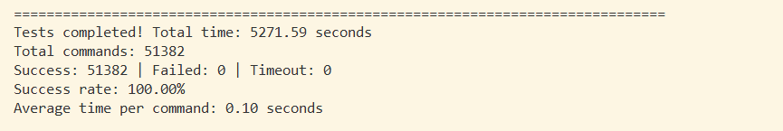

# Best Practices

## Adapting TensorFlow for KDNN

This document describes how to adapt the TensorFlow matrix operators (MatMul and FusedMatMul, which correspond to the Gemm operator of KDNN) to KDNN. Follow the instructions in this section. Improper operations may introduce undefined behaviors. Exercise caution when performing this operation.

1. Install basic software.

    ```bash
    yum install gcc g++ zip python vim tar wget unzip 
    ```

2. Install Bazel by following the instructions in [Installing Bazel](https://www.hikunpeng.com/document/detail/en/SRA/ecosystemEnable/TensorFlow/kunpengtensorflow_02_0008.html) in the _TensorFlow Porting Guide_. Bazel is required for TensorFlow compilation. For TensorFlow 2.15.0, download Bazel 6.5.0.

3. Download open-source TensorFlow 2.15.0 from GitHub.

    ```bash
    git clone -b v2.15.0 https://github.com/tensorflow/tensorflow.git 
    ```

4. Download the optimization patch from GitCode and integrate it into the open-source TensorFlow directory.

    ```bash
    git clone -b v2.15.0-2512 https://gitcode.com/boostkit/tensorflow.git sra-tensorflow 
    cp /path/to/sra-tensorflow/0001-boostsra-tensorflow.patch /path/to/tensorflow/ 
    cd /path/to/tensorflow && patch -p1 < 0001-boostsra-tensorflow.patch
    ```

5. Install the dependencies.

    ```bash
    yum install patchelf perl python3-devel
    pip3 install numpy==1.24.3
    pip3 install certifi==2023.7.22
    pip3 install requests==2.31.0
    pip3 install grpcio==1.59.0
    pip3 install packaging
    pip3 install wheel
    export C_INCLUDE_PATH=/usr/include/python3.9:$C_INCLUDE_PATH
    export CPLUS_INCLUDE_PATH=/usr/include/python3.9:$CPLUS_INCLUDE_PATH
    ```

    In the preceding commands, <code>/usr/include/python3.9</code> is the directory where <code>Python.h</code> is stored. Replace it with the actual directory in the compilation environment.

6. Prepare the KDNN header file and static library.

    ```bash
    cd /path/to/tensorflow/third_party/KDNN
    cp -r /usr/local/kdnn/include .
    mkdir -p src && cp /usr/local/kdnn/lib/threadpool/libkdnn.a src
    ```

7. Go to the KDNN directory and apply the header file patch to enable TensorFlow's exception handling feature.

    ```bash
    patch -p0 < tensorflow_kdnn_include_adapter.patch
    ```

8. Return to the TensorFlow root directory and configure the build options. For details about how to configure the compilation options, see [Installation from Source Code](https://www.hikunpeng.com/document/detail/en/SRA/ecosystemEnable/TensorFlow/kunpengtensorflow_02_0009.html) in the _TensorFlow Porting Guide_.

    ```bash
    cd ../..
    ./configure
    ```

9. Start the build.

    ```bash
    export TF_PYTHON_VERSION=3.9
    bazel --output_user_root=../output build -c opt --define=enable_kdnn=true //tensorflow/tools/pip_package:build_pip_package
    ```

    <code>../output</code> indicates the specified build output directory.

10. Install the pip package.

    ```bash
    ./bazel-bin/tensorflow/tools/pip_package/build_pip_package ./output-kdnn
    pip3 install ./output-kdnn/tensorflow-2.15.0-cp39-cp39-linux_aarch64.whl
    ```

## Adapting oneDNN for KDNN

This section describes how to adapt oneDNN for KDNN. Misoperations may introduce undefined behaviors. Exercise caution when performing this operation.

**Adaptation Procedure<a name="section39201312169"></a>**

1. Obtain the oneDNN adaptation code. Assume that <code>/path/to</code> is the directory where the source code is cloned.

    ```bash
    git clone -b v3.1.0 https://gitcode.com/openeuler/kail_dnn_adapter.git
    cd kail_dnn_adapter
    git submodule update --init --recursive
    cd oneDNN-open
    ulimit -n 262144
    patch -p1 < ../0001-kdnn-adapter.patch
    ```

2. Go to the <code>/path/to/kail_dnn_adapter</code> directory and compile oneDNN.

    - For Kunpeng 920 processors:

        ```bash
        cd /path/to/kail_dnn_adapter
        sh build.sh --use_static_kdnn=off
        ```

        The <code>--use_static_kdnn=on/off</code> option specifies whether to use the KDNN static library or dynamic library during compilation. The default value is <code>off</code>.

    - For new Kunpeng 920 processor model (the following example is based on the BiSheng Compiler):

        ```bash
        cd /path/to/kail_dnn_adapter
        sh build.sh --compiler=clang
        ```

    Path of the compilation product:

    Path to <code>libdnnl.so</code>: <code>out/oneDNN-open/build/src/</code>

    Paths to the dependency libraries:

    - Path to <code>.so</code> files related to ACL: <code>out/ComputeLibrary-23.11/build/</code>
    - Path to <code>.so</code> files related to KAIL: <code>/usr/local/kdnn/lib/omp/libkdnn.so</code>

    You can use all interfaces of oneDNN v3.4.0 by linking against <code>libdnnl.so</code>.

    > **NOTE**
    >In the compile command, <code>--compiler=clang</code> indicates that the BiSheng Compiler is used. By default, GCC is used.

**Verification After Adaptation <a name="section193111321616"></a>**

After compiling oneDNN, use the test cases included in the software package to verify the adaptation.

1. Go to the <code>/path/to/kail_dnn_adapter/out/llt/scripts</code> directory.

    ```bash
    cd /path/to/kail_dnn_adapter/out/llt/scripts
    ```

2. Run the test cases.

    ```bash
    python run_daily_build.py --working_dir=../../oneDNN-open/build/tests/benchdnn
    ```

    If all results returned <code>passed</code> and the following information is displayed, oneDNN is successfully adapted.

    
