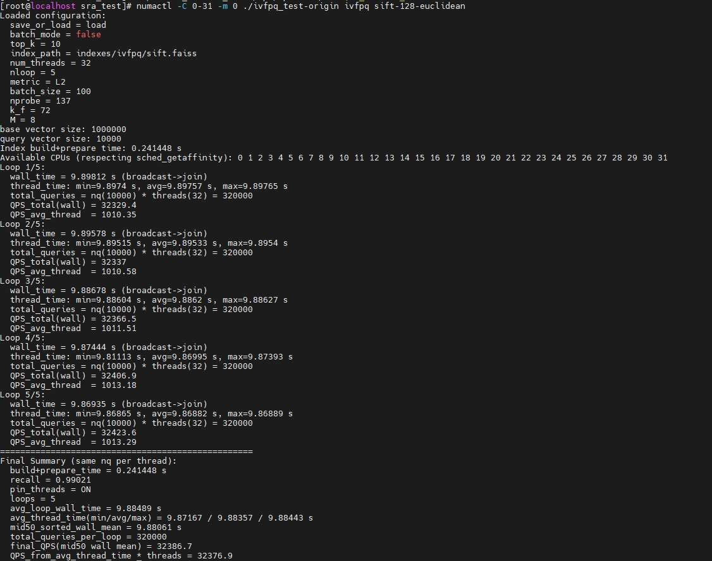

# User Guide

## Verified Environment

To use KRL smoothly and securely, ensure that your environment is one of the verified environments.

**Table 1** Verified environments for KRL<a id="verified-environments-for-krl"></a>

<a name="table113653362525"></a>
<table><thead align="left"><tr id="row2036563612525"><th class="cellrowborder" valign="top" width="21.77%" id="mcps1.2.6.1.1"><p id="p10365836165218"><a name="p10365836165218"></a><a name="p10365836165218"></a>OS</p>
</th>
<th class="cellrowborder" valign="top" width="23.5%" id="mcps1.2.6.1.2"><p id="p53652363523"><a name="p53652363523"></a><a name="p53652363523"></a>CPU</p>
</th>
<th class="cellrowborder" valign="top" width="18.44%" id="mcps1.2.6.1.3"><p id="p136510367522"><a name="p136510367522"></a><a name="p136510367522"></a>Memory</p>
</th>
<th class="cellrowborder" valign="top" width="16.900000000000002%" id="mcps1.2.6.1.4"><p id="p20365836185215"><a name="p20365836185215"></a><a name="p20365836185215"></a>Compiler</p>
</th>
<th class="cellrowborder" valign="top" width="19.39%" id="mcps1.2.6.1.5"><p id="p6365123615524"><a name="p6365123615524"></a><a name="p6365123615524"></a>CMake</p>
</th>
</tr>
</thead>
<tbody><tr id="row10365113685217"><td class="cellrowborder" valign="top" width="21.77%" headers="mcps1.2.6.1.1 "><p id="p1636573614523"><a name="p1636573614523"></a><a name="p1636573614523"></a>openEuler 22.03 LTS SP3</p>
</td>
<td class="cellrowborder" valign="top" width="23.5%" headers="mcps1.2.6.1.2 "><p id="p173654366528"><a name="p173654366528"></a><a name="p173654366528"></a>New Kunpeng 920 processor model</p>
</td>
<td class="cellrowborder" valign="top" width="18.44%" headers="mcps1.2.6.1.3 "><p id="p636533625218"><a name="p636533625218"></a><a name="p636533625218"></a>16 × 32 GB</p>
</td>
<td class="cellrowborder" valign="top" width="16.900000000000002%" headers="mcps1.2.6.1.4 "><p id="p103651036185219"><a name="p103651036185219"></a><a name="p103651036185219"></a>GCC 12.3.1</p>
</td>
<td class="cellrowborder" valign="top" width="19.39%" headers="mcps1.2.6.1.5 "><p id="p285111515577"><a name="p285111515577"></a><a name="p285111515577"></a>&gt;=3.22.0</p>
</td>
</tr>
<tr id="row10335834165819"><td class="cellrowborder" valign="top" width="21.77%" headers="mcps1.2.6.1.1 "><p id="p7336183465815"><a name="p7336183465815"></a><a name="p7336183465815"></a>openEuler 24.03 LTS SP3</p>
</td>
<td class="cellrowborder" valign="top" width="23.5%" headers="mcps1.2.6.1.2 "><p id="p15336103415817"><a name="p15336103415817"></a><a name="p15336103415817"></a>Kunpeng 950 processor</p>
</td>
<td class="cellrowborder" valign="top" width="18.44%" headers="mcps1.2.6.1.3 "><p id="p233663465818"><a name="p233663465818"></a><a name="p233663465818"></a>24 × 64 GB</p>
</td>
<td class="cellrowborder" valign="top" width="16.900000000000002%" headers="mcps1.2.6.1.4 "><p id="p12971140142310"><a name="p12971140142310"></a><a name="p12971140142310"></a>GCC 12.3.1</p>
</td>
<td class="cellrowborder" valign="top" width="19.39%" headers="mcps1.2.6.1.5 "><p id="p102524252319"><a name="p102524252319"></a><a name="p102524252319"></a>&gt;=3.22.0</p>
</td>
</tr>
</tbody>
</table>

## Installing KRL

This section describes how to install KRL using the RPM package and verify the package. Using parameters supported by the RPM package manager but not documented in this guide may result in undefined behavior. Proceed with caution.

1. Obtain the KRL software installation package [BoostKit-boostsra-krl_1.1.0.zip](https://gitcode.com/boostkit/boostsra/releases/download/v1.3.0/Boostkit-boostsra-krl_1.1.0.zip) from the GitCode repository. Decompress the ZIP file to obtain the RPM installation package.

    > **NOTE:**
    >- The KRL software package consists of the following files:
    >
    > ```text
    > ├── boostsra-krl-xxxx.aarch64.rpm
    > └── 0001-faiss-1.8.0-add-krl.patch
    >    ```
    >
    > `boostsra-krl-xxxx.aarch64.rpm` contains the KRL header files and dynamic library files. `0001-faiss-1.8.0-add-krl.patch` is the patch file required for enabling KRL in Faiss 1.8.0. _xxxx_ indicates the KRL software package version.

2. Install the RPM packages.

    ```bash
    rpm -ivh boostsra-krl-xxxx.aarch64.rpm
    ```

    After the installation is complete, the environment variable `LD_LIBRARY_PATH` is automatically added to `/etc/profile`, that is, the directory `/usr/local/sra_krl/lib` where the KRL dynamic library files are located.

    In the preceding command, _xxxx_ indicates the version.

3. Run the **source** command or log in to the terminal again for the environment variable to take effect.

    ```bash
    source /etc/profile
    ```

4. Check whether the environment variable `LD_LIBRARY_PATH` contains the KRL installation path `/usr/local/sra_krl/lib`.

    ```bash
    env | grep LD_LIBRARY_PATH
    ```

    If the variable contains the installation path, the installation is successful.

    After the installation, the corresponding files are generated in the installation path (the default path is `/usr/local/sra_krl`). The `include` folder contains the header files of KRL, the `lib` folder contains the dynamic library files of KRL.

## Uninstalling KRL

Before uninstalling KRL, make sure to stop any service flows that depend on it. Using parameters supported by the RPM package manager but not documented in this guide may result in undefined behavior. Proceed with caution.

**Uninstalling the RPM Package <a name="section175738555173"></a>**

1. Run the **rpm -e** command to uninstall the RPM package.

    ```bash
    rpm -e boostkit-sra_krl
    ```

2. Verify that the installation directory `/usr/local/sra_krl` is deleted.
3. Verify that the `/etc/profile` file does not contain environment variables related to `/usr/local/sra_krl`.

## Enabling KRL in Faiss

Faiss integrates with KRL to enhance the performance of the HNSW, PQFS, IVFPQ, IVFPQFS, and IVFFLAT algorithms. Users obtain the open source Faiss 1.8.0 code, integrate a patch for enabling KRL, and compile the code to obtain the dynamic library files with KRL performance enhanced.

1. Download the open-source Faiss source code from the [GitHub repository](https://github.com/facebookresearch/faiss.git) using the `v1.8.0` tag. Save the file to a path accessible to a compiler, such as `/path/to/faiss-1.8.0`.

    ```bash
    git clone --branch v1.8.0 --single-branch https://github.com/facebookresearch/faiss.git
    ```

2. Install Make, CMake, and GCC 12. The GCC 12 installation procedure applies to openEuler 22.03 LTS SP3. openEuler 24.03 LTS SP3 comes with GCC 12 pre-installed, so you only need to install Make and CMake.

    ```bash
    yum install make cmake gcc-toolset-12-gcc gcc-toolset-12-gcc-c++ gcc-toolset-12-libstdc++-static gcc-toolset-12-gcc-gfortran
    export PATH=/opt/openEuler/gcc-toolset-12/root/usr/bin/:$PATH
    export LD_LIBRARY_PATH=/opt/openEuler/gcc-toolset-12/root/usr/lib64/:$LD_LIBRARY_PATH
    ```

3. <a name="li84129301112"></a>Faiss depends on the math library. Download the open-source OpenBLAS source code from the [GitHub repository](https://github.com/OpenMathLib/OpenBLAS.git) using the v0.3.29 tag. Save the file to a path accessible to the compiler, such as `/path/to/OpenBLAS-0.3.29`.

    ```bash
    git clone --branch v0.3.29 --single-branch https://github.com/OpenMathLib/OpenBLAS.git
    ```

4. Compile the source code to generate the `libopenblas.so` dynamic library file.

    ```bash
    cd /path/to/OpenBLAS-0.3.29/OpenBLAS
    make
    make install
    ```

    > **NOTE:**
    >You can run the `make install PREFIX=/path/to/openblas/install` command to specify the installation path `/path/to/openblas/install`. The default installation path is `/opt/OpenBLAS`.

5. Extract the patch file `0001-faiss-1.8.0-add-krl.patch` required for enabling KRL from `BoostKit-boostsra-krl_1.1.0.zip`. If you install Faiss by compiling the source code, the patch file is stored in the `/path/to/krl` directory. Install the patch file.

    ```bash
    cd /path/to/faiss-1.8.0/faiss
    patch -p1 < /path/to/krl/0001-faiss-1.8.0-add-krl.patch
    ```

6. Compile the Faiss code to obtain `libfaiss.so`.

    ```bash
    export KRL_PATH=/usr/local/sra_krl
    cd /path/to/faiss-1.8.0
    cmake -B build . \
      -DFAISS_ENABLE_GPU=OFF \
      -DBUILD_TESTING=OFF \
      -DBUILD_SHARED_LIBS=ON \
      -DCMAKE_BUILD_TYPE=Release \
      -DFAISS_OPT_LEVEL=generic \
      -DFAISS_ENABLE_PYTHON=OFF \
      -DMKL_LIBRARIES=/opt/OpenBLAS/lib/libopenblas.so
    make -C build -j faiss
    make -C build install
    ```

    > **NOTE:**
    >- Set `KRL_PATH` to `/usr/local/sra_krl`.
    >- You can add the compilation option `-DCMAKE_INSTALL_PREFIX=/path/to/faiss/install` during compilation for specifying the installation path `/path/to/faiss/install`. The default installation path is `/usr/local`.
    >- The compilation option `-DMKL_LIBRARIES` must be set to the installation path of OpenBLAS in step [3](#li84129301112).

## Performance Test

This section uses the sift-128-euclidean.hdf5 dataset, Faiss-supported algorithm (IVFPQ), and 32 threads for illustration.

**Obtaining the Dataset and Test Program<a name="section5300679419"></a>**

1. Obtain the [test program](https://atomgit.com/openeuler/sra_test.git). The branch is `v2.0.0`. Assume that the program runs at the `/path/to/sra_test` directory. The full directory structure is as follows:

    ```text
    ├── configs                                                   // Stores configuration files for the algorithm and dataset.
          └── ivfpq
                └── ivfpq_sift-128-euclidean.config 
    ├── include                                                   // Stores header files of the test framework.
          └── algo                                                // Algorithm index definitions
          └── core                                                // Header files for data processing and test result processing
          └── framework                                           // Header files related to the test framework
    ├── src                                                       // Stores source files of the test framework.
          └── algo                                                // Algorithm adaptation layers
          └── bench                                               // Centralized test file
          └── core                                                // Files for data processing and test result processing
          └── registry                                            // Algorithm factory registry
    ├── Makefile                                                  // Script for compiling the program.
    └── test.sh                                                 // Script for running the test.
    ├── test_muti-numas.sh                                        // Script for running the parallel test
    ├── data                                                      // Directory for storing datasets (You need to manually create and store datasets.)
          └── sift-128-euclidean.hdf5
    ├── indexes
          └── ivfpq                                               // Stores manually built index.
                └── sift.faiss                                    // Built index, which is generated when the executable file ivfpq_test runs and the save_or_load parameter in the dataset configuration file is set to save.
    └── ivfpq_test                                                // Executable file generated after compilation.
    ```

2. <a name="li1673311431218"></a>Obtain the dataset and save it to <code>/path/to/sra_test/data</code>.

    ```bash
    cd /path/to/sra_test
    mkdir -p data
    cd data
    wget http://ann-benchmarks.com/sift-128-euclidean.hdf5 --no-check-certificate
    ```

**Running the Performance Test<a name="section183012712414"></a>**

1. Install dependencies.

    ```bash
    yum install hdf5 hdf5-devel numactl numactl-devel
    ```

2. Build the executable file. Enter the Faiss installation path and the paths to other required dependencies as prompted by the command line. When "Enter extra compile defines" is displayed, enter `-I/path/to/krl/out/include/ -L/path/to/krl/out/lib/ -lkrl`, where `/path/to/krl/out` is the KRL installation path.

    ```bash
    cd /path/to/sra_test
    make ivfpq_test
    ```

    > **NOTE:**
    >During the test, select the appropriate compilation instruction for each algorithm.
    >- HNSW: `make hnsw_test`
    >- PQFS: `make pqfs_test`
    >- IVFPQ: `make ivfpq_test`
    >- IVFPQFS: `make ivfpqfs_test`
    >- IVFFLAT: `make ivfflat_test`

3. For the first run, ensure that `save_or_load` in the `ivfpq_sift-128-euclidean.config` file is set to `save`. In subsequent runs, you can change it to `load` to use the built graph index or retriever for querying.
4. Run the executable file. Add the OpenBLAS, Faiss, and KRL dynamic library paths to the environment variable.

    ```bash
    numactl -C 0-31 -m 0 ./ivfpq_test ivfpq sift-128-euclidean
    ```

   The results before optimization are shown in [Figure 1 Execution results before optimization](#fig9931619182).

   Figure 1 Execution results before optimization <a name="fig9931619182"></a><a id="execution-results-before-optimization"></a>

   

   The results after optimization are shown in [Figure 2 Execution results after optimization](#fig9931619183).

   Figure 2 Result after optimization <a name="fig9931619183"></a><a id="execution-results-after-optimization"></a>

   
