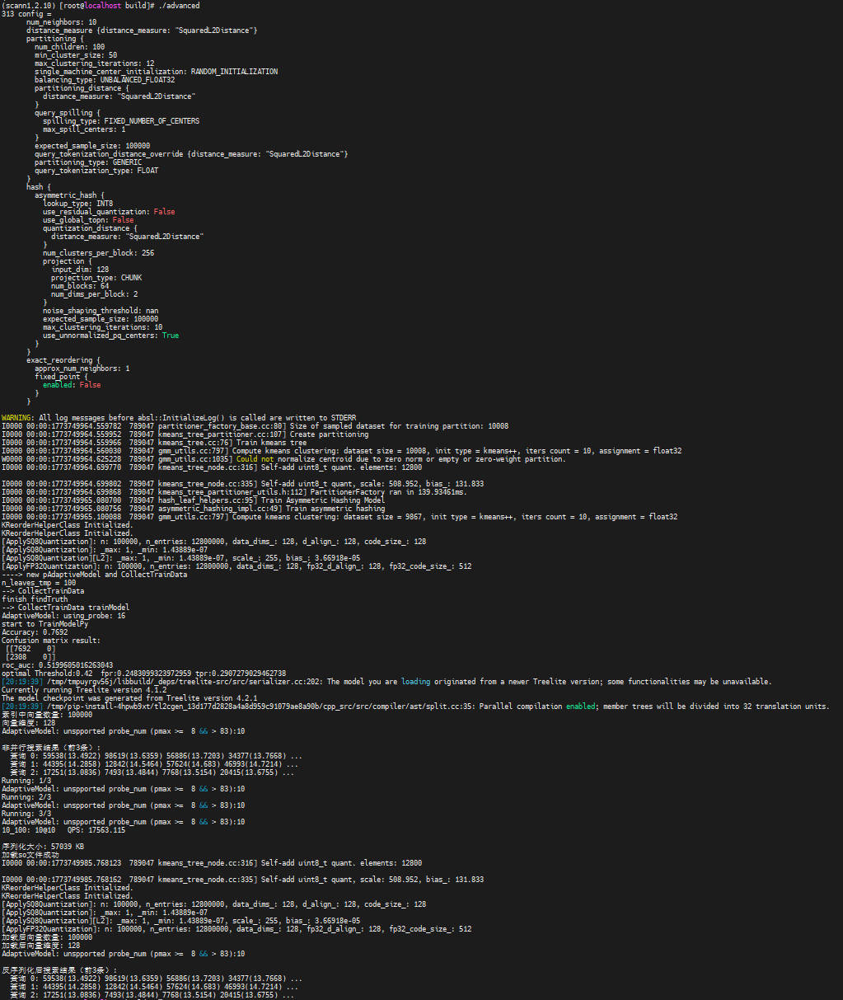

# Quick Start

This document provides a brief guide to getting started with the core functions of KScaNN.

## Core Concepts

KScaNN is an optimized implementation based on the open-source ScaNN algorithm, purpose-built for efficient vector similarity search.

- Vectors: KScaNN supports float32 vectors. Python APIs use the `numpy.ndarray` format, and C++ APIs use the `ConstSpan&lt;float&gt` or `DenseDataset&lt;float&gt` format.
- Index types: KScaNN uses a three-phase index structure consisting of Inverted File (IVF) + Product Quantization (PQ) + Reordering. It achieves efficient approximate nearest neighbor (ANN) search through clustering-based partitioning, product quantization, and reordering.
- Core process: Prepare Data → Configure Parameters → Build Index → Execute Search → Obtain Results

## Example

The following example demonstrates the core usage scenarios of KScaNN, with inline comments and result parsing. It covers the primary workflow of KScaNN: index building, single-query search, and batch search.

```c++
#include <scann/scann_ops/cc/scann.h>
#include <iostream>
#include <vector>
#include <random>
#include <memory>

using namespace research_scann;

int main() {
    // 1. Prepare data.
    int d = 128;                              // Vector dimension
    int nb = 10000;                           // Number of database vectors
    int nq = 5;                               // Number of query vectors
    int k = 10;                               // Number of returned nearest neighbors

    std::vector<float> db_vectors(nb * d);
    std::vector<float> query_vectors(nq * d);

    std::mt19937 rng(42);
    std::uniform_real_distribution<float> dist(0.0f, 1.0f);
    for (auto& v : db_vectors) v = dist(rng);
    for (auto& v : query_vectors) v = dist(rng);

    // 2. Configure index parameters.
    //    - 128-dimensional vector, SquaredL2 distance
    //    - 100 IVF partitions
    //    - PQ: 64 blocks, 2 dimensions per block, 256 centroids per block
    //    - Number of candidates for reordering: 100
    std::string config = R"(
      num_neighbors: 10
      distance_measure {distance_measure: "SquaredL2Distance"}
      partitioning {
        num_children: 100
        min_cluster_size: 50
        max_clustering_iterations: 12
        single_machine_center_initialization: RANDOM_INITIALIZATION
        balancing_type: UNBALANCED_FLOAT32
        partitioning_distance {
          distance_measure: "SquaredL2Distance"
        }
        query_spilling {
          spilling_type: FIXED_NUMBER_OF_CENTERS
          max_spill_centers: 10
        }
        expected_sample_size: 10000
        query_tokenization_distance_override {distance_measure: "SquaredL2Distance"}
        partitioning_type: GENERIC
        query_tokenization_type: FLOAT
      }
      hash {
        asymmetric_hash {
          lookup_type: INT8
          use_residual_quantization: False
          use_global_topn: False
          quantization_distance {
            distance_measure: "SquaredL2Distance"
          }
          num_clusters_per_block: 256
          projection {
            input_dim: 128
            projection_type: CHUNK
            num_blocks: 64
            num_dims_per_block: 2
          }
          noise_shaping_threshold: nan
          expected_sample_size: 10000
          max_clustering_iterations: 10
          use_unnormalized_pq_centers: True
        }
      }
      exact_reordering {
        approx_num_neighbors: 100
        fixed_point {
          enabled: False
        }
      }
    )";

    // 3. Configure K-Means parameters and build an index.
    GmmUtils::KMeansParams kmOpt;
    kmOpt.ivf.iter = 10;
    kmOpt.ivf.sample = 10000;
    kmOpt.ivf.init = 0;
    kmOpt.pq.iter = 10;
    kmOpt.pq.sample = 10000;
    kmOpt.pq.init = 0;

    auto scann = std::make_unique<ScannInterface>();
    ConstSpan<float> dataset(db_vectors.data(), db_vectors.size());

    auto status = scann->Initialize(dataset, nb, config, 8, kmOpt);

    if (!status.ok()) {
        std::cerr << "Failed to create the index: " << status.ToString() << std::endl;
        return -1;
    }

    std::cout << "Number of vectors in the index: " << scann->GetNum() << std::endl;
    std::cout << "Vector dimension: " << scann->GetDim() << std::endl

    // 4. Configure search parameters.
    int nprobe = 10;
    int reorder = 100;

    scann->SearchAdditionalParams(0.0f, 0.0f, 0, nprobe);
    scann->SetNumThreads(8);

    // 5. Perform a single search.
    DatapointPtr<float> query(nullptr, query_vectors.data(), d, d);
    NNResultsVector results;

    status = scann->Search(query, &results, k, reorder, nprobe);

    if (status.ok()) {
        std::cout << "\nSingle-query search results:" << std::endl;
        for (const auto& result : results) {
            std::cout << " index: " << result.first
                      << ", distance: " << result.second << std::endl;
        }
    }

    // 6. Perform batch search.
    std::vector<float> q_vec(query_vectors.begin(), query_vectors.end());
    DenseDataset<float> queries(std::move(q_vec), nq);

    std::unique_ptr<NNResultsVector[]> batch_results{new NNResultsVector[nq]};

    scann->SearchBatched(
        queries,
        MutableSpan<NNResultsVector>(&batch_results[0], nq),
        k,
        reorder,
        nprobe
    );

    std::cout << "\nBatch query results: " << std::endl
    for (int i = 0; i < nq; ++i) {
        std::cout << "  Query " << i << ": ";
        for (size_t j = 0; j < std::min((size_t)4, batch_results[i].size()); ++j) {
            std::cout << batch_results[i][j].first
                      << "(" << batch_results[i][j].second << ") ";
        }
        std::cout << "..." << std::endl;
    }

    return 0;
}
```

The expected output is as follows:


## Advanced Extension

The following demonstrates the advanced Features, including K-Means++ optimized construction, non-parallel search, adaptive parameter configuration, parallel batch search (multi-round Queries Per Second (QPS) benchmarking), index serialization and deserialization, and post-deserialization search verification.  

```c++
#include <scann/scann_ops/cc/scann.h>
#include <iostream>
#include <vector>
#include <random>
#include <memory>
#include <chrono>

using namespace research_scann;

int main() {
    // 1. Prepare data.
    int d = 128;
    int nb = 100000;
    int nq = 1000;
    int k = 10;

    std::vector<float> db_vectors(nb * d);
    std::vector<float> query_vectors(nq * d);

    std::mt19937 rng(42);
    std::uniform_real_distribution<float> dist(0.0f, 1.0f);
    for (auto& v : db_vectors) v = dist(rng);
    for (auto& v : query_vectors) v = dist(rng);

    // 2. Configure index parameters (100,000 128-dimensional vectors and 100 IVF partitions).
    std::string config = R"(
      num_neighbors: 10
      distance_measure {distance_measure: "SquaredL2Distance"}
      partitioning {
        num_children: 100
        min_cluster_size: 50
        max_clustering_iterations: 12
        single_machine_center_initialization: RANDOM_INITIALIZATION
        balancing_type: UNBALANCED_FLOAT32
        partitioning_distance {
          distance_measure: "SquaredL2Distance"
        }
        query_spilling {
          spilling_type: FIXED_NUMBER_OF_CENTERS
          max_spill_centers: 1
        }
        expected_sample_size: 100000
        query_tokenization_distance_override {distance_measure: "SquaredL2Distance"}
        partitioning_type: GENERIC
        query_tokenization_type: FLOAT
      }
      hash {
        asymmetric_hash {
          lookup_type: INT8
          use_residual_quantization: False
          use_global_topn: False
          quantization_distance {
            distance_measure: "SquaredL2Distance"
          }
          num_clusters_per_block: 256
          projection {
            input_dim: 128
            projection_type: CHUNK
            num_blocks: 64
            num_dims_per_block: 2
          }
          noise_shaping_threshold: nan
          expected_sample_size: 100000
          max_clustering_iterations: 10
          use_unnormalized_pq_centers: True
        }
      }
      exact_reordering {
        approx_num_neighbors: 1
        fixed_point {
          enabled: False
        }
      }
    )";

    // 3. Configure K-Means optimization parameters and build an index (corresponding to eval: Build).
    GmmUtils::KMeansParams kmOpt;
    kmOpt.ivf.iter = 10;
    kmOpt.ivf.sample = 10000;
    kmOpt.ivf.init = 2;                    // K-Means++ initialization
    kmOpt.pq.iter = 10;
    kmOpt.pq.sample = 10000;
    kmOpt.pq.init = 2;

    auto scann = std::make_unique<ScannInterface>();
    ConstSpan<float> dataset(db_vectors.data(), db_vectors.size());

    auto status = scann->Initialize(dataset, nb, config, 8, kmOpt);

    if (!status.ok()) {
        std::cerr << "Failed to create the index: " << status.ToString() << std::endl;
        return -1;
    }

    std::cout << "Number of vectors in the index: " << scann->GetNum() << std::endl;
    std::cout << "Vector dimension: " << scann->GetDim() << std::endl

    // 4. Search parameters.
    int nprobe = 10;
    int reorder = 100;
    float adp_threshold = 0.3f;
    float refine_prm = 0.2f;
    int adp_refined = 0;
    int num_thread = 8;
    int batch_size = 256;

    // 5. Non-parallel search (corresponding to eval: Search → SearchBatchedParallel, verifying correctness upon the first call)
    {
        scann->SearchAdditionalParams(adp_threshold, refine_prm, adp_refined, nprobe);
        scann->SetNumThreads(num_thread);

        std::vector<float> q_vec(query_vectors.begin(), query_vectors.end());
        DenseDataset<float> queries(std::move(q_vec), nq);
        std::unique_ptr<NNResultsVector[]> res{new NNResultsVector[nq]};

        scann->SearchBatchedParallel(
            queries,
            MutableSpan<NNResultsVector>(&res[0], nq),
            k, reorder, nprobe, batch_size
        );

        std::cout << "\nNon-parallel search results (first three records): " << std::endl
        for (int i = 0; i < std::min(nq, 3); ++i) {
            std::cout << "  Query" << i << ": ";
            for (size_t j = 0; j < std::min((size_t)4, res[i].size()); ++j) {
                std::cout << res[i][j].first << "(" << res[i][j].second << ") ";
            }
            std::cout << "..." << std::endl;
        }
    }

    // 6. Parallel batch search + multi-round QPS benchmarking (corresponding to eval: ParallelSearch multi-round loop)
    int numRuns = 3;
    std::vector<float> qps_list;

    for (int run = 0; run < numRuns; ++run) {
        std::cout << "Running: " << run + 1 << "/" << numRuns << std::endl;

        // Reconstruct queries in each round (DenseDataset is also reconstructed in each round in eval).
        std::vector<float> q_run(query_vectors.begin(), query_vectors.end());
        DenseDataset<float> queries_run(std::move(q_run), nq);

        std::unique_ptr<NNResultsVector[]> res{new NNResultsVector[nq]};

        // Reset parameters before search (corresponding to SearchAdditionalParams + SetNumThreads in each eval loop).
        scann->SearchAdditionalParams(adp_threshold, refine_prm, adp_refined, nprobe);
        if (num_thread != 320)
            scann->SetNumThreads(num_thread - 1);

        auto t1 = std::chrono::high_resolution_clock::now();

        scann->SearchBatchedParallel(
            queries_run,
            MutableSpan<NNResultsVector>(&res[0], nq),
            k, reorder, nprobe, batch_size
        );

        auto t2 = std::chrono::high_resolution_clock::now();
        double delta_ns = std::chrono::duration_cast<std::chrono::nanoseconds>(t2 - t1).count();
        float qps = (double)nq * 1e9 / delta_ns;
        qps_list.push_back(qps);
    }

    float max_qps = *std::max_element(qps_list.begin(), qps_list.end());
    printf("%d_%d:\t%d@%d\tQPS: %.3f\n", nprobe, reorder, k, k, max_qps);

    // 7. Index serialization and deserialization (corresponding to eval: Serialize + Deserialize)
    uint8_t* dataPtr = nullptr;
    size_t length = 0;
    scann->SerializeToMemory(dataPtr, length);
    std::cout << "\nSerialization size: " << length / 1024 << " KB" << std::endl

    auto loaded = std::make_unique<ScannInterface>();
    loaded->LoadFromMemory(dataPtr, length);
    std::cout << "Number of vectors after loading: " << loaded->GetNum() << std::endl;
    std::cout << "Vector dimension after loading: " << loaded->GetDim() << std::endl;

    // 8. Perform search and verification again after deserialization (search parameters need to be reconfigured).
    loaded->SearchAdditionalParams(adp_threshold, refine_prm, adp_refined, nprobe);
    loaded->SetNumThreads(num_thread);

    {
        std::vector<float> q_verify(query_vectors.begin(), query_vectors.end());
        DenseDataset<float> queries_verify(std::move(q_verify), nq);
        std::unique_ptr<NNResultsVector[]> res{new NNResultsVector[nq]};

        loaded->SearchBatchedParallel(
            queries_verify,
            MutableSpan<NNResultsVector>(&res[0], nq),
            k, reorder, nprobe, batch_size
        );

        std::cout << "\nSearch results (first three records) after deserialization:" << std::endl;
        for (int i = 0; i < std::min(nq, 3); ++i) {
            std::cout << "  Query " << i << ": ";
            for (size_t j = 0; j < std::min((size_t)4, res[i].size()); ++j) {
                std::cout << res[i][j].first << "(" << res[i][j].second << ") ";
            }
            std::cout << "..." << std::endl;
        }
    }

    delete[] dataPtr;
    return 0;
}
```

The expected output is as follows:


