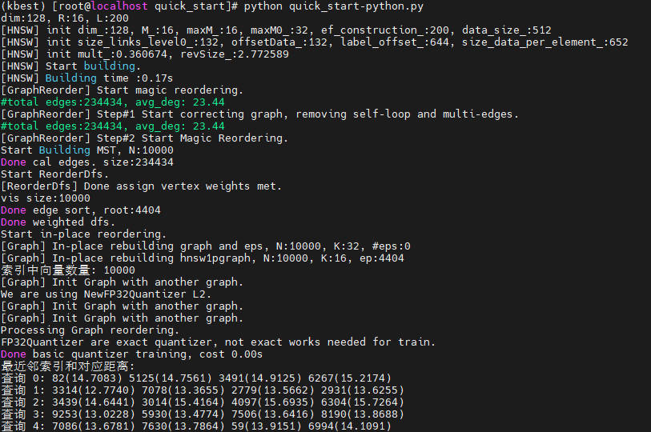
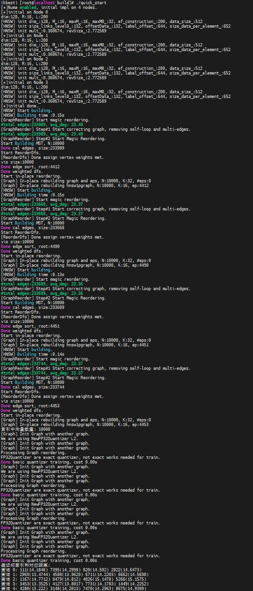
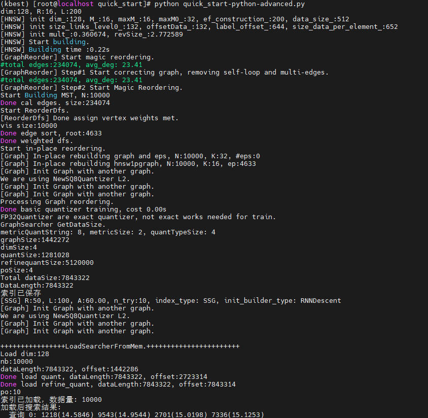

# 快速入门

本节提供快速上手KBest核心功能的简易指导。

## 核心概念

KBest基于图的近似最近邻搜索，其核心是图索引（Graph Index），即通过构建邻居关系图来高效执行相似性搜索的结构：

- 向量：KBest支持float32类型的向量。
- 索引类型：KBest基于图结构实现近似搜索，支持多种邻居选择策略（HNSW、NSG、TSDG、SSG），推荐入门使用HNSW策略。
- 核心流程：创建索引 → 添加向量并构建图索引 → 构建检索器 → 执行相似性搜索

## 快速入门示例

以下是覆盖KBest核心使用场景的完整代码，包含注释和结果解析。

### Python

```python
import numpy as np
import kbest

# 1. 准备数据
d = 128                                       # 向量维度
nb = 10000                                    # 底库向量数量
nq = 5                                        # 查询向量数量

np.random.seed(42)
db_vectors = np.random.random((nb, d)).astype(np.float32)     # 底库向量
query_vectors = np.random.random((nq, d)).astype(np.float32)  # 查询向量

# 2. 创建索引
# 参数说明：维度, 邻居数R, 构图候选列表L, 角度阈值A, 图优化迭代次数,
#          距离类型, 构图算法, 邻居策略, NUMA开关, NUMA节点数
index = kbest.KBest(d, 32, 200, 60, 2, "L2", "RNNDescent", "HNSW", False, 1)

# 3. 添加向量并构建图索引
# 参数说明：数据量, 数据, 块大小, 重排开关, 量化等级(0=FP32)
index.add(nb, db_vectors, 16, 1, 0)
print(f"索引中向量数量: {index.getNTotal()}")  # 输出: 10000

# 4. 构建检索器（必须在搜索前调用）
index.buildSearcher()

# 5. 设置检索参数（可选）
index.setEf(100)

# 6. 执行搜索
k = 4                                         # 返回最近的4个向量
distances = np.zeros((nq, k), dtype=np.float32)
indices = np.zeros((nq, k), dtype=np.int64)

index.search(nq, query_vectors, k, distances, indices, 4)

# 7. 结果解析
print("最近邻索引和对应距离:")
for i in range(nq):
    result = " ".join([f"{indices[i,j]}({distances[i,j]:.4f})" for j in range(k)])
    print(f"查询 {i}: {result}")
```

预期结果如下：



### C++

```c++
#include <iostream>
#include <vector>
#include <random>
#include "kbest.h"

int main() {
    // 1. 准备数据
    int d = 128;                              // 向量维度
    int nb = 10000;                           // 底库向量数量
    int nq = 5;                               // 查询向量数量

    std::vector<float> db_vectors(nb * d);    // 底库向量
    std::vector<float> query_vectors(nq * d); // 查询向量

    // 随机生成向量数据
    std::mt19937 rng(42);
    std::uniform_real_distribution<float> dist(0.0f, 1.0f);
    for (auto& v : db_vectors) v = dist(rng);
    for (auto& v : query_vectors) v = dist(rng);

    // 2. 创建索引
    // 参数说明：维度=128, 邻居数R=32, 构图候选列表L=200, 角度阈值A=60
    //          图优化迭代次数=2, 距离类型=L2, 构图算法=RNNDescent, 邻居策略=HNSW
    KBest index(d, 32, 200, 60, 2, "L2", "RNNDescent", "HNSW");

    // 3. 添加向量并构建图索引
    // 参数说明：数据量, 数据指针, 块大小=16, 重排=1, 量化等级=0(FP32)
    index.Add(nb, db_vectors.data(), 16, 1, 0);
    std::cout << "索引中向量数量: " << index.GetNTotal() << std::endl;  // 输出: 10000

    // 4. 构建检索器（必须在搜索前调用）
    index.BuildSearcher();

    // 5. 设置检索参数（可选，ef越大精度越高但速度越慢）
    index.SetEf(100);

    // 6. 执行搜索（返回每个查询的k个最近邻）
    int k = 4;                                // 返回最近的4个向量
    std::vector<float> distances(nq * k);     // 存储距离结果
    std::vector<int64_t> indices(nq * k);     // 存储索引结果

    index.Search(nq, query_vectors.data(), k, distances.data(), indices.data(), 4);

    // 7. 结果解析
    std::cout << "最近邻索引和对应距离:" << std::endl;
    for (int i = 0; i < nq; i++) {
        std::cout << "查询 " << i << ": ";
        for (int j = 0; j < k; j++) {
            std::cout << indices[i * k + j] << "(" << distances[i * k + j] << ") ";
        }
        std::cout << std::endl;
    }

    return 0;
}
```

预期结果如下：



## 进阶扩展

进阶示例展示索引持久化、量化加速等功能。

### Python

```python
import numpy as np
import kbest

d = 128
nb = 10000

db_vectors = np.random.random((nb, d)).astype(np.float32)

# ===== 构建索引并使用量化加速 =====
index = kbest.KBest(d, 32, 200, 60, 2, "L2", "RNNDescent", "HNSW", False, 1)

# 量化等级：0=FP32(精度最高), 1=SQ8U, 2=SQ4U, 3=FP16
level = 1  # 使用SQ8U量化
index.add(nb, db_vectors, 16, 1, level)
index.buildSearcher()

# ===== 保存索引到文件 =====
index.save("./kbest_index.bin")
print("索引已保存")

# ===== 加载索引并直接搜索 =====
loaded_index = kbest.KBest(False, 1)          # 加载专用构造(numa_enabled, numa_nodes)
loaded_index.load("./kbest_index.bin")
print(f"索引已加载，数据量: {loaded_index.getNTotal()}")

# 设置检索参数后直接搜索，无需重新构建
loaded_index.setEf(100)
nq, k = 1, 4
query = np.random.random((nq, d)).astype(np.float32)
distances = np.zeros((nq, k), dtype=np.float32)
indices = np.zeros((nq, k), dtype=np.int64)
loaded_index.search(nq, query, k, distances, indices, 4)

print("加载后搜索结果:")
for i in range(nq):
    result = " ".join([f"{indices[i,j]}({distances[i,j]:.4f})" for j in range(k)])
    print(f"  查询 {i}: {result}")
```

预期结果如下：



### C++

```c++
#include <iostream>
#include <vector>
#include "kbest.h"

int main() {
    int d = 128;
    int nb = 10000;

    std::vector<float> db_vectors(nb * d);
    // ... 填充数据 ...

    // ===== 构建索引并使用量化加速 =====
    KBest index(d, 32, 200, 60, 2, "L2", "RNNDescent", "HNSW");

    // 量化等级：0=FP32(精度最高), 1=SQ8U, 2=SQ4U, 3=FP16
    int level = 1;  // 使用SQ8U量化，平衡性能与精度
    index.Add(nb, db_vectors.data(), 16, 1, level);
    index.BuildSearcher();

    // ===== 保存索引到文件 =====
    index.Save("./kbest_index.bin");
    std::cout << "索引已保存" << std::endl;

    // ===== 加载索引并直接搜索 =====
    KBest loaded_index;                       // 无参构造
    loaded_index.Load("./kbest_index.bin");   // 加载检索器
    std::cout << "索引已加载，数据量: " << loaded_index.GetNTotal() << std::endl;

    // 设置检索参数后直接搜索，无需重新构建
    loaded_index.SetEf(100);
    int nq = 1, k = 4;
    std::vector<float> query(d), distances(k);
    std::vector<int64_t> indices(k);
    loaded_index.Search(nq, query.data(), k, distances.data(), indices.data(), 4);

    return 0;
}
```

预期结果如下：


## 进阶参数调优指导<a name="ZH-CN_TOPIC_0000002522066588"></a>

本节提供KBest接口相关参数的进阶调优指导，该调优指导同时适用于C++接口与Python接口。

**构造函数接口<a name="section8200133234918"></a>**

<a name="table1366255115497"></a>
<table><thead align="left"><tr id="row66786517499"><th class="cellrowborder" valign="top" width="8.95%" id="mcps1.1.5.1.1"><p id="p66781551124917"><a name="p66781551124917"></a><a name="p66781551124917"></a><strong id="b76781251184911"><a name="b76781251184911"></a><a name="b76781251184911"></a>参数名称</strong></p>
</th>
<th class="cellrowborder" valign="top" width="15.36%" id="mcps1.1.5.1.2"><p id="p46781651164920"><a name="p46781651164920"></a><a name="p46781651164920"></a><strong id="b146785514496"><a name="b146785514496"></a><a name="b146785514496"></a>参数取值范围</strong></p>
</th>
<th class="cellrowborder" valign="top" width="11.28%" id="mcps1.1.5.1.3"><p id="p14678205194912"><a name="p14678205194912"></a><a name="p14678205194912"></a><strong id="b867895112493"><a name="b867895112493"></a><a name="b867895112493"></a>推荐值</strong></p>
</th>
<th class="cellrowborder" valign="top" width="64.41%" id="mcps1.1.5.1.4"><p id="p19678125114915"><a name="p19678125114915"></a><a name="p19678125114915"></a>调优说明</p>
</th>
</tr>
</thead>
<tbody><tr id="row0678115116491"><td class="cellrowborder" valign="top" width="8.95%" headers="mcps1.1.5.1.1 "><p id="p10678175124917"><a name="p10678175124917"></a><a name="p10678175124917"></a>R</p>
</td>
<td class="cellrowborder" valign="top" width="15.36%" headers="mcps1.1.5.1.2 "><p id="p16678151194911"><a name="p16678151194911"></a><a name="p16678151194911"></a>[11,499]</p>
</td>
<td class="cellrowborder" valign="top" width="11.28%" headers="mcps1.1.5.1.3 "><p id="p0678165110491"><a name="p0678165110491"></a><a name="p0678165110491"></a>50</p>
</td>
<td class="cellrowborder" valign="top" width="64.41%" headers="mcps1.1.5.1.4 "><p id="p9678951174913"><a name="p9678951174913"></a><a name="p9678951174913"></a>邻居节点数，影响图构建耗时和最终索引质量，一般推荐使用50，过大可能会导致构建耗时过长以及搜索性能下降，过小则会影响检索精度。</p>
</td>
</tr>
<tr id="row12678115134918"><td class="cellrowborder" valign="top" width="8.95%" headers="mcps1.1.5.1.1 "><p id="p8678351104913"><a name="p8678351104913"></a><a name="p8678351104913"></a>L</p>
</td>
<td class="cellrowborder" valign="top" width="15.36%" headers="mcps1.1.5.1.2 "><p id="p136781451144916"><a name="p136781451144916"></a><a name="p136781451144916"></a>[11,1999]</p>
</td>
<td class="cellrowborder" valign="top" width="11.28%" headers="mcps1.1.5.1.3 "><p id="p176785511495"><a name="p176785511495"></a><a name="p176785511495"></a>100,200</p>
</td>
<td class="cellrowborder" valign="top" width="64.41%" headers="mcps1.1.5.1.4 "><p id="p267813517498"><a name="p267813517498"></a><a name="p267813517498"></a>构图时的候选节点列表大小，影响图构建耗时和最终索引质量，一般推荐使用100，过大可能会导致构建耗时过长。</p>
</td>
</tr>
<tr id="row8678951164919"><td class="cellrowborder" valign="top" width="8.95%" headers="mcps1.1.5.1.1 "><p id="p1367855144915"><a name="p1367855144915"></a><a name="p1367855144915"></a>A</p>
</td>
<td class="cellrowborder" valign="top" width="15.36%" headers="mcps1.1.5.1.2 "><p id="p167815519497"><a name="p167815519497"></a><a name="p167815519497"></a>[1,360]</p>
</td>
<td class="cellrowborder" valign="top" width="11.28%" headers="mcps1.1.5.1.3 "><p id="p76788512492"><a name="p76788512492"></a><a name="p76788512492"></a>60,120</p>
</td>
<td class="cellrowborder" valign="top" width="64.41%" headers="mcps1.1.5.1.4 "><p id="p06781351134912"><a name="p06781351134912"></a><a name="p06781351134912"></a>构图剪枝时的角度阈值，对于IP数据集，一般使用120，L2数据集一般使用60。</p>
</td>
</tr>
<tr id="row11894754132116"><td class="cellrowborder" valign="top" width="8.95%" headers="mcps1.1.5.1.1 "><p id="p1589414545217"><a name="p1589414545217"></a><a name="p1589414545217"></a>graph_opt_iter</p>
</td>
<td class="cellrowborder" valign="top" width="15.36%" headers="mcps1.1.5.1.2 "><p id="p118941454192120"><a name="p118941454192120"></a><a name="p118941454192120"></a>[0,30]</p>
</td>
<td class="cellrowborder" valign="top" width="11.28%" headers="mcps1.1.5.1.3 "><p id="p0894105410210"><a name="p0894105410210"></a><a name="p0894105410210"></a>29</p>
</td>
<td class="cellrowborder" valign="top" width="64.41%" headers="mcps1.1.5.1.4 "><p id="p8894954162112"><a name="p8894954162112"></a><a name="p8894954162112"></a>图索引自我迭代的轮数，过大可能导致构建耗时过长。</p>
</td>
</tr>
</tbody>
</table>

**Add接口<a name="section9524192295015"></a>**

<a name="table13386938135011"></a>
<table><thead align="left"><tr id="row4398638195017"><th class="cellrowborder" valign="top" width="9.89%" id="mcps1.1.5.1.1"><p id="p14398143815014"><a name="p14398143815014"></a><a name="p14398143815014"></a><strong id="b73981038135019"><a name="b73981038135019"></a><a name="b73981038135019"></a>参数名称</strong></p>
</th>
<th class="cellrowborder" valign="top" width="14.360000000000001%" id="mcps1.1.5.1.2"><p id="p20398183825020"><a name="p20398183825020"></a><a name="p20398183825020"></a><strong id="b15398193811506"><a name="b15398193811506"></a><a name="b15398193811506"></a>参数取值范围</strong></p>
</th>
<th class="cellrowborder" valign="top" width="11.17%" id="mcps1.1.5.1.3"><p id="p03986387506"><a name="p03986387506"></a><a name="p03986387506"></a><strong id="b143981138175013"><a name="b143981138175013"></a><a name="b143981138175013"></a>推荐值</strong></p>
</th>
<th class="cellrowborder" valign="top" width="64.58%" id="mcps1.1.5.1.4"><p id="p12398113814500"><a name="p12398113814500"></a><a name="p12398113814500"></a>调优说明</p>
</th>
</tr>
</thead>
<tbody><tr id="row16398133816503"><td class="cellrowborder" valign="top" width="9.89%" headers="mcps1.1.5.1.1 "><p id="p19398938175019"><a name="p19398938175019"></a><a name="p19398938175019"></a>level</p>
</td>
<td class="cellrowborder" valign="top" width="14.360000000000001%" headers="mcps1.1.5.1.2 "><p id="p143981138165019"><a name="p143981138165019"></a><a name="p143981138165019"></a>[0,3]</p>
</td>
<td class="cellrowborder" valign="top" width="11.17%" headers="mcps1.1.5.1.3 "><p id="p1992794810503"><a name="p1992794810503"></a><a name="p1992794810503"></a>1,2</p>
</td>
<td class="cellrowborder" valign="top" width="64.58%" headers="mcps1.1.5.1.4 "><p id="p19398173875010"><a name="p19398173875010"></a><a name="p19398173875010"></a>控制量化的等级，level 1代表SQ8U量化，level 2代表SQ4U量化。对于IP数据集，一般使用1，L2数据集使用2。</p>
</td>
</tr>
</tbody>
</table>

**SetEf接口<a name="section2981160145118"></a>**

<a name="table133713875113"></a>
<table><thead align="left"><tr id="row45010812514"><th class="cellrowborder" valign="top" width="9.979002099790021%" id="mcps1.1.4.1.1"><p id="p165012816514"><a name="p165012816514"></a><a name="p165012816514"></a><strong id="b3508855110"><a name="b3508855110"></a><a name="b3508855110"></a>参数名称</strong></p>
</th>
<th class="cellrowborder" valign="top" width="25.537446255374462%" id="mcps1.1.4.1.2"><p id="p0509813518"><a name="p0509813518"></a><a name="p0509813518"></a><strong id="b185019819512"><a name="b185019819512"></a><a name="b185019819512"></a>参数取值范围</strong></p>
</th>
<th class="cellrowborder" valign="top" width="64.48355164483553%" id="mcps1.1.4.1.3"><p id="p1850184510"><a name="p1850184510"></a><a name="p1850184510"></a>调优说明</p>
</th>
</tr>
</thead>
<tbody><tr id="row185012810519"><td class="cellrowborder" valign="top" width="9.979002099790021%" headers="mcps1.1.4.1.1 "><p id="p1550188195117"><a name="p1550188195117"></a><a name="p1550188195117"></a>ef</p>
</td>
<td class="cellrowborder" valign="top" width="25.537446255374462%" headers="mcps1.1.4.1.2 "><p id="p1667165924518"><a name="p1667165924518"></a><a name="p1667165924518"></a>[1, nb]，其中<span class="parmname" id="parmname336535516614"><a name="parmname336535516614"></a><a name="parmname336535516614"></a>“nb”</span>为向量底库数据量大小。</p>
</td>
<td class="cellrowborder" valign="top" width="64.48355164483553%" headers="mcps1.1.4.1.3 "><p id="p75010812517"><a name="p75010812517"></a><a name="p75010812517"></a>检索时的候选节点列表大小，对于小规模数据集，一般在10~500左右。更大的ef会带来更高的检索精度，但是检索性能也会降低。建议在精度达标情况下ef取较小值。</p>
</td>
</tr>
</tbody>
</table>

**SetEarlyStoppingParams接口<a name="section158341126132613"></a>**

<a name="table158341026202611"></a>
<table><thead align="left"><tr id="row083442632614"><th class="cellrowborder" valign="top" width="10.048995100489948%" id="mcps1.1.4.1.1"><p id="p138349263265"><a name="p138349263265"></a><a name="p138349263265"></a><strong id="b98342263261"><a name="b98342263261"></a><a name="b98342263261"></a>参数名称</strong></p>
</th>
<th class="cellrowborder" valign="top" width="25.68743125687431%" id="mcps1.1.4.1.2"><p id="p178349264263"><a name="p178349264263"></a><a name="p178349264263"></a><strong id="b1283432682617"><a name="b1283432682617"></a><a name="b1283432682617"></a>参数取值范围</strong></p>
</th>
<th class="cellrowborder" valign="top" width="64.26357364263573%" id="mcps1.1.4.1.3"><p id="p4834926162617"><a name="p4834926162617"></a><a name="p4834926162617"></a>调优说明</p>
</th>
</tr>
</thead>
<tbody><tr id="row983432622611"><td class="cellrowborder" valign="top" width="10.048995100489948%" headers="mcps1.1.4.1.1 "><p id="p383412610265"><a name="p383412610265"></a><a name="p383412610265"></a>adding_pref</p>
</td>
<td class="cellrowborder" valign="top" width="25.68743125687431%" headers="mcps1.1.4.1.2 "><p id="p15834122613266"><a name="p15834122613266"></a><a name="p15834122613266"></a>大于等于1</p>
</td>
<td class="cellrowborder" valign="top" width="64.26357364263573%" headers="mcps1.1.4.1.3 "><p id="p1983482616262"><a name="p1983482616262"></a><a name="p1983482616262"></a>用于检索时早停机制，表示候选节点插入阈值，检索过程中节点插入候选集的位置大于adding_pref表示其远离查询节点，后续检索到答案的可能较低。较小的adding_pref能提高检索效率，但是检索精度也会降低。</p>
</td>
</tr>
<tr id="row12289144115296"><td class="cellrowborder" valign="top" width="10.048995100489948%" headers="mcps1.1.4.1.1 "><p id="p4289541152916"><a name="p4289541152916"></a><a name="p4289541152916"></a>patience</p>
</td>
<td class="cellrowborder" valign="top" width="25.68743125687431%" headers="mcps1.1.4.1.2 "><p id="p528984112292"><a name="p528984112292"></a><a name="p528984112292"></a>大于等于1</p>
</td>
<td class="cellrowborder" valign="top" width="64.26357364263573%" headers="mcps1.1.4.1.3 "><p id="p23507402345"><a name="p23507402345"></a><a name="p23507402345"></a>检索时早停机制，表示插入位置靠后或者插入失败的耐心值，当连续插入位置大于阈值adding_pref的次数超过耐心值时，检索结束。较小的patience能提高检索效率，但是检索精度也会降低。</p>
</td>
</tr>
</tbody>
</table>
