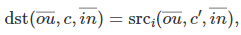
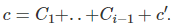

# API参考

## KDNN算子说明

### 算子范围

KDNN目前支持的算子如[**表 1** KDNN支持的算子](#KDNN支持的算子)所示。

**表 1** KDNN支持的算子<a id="KDNN支持的算子"></a>

<a name="zh-cn_topic_0000001831166845_zh-cn_topic_0000001135499637_table2979mcpsimp"></a>
<table><thead align="left"><tr id="zh-cn_topic_0000001831166845_zh-cn_topic_0000001135499637_row2986mcpsimp"><th class="cellrowborder" valign="top" width="39.989999999999995%" id="mcps1.2.3.1.1"><p id="zh-cn_topic_0000001831166845_zh-cn_topic_0000001135499637_p2988mcpsimp"><a name="zh-cn_topic_0000001831166845_zh-cn_topic_0000001135499637_p2988mcpsimp"></a><a name="zh-cn_topic_0000001831166845_zh-cn_topic_0000001135499637_p2988mcpsimp"></a>算子名称</p>
</th>
<th class="cellrowborder" valign="top" width="60.01%" id="mcps1.2.3.1.2"><p id="p2087975013312"><a name="p2087975013312"></a><a name="p2087975013312"></a>算子说明</p>
</th>
</tr>
</thead>
<tbody><tr id="zh-cn_topic_0000001831166845_zh-cn_topic_0000001135499637_row3000mcpsimp"><td class="cellrowborder" valign="top" width="39.989999999999995%" headers="mcps1.2.3.1.1 "><p id="p866314942815"><a name="p866314942815"></a><a name="p866314942815"></a>Eltwise</p>
</td>
<td class="cellrowborder" valign="top" width="60.01%" headers="mcps1.2.3.1.2 "><p id="p387919507318"><a name="p387919507318"></a><a name="p387919507318"></a>逐元素操作算子。</p>
</td>
</tr>
<tr id="zh-cn_topic_0000001831166845_zh-cn_topic_0000001135499637_row3009mcpsimp"><td class="cellrowborder" valign="top" width="39.989999999999995%" headers="mcps1.2.3.1.1 "><p id="p325211591391"><a name="p325211591391"></a><a name="p325211591391"></a>Layer Normalization</p>
</td>
<td class="cellrowborder" valign="top" width="60.01%" headers="mcps1.2.3.1.2 "><p id="p1387995018312"><a name="p1387995018312"></a><a name="p1387995018312"></a>层归一化算子。</p>
</td>
</tr>
<tr id="zh-cn_topic_0000001831166845_zh-cn_topic_0000001135499637_row3022mcpsimp"><td class="cellrowborder" valign="top" width="39.989999999999995%" headers="mcps1.2.3.1.1 "><p id="p99038226406"><a name="p99038226406"></a><a name="p99038226406"></a>Inner Product</p>
</td>
<td class="cellrowborder" valign="top" width="60.01%" headers="mcps1.2.3.1.2 "><p id="p118791050173117"><a name="p118791050173117"></a><a name="p118791050173117"></a>矩阵内积算子。</p>
</td>
</tr>
<tr id="row1618063616402"><td class="cellrowborder" valign="top" width="39.989999999999995%" headers="mcps1.2.3.1.1 "><p id="p51801936114010"><a name="p51801936114010"></a><a name="p51801936114010"></a>Softmax</p>
</td>
<td class="cellrowborder" valign="top" width="60.01%" headers="mcps1.2.3.1.2 "><p id="p148791150193116"><a name="p148791150193116"></a><a name="p148791150193116"></a>Softmax归一化算子。</p>
</td>
</tr>
<tr id="row0869103924011"><td class="cellrowborder" valign="top" width="39.989999999999995%" headers="mcps1.2.3.1.1 "><p id="p67891843124017"><a name="p67891843124017"></a><a name="p67891843124017"></a>Sum</p>
</td>
<td class="cellrowborder" valign="top" width="60.01%" headers="mcps1.2.3.1.2 "><p id="p087912503314"><a name="p087912503314"></a><a name="p087912503314"></a>求和算子。</p>
</td>
</tr>
<tr id="row7727330154711"><td class="cellrowborder" valign="top" width="39.989999999999995%" headers="mcps1.2.3.1.1 "><p id="p8869203919406"><a name="p8869203919406"></a><a name="p8869203919406"></a>Matmul</p>
</td>
<td class="cellrowborder" valign="top" width="60.01%" headers="mcps1.2.3.1.2 "><p id="p6879115011315"><a name="p6879115011315"></a><a name="p6879115011315"></a>矩阵乘法算子。</p>
</td>
</tr>
<tr id="row832917475406"><td class="cellrowborder" valign="top" width="39.989999999999995%" headers="mcps1.2.3.1.1 "><p id="p163291847164019"><a name="p163291847164019"></a><a name="p163291847164019"></a>Convolution</p>
</td>
<td class="cellrowborder" valign="top" width="60.01%" headers="mcps1.2.3.1.2 "><p id="p98796507315"><a name="p98796507315"></a><a name="p98796507315"></a>卷积算子。</p>
</td>
</tr>
<tr id="row06051931869"><td class="cellrowborder" valign="top" width="39.989999999999995%" headers="mcps1.2.3.1.1 "><p id="p860553112618"><a name="p860553112618"></a><a name="p860553112618"></a>Deconvolution</p>
</td>
<td class="cellrowborder" valign="top" width="60.01%" headers="mcps1.2.3.1.2 "><p id="p26051831367"><a name="p26051831367"></a><a name="p26051831367"></a>执行反卷积操作。</p>
</td>
</tr>
<tr id="row1863605874613"><td class="cellrowborder" valign="top" width="39.989999999999995%" headers="mcps1.2.3.1.1 "><p id="p9583429951"><a name="p9583429951"></a><a name="p9583429951"></a>Concat</p>
</td>
<td class="cellrowborder" valign="top" width="60.01%" headers="mcps1.2.3.1.2 "><p id="p1734912731016"><a name="p1734912731016"></a><a name="p1734912731016"></a>拼接算子。</p>
</td>
</tr>
<tr id="row142793271451"><td class="cellrowborder" valign="top" width="39.989999999999995%" headers="mcps1.2.3.1.1 "><p id="p15279127857"><a name="p15279127857"></a><a name="p15279127857"></a>Resampling</p>
</td>
<td class="cellrowborder" valign="top" width="60.01%" headers="mcps1.2.3.1.2 "><p id="p22792027654"><a name="p22792027654"></a><a name="p22792027654"></a>数据重新采样放缩算子。</p>
</td>
</tr>
<tr id="row185839291055"><td class="cellrowborder" valign="top" width="39.989999999999995%" headers="mcps1.2.3.1.1 "><p id="p71956248510"><a name="p71956248510"></a><a name="p71956248510"></a>Shuffle</p>
</td>
<td class="cellrowborder" valign="top" width="60.01%" headers="mcps1.2.3.1.2 "><p id="p1919582414515"><a name="p1919582414515"></a><a name="p1919582414515"></a>数据混洗算子。</p>
</td>
</tr>
<tr id="row385215911326"><td class="cellrowborder" valign="top" width="39.989999999999995%" headers="mcps1.2.3.1.1 "><p id="p1463675811463"><a name="p1463675811463"></a><a name="p1463675811463"></a>Reorder</p>
</td>
<td class="cellrowborder" valign="top" width="60.01%" headers="mcps1.2.3.1.2 "><p id="p663685834614"><a name="p663685834614"></a><a name="p663685834614"></a>数据重新排布算子。</p>
</td>
</tr>
<tr id="row1890310400380"><td class="cellrowborder" valign="top" width="39.989999999999995%" headers="mcps1.2.3.1.1 "><p id="p149032409384"><a name="p149032409384"></a><a name="p149032409384"></a>Pool</p>
</td>
<td class="cellrowborder" valign="top" width="60.01%" headers="mcps1.2.3.1.2 "><p id="p2090315408384"><a name="p2090315408384"></a><a name="p2090315408384"></a>池化操作算子。</p>
</td>
</tr>
<tr id="row1650019445388"><td class="cellrowborder" valign="top" width="39.989999999999995%" headers="mcps1.2.3.1.1 "><p id="p105017445383"><a name="p105017445383"></a><a name="p105017445383"></a>Batch Normalization（bnormal）</p>
</td>
<td class="cellrowborder" valign="top" width="60.01%" headers="mcps1.2.3.1.2 "><p id="p35011744103811"><a name="p35011744103811"></a><a name="p35011744103811"></a>批次归一化算子。</p>
</td>
</tr>
<tr id="row1037713109395"><td class="cellrowborder" valign="top" width="39.989999999999995%" headers="mcps1.2.3.1.1 "><p id="p13771710133915"><a name="p13771710133915"></a><a name="p13771710133915"></a>Local Response Normalization（lrn）</p>
</td>
<td class="cellrowborder" valign="top" width="60.01%" headers="mcps1.2.3.1.2 "><p id="p73776101397"><a name="p73776101397"></a><a name="p73776101397"></a>局部响应归一化算子。</p>
</td>
</tr>
<tr id="row8309171333911"><td class="cellrowborder" valign="top" width="39.989999999999995%" headers="mcps1.2.3.1.1 "><p id="p330921315396"><a name="p330921315396"></a><a name="p330921315396"></a>Reduction</p>
</td>
<td class="cellrowborder" valign="top" width="60.01%" headers="mcps1.2.3.1.2 "><p id="p15309171318398"><a name="p15309171318398"></a><a name="p15309171318398"></a>推断算子。</p>
</td>
</tr>
<tr id="row11693131523917"><td class="cellrowborder" valign="top" width="39.989999999999995%" headers="mcps1.2.3.1.1 "><p id="p669315155395"><a name="p669315155395"></a><a name="p669315155395"></a>PReLU</p>
</td>
<td class="cellrowborder" valign="top" width="60.01%" headers="mcps1.2.3.1.2 "><p id="p106931615193917"><a name="p106931615193917"></a><a name="p106931615193917"></a>使用训练alpha的激活算子（Leaky ReLU）。</p>
</td>
</tr>
<tr id="row19543518123911"><td class="cellrowborder" valign="top" width="39.989999999999995%" headers="mcps1.2.3.1.1 "><p id="p054321873912"><a name="p054321873912"></a><a name="p054321873912"></a>Binary</p>
</td>
<td class="cellrowborder" valign="top" width="60.01%" headers="mcps1.2.3.1.2 "><p id="p19543118173911"><a name="p19543118173911"></a><a name="p19543118173911"></a>二进制基元计算张量算子。</p>
</td>
</tr>
<tr id="row105101723183916"><td class="cellrowborder" valign="top" width="39.989999999999995%" headers="mcps1.2.3.1.1 "><p id="p3510723193910"><a name="p3510723193910"></a><a name="p3510723193910"></a>RNN</p>
</td>
<td class="cellrowborder" valign="top" width="60.01%" headers="mcps1.2.3.1.2 "><p id="p155102023173910"><a name="p155102023173910"></a><a name="p155102023173910"></a>循环神经网络算子。</p>
</td>
</tr>
<tr id="row879351475812"><td class="cellrowborder" valign="top" width="39.989999999999995%" headers="mcps1.2.3.1.1 "><p id="p1179316141586"><a name="p1179316141586"></a><a name="p1179316141586"></a>Group Normalization</p>
</td>
<td class="cellrowborder" valign="top" width="60.01%" headers="mcps1.2.3.1.2 "><p id="p11793101495816"><a name="p11793101495816"></a><a name="p11793101495816"></a>分组归一化算子。</p>
</td>
</tr>
<tr id="row169821152185911"><td class="cellrowborder" valign="top" width="39.989999999999995%" headers="mcps1.2.3.1.1 "><p id="p18983125255920"><a name="p18983125255920"></a><a name="p18983125255920"></a>SparseGemm</p>
</td>
<td class="cellrowborder" valign="top" width="60.01%" headers="mcps1.2.3.1.2 "><p id="p189839529591"><a name="p189839529591"></a><a name="p189839529591"></a>稀疏矩阵乘算子。</p>
</td>
</tr>
</tbody>
</table>

### 算子说明

#### Eltwise

##### 功能描述

**算子功能<a name="section125193763216"></a>**

对张量中的每个元素进行同种类型的操作运算，包括abs、exp、log等。

**算子公式<a name="section18781135743213"></a>**


Eltwise算子当前支持的Operation种类如[**表 1** Operation种类](#Operation种类)所示。

**表 1** Operation种类<a id="Operation种类"></a>

<a name="table13433171022018"></a>
<table><thead align="left"><tr id="row1843314108208"><th class="cellrowborder" valign="top" width="17.43%" id="mcps1.2.4.1.1"><p id="p19433410182012"><a name="p19433410182012"></a><a name="p19433410182012"></a>算子种类</p>
</th>
<th class="cellrowborder" valign="top" width="16.919999999999998%" id="mcps1.2.4.1.2"><p id="p9945146904"><a name="p9945146904"></a><a name="p9945146904"></a>传播方向</p>
</th>
<th class="cellrowborder" valign="top" width="65.64999999999999%" id="mcps1.2.4.1.3"><p id="p16433151022013"><a name="p16433151022013"></a><a name="p16433151022013"></a>计算公式</p>
</th>
</tr>
</thead>
<tbody><tr id="row4433181019207"><td class="cellrowborder" valign="top" width="17.43%" headers="mcps1.2.4.1.1 "><p id="p8433201017203"><a name="p8433201017203"></a><a name="p8433201017203"></a>abs</p>
</td>
<td class="cellrowborder" valign="top" width="16.919999999999998%" headers="mcps1.2.4.1.2 "><p id="p96063512232"><a name="p96063512232"></a><a name="p96063512232"></a>Forward</p>
</td>
<td class="cellrowborder" valign="top" width="65.64999999999999%" headers="mcps1.2.4.1.3 "><p id="p177130010261"><a name="p177130010261"></a><a name="p177130010261"></a><a name="image1632213331663"></a><a name="image1632213331663"></a><span></span></p>
</td>
</tr>
<tr id="row14434141042016"><td class="cellrowborder" valign="top" width="17.43%" headers="mcps1.2.4.1.1 "><p id="p13434510182013"><a name="p13434510182013"></a><a name="p13434510182013"></a>exp</p>
</td>
<td class="cellrowborder" valign="top" width="16.919999999999998%" headers="mcps1.2.4.1.2 "><p id="p271885214191"><a name="p271885214191"></a><a name="p271885214191"></a>Forward</p>
</td>
<td class="cellrowborder" valign="top" width="65.64999999999999%" headers="mcps1.2.4.1.3 "><p id="p10434810192019"><a name="p10434810192019"></a><a name="p10434810192019"></a><a name="image19244135117298"></a><a name="image19244135117298"></a><span></span></p>
</td>
</tr>
<tr id="row1843491072012"><td class="cellrowborder" valign="top" width="17.43%" headers="mcps1.2.4.1.1 "><p id="p74347101204"><a name="p74347101204"></a><a name="p74347101204"></a>log</p>
</td>
<td class="cellrowborder" valign="top" width="16.919999999999998%" headers="mcps1.2.4.1.2 "><p id="p8719252131911"><a name="p8719252131911"></a><a name="p8719252131911"></a>Forward</p>
</td>
<td class="cellrowborder" valign="top" width="65.64999999999999%" headers="mcps1.2.4.1.3 "><p id="p104341710172014"><a name="p104341710172014"></a><a name="p104341710172014"></a><a name="image1243111417253"></a><a name="image1243111417253"></a><span></span></p>
</td>
</tr>
<tr id="row6434171002011"><td class="cellrowborder" valign="top" width="17.43%" headers="mcps1.2.4.1.1 "><p id="p543471052012"><a name="p543471052012"></a><a name="p543471052012"></a>sqrt</p>
</td>
<td class="cellrowborder" valign="top" width="16.919999999999998%" headers="mcps1.2.4.1.2 "><p id="p372011527196"><a name="p372011527196"></a><a name="p372011527196"></a>Forward</p>
</td>
<td class="cellrowborder" valign="top" width="65.64999999999999%" headers="mcps1.2.4.1.3 "><p id="p32635318254"><a name="p32635318254"></a><a name="p32635318254"></a><a name="image26041739173016"></a><a name="image26041739173016"></a><span></span></p>
</td>
</tr>
<tr id="row184351710122020"><td class="cellrowborder" valign="top" width="17.43%" headers="mcps1.2.4.1.1 "><p id="p8435111017205"><a name="p8435111017205"></a><a name="p8435111017205"></a>round</p>
</td>
<td class="cellrowborder" valign="top" width="16.919999999999998%" headers="mcps1.2.4.1.2 "><p id="p19721145213194"><a name="p19721145213194"></a><a name="p19721145213194"></a>Forward</p>
</td>
<td class="cellrowborder" valign="top" width="65.64999999999999%" headers="mcps1.2.4.1.3 "><p id="p945518449308"><a name="p945518449308"></a><a name="p945518449308"></a><a name="image1415910393119"></a><a name="image1415910393119"></a><span></span></p>
</td>
</tr>
<tr id="row2435111019208"><td class="cellrowborder" valign="top" width="17.43%" headers="mcps1.2.4.1.1 "><p id="p6435201032011"><a name="p6435201032011"></a><a name="p6435201032011"></a>tanh</p>
</td>
<td class="cellrowborder" valign="top" width="16.919999999999998%" headers="mcps1.2.4.1.2 "><p id="p87211052141914"><a name="p87211052141914"></a><a name="p87211052141914"></a>Forward</p>
</td>
<td class="cellrowborder" valign="top" width="65.64999999999999%" headers="mcps1.2.4.1.3 "><p id="p943514108206"><a name="p943514108206"></a><a name="p943514108206"></a><a name="image658017341229"></a><a name="image658017341229"></a><span></span></p>
</td>
</tr>
<tr id="row113881312111"><td class="cellrowborder" valign="top" width="17.43%" headers="mcps1.2.4.1.1 "><p id="p173887392119"><a name="p173887392119"></a><a name="p173887392119"></a>relu</p>
</td>
<td class="cellrowborder" valign="top" width="16.919999999999998%" headers="mcps1.2.4.1.2 "><p id="p19295194610518"><a name="p19295194610518"></a><a name="p19295194610518"></a>Forward</p>
</td>
<td class="cellrowborder" valign="top" width="65.64999999999999%" headers="mcps1.2.4.1.3 "><p id="p83888315216"><a name="p83888315216"></a><a name="p83888315216"></a><a name="image37836271460"></a><a name="image37836271460"></a><span></span></p>
</td>
</tr>
<tr id="row456865013615"><td class="cellrowborder" valign="top" width="17.43%" headers="mcps1.2.4.1.1 "><p id="p417085511917"><a name="p417085511917"></a><a name="p417085511917"></a>elu</p>
</td>
<td class="cellrowborder" valign="top" width="16.919999999999998%" headers="mcps1.2.4.1.2 "><p id="p1630142610374"><a name="p1630142610374"></a><a name="p1630142610374"></a>Backward</p>
</td>
<td class="cellrowborder" valign="top" width="65.64999999999999%" headers="mcps1.2.4.1.3 "><p id="p156835033620"><a name="p156835033620"></a><a name="p156835033620"></a><a name="image737054819620"></a><a name="image737054819620"></a><span></span></p>
</td>
</tr>
<tr id="row461542392110"><td class="cellrowborder" valign="top" width="17.43%" headers="mcps1.2.4.1.1 "><p id="p4615223152114"><a name="p4615223152114"></a><a name="p4615223152114"></a>logistic</p>
</td>
<td class="cellrowborder" valign="top" width="16.919999999999998%" headers="mcps1.2.4.1.2 "><p id="p62061250157"><a name="p62061250157"></a><a name="p62061250157"></a>Forward</p>
</td>
<td class="cellrowborder" valign="top" width="65.64999999999999%" headers="mcps1.2.4.1.3 "><p id="p961532317211"><a name="p961532317211"></a><a name="p961532317211"></a><a name="image157349845116"></a><a name="image157349845116"></a><span></span></p>
</td>
</tr>
<tr id="row7621204717453"><td class="cellrowborder" valign="top" width="17.43%" headers="mcps1.2.4.1.1 "><p id="p1265119092010"><a name="p1265119092010"></a><a name="p1265119092010"></a>logistic</p>
</td>
<td class="cellrowborder" valign="top" width="16.919999999999998%" headers="mcps1.2.4.1.2 "><p id="p192076506518"><a name="p192076506518"></a><a name="p192076506518"></a>Backward</p>
</td>
<td class="cellrowborder" valign="top" width="65.64999999999999%" headers="mcps1.2.4.1.3 "><p id="p862164774516"><a name="p862164774516"></a><a name="p862164774516"></a><a name="image1324494873"></a><a name="image1324494873"></a><span></span></p>
</td>
</tr>
<tr id="row196280134216"><td class="cellrowborder" valign="top" width="17.43%" headers="mcps1.2.4.1.1 "><p id="p14629171310217"><a name="p14629171310217"></a><a name="p14629171310217"></a>linear</p>
</td>
<td class="cellrowborder" valign="top" width="16.919999999999998%" headers="mcps1.2.4.1.2 "><p id="p38089511156"><a name="p38089511156"></a><a name="p38089511156"></a>Forward</p>
</td>
<td class="cellrowborder" valign="top" width="65.64999999999999%" headers="mcps1.2.4.1.3 "><p id="p362931320213"><a name="p362931320213"></a><a name="p362931320213"></a><a name="image526984811544"></a><a name="image526984811544"></a><span></span></p>
</td>
</tr>
<tr id="row1688762718217"><td class="cellrowborder" valign="top" width="17.43%" headers="mcps1.2.4.1.1 "><p id="p12129177142014"><a name="p12129177142014"></a><a name="p12129177142014"></a>linear</p>
</td>
<td class="cellrowborder" valign="top" width="16.919999999999998%" headers="mcps1.2.4.1.2 "><p id="p108084511155"><a name="p108084511155"></a><a name="p108084511155"></a>Backward</p>
</td>
<td class="cellrowborder" valign="top" width="65.64999999999999%" headers="mcps1.2.4.1.3 "><p id="p17887202719215"><a name="p17887202719215"></a><a name="p17887202719215"></a><a name="image6537141385517"></a><a name="image6537141385517"></a><span></span></p>
</td>
</tr>
</tbody>
</table>

上述公式中包含的符号含义如[**表 2** 公式参数说明](#公式参数说明)所示。

**表 2** 公式参数说明<a id="公式参数说明"></a>

<a name="table1694791217544"></a>
<table><thead align="left"><tr id="row20947121245413"><th class="cellrowborder" valign="top" width="40%" id="mcps1.2.3.1.1"><p id="p15947812195417"><a name="p15947812195417"></a><a name="p15947812195417"></a>参数</p>
</th>
<th class="cellrowborder" valign="top" width="60%" id="mcps1.2.3.1.2"><p id="p189471712165411"><a name="p189471712165411"></a><a name="p189471712165411"></a>参数说明</p>
</th>
</tr>
</thead>
<tbody><tr id="row1094741235418"><td class="cellrowborder" valign="top" width="40%" headers="mcps1.2.3.1.1 "><p id="p10947712195416"><a name="p10947712195416"></a><a name="p10947712195416"></a>s</p>
</td>
<td class="cellrowborder" valign="top" width="60%" headers="mcps1.2.3.1.2 "><p id="p8741154823911"><a name="p8741154823911"></a><a name="p8741154823911"></a>src Tensor中的元素。</p>
</td>
</tr>
<tr id="row16880133065516"><td class="cellrowborder" valign="top" width="40%" headers="mcps1.2.3.1.1 "><p id="p0880830175510"><a name="p0880830175510"></a><a name="p0880830175510"></a>d</p>
</td>
<td class="cellrowborder" valign="top" width="60%" headers="mcps1.2.3.1.2 "><p id="p997713516017"><a name="p997713516017"></a><a name="p997713516017"></a>dst Tensor中的元素。</p>
</td>
</tr>
<tr id="row1385161118426"><td class="cellrowborder" valign="top" width="40%" headers="mcps1.2.3.1.1 "><p id="p0385811104214"><a name="p0385811104214"></a><a name="p0385811104214"></a>ds</p>
</td>
<td class="cellrowborder" valign="top" width="60%" headers="mcps1.2.3.1.2 "><p id="p1063522104318"><a name="p1063522104318"></a><a name="p1063522104318"></a>diff_src Tensor中的元素。</p>
</td>
</tr>
<tr id="row1453711654213"><td class="cellrowborder" valign="top" width="40%" headers="mcps1.2.3.1.1 "><p id="p753741618421"><a name="p753741618421"></a><a name="p753741618421"></a>dd</p>
</td>
<td class="cellrowborder" valign="top" width="60%" headers="mcps1.2.3.1.2 "><p id="p189535216434"><a name="p189535216434"></a><a name="p189535216434"></a>diff_dst Tensor中的元素。</p>
</td>
</tr>
<tr id="row377892716302"><td class="cellrowborder" valign="top" width="40%" headers="mcps1.2.3.1.1 "><p id="p11779227103019"><a name="p11779227103019"></a><a name="p11779227103019"></a>α，β</p>
</td>
<td class="cellrowborder" valign="top" width="60%" headers="mcps1.2.3.1.2 "><p id="p477972713308"><a name="p477972713308"></a><a name="p477972713308"></a>相应算子公式中的α，β入参，为常量浮点数。</p>
</td>
</tr>
</tbody>
</table>

##### 特性范围

**传播方向及数据类型<a name="section11288115412389"></a>**

<a name="table1494520461013"></a>
<table><thead align="left"><tr id="row5945194612018"><th class="cellrowborder" valign="top" width="33.33333333333333%" id="mcps1.1.4.1.1"><p id="p1594512461401"><a name="p1594512461401"></a><a name="p1594512461401"></a>Operation</p>
</th>
<th class="cellrowborder" valign="top" width="33.33333333333333%" id="mcps1.1.4.1.2"><p id="p59452046505"><a name="p59452046505"></a><a name="p59452046505"></a>数据类型</p>
</th>
<th class="cellrowborder" valign="top" width="33.33333333333333%" id="mcps1.1.4.1.3"><p id="p9945146904"><a name="p9945146904"></a><a name="p9945146904"></a>支持的传播方向</p>
</th>
</tr>
</thead>
<tbody><tr id="row119462464020"><td class="cellrowborder" valign="top" width="33.33333333333333%" headers="mcps1.1.4.1.1 "><p id="p1594613461018"><a name="p1594613461018"></a><a name="p1594613461018"></a>abs</p>
</td>
<td class="cellrowborder" valign="top" width="33.33333333333333%" headers="mcps1.1.4.1.2 "><p id="p1794654619015"><a name="p1794654619015"></a><a name="p1794654619015"></a>f32</p>
</td>
<td class="cellrowborder" valign="top" width="33.33333333333333%" headers="mcps1.1.4.1.3 "><p id="p101226131340"><a name="p101226131340"></a><a name="p101226131340"></a>Forward：</p>
<a name="ul1130172491"></a><a name="ul1130172491"></a><ul id="ul1130172491"><li>dnnl_forward_training</li><li>dnnl_forward_inference</li></ul>
</td>
</tr>
<tr id="row39466461803"><td class="cellrowborder" valign="top" width="33.33333333333333%" headers="mcps1.1.4.1.1 "><p id="p16946174618012"><a name="p16946174618012"></a><a name="p16946174618012"></a>exp</p>
</td>
<td class="cellrowborder" valign="top" width="33.33333333333333%" headers="mcps1.1.4.1.2 "><p id="p199466467019"><a name="p199466467019"></a><a name="p199466467019"></a>f32</p>
</td>
<td class="cellrowborder" valign="top" width="33.33333333333333%" headers="mcps1.1.4.1.3 "><p id="p955022372013"><a name="p955022372013"></a><a name="p955022372013"></a>Forward：</p>
<a name="ul145501423152014"></a><a name="ul145501423152014"></a><ul id="ul145501423152014"><li>dnnl_forward_training</li><li>dnnl_forward_inference</li></ul>
</td>
</tr>
<tr id="row894624611018"><td class="cellrowborder" valign="top" width="33.33333333333333%" headers="mcps1.1.4.1.1 "><p id="p149462046007"><a name="p149462046007"></a><a name="p149462046007"></a>log</p>
</td>
<td class="cellrowborder" valign="top" width="33.33333333333333%" headers="mcps1.1.4.1.2 "><p id="p189466464010"><a name="p189466464010"></a><a name="p189466464010"></a>f32</p>
</td>
<td class="cellrowborder" valign="top" width="33.33333333333333%" headers="mcps1.1.4.1.3 "><p id="p10552623202012"><a name="p10552623202012"></a><a name="p10552623202012"></a>Forward：</p>
<a name="ul355262382015"></a><a name="ul355262382015"></a><ul id="ul355262382015"><li>dnnl_forward_training</li><li>dnnl_forward_inference</li></ul>
</td>
</tr>
<tr id="row42661314217"><td class="cellrowborder" valign="top" width="33.33333333333333%" headers="mcps1.1.4.1.1 "><p id="p11261113220"><a name="p11261113220"></a><a name="p11261113220"></a>sqrt</p>
</td>
<td class="cellrowborder" valign="top" width="33.33333333333333%" headers="mcps1.1.4.1.2 "><p id="p02616131928"><a name="p02616131928"></a><a name="p02616131928"></a>f32</p>
</td>
<td class="cellrowborder" valign="top" width="33.33333333333333%" headers="mcps1.1.4.1.3 "><p id="p85541023122013"><a name="p85541023122013"></a><a name="p85541023122013"></a>Forward：</p>
<a name="ul35541823182015"></a><a name="ul35541823182015"></a><ul id="ul35541823182015"><li>dnnl_forward_training</li><li>dnnl_forward_inference</li></ul>
</td>
</tr>
<tr id="row535019161323"><td class="cellrowborder" valign="top" width="33.33333333333333%" headers="mcps1.1.4.1.1 "><p id="p1035018167210"><a name="p1035018167210"></a><a name="p1035018167210"></a>round</p>
</td>
<td class="cellrowborder" valign="top" width="33.33333333333333%" headers="mcps1.1.4.1.2 "><p id="p7350216427"><a name="p7350216427"></a><a name="p7350216427"></a>f32</p>
</td>
<td class="cellrowborder" valign="top" width="33.33333333333333%" headers="mcps1.1.4.1.3 "><p id="p555610239206"><a name="p555610239206"></a><a name="p555610239206"></a>Forward：</p>
<a name="ul14556152372015"></a><a name="ul14556152372015"></a><ul id="ul14556152372015"><li>dnnl_forward_training</li><li>dnnl_forward_inference</li></ul>
</td>
</tr>
<tr id="row101614262210"><td class="cellrowborder" valign="top" width="33.33333333333333%" headers="mcps1.1.4.1.1 "><p id="p1216226627"><a name="p1216226627"></a><a name="p1216226627"></a>tanh</p>
</td>
<td class="cellrowborder" valign="top" width="33.33333333333333%" headers="mcps1.1.4.1.2 "><p id="p51617261329"><a name="p51617261329"></a><a name="p51617261329"></a>f32</p>
</td>
<td class="cellrowborder" valign="top" width="33.33333333333333%" headers="mcps1.1.4.1.3 "><p id="p115581323182010"><a name="p115581323182010"></a><a name="p115581323182010"></a>Forward：</p>
<a name="ul175585235207"></a><a name="ul175585235207"></a><ul id="ul175585235207"><li>dnnl_forward_training</li><li>dnnl_forward_inference</li></ul>
</td>
</tr>
<tr id="row325322213215"><td class="cellrowborder" valign="top" width="33.33333333333333%" headers="mcps1.1.4.1.1 "><p id="p825319221421"><a name="p825319221421"></a><a name="p825319221421"></a>relu</p>
</td>
<td class="cellrowborder" valign="top" width="33.33333333333333%" headers="mcps1.1.4.1.2 "><p id="p5255335142718"><a name="p5255335142718"></a><a name="p5255335142718"></a>f32/f16/bf16</p>
</td>
<td class="cellrowborder" valign="top" width="33.33333333333333%" headers="mcps1.1.4.1.3 "><a name="ul888021012493"></a><a name="ul888021012493"></a><ul id="ul888021012493"><li>Forward：<a name="ul19693131424916"></a><a name="ul19693131424916"></a><ul id="ul19693131424916"><li>dnnl_forward_training</li><li>dnnl_forward_inference</li></ul>
</li><li>Backward：dnnl_backward_data</li></ul>
</td>
</tr>
<tr id="row3174181914210"><td class="cellrowborder" valign="top" width="33.33333333333333%" headers="mcps1.1.4.1.1 "><p id="p1717412198211"><a name="p1717412198211"></a><a name="p1717412198211"></a>logistic</p>
</td>
<td class="cellrowborder" valign="top" width="33.33333333333333%" headers="mcps1.1.4.1.2 "><p id="p674713342719"><a name="p674713342719"></a><a name="p674713342719"></a>f32/f16/bf16</p>
</td>
<td class="cellrowborder" valign="top" width="33.33333333333333%" headers="mcps1.1.4.1.3 "><a name="ul1218319303204"></a><a name="ul1218319303204"></a><ul id="ul1218319303204"><li>Forward：<a name="ul81832307202"></a><a name="ul81832307202"></a><ul id="ul81832307202"><li>dnnl_forward_training</li><li>dnnl_forward_inference</li></ul>
</li><li>Backward：dnnl_backward_data</li></ul>
</td>
</tr>
<tr id="row165107222033"><td class="cellrowborder" valign="top" width="33.33333333333333%" headers="mcps1.1.4.1.1 "><p id="p105104226315"><a name="p105104226315"></a><a name="p105104226315"></a>linear</p>
</td>
<td class="cellrowborder" valign="top" width="33.33333333333333%" headers="mcps1.1.4.1.2 "><p id="p95111227319"><a name="p95111227319"></a><a name="p95111227319"></a>f32/f16/bf16</p>
</td>
<td class="cellrowborder" valign="top" width="33.33333333333333%" headers="mcps1.1.4.1.3 "><a name="ul1187830162011"></a><a name="ul1187830162011"></a><ul id="ul1187830162011"><li>Forward：<a name="ul20187153032010"></a><a name="ul20187153032010"></a><ul id="ul20187153032010"><li>dnnl_forward_training</li><li>dnnl_forward_inference</li></ul>
</li><li>Backward：dnnl_backward_data</li></ul>
</td>
</tr>
</tbody>
</table>

**维度与数据排布<a name="section176701873395"></a>**

KDNN支持的Eltwise类算子支持1D-5D的顺序数据排布。

**表 1** Tensor维度对应参数数据排布<a id="Tensor维度对应参数数据排布"></a>

<a name="table14532145619237"></a>
<table><thead align="left"><tr id="row3532956132315"><th class="cellrowborder" valign="top" width="33.33333333333333%" id="mcps1.2.4.1.1"><p id="p165327567230"><a name="p165327567230"></a><a name="p165327567230"></a>Tensor维度</p>
</th>
<th class="cellrowborder" valign="top" width="33.33333333333333%" id="mcps1.2.4.1.2"><p id="p1153216565237"><a name="p1153216565237"></a><a name="p1153216565237"></a>输入src Tensor数据排布</p>
</th>
<th class="cellrowborder" valign="top" width="33.33333333333333%" id="mcps1.2.4.1.3"><p id="p155417162617"><a name="p155417162617"></a><a name="p155417162617"></a>输出dst Tensor数据排布</p>
</th>
</tr>
</thead>
<tbody><tr id="row2053225622311"><td class="cellrowborder" valign="top" width="33.33333333333333%" headers="mcps1.2.4.1.1 "><p id="p7532125611236"><a name="p7532125611236"></a><a name="p7532125611236"></a>1D</p>
</td>
<td class="cellrowborder" valign="top" width="33.33333333333333%" headers="mcps1.2.4.1.2 "><p id="p18532105615234"><a name="p18532105615234"></a><a name="p18532105615234"></a>dnnl_a</p>
</td>
<td class="cellrowborder" valign="top" width="33.33333333333333%" headers="mcps1.2.4.1.3 "><p id="p661713246227"><a name="p661713246227"></a><a name="p661713246227"></a>dnnl_a</p>
</td>
</tr>
<tr id="row105326567239"><td class="cellrowborder" valign="top" width="33.33333333333333%" headers="mcps1.2.4.1.1 "><p id="p5532115672314"><a name="p5532115672314"></a><a name="p5532115672314"></a>2D</p>
</td>
<td class="cellrowborder" valign="top" width="33.33333333333333%" headers="mcps1.2.4.1.2 "><p id="p15328565230"><a name="p15328565230"></a><a name="p15328565230"></a>dnnl_ab</p>
</td>
<td class="cellrowborder" valign="top" width="33.33333333333333%" headers="mcps1.2.4.1.3 "><p id="p1353245692315"><a name="p1353245692315"></a><a name="p1353245692315"></a>dnnl_ab</p>
</td>
</tr>
<tr id="row11532125617237"><td class="cellrowborder" valign="top" width="33.33333333333333%" headers="mcps1.2.4.1.1 "><p id="p1653218564231"><a name="p1653218564231"></a><a name="p1653218564231"></a>3D</p>
</td>
<td class="cellrowborder" valign="top" width="33.33333333333333%" headers="mcps1.2.4.1.2 "><p id="p13532155662315"><a name="p13532155662315"></a><a name="p13532155662315"></a>dnnl_abc</p>
</td>
<td class="cellrowborder" valign="top" width="33.33333333333333%" headers="mcps1.2.4.1.3 "><p id="p253318566235"><a name="p253318566235"></a><a name="p253318566235"></a>dnnl_abc</p>
</td>
</tr>
<tr id="row1112183414268"><td class="cellrowborder" valign="top" width="33.33333333333333%" headers="mcps1.2.4.1.1 "><p id="p1511373411267"><a name="p1511373411267"></a><a name="p1511373411267"></a>4D</p>
</td>
<td class="cellrowborder" valign="top" width="33.33333333333333%" headers="mcps1.2.4.1.2 "><p id="p511383402618"><a name="p511383402618"></a><a name="p511383402618"></a>dnnl_abcd</p>
</td>
<td class="cellrowborder" valign="top" width="33.33333333333333%" headers="mcps1.2.4.1.3 "><p id="p411363413263"><a name="p411363413263"></a><a name="p411363413263"></a>dnnl_abcd</p>
</td>
</tr>
<tr id="row840614372268"><td class="cellrowborder" valign="top" width="33.33333333333333%" headers="mcps1.2.4.1.1 "><p id="p1540763710265"><a name="p1540763710265"></a><a name="p1540763710265"></a>5D</p>
</td>
<td class="cellrowborder" valign="top" width="33.33333333333333%" headers="mcps1.2.4.1.2 "><p id="p1840711378265"><a name="p1840711378265"></a><a name="p1840711378265"></a>dnnl_abcde</p>
</td>
<td class="cellrowborder" valign="top" width="33.33333333333333%" headers="mcps1.2.4.1.3 "><p id="p240783718262"><a name="p240783718262"></a><a name="p240783718262"></a>dnnl_abcde</p>
</td>
</tr>
</tbody>
</table>

<h4 id="zh-cn_topic_0000002518231486"><a name="zh-cn_topic_0000002518231486"></a>Layer Normalization</h4>

##### 功能描述

**算子功能<a name="section15421327113911"></a>**

层归一化算子。

**算子公式<a name="section36451039203911"></a>**

3维情形下的层归一化算子公式为：


均值和方差可通过运行时计算或由用户提供。如果在运行时计算均值和方差，请使用以下公式：


其中，公式中参数描述如[**表 1** 公式参数说明](#公式参数说明_1)所示。

**表 1** 公式参数说明<a id="公式参数说明_1"></a>

<a name="table153896413116"></a>
<table><thead align="left"><tr id="row12390114191120"><th class="cellrowborder" valign="top" width="50%" id="mcps1.2.3.1.1"><p id="p15390124115115"><a name="p15390124115115"></a><a name="p15390124115115"></a>参数</p>
</th>
<th class="cellrowborder" valign="top" width="50%" id="mcps1.2.3.1.2"><p id="p13390241191115"><a name="p13390241191115"></a><a name="p13390241191115"></a>描述</p>
</th>
</tr>
</thead>
<tbody><tr id="row4390104191113"><td class="cellrowborder" valign="top" width="50%" headers="mcps1.2.3.1.1 "><p id="p1439074110114"><a name="p1439074110114"></a><a name="p1439074110114"></a><a name="image3406112802814"></a><a name="image3406112802814"></a><span></span></p>
</td>
<td class="cellrowborder" valign="top" width="50%" headers="mcps1.2.3.1.2 "><p id="p12390941121116"><a name="p12390941121116"></a><a name="p12390941121116"></a>缩放量。</p>
</td>
</tr>
<tr id="row1390541141114"><td class="cellrowborder" valign="top" width="50%" headers="mcps1.2.3.1.1 "><p id="p1439034111111"><a name="p1439034111111"></a><a name="p1439034111111"></a><a name="image1865513501302"></a><a name="image1865513501302"></a><span></span></p>
</td>
<td class="cellrowborder" valign="top" width="50%" headers="mcps1.2.3.1.2 "><p id="p539044181116"><a name="p539044181116"></a><a name="p539044181116"></a>偏移量。</p>
</td>
</tr>
<tr id="row1639014114112"><td class="cellrowborder" valign="top" width="50%" headers="mcps1.2.3.1.1 "><p id="p1539074151118"><a name="p1539074151118"></a><a name="p1539074151118"></a><a name="image21211546143111"></a><a name="image21211546143111"></a><span></span></p>
</td>
<td class="cellrowborder" valign="top" width="50%" headers="mcps1.2.3.1.2 "><p id="p193911941161119"><a name="p193911941161119"></a><a name="p193911941161119"></a>平均差。</p>
</td>
</tr>
<tr id="row1739116411114"><td class="cellrowborder" valign="top" width="50%" headers="mcps1.2.3.1.1 "><p id="p73917410117"><a name="p73917410117"></a><a name="p73917410117"></a><a name="image82328015166"></a><a name="image82328015166"></a><span></span></p>
</td>
<td class="cellrowborder" valign="top" width="50%" headers="mcps1.2.3.1.2 "><p id="p1939114117114"><a name="p1939114117114"></a><a name="p1939114117114"></a>方差。</p>
</td>
</tr>
<tr id="row17391154115117"><td class="cellrowborder" valign="top" width="50%" headers="mcps1.2.3.1.1 "><p id="p5391134151110"><a name="p5391134151110"></a><a name="p5391134151110"></a><a name="image441945343210"></a><a name="image441945343210"></a><span></span></p>
</td>
<td class="cellrowborder" valign="top" width="50%" headers="mcps1.2.3.1.2 "><p id="p839111415112"><a name="p839111415112"></a><a name="p839111415112"></a>常数，用以提高数值稳定性。</p>
</td>
</tr>
</tbody>
</table>

##### 特性范围

**数据类型<a name="section167325623911"></a>**

**表 1** 参数数据类型<a id="参数数据类型"></a>

<a name="table1358756175219"></a>
<table><thead align="left"><tr id="row1058813645218"><th class="cellrowborder" valign="top" width="33.33333333333333%" id="mcps1.2.4.1.1"><p id="p1588156135211"><a name="p1588156135211"></a><a name="p1588156135211"></a>输入src数据类型</p>
</th>
<th class="cellrowborder" valign="top" width="33.33333333333333%" id="mcps1.2.4.1.2"><p id="p75881566522"><a name="p75881566522"></a><a name="p75881566522"></a>输出dst数据类型</p>
</th>
<th class="cellrowborder" valign="top" width="33.33333333333333%" id="mcps1.2.4.1.3"><p id="p85882067529"><a name="p85882067529"></a><a name="p85882067529"></a>缩放量及偏移量数据类型</p>
</th>
</tr>
</thead>
<tbody><tr id="row165888695214"><td class="cellrowborder" valign="top" width="33.33333333333333%" headers="mcps1.2.4.1.1 "><p id="p258820615213"><a name="p258820615213"></a><a name="p258820615213"></a>f32</p>
</td>
<td class="cellrowborder" valign="top" width="33.33333333333333%" headers="mcps1.2.4.1.2 "><p id="p12588136175216"><a name="p12588136175216"></a><a name="p12588136175216"></a>f32</p>
</td>
<td class="cellrowborder" valign="top" width="33.33333333333333%" headers="mcps1.2.4.1.3 "><p id="p205881468528"><a name="p205881468528"></a><a name="p205881468528"></a>f32</p>
</td>
</tr>
<tr id="row1458818619525"><td class="cellrowborder" valign="top" width="33.33333333333333%" headers="mcps1.2.4.1.1 "><p id="p10588563523"><a name="p10588563523"></a><a name="p10588563523"></a>f16</p>
</td>
<td class="cellrowborder" valign="top" width="33.33333333333333%" headers="mcps1.2.4.1.2 "><p id="p10588761527"><a name="p10588761527"></a><a name="p10588761527"></a>f16</p>
</td>
<td class="cellrowborder" valign="top" width="33.33333333333333%" headers="mcps1.2.4.1.3 "><p id="p1258836175214"><a name="p1258836175214"></a><a name="p1258836175214"></a>f16</p>
</td>
</tr>
<tr id="row6381272547"><td class="cellrowborder" valign="top" width="33.33333333333333%" headers="mcps1.2.4.1.1 "><p id="p14381327175410"><a name="p14381327175410"></a><a name="p14381327175410"></a>bf16</p>
</td>
<td class="cellrowborder" valign="top" width="33.33333333333333%" headers="mcps1.2.4.1.2 "><p id="p133818279542"><a name="p133818279542"></a><a name="p133818279542"></a>bf16</p>
</td>
<td class="cellrowborder" valign="top" width="33.33333333333333%" headers="mcps1.2.4.1.3 "><p id="p1038327145420"><a name="p1038327145420"></a><a name="p1038327145420"></a>bf16</p>
</td>
</tr>
</tbody>
</table>

**传播方向及Flag支持<a name="section1497568406"></a>**

<a name="table1037018478586"></a>
<table><thead align="left"><tr id="row7370204715813"><th class="cellrowborder" valign="top" width="40%" id="mcps1.1.3.1.1"><p id="p10370104725810"><a name="p10370104725810"></a><a name="p10370104725810"></a>flag</p>
</th>
<th class="cellrowborder" valign="top" width="60%" id="mcps1.1.3.1.2"><p id="p1737134725813"><a name="p1737134725813"></a><a name="p1737134725813"></a>传播方向</p>
</th>
</tr>
</thead>
<tbody><tr id="row1337164710581"><td class="cellrowborder" valign="top" width="40%" headers="mcps1.1.3.1.1 "><p id="p91025319593"><a name="p91025319593"></a><a name="p91025319593"></a>dnnl_normalization_flags_none（默认归一化）</p>
</td>
<td class="cellrowborder" valign="top" width="60%" headers="mcps1.1.3.1.2 "><a name="ul84281532135217"></a><a name="ul84281532135217"></a><ul id="ul84281532135217"><li>Forward：<a name="ul574913357529"></a><a name="ul574913357529"></a><ul id="ul574913357529"><li>dnnl_forward_training</li><li>dnnl_forward_inference</li></ul>
</li><li>Backward：<a name="ul491810382524"></a><a name="ul491810382524"></a><ul id="ul491810382524"><li>dnnl_backward_data</li><li>dnnl_backward</li></ul>
</li></ul>
</td>
</tr>
<tr id="row18371547145815"><td class="cellrowborder" valign="top" width="40%" headers="mcps1.1.3.1.1 "><p id="p191893359016"><a name="p191893359016"></a><a name="p191893359016"></a>dnnl_use_global_stats （全局统计量）</p>
</td>
<td class="cellrowborder" valign="top" width="60%" headers="mcps1.1.3.1.2 "><a name="ul1384024142017"></a><a name="ul1384024142017"></a><ul id="ul1384024142017"><li>Forward：<a name="ul384004172019"></a><a name="ul384004172019"></a><ul id="ul384004172019"><li>dnnl_forward_training</li><li>dnnl_forward_inference</li></ul>
</li><li>Backward：<a name="ul178401341122011"></a><a name="ul178401341122011"></a><ul id="ul178401341122011"><li>dnnl_backward_data</li><li>dnnl_backward</li></ul>
</li></ul>
</td>
</tr>
<tr id="row1037194795815"><td class="cellrowborder" valign="top" width="40%" headers="mcps1.1.3.1.1 "><p id="p163931151813"><a name="p163931151813"></a><a name="p163931151813"></a>dnnl_use_scale （启用缩放参数）</p>
</td>
<td class="cellrowborder" valign="top" width="60%" headers="mcps1.1.3.1.2 "><p id="p36964384137"><a name="p36964384137"></a><a name="p36964384137"></a>Forward：</p>
<a name="ul087374315525"></a><a name="ul087374315525"></a><ul id="ul087374315525"><li>dnnl_forward_training</li><li>dnnl_forward_inference</li></ul>
</td>
</tr>
<tr id="row8106441809"><td class="cellrowborder" valign="top" width="40%" headers="mcps1.1.3.1.1 "><p id="p93939191917"><a name="p93939191917"></a><a name="p93939191917"></a>dnnl_use_shift （启用平移参数）</p>
</td>
<td class="cellrowborder" valign="top" width="60%" headers="mcps1.1.3.1.2 "><p id="p6813104917201"><a name="p6813104917201"></a><a name="p6813104917201"></a>Forward：</p>
<a name="ul14813124914206"></a><a name="ul14813124914206"></a><ul id="ul14813124914206"><li>dnnl_forward_training</li><li>dnnl_forward_inference</li></ul>
</td>
</tr>
<tr id="row19383114120014"><td class="cellrowborder" valign="top" width="40%" headers="mcps1.1.3.1.1 "><p id="p082723216"><a name="p082723216"></a><a name="p082723216"></a>dnnl_use_global_stats | dnnl_use_scale | dnnl_use_shift</p>
</td>
<td class="cellrowborder" valign="top" width="60%" headers="mcps1.1.3.1.2 "><p id="p6815549132013"><a name="p6815549132013"></a><a name="p6815549132013"></a>Forward：</p>
<a name="ul6815249202016"></a><a name="ul6815249202016"></a><ul id="ul6815249202016"><li>dnnl_forward_training</li><li>dnnl_forward_inference</li></ul>
</td>
</tr>
</tbody>
</table>

**数据排布支持<a name="section6836517164016"></a>**

**表 2** Tensor维度对应参数数据排布<a id="Tensor维度对应参数数据排布_1"></a>

<a name="table76841024172615"></a>
<table><thead align="left"><tr id="row17684724102611"><th class="cellrowborder" valign="top" width="25%" id="mcps1.2.5.1.1"><p id="p368492442616"><a name="p368492442616"></a><a name="p368492442616"></a>Tensor维度</p>
</th>
<th class="cellrowborder" valign="top" width="25%" id="mcps1.2.5.1.2"><p id="p18684724182616"><a name="p18684724182616"></a><a name="p18684724182616"></a>输入src Tensor数据排布</p>
</th>
<th class="cellrowborder" valign="top" width="25%" id="mcps1.2.5.1.3"><p id="p126281650182915"><a name="p126281650182915"></a><a name="p126281650182915"></a>输出dst Tensor数据排布</p>
</th>
<th class="cellrowborder" valign="top" width="25%" id="mcps1.2.5.1.4"><p id="p668412414265"><a name="p668412414265"></a><a name="p668412414265"></a>均值与方差Tensor数据排布</p>
</th>
</tr>
</thead>
<tbody><tr id="row1568412416267"><td class="cellrowborder" valign="top" width="25%" headers="mcps1.2.5.1.1 "><p id="p18684924102618"><a name="p18684924102618"></a><a name="p18684924102618"></a>2D</p>
</td>
<td class="cellrowborder" valign="top" width="25%" headers="mcps1.2.5.1.2 "><p id="p15328565230"><a name="p15328565230"></a><a name="p15328565230"></a>dnnl_ab</p>
</td>
<td class="cellrowborder" valign="top" width="25%" headers="mcps1.2.5.1.3 "><p id="p125351636203012"><a name="p125351636203012"></a><a name="p125351636203012"></a>dnnl_ab</p>
</td>
<td class="cellrowborder" valign="top" width="25%" headers="mcps1.2.5.1.4 "><p id="p7454113816305"><a name="p7454113816305"></a><a name="p7454113816305"></a>dnnl_a</p>
</td>
</tr>
<tr id="row14684152482617"><td class="cellrowborder" valign="top" width="25%" headers="mcps1.2.5.1.1 "><p id="p1968418241269"><a name="p1968418241269"></a><a name="p1968418241269"></a>3D</p>
</td>
<td class="cellrowborder" valign="top" width="25%" headers="mcps1.2.5.1.2 "><p id="p13532155662315"><a name="p13532155662315"></a><a name="p13532155662315"></a>dnnl_abc</p>
</td>
<td class="cellrowborder" valign="top" width="25%" headers="mcps1.2.5.1.3 "><p id="p2536103613010"><a name="p2536103613010"></a><a name="p2536103613010"></a>dnnl_abc</p>
</td>
<td class="cellrowborder" valign="top" width="25%" headers="mcps1.2.5.1.4 "><p id="p9454038163010"><a name="p9454038163010"></a><a name="p9454038163010"></a>dnnl_ab</p>
</td>
</tr>
<tr id="row10750131682910"><td class="cellrowborder" valign="top" width="25%" headers="mcps1.2.5.1.1 "><p id="p9750181682917"><a name="p9750181682917"></a><a name="p9750181682917"></a>4D</p>
</td>
<td class="cellrowborder" valign="top" width="25%" headers="mcps1.2.5.1.2 "><p id="p511383402618"><a name="p511383402618"></a><a name="p511383402618"></a>dnnl_abcd</p>
</td>
<td class="cellrowborder" valign="top" width="25%" headers="mcps1.2.5.1.3 "><p id="p155368361301"><a name="p155368361301"></a><a name="p155368361301"></a>dnnl_abcd</p>
</td>
<td class="cellrowborder" valign="top" width="25%" headers="mcps1.2.5.1.4 "><p id="p1645413817303"><a name="p1645413817303"></a><a name="p1645413817303"></a>dnnl_abc</p>
</td>
</tr>
<tr id="row1150917293293"><td class="cellrowborder" valign="top" width="25%" headers="mcps1.2.5.1.1 "><p id="p15096295298"><a name="p15096295298"></a><a name="p15096295298"></a>5D</p>
</td>
<td class="cellrowborder" valign="top" width="25%" headers="mcps1.2.5.1.2 "><p id="p1840711378265"><a name="p1840711378265"></a><a name="p1840711378265"></a>dnnl_abcde</p>
</td>
<td class="cellrowborder" valign="top" width="25%" headers="mcps1.2.5.1.3 "><p id="p95361936103018"><a name="p95361936103018"></a><a name="p95361936103018"></a>dnnl_abcde</p>
</td>
<td class="cellrowborder" valign="top" width="25%" headers="mcps1.2.5.1.4 "><p id="p19454338163014"><a name="p19454338163014"></a><a name="p19454338163014"></a>dnnl_abcd</p>
</td>
</tr>
</tbody>
</table>

#### Inner Product

##### 功能描述

**算子功能<a name="section6472163313418"></a>**

矩阵内积算子。

**算子公式<a name="section102471449419"></a>**

2D情形下，矩阵内积计算公式如下：


高维Tensor将被展平为2D Tensor进行计算。

**表 1** 公式参数说明<a id="公式参数说明_2"></a>

<a name="table874017480398"></a>
<table><thead align="left"><tr id="row1274164873913"><th class="cellrowborder" valign="top" width="40%" id="mcps1.2.3.1.1"><p id="p774154883917"><a name="p774154883917"></a><a name="p774154883917"></a>参数</p>
</th>
<th class="cellrowborder" valign="top" width="60%" id="mcps1.2.3.1.2"><p id="p1074117487399"><a name="p1074117487399"></a><a name="p1074117487399"></a>参数说明</p>
</th>
</tr>
</thead>
<tbody><tr id="row131074613436"><td class="cellrowborder" valign="top" width="40%" headers="mcps1.2.3.1.1 "><p id="p51074610436"><a name="p51074610436"></a><a name="p51074610436"></a>n</p>
</td>
<td class="cellrowborder" valign="top" width="60%" headers="mcps1.2.3.1.2 "><p id="p510746144320"><a name="p510746144320"></a><a name="p510746144320"></a>batch数。</p>
</td>
</tr>
<tr id="row7371168134313"><td class="cellrowborder" valign="top" width="40%" headers="mcps1.2.3.1.1 "><p id="p1137117844314"><a name="p1137117844314"></a><a name="p1137117844314"></a>ic</p>
</td>
<td class="cellrowborder" valign="top" width="60%" headers="mcps1.2.3.1.2 "><p id="p1437116874312"><a name="p1437116874312"></a><a name="p1437116874312"></a>input channel，输入通道数。</p>
</td>
</tr>
<tr id="row125824212431"><td class="cellrowborder" valign="top" width="40%" headers="mcps1.2.3.1.1 "><p id="p13582182124312"><a name="p13582182124312"></a><a name="p13582182124312"></a>oc</p>
</td>
<td class="cellrowborder" valign="top" width="60%" headers="mcps1.2.3.1.2 "><p id="p158222104315"><a name="p158222104315"></a><a name="p158222104315"></a>output channel，输出通道数。</p>
</td>
</tr>
<tr id="row1741104811398"><td class="cellrowborder" valign="top" width="40%" headers="mcps1.2.3.1.1 "><p id="p11741194813910"><a name="p11741194813910"></a><a name="p11741194813910"></a>src</p>
</td>
<td class="cellrowborder" valign="top" width="60%" headers="mcps1.2.3.1.2 "><p id="p15664195619363"><a name="p15664195619363"></a><a name="p15664195619363"></a>源输入Tensor。</p>
</td>
</tr>
<tr id="row1974154883915"><td class="cellrowborder" valign="top" width="40%" headers="mcps1.2.3.1.1 "><p id="p13215113615341"><a name="p13215113615341"></a><a name="p13215113615341"></a>weights</p>
</td>
<td class="cellrowborder" valign="top" width="60%" headers="mcps1.2.3.1.2 "><p id="p187101257193610"><a name="p187101257193610"></a><a name="p187101257193610"></a>权重Tensor。</p>
</td>
</tr>
<tr id="row57411048103915"><td class="cellrowborder" valign="top" width="40%" headers="mcps1.2.3.1.1 "><p id="p831516373348"><a name="p831516373348"></a><a name="p831516373348"></a>bias</p>
</td>
<td class="cellrowborder" valign="top" width="60%" headers="mcps1.2.3.1.2 "><p id="p6350730133514"><a name="p6350730133514"></a><a name="p6350730133514"></a>偏置Tensor。</p>
</td>
</tr>
<tr id="row14589103753618"><td class="cellrowborder" valign="top" width="40%" headers="mcps1.2.3.1.1 "><p id="p3442125219192"><a name="p3442125219192"></a><a name="p3442125219192"></a>dst</p>
</td>
<td class="cellrowborder" valign="top" width="60%" headers="mcps1.2.3.1.2 "><p id="p10589133753616"><a name="p10589133753616"></a><a name="p10589133753616"></a>输出结果Tensor。</p>
</td>
</tr>
</tbody>
</table>

##### 特性范围

**传播方向<a name="section1069176124217"></a>**

<a name="table1726295173415"></a>
<table><thead align="left"><tr id="row926335103413"><th class="cellrowborder" valign="top" width="40%" id="mcps1.1.3.1.1"><p id="p102631515342"><a name="p102631515342"></a><a name="p102631515342"></a>传播方向</p>
</th>
<th class="cellrowborder" valign="top" width="60%" id="mcps1.1.3.1.2"><p id="p02631511349"><a name="p02631511349"></a><a name="p02631511349"></a>具体类别</p>
</th>
</tr>
</thead>
<tbody><tr id="row2263155193413"><td class="cellrowborder" valign="top" width="40%" headers="mcps1.1.3.1.1 "><p id="p926335113344"><a name="p926335113344"></a><a name="p926335113344"></a>Forward</p>
</td>
<td class="cellrowborder" valign="top" width="60%" headers="mcps1.1.3.1.2 "><p id="p289710984011"><a name="p289710984011"></a><a name="p289710984011"></a>dnnl_forward_training</p>
<p id="p13838274401"><a name="p13838274401"></a><a name="p13838274401"></a>dnnl_forward_inference</p>
</td>
</tr>
<tr id="row10263115123411"><td class="cellrowborder" valign="top" width="40%" headers="mcps1.1.3.1.1 "><p id="p6263155115348"><a name="p6263155115348"></a><a name="p6263155115348"></a>Backward</p>
</td>
<td class="cellrowborder" valign="top" width="60%" headers="mcps1.1.3.1.2 "><p id="p826317517347"><a name="p826317517347"></a><a name="p826317517347"></a>dnnl_backward_data</p>
<p id="p201896914118"><a name="p201896914118"></a><a name="p201896914118"></a>dnnl_backward_weights</p>
</td>
</tr>
</tbody>
</table>

**数据类型<a name="section1827218164216"></a>**

**表 1** Forward传播方向对应的参数数据类型<a id="Forward传播方向对应的参数数据类型"></a>

<a name="table1663935671"></a>
<table><thead align="left"><tr id="row866316358715"><th class="cellrowborder" valign="top" width="25%" id="mcps1.2.5.1.1"><p id="p2663173519716"><a name="p2663173519716"></a><a name="p2663173519716"></a>输入src数据类型</p>
</th>
<th class="cellrowborder" valign="top" width="25%" id="mcps1.2.5.1.2"><p id="p116631135670"><a name="p116631135670"></a><a name="p116631135670"></a>权重weight数据类型</p>
</th>
<th class="cellrowborder" valign="top" width="25%" id="mcps1.2.5.1.3"><p id="p266313352718"><a name="p266313352718"></a><a name="p266313352718"></a>输出dst数据类型</p>
</th>
<th class="cellrowborder" valign="top" width="25%" id="mcps1.2.5.1.4"><p id="p1166314351773"><a name="p1166314351773"></a><a name="p1166314351773"></a>偏置bias数据类型</p>
</th>
</tr>
</thead>
<tbody><tr id="row3663193512716"><td class="cellrowborder" valign="top" width="25%" headers="mcps1.2.5.1.1 "><p id="p676513280819"><a name="p676513280819"></a><a name="p676513280819"></a>f32</p>
</td>
<td class="cellrowborder" valign="top" width="25%" headers="mcps1.2.5.1.2 "><p id="p1876511281384"><a name="p1876511281384"></a><a name="p1876511281384"></a>f32</p>
</td>
<td class="cellrowborder" valign="top" width="25%" headers="mcps1.2.5.1.3 "><p id="p14765192812819"><a name="p14765192812819"></a><a name="p14765192812819"></a>f32</p>
</td>
<td class="cellrowborder" valign="top" width="25%" headers="mcps1.2.5.1.4 "><p id="p576514281820"><a name="p576514281820"></a><a name="p576514281820"></a>f32或无</p>
</td>
</tr>
<tr id="row10394224887"><td class="cellrowborder" valign="top" width="25%" headers="mcps1.2.5.1.1 "><p id="p7765828588"><a name="p7765828588"></a><a name="p7765828588"></a>f16</p>
</td>
<td class="cellrowborder" valign="top" width="25%" headers="mcps1.2.5.1.2 "><p id="p14765182813819"><a name="p14765182813819"></a><a name="p14765182813819"></a>f16</p>
</td>
<td class="cellrowborder" valign="top" width="25%" headers="mcps1.2.5.1.3 "><p id="p187651228989"><a name="p187651228989"></a><a name="p187651228989"></a>f16</p>
</td>
<td class="cellrowborder" valign="top" width="25%" headers="mcps1.2.5.1.4 "><p id="p57653281812"><a name="p57653281812"></a><a name="p57653281812"></a>f16或无</p>
</td>
</tr>
<tr id="row11663735779"><td class="cellrowborder" valign="top" width="25%" headers="mcps1.2.5.1.1 "><p id="p117656281487"><a name="p117656281487"></a><a name="p117656281487"></a>bf16</p>
</td>
<td class="cellrowborder" valign="top" width="25%" headers="mcps1.2.5.1.2 "><p id="p97658281489"><a name="p97658281489"></a><a name="p97658281489"></a>bf16</p>
</td>
<td class="cellrowborder" valign="top" width="25%" headers="mcps1.2.5.1.3 "><p id="p176517281789"><a name="p176517281789"></a><a name="p176517281789"></a>bf16</p>
</td>
<td class="cellrowborder" valign="top" width="25%" headers="mcps1.2.5.1.4 "><p id="p117658282083"><a name="p117658282083"></a><a name="p117658282083"></a>bf16或无</p>
</td>
</tr>
<tr id="row146636355718"><td class="cellrowborder" valign="top" width="25%" headers="mcps1.2.5.1.1 "><p id="p97661128584"><a name="p97661128584"></a><a name="p97661128584"></a>f16</p>
</td>
<td class="cellrowborder" valign="top" width="25%" headers="mcps1.2.5.1.2 "><p id="p157661428287"><a name="p157661428287"></a><a name="p157661428287"></a>f16</p>
</td>
<td class="cellrowborder" valign="top" width="25%" headers="mcps1.2.5.1.3 "><p id="p107668281088"><a name="p107668281088"></a><a name="p107668281088"></a>f32</p>
</td>
<td class="cellrowborder" valign="top" width="25%" headers="mcps1.2.5.1.4 "><p id="p67661728585"><a name="p67661728585"></a><a name="p67661728585"></a>f32或无</p>
</td>
</tr>
<tr id="row1366363519716"><td class="cellrowborder" valign="top" width="25%" headers="mcps1.2.5.1.1 "><p id="p07667281389"><a name="p07667281389"></a><a name="p07667281389"></a>bf16</p>
</td>
<td class="cellrowborder" valign="top" width="25%" headers="mcps1.2.5.1.2 "><p id="p13766102817815"><a name="p13766102817815"></a><a name="p13766102817815"></a>bf16</p>
</td>
<td class="cellrowborder" valign="top" width="25%" headers="mcps1.2.5.1.3 "><p id="p27668281682"><a name="p27668281682"></a><a name="p27668281682"></a>f32</p>
</td>
<td class="cellrowborder" valign="top" width="25%" headers="mcps1.2.5.1.4 "><p id="p87661628882"><a name="p87661628882"></a><a name="p87661628882"></a>f32或无</p>
</td>
</tr>
</tbody>
</table>

**表 2** Backward（dnnl\_backward\_data类别）传播方向对应的参数数据类型<a id="Backward（dnnl\_backward\_data类别）传播方向对应的参数数据类型"></a>

<a name="table255719316915"></a>
<table><thead align="left"><tr id="row145571239915"><th class="cellrowborder" valign="top" width="33.33333333333333%" id="mcps1.2.4.1.1"><p id="p25575312910"><a name="p25575312910"></a><a name="p25575312910"></a>输入src数据类型</p>
</th>
<th class="cellrowborder" valign="top" width="33.33333333333333%" id="mcps1.2.4.1.2"><p id="p145573316912"><a name="p145573316912"></a><a name="p145573316912"></a>权重weight数据类型</p>
</th>
<th class="cellrowborder" valign="top" width="33.33333333333333%" id="mcps1.2.4.1.3"><p id="p6557163697"><a name="p6557163697"></a><a name="p6557163697"></a>输出dst数据类型</p>
</th>
</tr>
</thead>
<tbody><tr id="row185571632094"><td class="cellrowborder" valign="top" width="33.33333333333333%" headers="mcps1.2.4.1.1 "><p id="p37707148918"><a name="p37707148918"></a><a name="p37707148918"></a>f32</p>
</td>
<td class="cellrowborder" valign="top" width="33.33333333333333%" headers="mcps1.2.4.1.2 "><p id="p1377041414915"><a name="p1377041414915"></a><a name="p1377041414915"></a>f32</p>
</td>
<td class="cellrowborder" valign="top" width="33.33333333333333%" headers="mcps1.2.4.1.3 "><p id="p07701714596"><a name="p07701714596"></a><a name="p07701714596"></a>f32</p>
</td>
</tr>
<tr id="row155863397"><td class="cellrowborder" valign="top" width="33.33333333333333%" headers="mcps1.2.4.1.1 "><p id="p1377091410917"><a name="p1377091410917"></a><a name="p1377091410917"></a>f16</p>
</td>
<td class="cellrowborder" valign="top" width="33.33333333333333%" headers="mcps1.2.4.1.2 "><p id="p14770131411917"><a name="p14770131411917"></a><a name="p14770131411917"></a>f16</p>
</td>
<td class="cellrowborder" valign="top" width="33.33333333333333%" headers="mcps1.2.4.1.3 "><p id="p197706141498"><a name="p197706141498"></a><a name="p197706141498"></a>f16</p>
</td>
</tr>
<tr id="row18558635919"><td class="cellrowborder" valign="top" width="33.33333333333333%" headers="mcps1.2.4.1.1 "><p id="p1177071412910"><a name="p1177071412910"></a><a name="p1177071412910"></a>bf16</p>
</td>
<td class="cellrowborder" valign="top" width="33.33333333333333%" headers="mcps1.2.4.1.2 "><p id="p127705141898"><a name="p127705141898"></a><a name="p127705141898"></a>bf16</p>
</td>
<td class="cellrowborder" valign="top" width="33.33333333333333%" headers="mcps1.2.4.1.3 "><p id="p147711141595"><a name="p147711141595"></a><a name="p147711141595"></a>bf16</p>
</td>
</tr>
<tr id="row115581531097"><td class="cellrowborder" valign="top" width="33.33333333333333%" headers="mcps1.2.4.1.1 "><p id="p1771121417920"><a name="p1771121417920"></a><a name="p1771121417920"></a>f32</p>
</td>
<td class="cellrowborder" valign="top" width="33.33333333333333%" headers="mcps1.2.4.1.2 "><p id="p1977115141690"><a name="p1977115141690"></a><a name="p1977115141690"></a>f16</p>
</td>
<td class="cellrowborder" valign="top" width="33.33333333333333%" headers="mcps1.2.4.1.3 "><p id="p57717141896"><a name="p57717141896"></a><a name="p57717141896"></a>f16</p>
</td>
</tr>
<tr id="row1555873791"><td class="cellrowborder" valign="top" width="33.33333333333333%" headers="mcps1.2.4.1.1 "><p id="p077113147918"><a name="p077113147918"></a><a name="p077113147918"></a>f32</p>
</td>
<td class="cellrowborder" valign="top" width="33.33333333333333%" headers="mcps1.2.4.1.2 "><p id="p8771161415914"><a name="p8771161415914"></a><a name="p8771161415914"></a>bf16</p>
</td>
<td class="cellrowborder" valign="top" width="33.33333333333333%" headers="mcps1.2.4.1.3 "><p id="p67712143918"><a name="p67712143918"></a><a name="p67712143918"></a>bf16</p>
</td>
</tr>
</tbody>
</table>

**表 3** Backward（dnnl\_backward\_weights类别）传播方向对应的参数数据类型<a id="Backward（dnnl\_backward\_weights类别）传播方向对应的参数数据类型"></a>

<a name="table1918318514109"></a>
<table><thead align="left"><tr id="row1418316511010"><th class="cellrowborder" valign="top" width="25%" id="mcps1.2.5.1.1"><p id="p018317501019"><a name="p018317501019"></a><a name="p018317501019"></a>输入src数据类型</p>
</th>
<th class="cellrowborder" valign="top" width="25%" id="mcps1.2.5.1.2"><p id="p0183250109"><a name="p0183250109"></a><a name="p0183250109"></a>权重weight数据类型</p>
</th>
<th class="cellrowborder" valign="top" width="25%" id="mcps1.2.5.1.3"><p id="p0183451105"><a name="p0183451105"></a><a name="p0183451105"></a>输出dst数据类型</p>
</th>
<th class="cellrowborder" valign="top" width="25%" id="mcps1.2.5.1.4"><p id="p218315511012"><a name="p218315511012"></a><a name="p218315511012"></a>偏置bias数据类型</p>
</th>
</tr>
</thead>
<tbody><tr id="row131831957103"><td class="cellrowborder" valign="top" width="25%" headers="mcps1.2.5.1.1 "><p id="p4247316161017"><a name="p4247316161017"></a><a name="p4247316161017"></a>f32</p>
</td>
<td class="cellrowborder" valign="top" width="25%" headers="mcps1.2.5.1.2 "><p id="p202471516181011"><a name="p202471516181011"></a><a name="p202471516181011"></a>f32</p>
</td>
<td class="cellrowborder" valign="top" width="25%" headers="mcps1.2.5.1.3 "><p id="p6247171619105"><a name="p6247171619105"></a><a name="p6247171619105"></a>f32</p>
</td>
<td class="cellrowborder" valign="top" width="25%" headers="mcps1.2.5.1.4 "><p id="p121841452108"><a name="p121841452108"></a><a name="p121841452108"></a>f32或无</p>
</td>
</tr>
<tr id="row16184052106"><td class="cellrowborder" valign="top" width="25%" headers="mcps1.2.5.1.1 "><p id="p1247016131019"><a name="p1247016131019"></a><a name="p1247016131019"></a>f16</p>
</td>
<td class="cellrowborder" valign="top" width="25%" headers="mcps1.2.5.1.2 "><p id="p92478165109"><a name="p92478165109"></a><a name="p92478165109"></a>f16</p>
</td>
<td class="cellrowborder" valign="top" width="25%" headers="mcps1.2.5.1.3 "><p id="p524715164105"><a name="p524715164105"></a><a name="p524715164105"></a>f16</p>
</td>
<td class="cellrowborder" valign="top" width="25%" headers="mcps1.2.5.1.4 "><p id="p318415141014"><a name="p318415141014"></a><a name="p318415141014"></a>f16或无</p>
</td>
</tr>
<tr id="row818416514109"><td class="cellrowborder" valign="top" width="25%" headers="mcps1.2.5.1.1 "><p id="p182471816121015"><a name="p182471816121015"></a><a name="p182471816121015"></a>bf16</p>
</td>
<td class="cellrowborder" valign="top" width="25%" headers="mcps1.2.5.1.2 "><p id="p18247516191017"><a name="p18247516191017"></a><a name="p18247516191017"></a>bf16</p>
</td>
<td class="cellrowborder" valign="top" width="25%" headers="mcps1.2.5.1.3 "><p id="p13247201618103"><a name="p13247201618103"></a><a name="p13247201618103"></a>bf16</p>
</td>
<td class="cellrowborder" valign="top" width="25%" headers="mcps1.2.5.1.4 "><p id="p2184175141018"><a name="p2184175141018"></a><a name="p2184175141018"></a>bf16或无</p>
</td>
</tr>
<tr id="row218420511101"><td class="cellrowborder" valign="top" width="25%" headers="mcps1.2.5.1.1 "><p id="p224711610100"><a name="p224711610100"></a><a name="p224711610100"></a>f16</p>
</td>
<td class="cellrowborder" valign="top" width="25%" headers="mcps1.2.5.1.2 "><p id="p924718164104"><a name="p924718164104"></a><a name="p924718164104"></a>f32</p>
</td>
<td class="cellrowborder" valign="top" width="25%" headers="mcps1.2.5.1.3 "><p id="p10247161616105"><a name="p10247161616105"></a><a name="p10247161616105"></a>f16</p>
</td>
<td class="cellrowborder" valign="top" width="25%" headers="mcps1.2.5.1.4 "><p id="p7184195121017"><a name="p7184195121017"></a><a name="p7184195121017"></a>f32或无</p>
</td>
</tr>
<tr id="row141841958104"><td class="cellrowborder" valign="top" width="25%" headers="mcps1.2.5.1.1 "><p id="p924771641014"><a name="p924771641014"></a><a name="p924771641014"></a>bf16</p>
</td>
<td class="cellrowborder" valign="top" width="25%" headers="mcps1.2.5.1.2 "><p id="p112471316161012"><a name="p112471316161012"></a><a name="p112471316161012"></a>f32</p>
</td>
<td class="cellrowborder" valign="top" width="25%" headers="mcps1.2.5.1.3 "><p id="p12247111601012"><a name="p12247111601012"></a><a name="p12247111601012"></a>bf16</p>
</td>
<td class="cellrowborder" valign="top" width="25%" headers="mcps1.2.5.1.4 "><p id="p018410581013"><a name="p018410581013"></a><a name="p018410581013"></a>f32或无</p>
</td>
</tr>
</tbody>
</table>

#### Softmax

##### 功能描述

**算子功能<a name="section11946533134215"></a>**

沿数据的某一维执行Softmax函数运算。

**算子公式<a name="section11971945184214"></a>**


**表 1** 公式参数说明<a id="公式参数说明_3"></a>

<a name="table874017480398"></a>
<table><thead align="left"><tr id="row1274164873913"><th class="cellrowborder" valign="top" width="40%" id="mcps1.2.3.1.1"><p id="p774154883917"><a name="p774154883917"></a><a name="p774154883917"></a>参数</p>
</th>
<th class="cellrowborder" valign="top" width="60%" id="mcps1.2.3.1.2"><p id="p1074117487399"><a name="p1074117487399"></a><a name="p1074117487399"></a>参数说明</p>
</th>
</tr>
</thead>
<tbody><tr id="row1741104811398"><td class="cellrowborder" valign="top" width="40%" headers="mcps1.2.3.1.1 "><p id="p11741194813910"><a name="p11741194813910"></a><a name="p11741194813910"></a>src</p>
</td>
<td class="cellrowborder" valign="top" width="60%" headers="mcps1.2.3.1.2 "><p id="p8741154823911"><a name="p8741154823911"></a><a name="p8741154823911"></a>输入Tensor。</p>
</td>
</tr>
<tr id="row1974154883915"><td class="cellrowborder" valign="top" width="40%" headers="mcps1.2.3.1.1 "><p id="p148141232191513"><a name="p148141232191513"></a><a name="p148141232191513"></a>dst</p>
</td>
<td class="cellrowborder" valign="top" width="60%" headers="mcps1.2.3.1.2 "><p id="p1093320161400"><a name="p1093320161400"></a><a name="p1093320161400"></a>输出Tensor。</p>
</td>
</tr>
<tr id="row57411048103915"><td class="cellrowborder" valign="top" width="40%" headers="mcps1.2.3.1.1 "><p id="p5741148143919"><a name="p5741148143919"></a><a name="p5741148143919"></a>c</p>
</td>
<td class="cellrowborder" valign="top" width="60%" headers="mcps1.2.3.1.2 "><p id="p16741748163916"><a name="p16741748163916"></a><a name="p16741748163916"></a>softmax运算所沿维度。</p>
</td>
</tr>
<tr id="row4741948143915"><td class="cellrowborder" valign="top" width="40%" headers="mcps1.2.3.1.1 "><p id="p674112483396"><a name="p674112483396"></a><a name="p674112483396"></a><a name="image1167245617206"></a><a name="image1167245617206"></a><span></span></p>
</td>
<td class="cellrowborder" valign="top" width="60%" headers="mcps1.2.3.1.2 "><p id="p1174294823919"><a name="p1174294823919"></a><a name="p1174294823919"></a>最外维度。</p>
</td>
</tr>
<tr id="row17424486395"><td class="cellrowborder" valign="top" width="40%" headers="mcps1.2.3.1.1 "><p id="p1474254813392"><a name="p1474254813392"></a><a name="p1474254813392"></a><a name="image189237992116"></a><a name="image189237992116"></a><span></span></p>
</td>
<td class="cellrowborder" valign="top" width="60%" headers="mcps1.2.3.1.2 "><p id="p12742134816397"><a name="p12742134816397"></a><a name="p12742134816397"></a>最内维度。</p>
</td>
</tr>
<tr id="row27421048173919"><td class="cellrowborder" valign="top" width="40%" headers="mcps1.2.3.1.1 "><p id="p974213481393"><a name="p974213481393"></a><a name="p974213481393"></a><a name="image137715465215"></a><a name="image137715465215"></a><span></span></p>
</td>
<td class="cellrowborder" valign="top" width="60%" headers="mcps1.2.3.1.2 "><p id="p11445144202014"><a name="p11445144202014"></a><a name="p11445144202014"></a>用于产生数值稳定输出结果的系数，通过以下公式计算，其中ic是从最外维度到最内维度的所有中间维度。</p>
<p id="p157421148153920"><a name="p157421148153920"></a><a name="p157421148153920"></a><a name="image59651751122312"></a><a name="image59651751122312"></a><span></span></p>
</td>
</tr>
</tbody>
</table>

##### 特性范围

**传播方向<a name="section94017124310"></a>**

<a name="table1726295173415"></a>
<table><thead align="left"><tr id="row926335103413"><th class="cellrowborder" valign="top" width="40%" id="mcps1.1.3.1.1"><p id="p102631515342"><a name="p102631515342"></a><a name="p102631515342"></a>传播方向</p>
</th>
<th class="cellrowborder" valign="top" width="60%" id="mcps1.1.3.1.2"><p id="p02631511349"><a name="p02631511349"></a><a name="p02631511349"></a>具体类别</p>
</th>
</tr>
</thead>
<tbody><tr id="row2263155193413"><td class="cellrowborder" valign="top" width="40%" headers="mcps1.1.3.1.1 "><p id="p926335113344"><a name="p926335113344"></a><a name="p926335113344"></a>Forward</p>
</td>
<td class="cellrowborder" valign="top" width="60%" headers="mcps1.1.3.1.2 "><p id="p410618546101"><a name="p410618546101"></a><a name="p410618546101"></a>dnnl_forward_training</p>
<p id="p1810675471014"><a name="p1810675471014"></a><a name="p1810675471014"></a>dnnl_forward_inference</p>
</td>
</tr>
<tr id="row10263115123411"><td class="cellrowborder" valign="top" width="40%" headers="mcps1.1.3.1.1 "><p id="p6263155115348"><a name="p6263155115348"></a><a name="p6263155115348"></a>Backward</p>
</td>
<td class="cellrowborder" valign="top" width="60%" headers="mcps1.1.3.1.2 "><p id="p826317517347"><a name="p826317517347"></a><a name="p826317517347"></a>dnnl_backward_data</p>
</td>
</tr>
</tbody>
</table>

**数据类型<a name="section11633511144316"></a>**

**表 1** 参数数据类型<a id="参数数据类型_1"></a>

<a name="table1358756175219"></a>
<table><thead align="left"><tr id="row1058813645218"><th class="cellrowborder" valign="top" width="40%" id="mcps1.2.3.1.1"><p id="p1588156135211"><a name="p1588156135211"></a><a name="p1588156135211"></a>输入src数据类型</p>
</th>
<th class="cellrowborder" valign="top" width="60%" id="mcps1.2.3.1.2"><p id="p75881566522"><a name="p75881566522"></a><a name="p75881566522"></a>输出dst数据类型</p>
</th>
</tr>
</thead>
<tbody><tr id="row165888695214"><td class="cellrowborder" valign="top" width="40%" headers="mcps1.2.3.1.1 "><p id="p258820615213"><a name="p258820615213"></a><a name="p258820615213"></a>f32</p>
</td>
<td class="cellrowborder" valign="top" width="60%" headers="mcps1.2.3.1.2 "><p id="p12588136175216"><a name="p12588136175216"></a><a name="p12588136175216"></a>f32</p>
</td>
</tr>
<tr id="row1458818619525"><td class="cellrowborder" valign="top" width="40%" headers="mcps1.2.3.1.1 "><p id="p10588563523"><a name="p10588563523"></a><a name="p10588563523"></a>f16</p>
</td>
<td class="cellrowborder" valign="top" width="60%" headers="mcps1.2.3.1.2 "><p id="p10588761527"><a name="p10588761527"></a><a name="p10588761527"></a>f16</p>
</td>
</tr>
<tr id="row6381272547"><td class="cellrowborder" valign="top" width="40%" headers="mcps1.2.3.1.1 "><p id="p14381327175410"><a name="p14381327175410"></a><a name="p14381327175410"></a>bf16</p>
</td>
<td class="cellrowborder" valign="top" width="60%" headers="mcps1.2.3.1.2 "><p id="p133818279542"><a name="p133818279542"></a><a name="p133818279542"></a>bf16</p>
</td>
</tr>
</tbody>
</table>

**维度与数据排布<a name="section4649428124313"></a>**

**表 2** Tensor维度对应参数数据排布<a id="Tensor维度对应参数数据排布_2"></a>

<a name="table76841024172615"></a>
<table><thead align="left"><tr id="row17684724102611"><th class="cellrowborder" valign="top" width="33.33333333333333%" id="mcps1.2.4.1.1"><p id="p368492442616"><a name="p368492442616"></a><a name="p368492442616"></a>Tensor维度</p>
</th>
<th class="cellrowborder" valign="top" width="33.33333333333333%" id="mcps1.2.4.1.2"><p id="p18684724182616"><a name="p18684724182616"></a><a name="p18684724182616"></a>输入src Tensor数据排布</p>
</th>
<th class="cellrowborder" valign="top" width="33.33333333333333%" id="mcps1.2.4.1.3"><p id="p126281650182915"><a name="p126281650182915"></a><a name="p126281650182915"></a>输出dst Tensor数据排布</p>
</th>
</tr>
</thead>
<tbody><tr id="row1814331418128"><td class="cellrowborder" valign="top" width="33.33333333333333%" headers="mcps1.2.4.1.1 "><p id="p5143191401217"><a name="p5143191401217"></a><a name="p5143191401217"></a>1D</p>
</td>
<td class="cellrowborder" valign="top" width="33.33333333333333%" headers="mcps1.2.4.1.2 "><p id="p614361416126"><a name="p614361416126"></a><a name="p614361416126"></a>dnnl_a</p>
</td>
<td class="cellrowborder" valign="top" width="33.33333333333333%" headers="mcps1.2.4.1.3 "><p id="p514311411127"><a name="p514311411127"></a><a name="p514311411127"></a>dnnl_a</p>
</td>
</tr>
<tr id="row1568412416267"><td class="cellrowborder" valign="top" width="33.33333333333333%" headers="mcps1.2.4.1.1 "><p id="p18684924102618"><a name="p18684924102618"></a><a name="p18684924102618"></a>2D</p>
</td>
<td class="cellrowborder" valign="top" width="33.33333333333333%" headers="mcps1.2.4.1.2 "><p id="p749541091218"><a name="p749541091218"></a><a name="p749541091218"></a>dnnl_ab</p>
</td>
<td class="cellrowborder" valign="top" width="33.33333333333333%" headers="mcps1.2.4.1.3 "><p id="p125351636203012"><a name="p125351636203012"></a><a name="p125351636203012"></a>dnnl_ab</p>
</td>
</tr>
<tr id="row14684152482617"><td class="cellrowborder" valign="top" width="33.33333333333333%" headers="mcps1.2.4.1.1 "><p id="p1968418241269"><a name="p1968418241269"></a><a name="p1968418241269"></a>3D</p>
</td>
<td class="cellrowborder" valign="top" width="33.33333333333333%" headers="mcps1.2.4.1.2 "><p id="p549571041215"><a name="p549571041215"></a><a name="p549571041215"></a>dnnl_abc</p>
</td>
<td class="cellrowborder" valign="top" width="33.33333333333333%" headers="mcps1.2.4.1.3 "><p id="p2536103613010"><a name="p2536103613010"></a><a name="p2536103613010"></a>dnnl_abc</p>
</td>
</tr>
<tr id="row10750131682910"><td class="cellrowborder" valign="top" width="33.33333333333333%" headers="mcps1.2.4.1.1 "><p id="p9750181682917"><a name="p9750181682917"></a><a name="p9750181682917"></a>4D</p>
</td>
<td class="cellrowborder" valign="top" width="33.33333333333333%" headers="mcps1.2.4.1.2 "><p id="p4495161031215"><a name="p4495161031215"></a><a name="p4495161031215"></a>dnnl_abcd</p>
</td>
<td class="cellrowborder" valign="top" width="33.33333333333333%" headers="mcps1.2.4.1.3 "><p id="p155368361301"><a name="p155368361301"></a><a name="p155368361301"></a>dnnl_abcd</p>
</td>
</tr>
<tr id="row1150917293293"><td class="cellrowborder" valign="top" width="33.33333333333333%" headers="mcps1.2.4.1.1 "><p id="p15096295298"><a name="p15096295298"></a><a name="p15096295298"></a>5D</p>
</td>
<td class="cellrowborder" valign="top" width="33.33333333333333%" headers="mcps1.2.4.1.2 "><p id="p94952010131215"><a name="p94952010131215"></a><a name="p94952010131215"></a>dnnl_abcde</p>
</td>
<td class="cellrowborder" valign="top" width="33.33333333333333%" headers="mcps1.2.4.1.3 "><p id="p95361936103018"><a name="p95361936103018"></a><a name="p95361936103018"></a>dnnl_abcde</p>
</td>
</tr>
</tbody>
</table>

#### Sum

##### 功能描述

**算子功能<a name="section723948114314"></a>**

计算N个张量的和。

**算子公式<a name="section14477516144410"></a>**


**表 1** 公式参数说明<a id="公式参数说明_4"></a>

<a name="table874017480398"></a>
<table><thead align="left"><tr id="row1274164873913"><th class="cellrowborder" valign="top" width="40%" id="mcps1.2.3.1.1"><p id="p774154883917"><a name="p774154883917"></a><a name="p774154883917"></a>参数</p>
</th>
<th class="cellrowborder" valign="top" width="60%" id="mcps1.2.3.1.2"><p id="p1074117487399"><a name="p1074117487399"></a><a name="p1074117487399"></a>参数说明</p>
</th>
</tr>
</thead>
<tbody><tr id="row1741104811398"><td class="cellrowborder" valign="top" width="40%" headers="mcps1.2.3.1.1 "><p id="p11741194813910"><a name="p11741194813910"></a><a name="p11741194813910"></a>src</p>
</td>
<td class="cellrowborder" valign="top" width="60%" headers="mcps1.2.3.1.2 "><p id="p8741154823911"><a name="p8741154823911"></a><a name="p8741154823911"></a>输入src Tensor。</p>
</td>
</tr>
<tr id="row1974154883915"><td class="cellrowborder" valign="top" width="40%" headers="mcps1.2.3.1.1 "><p id="p13215113615341"><a name="p13215113615341"></a><a name="p13215113615341"></a>dst</p>
</td>
<td class="cellrowborder" valign="top" width="60%" headers="mcps1.2.3.1.2 "><p id="p1093320161400"><a name="p1093320161400"></a><a name="p1093320161400"></a>输出dst Tensor。</p>
</td>
</tr>
<tr id="row57411048103915"><td class="cellrowborder" valign="top" width="40%" headers="mcps1.2.3.1.1 "><p id="p831516373348"><a name="p831516373348"></a><a name="p831516373348"></a>scales</p>
</td>
<td class="cellrowborder" valign="top" width="60%" headers="mcps1.2.3.1.2 "><p id="p6350730133514"><a name="p6350730133514"></a><a name="p6350730133514"></a>缩放系数。</p>
</td>
</tr>
</tbody>
</table>

##### 特性范围

**数据类型<a name="section26421029114411"></a>**

**表 1** 参数数据类型<a id="参数数据类型_2"></a>

<a name="table14307184310369"></a>
<table><thead align="left"><tr id="row11307174310366"><th class="cellrowborder" valign="top" width="40%" id="mcps1.2.3.1.1"><p id="p230713438363"><a name="p230713438363"></a><a name="p230713438363"></a>src数据类型</p>
</th>
<th class="cellrowborder" valign="top" width="60%" id="mcps1.2.3.1.2"><p id="p19307543183617"><a name="p19307543183617"></a><a name="p19307543183617"></a>dst数据类型</p>
</th>
</tr>
</thead>
<tbody><tr id="row1230784363615"><td class="cellrowborder" valign="top" width="40%" headers="mcps1.2.3.1.1 "><p id="p5307124318364"><a name="p5307124318364"></a><a name="p5307124318364"></a>f32</p>
</td>
<td class="cellrowborder" valign="top" width="60%" headers="mcps1.2.3.1.2 "><p id="p9307443123619"><a name="p9307443123619"></a><a name="p9307443123619"></a>f32</p>
</td>
</tr>
<tr id="row8307104310360"><td class="cellrowborder" valign="top" width="40%" headers="mcps1.2.3.1.1 "><p id="p730764315368"><a name="p730764315368"></a><a name="p730764315368"></a>f16</p>
</td>
<td class="cellrowborder" valign="top" width="60%" headers="mcps1.2.3.1.2 "><p id="p1130718437365"><a name="p1130718437365"></a><a name="p1130718437365"></a>f16</p>
</td>
</tr>
<tr id="row193650459396"><td class="cellrowborder" valign="top" width="40%" headers="mcps1.2.3.1.1 "><p id="p536517458392"><a name="p536517458392"></a><a name="p536517458392"></a>bf16</p>
</td>
<td class="cellrowborder" valign="top" width="60%" headers="mcps1.2.3.1.2 "><p id="p436515451392"><a name="p436515451392"></a><a name="p436515451392"></a>bf16</p>
</td>
</tr>
</tbody>
</table>

**数据排布<a name="section1449134044414"></a>**

KDNN Sum算子支持以下数据排布：

- 数据维度支持1D-5D。
- N个输入Tensor与输出Tensor需为相同维度、相同数据排布，具体数据排布支持情况见下表。

**表 2** Tensor维度对应参数数据排布<a id="Tensor维度对应参数数据排布_3"></a>

<a name="table868914794012"></a>
<table><thead align="left"><tr id="row469094716400"><th class="cellrowborder" valign="top" width="33.339999999999996%" id="mcps1.2.4.1.1"><p id="p969018474404"><a name="p969018474404"></a><a name="p969018474404"></a>Tensor维度</p>
</th>
<th class="cellrowborder" valign="top" width="33.33%" id="mcps1.2.4.1.2"><p id="p1690194774012"><a name="p1690194774012"></a><a name="p1690194774012"></a>src数据排布</p>
</th>
<th class="cellrowborder" valign="top" width="33.33%" id="mcps1.2.4.1.3"><p id="p668063212419"><a name="p668063212419"></a><a name="p668063212419"></a>dst数据排布</p>
</th>
</tr>
</thead>
<tbody><tr id="row26900475406"><td class="cellrowborder" valign="top" width="33.339999999999996%" headers="mcps1.2.4.1.1 "><p id="p86901147194011"><a name="p86901147194011"></a><a name="p86901147194011"></a>1D</p>
</td>
<td class="cellrowborder" valign="top" width="33.33%" headers="mcps1.2.4.1.2 "><p id="p18532105615234"><a name="p18532105615234"></a><a name="p18532105615234"></a>dnnl_a</p>
</td>
<td class="cellrowborder" valign="top" width="33.33%" headers="mcps1.2.4.1.3 "><p id="p147956329"><a name="p147956329"></a><a name="p147956329"></a>dnnl_a</p>
</td>
</tr>
<tr id="row19578448114116"><td class="cellrowborder" valign="top" width="33.339999999999996%" headers="mcps1.2.4.1.1 "><p id="p12578748144111"><a name="p12578748144111"></a><a name="p12578748144111"></a>2D</p>
</td>
<td class="cellrowborder" valign="top" width="33.33%" headers="mcps1.2.4.1.2 "><p id="p1457834834116"><a name="p1457834834116"></a><a name="p1457834834116"></a>dnnl_ab</p>
</td>
<td class="cellrowborder" valign="top" width="33.33%" headers="mcps1.2.4.1.3 "><p id="p1457814815418"><a name="p1457814815418"></a><a name="p1457814815418"></a>dnnl_ab</p>
</td>
</tr>
<tr id="row12878442184113"><td class="cellrowborder" valign="top" width="33.339999999999996%" headers="mcps1.2.4.1.1 "><p id="p987864274112"><a name="p987864274112"></a><a name="p987864274112"></a>3D</p>
</td>
<td class="cellrowborder" valign="top" width="33.33%" headers="mcps1.2.4.1.2 "><p id="p487824216418"><a name="p487824216418"></a><a name="p487824216418"></a>dnnl_abc</p>
</td>
<td class="cellrowborder" valign="top" width="33.33%" headers="mcps1.2.4.1.3 "><p id="p987864213418"><a name="p987864213418"></a><a name="p987864213418"></a>dnnl_abc</p>
</td>
</tr>
<tr id="row76901347194013"><td class="cellrowborder" valign="top" width="33.339999999999996%" headers="mcps1.2.4.1.1 "><p id="p51126812110"><a name="p51126812110"></a><a name="p51126812110"></a>3D</p>
</td>
<td class="cellrowborder" valign="top" width="33.33%" headers="mcps1.2.4.1.2 "><p id="p169015477408"><a name="p169015477408"></a><a name="p169015477408"></a>dnnl_acb</p>
</td>
<td class="cellrowborder" valign="top" width="33.33%" headers="mcps1.2.4.1.3 "><p id="p3690104774011"><a name="p3690104774011"></a><a name="p3690104774011"></a>dnnl_acb</p>
</td>
</tr>
<tr id="row195751943154217"><td class="cellrowborder" valign="top" width="33.339999999999996%" headers="mcps1.2.4.1.1 "><p id="p19576043154218"><a name="p19576043154218"></a><a name="p19576043154218"></a>4D</p>
</td>
<td class="cellrowborder" valign="top" width="33.33%" headers="mcps1.2.4.1.2 "><p id="p857612438420"><a name="p857612438420"></a><a name="p857612438420"></a>dnnl_abcd</p>
</td>
<td class="cellrowborder" valign="top" width="33.33%" headers="mcps1.2.4.1.3 "><p id="p0576043174213"><a name="p0576043174213"></a><a name="p0576043174213"></a>dnnl_abcd</p>
</td>
</tr>
<tr id="row6818174517422"><td class="cellrowborder" valign="top" width="33.339999999999996%" headers="mcps1.2.4.1.1 "><p id="p442918137217"><a name="p442918137217"></a><a name="p442918137217"></a>4D</p>
</td>
<td class="cellrowborder" valign="top" width="33.33%" headers="mcps1.2.4.1.2 "><p id="p381854514425"><a name="p381854514425"></a><a name="p381854514425"></a>dnnl_acdb</p>
</td>
<td class="cellrowborder" valign="top" width="33.33%" headers="mcps1.2.4.1.3 "><p id="p198188452422"><a name="p198188452422"></a><a name="p198188452422"></a>dnnl_acdb</p>
</td>
</tr>
<tr id="row18821453184211"><td class="cellrowborder" valign="top" width="33.339999999999996%" headers="mcps1.2.4.1.1 "><p id="p6821553144217"><a name="p6821553144217"></a><a name="p6821553144217"></a>5D</p>
</td>
<td class="cellrowborder" valign="top" width="33.33%" headers="mcps1.2.4.1.2 "><p id="p17821653164219"><a name="p17821653164219"></a><a name="p17821653164219"></a>dnnl_abcde</p>
</td>
<td class="cellrowborder" valign="top" width="33.33%" headers="mcps1.2.4.1.3 "><p id="p1782145304220"><a name="p1782145304220"></a><a name="p1782145304220"></a>dnnl_abcde</p>
</td>
</tr>
<tr id="row1952845624210"><td class="cellrowborder" valign="top" width="33.339999999999996%" headers="mcps1.2.4.1.1 "><p id="p144355191213"><a name="p144355191213"></a><a name="p144355191213"></a>5D</p>
</td>
<td class="cellrowborder" valign="top" width="33.33%" headers="mcps1.2.4.1.2 "><p id="p145283562424"><a name="p145283562424"></a><a name="p145283562424"></a>dnnl_acdeb</p>
</td>
<td class="cellrowborder" valign="top" width="33.33%" headers="mcps1.2.4.1.3 "><p id="p559517276454"><a name="p559517276454"></a><a name="p559517276454"></a>dnnl_acdeb</p>
</td>
</tr>
</tbody>
</table>

#### Matmul

##### 功能描述

**算子功能<a name="section559511016456"></a>**

该算子用于矩阵乘法计算。

**算子公式<a name="section1277182184518"></a>**

- 2D Tensor

    

- 高维Tensor

    

    **表 1** 公式参数说明<a id="公式参数说明_5"></a>

    <a name="table76401552018"></a>
    <table><thead align="left"><tr id="row563817516207"><th class="cellrowborder" valign="top" width="40%" id="mcps1.2.3.1.1"><p id="p26381559202"><a name="p26381559202"></a><a name="p26381559202"></a>参数</p>
    </th>
    <th class="cellrowborder" valign="top" width="60%" id="mcps1.2.3.1.2"><p id="p1963895192012"><a name="p1963895192012"></a><a name="p1963895192012"></a>参数说明</p>
    </th>
    </tr>
    </thead>
    <tbody><tr id="row263910582012"><td class="cellrowborder" valign="top" width="40%" headers="mcps1.2.3.1.1 "><p id="p17639455205"><a name="p17639455205"></a><a name="p17639455205"></a>src</p>
    </td>
    <td class="cellrowborder" valign="top" width="60%" headers="mcps1.2.3.1.2 "><p id="p1763913519208"><a name="p1763913519208"></a><a name="p1763913519208"></a>源输入Tensor。</p>
    </td>
    </tr>
    <tr id="row1163985122010"><td class="cellrowborder" valign="top" width="40%" headers="mcps1.2.3.1.1 "><p id="p1363912562011"><a name="p1363912562011"></a><a name="p1363912562011"></a>weights</p>
    </td>
    <td class="cellrowborder" valign="top" width="60%" headers="mcps1.2.3.1.2 "><p id="p176394514207"><a name="p176394514207"></a><a name="p176394514207"></a>权重Tensor。</p>
    </td>
    </tr>
    <tr id="row1563945102015"><td class="cellrowborder" valign="top" width="40%" headers="mcps1.2.3.1.1 "><p id="p263910518206"><a name="p263910518206"></a><a name="p263910518206"></a>bias</p>
    </td>
    <td class="cellrowborder" valign="top" width="60%" headers="mcps1.2.3.1.2 "><p id="p16396511206"><a name="p16396511206"></a><a name="p16396511206"></a>偏置Tensor。</p>
    </td>
    </tr>
    <tr id="row964016532019"><td class="cellrowborder" valign="top" width="40%" headers="mcps1.2.3.1.1 "><p id="p10639135182018"><a name="p10639135182018"></a><a name="p10639135182018"></a>dst</p>
    </td>
    <td class="cellrowborder" valign="top" width="60%" headers="mcps1.2.3.1.2 "><p id="p12639105162016"><a name="p12639105162016"></a><a name="p12639105162016"></a>输出结果Tensor。</p>
    </td>
    </tr>
    <tr id="row4455357111718"><td class="cellrowborder" valign="top" width="40%" headers="mcps1.2.3.1.1 "><p id="p19456185751718"><a name="p19456185751718"></a><a name="p19456185751718"></a>m，n，k</p>
    </td>
    <td class="cellrowborder" valign="top" width="60%" headers="mcps1.2.3.1.2 "><p id="p1645625710174"><a name="p1645625710174"></a><a name="p1645625710174"></a>待计算矩阵A（m行，k列），矩阵B（k行，n列）和输出矩阵C（m行，n列）的Height和Width。</p>
    </td>
    </tr>
    </tbody>
    </table>

##### 特性范围

**数据类型<a name="section1022013433455"></a>**

**表 1** 参数数据类型<a id="参数数据类型_3"></a>

<a name="table18153134152317"></a>
<table><thead align="left"><tr id="row10153193482312"><th class="cellrowborder" valign="top" width="25%" id="mcps1.2.5.1.1"><p id="p1817754213238"><a name="p1817754213238"></a><a name="p1817754213238"></a>src数据类型</p>
</th>
<th class="cellrowborder" valign="top" width="25%" id="mcps1.2.5.1.2"><p id="p917774282317"><a name="p917774282317"></a><a name="p917774282317"></a>weight数据类型</p>
</th>
<th class="cellrowborder" valign="top" width="25%" id="mcps1.2.5.1.3"><p id="p16177184212236"><a name="p16177184212236"></a><a name="p16177184212236"></a>dst数据类型</p>
</th>
<th class="cellrowborder" valign="top" width="25%" id="mcps1.2.5.1.4"><p id="p1817710425235"><a name="p1817710425235"></a><a name="p1817710425235"></a>bias数据类型</p>
</th>
</tr>
</thead>
<tbody><tr id="row415416345232"><td class="cellrowborder" valign="top" width="25%" headers="mcps1.2.5.1.1 "><p id="p14178342102317"><a name="p14178342102317"></a><a name="p14178342102317"></a>f32</p>
</td>
<td class="cellrowborder" valign="top" width="25%" headers="mcps1.2.5.1.2 "><p id="p0178204272312"><a name="p0178204272312"></a><a name="p0178204272312"></a>f32</p>
</td>
<td class="cellrowborder" valign="top" width="25%" headers="mcps1.2.5.1.3 "><p id="p91783424235"><a name="p91783424235"></a><a name="p91783424235"></a>f32</p>
</td>
<td class="cellrowborder" valign="top" width="25%" headers="mcps1.2.5.1.4 "><p id="p1017814427231"><a name="p1017814427231"></a><a name="p1017814427231"></a>f32</p>
</td>
</tr>
<tr id="row171541834162313"><td class="cellrowborder" valign="top" width="25%" headers="mcps1.2.5.1.1 "><p id="p101781442112312"><a name="p101781442112312"></a><a name="p101781442112312"></a>f16</p>
</td>
<td class="cellrowborder" valign="top" width="25%" headers="mcps1.2.5.1.2 "><p id="p9178134219235"><a name="p9178134219235"></a><a name="p9178134219235"></a>f16</p>
</td>
<td class="cellrowborder" valign="top" width="25%" headers="mcps1.2.5.1.3 "><p id="p8178442172318"><a name="p8178442172318"></a><a name="p8178442172318"></a>f16</p>
</td>
<td class="cellrowborder" valign="top" width="25%" headers="mcps1.2.5.1.4 "><p id="p13178164214230"><a name="p13178164214230"></a><a name="p13178164214230"></a>f16</p>
</td>
</tr>
<tr id="row31547341237"><td class="cellrowborder" valign="top" width="25%" headers="mcps1.2.5.1.1 "><p id="p4178114214233"><a name="p4178114214233"></a><a name="p4178114214233"></a>bf16</p>
</td>
<td class="cellrowborder" valign="top" width="25%" headers="mcps1.2.5.1.2 "><p id="p161781142112311"><a name="p161781142112311"></a><a name="p161781142112311"></a>bf16</p>
</td>
<td class="cellrowborder" valign="top" width="25%" headers="mcps1.2.5.1.3 "><p id="p1317884212230"><a name="p1317884212230"></a><a name="p1317884212230"></a>bf16</p>
</td>
<td class="cellrowborder" valign="top" width="25%" headers="mcps1.2.5.1.4 "><p id="p8178124222312"><a name="p8178124222312"></a><a name="p8178124222312"></a>bf16</p>
</td>
</tr>
<tr id="row7154634122313"><td class="cellrowborder" valign="top" width="25%" headers="mcps1.2.5.1.1 "><p id="p10178142202311"><a name="p10178142202311"></a><a name="p10178142202311"></a>f16</p>
</td>
<td class="cellrowborder" valign="top" width="25%" headers="mcps1.2.5.1.2 "><p id="p1517844211238"><a name="p1517844211238"></a><a name="p1517844211238"></a>f16</p>
</td>
<td class="cellrowborder" valign="top" width="25%" headers="mcps1.2.5.1.3 "><p id="p4178174222320"><a name="p4178174222320"></a><a name="p4178174222320"></a>f32</p>
</td>
<td class="cellrowborder" valign="top" width="25%" headers="mcps1.2.5.1.4 "><p id="p517864218238"><a name="p517864218238"></a><a name="p517864218238"></a>f32/f16</p>
</td>
</tr>
<tr id="row51541534122310"><td class="cellrowborder" valign="top" width="25%" headers="mcps1.2.5.1.1 "><p id="p18178134210232"><a name="p18178134210232"></a><a name="p18178134210232"></a>bf16</p>
</td>
<td class="cellrowborder" valign="top" width="25%" headers="mcps1.2.5.1.2 "><p id="p18178942162311"><a name="p18178942162311"></a><a name="p18178942162311"></a>bf16</p>
</td>
<td class="cellrowborder" valign="top" width="25%" headers="mcps1.2.5.1.3 "><p id="p13178174220235"><a name="p13178174220235"></a><a name="p13178174220235"></a>f32</p>
</td>
<td class="cellrowborder" valign="top" width="25%" headers="mcps1.2.5.1.4 "><p id="p3178174292320"><a name="p3178174292320"></a><a name="p3178174292320"></a>bf16/f32</p>
</td>
</tr>
</tbody>
</table>

**数据排布<a name="section1598135114456"></a>**

**表 2** Tensor维度对应参数数据排布<a id="Tensor维度对应参数数据排布_4"></a>

<a name="table14738119132511"></a>
<table><thead align="left"><tr id="row373816199255"><th class="cellrowborder" valign="top" width="25%" id="mcps1.2.5.1.1"><p id="p194071826122513"><a name="p194071826122513"></a><a name="p194071826122513"></a>Tensor维度</p>
</th>
<th class="cellrowborder" valign="top" width="25%" id="mcps1.2.5.1.2"><p id="p9407172618253"><a name="p9407172618253"></a><a name="p9407172618253"></a>src数据排布</p>
</th>
<th class="cellrowborder" valign="top" width="25%" id="mcps1.2.5.1.3"><p id="p1940742612520"><a name="p1940742612520"></a><a name="p1940742612520"></a>weight数据排布</p>
</th>
<th class="cellrowborder" valign="top" width="25%" id="mcps1.2.5.1.4"><p id="p240742692516"><a name="p240742692516"></a><a name="p240742692516"></a>dst数据排布</p>
</th>
</tr>
</thead>
<tbody><tr id="row4739161942519"><td class="cellrowborder" valign="top" width="25%" headers="mcps1.2.5.1.1 "><p id="p12407926102519"><a name="p12407926102519"></a><a name="p12407926102519"></a>2D</p>
</td>
<td class="cellrowborder" valign="top" width="25%" headers="mcps1.2.5.1.2 "><p id="p18532105615234"><a name="p18532105615234"></a><a name="p18532105615234"></a>dnnl_ab/dnnl_ba</p>
</td>
<td class="cellrowborder" valign="top" width="25%" headers="mcps1.2.5.1.3 "><p id="p184071226192517"><a name="p184071226192517"></a><a name="p184071226192517"></a>dnnl_ab/dnnl_ba</p>
</td>
<td class="cellrowborder" valign="top" width="25%" headers="mcps1.2.5.1.4 "><p id="p340714261257"><a name="p340714261257"></a><a name="p340714261257"></a>dnnl_ab/dnnl_ba</p>
</td>
</tr>
<tr id="row157391119112515"><td class="cellrowborder" valign="top" width="25%" headers="mcps1.2.5.1.1 "><p id="p1440710268257"><a name="p1440710268257"></a><a name="p1440710268257"></a>3D</p>
</td>
<td class="cellrowborder" valign="top" width="25%" headers="mcps1.2.5.1.2 "><p id="p1940716264259"><a name="p1940716264259"></a><a name="p1940716264259"></a>dnnl_abc/dnnl_acb</p>
</td>
<td class="cellrowborder" valign="top" width="25%" headers="mcps1.2.5.1.3 "><p id="p134071326202513"><a name="p134071326202513"></a><a name="p134071326202513"></a>dnnl_abc/dnnl_acb</p>
</td>
<td class="cellrowborder" valign="top" width="25%" headers="mcps1.2.5.1.4 "><p id="p740792612517"><a name="p740792612517"></a><a name="p740792612517"></a>dnnl_abc/dnnl_acb</p>
</td>
</tr>
<tr id="row20739019102518"><td class="cellrowborder" valign="top" width="25%" headers="mcps1.2.5.1.1 "><p id="p44070263251"><a name="p44070263251"></a><a name="p44070263251"></a>4D</p>
</td>
<td class="cellrowborder" valign="top" width="25%" headers="mcps1.2.5.1.2 "><p id="p3407172619253"><a name="p3407172619253"></a><a name="p3407172619253"></a>dnnl_abcd/dnnl_abdc</p>
</td>
<td class="cellrowborder" valign="top" width="25%" headers="mcps1.2.5.1.3 "><p id="p340719265258"><a name="p340719265258"></a><a name="p340719265258"></a>dnnl_abcd/dnnl_abdc</p>
</td>
<td class="cellrowborder" valign="top" width="25%" headers="mcps1.2.5.1.4 "><p id="p14407726112513"><a name="p14407726112513"></a><a name="p14407726112513"></a>dnnl_abcd/dnnl_abdc</p>
</td>
</tr>
<tr id="row373981920257"><td class="cellrowborder" valign="top" width="25%" headers="mcps1.2.5.1.1 "><p id="p1407142619257"><a name="p1407142619257"></a><a name="p1407142619257"></a>5D</p>
</td>
<td class="cellrowborder" valign="top" width="25%" headers="mcps1.2.5.1.2 "><p id="p7407182610257"><a name="p7407182610257"></a><a name="p7407182610257"></a>dnnl_abcde/dnnl_abced</p>
</td>
<td class="cellrowborder" valign="top" width="25%" headers="mcps1.2.5.1.3 "><p id="p1407026112515"><a name="p1407026112515"></a><a name="p1407026112515"></a>dnnl_abcde/dnnl_abced</p>
</td>
<td class="cellrowborder" valign="top" width="25%" headers="mcps1.2.5.1.4 "><p id="p2407726182511"><a name="p2407726182511"></a><a name="p2407726182511"></a>dnnl_abcde/dnnl_abced</p>
</td>
</tr>
</tbody>
</table>

#### Convolution

##### 功能描述

**算子功能<a name="section1123344184614"></a>**

卷积算子。

**算子公式<a name="section17199318134615"></a>**

通用2D卷积计算公式：


**表 1** 参数说明<a id="参数说明"></a>

<a name="table1956102174310"></a>
<table><thead align="left"><tr id="row1856202110430"><th class="cellrowborder" valign="top" width="20%" id="mcps1.2.6.1.1"><p id="p1356202115439"><a name="p1356202115439"></a><a name="p1356202115439"></a>参数</p>
</th>
<th class="cellrowborder" valign="top" width="14.360000000000001%" id="mcps1.2.6.1.2"><p id="p257521134310"><a name="p257521134310"></a><a name="p257521134310"></a>Depth</p>
</th>
<th class="cellrowborder" valign="top" width="14.95%" id="mcps1.2.6.1.3"><p id="p11573184510438"><a name="p11573184510438"></a><a name="p11573184510438"></a>Height</p>
</th>
<th class="cellrowborder" valign="top" width="14.62%" id="mcps1.2.6.1.4"><p id="p13571821124310"><a name="p13571821124310"></a><a name="p13571821124310"></a>Width</p>
</th>
<th class="cellrowborder" valign="top" width="36.07%" id="mcps1.2.6.1.5"><p id="p85722164310"><a name="p85722164310"></a><a name="p85722164310"></a>Comment</p>
</th>
</tr>
</thead>
<tbody><tr id="row1357192110436"><td class="cellrowborder" valign="top" width="20%" headers="mcps1.2.6.1.1 "><p id="p65722110431"><a name="p65722110431"></a><a name="p65722110431"></a>Padding：Front，top and left</p>
</td>
<td class="cellrowborder" valign="top" width="14.360000000000001%" headers="mcps1.2.6.1.2 "><p id="p4577212431"><a name="p4577212431"></a><a name="p4577212431"></a>PD<sub id="sub1938614571449"><a name="sub1938614571449"></a><a name="sub1938614571449"></a>L</sub></p>
</td>
<td class="cellrowborder" valign="top" width="14.95%" headers="mcps1.2.6.1.3 "><p id="p1357192112437"><a name="p1357192112437"></a><a name="p1357192112437"></a>PH<sub id="sub84552844510"><a name="sub84552844510"></a><a name="sub84552844510"></a>L</sub></p>
</td>
<td class="cellrowborder" valign="top" width="14.62%" headers="mcps1.2.6.1.4 "><p id="p105752194313"><a name="p105752194313"></a><a name="p105752194313"></a>PW<sub id="sub1679810168457"><a name="sub1679810168457"></a><a name="sub1679810168457"></a>L</sub></p>
</td>
<td class="cellrowborder" valign="top" width="36.07%" headers="mcps1.2.6.1.5 "><p id="p205792112432"><a name="p205792112432"></a><a name="p205792112432"></a>padding_l表示对应矢量的padding（l代表left）。</p>
</td>
</tr>
<tr id="row25710211438"><td class="cellrowborder" valign="top" width="20%" headers="mcps1.2.6.1.1 "><p id="p757132114311"><a name="p757132114311"></a><a name="p757132114311"></a>Padding：Back，bottom and right</p>
</td>
<td class="cellrowborder" valign="top" width="14.360000000000001%" headers="mcps1.2.6.1.2 "><p id="p55792119437"><a name="p55792119437"></a><a name="p55792119437"></a>PD<sub id="sub083312431470"><a name="sub083312431470"></a><a name="sub083312431470"></a>R</sub></p>
</td>
<td class="cellrowborder" valign="top" width="14.95%" headers="mcps1.2.6.1.3 "><p id="p195711212433"><a name="p195711212433"></a><a name="p195711212433"></a>PH<sub id="sub10837047114713"><a name="sub10837047114713"></a><a name="sub10837047114713"></a>R</sub></p>
</td>
<td class="cellrowborder" valign="top" width="14.62%" headers="mcps1.2.6.1.4 "><p id="p145712104310"><a name="p145712104310"></a><a name="p145712104310"></a>PW<sub id="sub158061850174711"><a name="sub158061850174711"></a><a name="sub158061850174711"></a>R</sub></p>
</td>
<td class="cellrowborder" valign="top" width="36.07%" headers="mcps1.2.6.1.5 "><p id="p65752114311"><a name="p65752114311"></a><a name="p65752114311"></a>padding_r表示对应矢量的padding（r代表right）。</p>
</td>
</tr>
<tr id="row1757021204316"><td class="cellrowborder" valign="top" width="20%" headers="mcps1.2.6.1.1 "><p id="p1557821134319"><a name="p1557821134319"></a><a name="p1557821134319"></a>Stride</p>
</td>
<td class="cellrowborder" valign="top" width="14.360000000000001%" headers="mcps1.2.6.1.2 "><p id="p1576218435"><a name="p1576218435"></a><a name="p1576218435"></a>SD</p>
</td>
<td class="cellrowborder" valign="top" width="14.95%" headers="mcps1.2.6.1.3 "><p id="p357102164312"><a name="p357102164312"></a><a name="p357102164312"></a>SH</p>
</td>
<td class="cellrowborder" valign="top" width="14.62%" headers="mcps1.2.6.1.4 "><p id="p1857132104316"><a name="p1857132104316"></a><a name="p1857132104316"></a>SW</p>
</td>
<td class="cellrowborder" valign="top" width="36.07%" headers="mcps1.2.6.1.5 "><p id="p1570212432"><a name="p1570212432"></a><a name="p1570212432"></a>跳转距离，在连续卷积时stride为1。</p>
</td>
</tr>
<tr id="row157121114316"><td class="cellrowborder" valign="top" width="20%" headers="mcps1.2.6.1.1 "><p id="p05712114438"><a name="p05712114438"></a><a name="p05712114438"></a>Dilation</p>
</td>
<td class="cellrowborder" valign="top" width="14.360000000000001%" headers="mcps1.2.6.1.2 "><p id="p195711219431"><a name="p195711219431"></a><a name="p195711219431"></a>DD</p>
</td>
<td class="cellrowborder" valign="top" width="14.95%" headers="mcps1.2.6.1.3 "><p id="p1057921154311"><a name="p1057921154311"></a><a name="p1057921154311"></a>DH</p>
</td>
<td class="cellrowborder" valign="top" width="14.62%" headers="mcps1.2.6.1.4 "><p id="p55772115434"><a name="p55772115434"></a><a name="p55772115434"></a>DW</p>
</td>
<td class="cellrowborder" valign="top" width="36.07%" headers="mcps1.2.6.1.5 "><p id="p1757142194315"><a name="p1757142194315"></a><a name="p1757142194315"></a>扩充值，无扩充时该值为0。</p>
</td>
</tr>
<tr id="row24514343218"><td class="cellrowborder" valign="top" width="20%" headers="mcps1.2.6.1.1 "><p id="p17639455205"><a name="p17639455205"></a><a name="p17639455205"></a>src</p>
</td>
<td class="cellrowborder" valign="top" width="14.360000000000001%" headers="mcps1.2.6.1.2 "><p id="p18281135142212"><a name="p18281135142212"></a><a name="p18281135142212"></a>-</p>
</td>
<td class="cellrowborder" valign="top" width="14.95%" headers="mcps1.2.6.1.3 "><p id="p194513343211"><a name="p194513343211"></a><a name="p194513343211"></a>-</p>
</td>
<td class="cellrowborder" valign="top" width="14.62%" headers="mcps1.2.6.1.4 "><p id="p1545113432118"><a name="p1545113432118"></a><a name="p1545113432118"></a>-</p>
</td>
<td class="cellrowborder" valign="top" width="36.07%" headers="mcps1.2.6.1.5 "><p id="p1763913519208"><a name="p1763913519208"></a><a name="p1763913519208"></a>源输入Tensor。</p>
</td>
</tr>
<tr id="row545934132110"><td class="cellrowborder" valign="top" width="20%" headers="mcps1.2.6.1.1 "><p id="p1363912562011"><a name="p1363912562011"></a><a name="p1363912562011"></a>weights</p>
</td>
<td class="cellrowborder" valign="top" width="14.360000000000001%" headers="mcps1.2.6.1.2 "><p id="p1628014519224"><a name="p1628014519224"></a><a name="p1628014519224"></a>-</p>
</td>
<td class="cellrowborder" valign="top" width="14.95%" headers="mcps1.2.6.1.3 "><p id="p84463452112"><a name="p84463452112"></a><a name="p84463452112"></a>-</p>
</td>
<td class="cellrowborder" valign="top" width="14.62%" headers="mcps1.2.6.1.4 "><p id="p44433442114"><a name="p44433442114"></a><a name="p44433442114"></a>-</p>
</td>
<td class="cellrowborder" valign="top" width="36.07%" headers="mcps1.2.6.1.5 "><p id="p176394514207"><a name="p176394514207"></a><a name="p176394514207"></a>权重Tensor。</p>
</td>
</tr>
<tr id="row3452341217"><td class="cellrowborder" valign="top" width="20%" headers="mcps1.2.6.1.1 "><p id="p263910518206"><a name="p263910518206"></a><a name="p263910518206"></a>bias</p>
</td>
<td class="cellrowborder" valign="top" width="14.360000000000001%" headers="mcps1.2.6.1.2 "><p id="p10280135152214"><a name="p10280135152214"></a><a name="p10280135152214"></a>-</p>
</td>
<td class="cellrowborder" valign="top" width="14.95%" headers="mcps1.2.6.1.3 "><p id="p94417344219"><a name="p94417344219"></a><a name="p94417344219"></a>-</p>
</td>
<td class="cellrowborder" valign="top" width="14.62%" headers="mcps1.2.6.1.4 "><p id="p24483472115"><a name="p24483472115"></a><a name="p24483472115"></a>-</p>
</td>
<td class="cellrowborder" valign="top" width="36.07%" headers="mcps1.2.6.1.5 "><p id="p16396511206"><a name="p16396511206"></a><a name="p16396511206"></a>偏置Tensor。</p>
</td>
</tr>
<tr id="row144533472114"><td class="cellrowborder" valign="top" width="20%" headers="mcps1.2.6.1.1 "><p id="p10639135182018"><a name="p10639135182018"></a><a name="p10639135182018"></a>dst</p>
</td>
<td class="cellrowborder" valign="top" width="14.360000000000001%" headers="mcps1.2.6.1.2 "><p id="p152631451224"><a name="p152631451224"></a><a name="p152631451224"></a>-</p>
</td>
<td class="cellrowborder" valign="top" width="14.95%" headers="mcps1.2.6.1.3 "><p id="p644183415215"><a name="p644183415215"></a><a name="p644183415215"></a>-</p>
</td>
<td class="cellrowborder" valign="top" width="14.62%" headers="mcps1.2.6.1.4 "><p id="p44443415215"><a name="p44443415215"></a><a name="p44443415215"></a>-</p>
</td>
<td class="cellrowborder" valign="top" width="36.07%" headers="mcps1.2.6.1.5 "><p id="p12639105162016"><a name="p12639105162016"></a><a name="p12639105162016"></a>输出结果Tensor。</p>
</td>
</tr>
<tr id="row177013563227"><td class="cellrowborder" valign="top" width="20%" headers="mcps1.2.6.1.1 "><p id="p27025662213"><a name="p27025662213"></a><a name="p27025662213"></a>ic</p>
</td>
<td class="cellrowborder" valign="top" width="14.360000000000001%" headers="mcps1.2.6.1.2 "><p id="p167085662218"><a name="p167085662218"></a><a name="p167085662218"></a>-</p>
</td>
<td class="cellrowborder" valign="top" width="14.95%" headers="mcps1.2.6.1.3 "><p id="p57012563228"><a name="p57012563228"></a><a name="p57012563228"></a>-</p>
</td>
<td class="cellrowborder" valign="top" width="14.62%" headers="mcps1.2.6.1.4 "><p id="p1370205642216"><a name="p1370205642216"></a><a name="p1370205642216"></a>-</p>
</td>
<td class="cellrowborder" valign="top" width="36.07%" headers="mcps1.2.6.1.5 "><p id="p1570145662217"><a name="p1570145662217"></a><a name="p1570145662217"></a>输入channel。</p>
</td>
</tr>
<tr id="row1689014536226"><td class="cellrowborder" valign="top" width="20%" headers="mcps1.2.6.1.1 "><p id="p198902537223"><a name="p198902537223"></a><a name="p198902537223"></a>oc</p>
</td>
<td class="cellrowborder" valign="top" width="14.360000000000001%" headers="mcps1.2.6.1.2 "><p id="p8890953102212"><a name="p8890953102212"></a><a name="p8890953102212"></a>-</p>
</td>
<td class="cellrowborder" valign="top" width="14.95%" headers="mcps1.2.6.1.3 "><p id="p1189012539223"><a name="p1189012539223"></a><a name="p1189012539223"></a>-</p>
</td>
<td class="cellrowborder" valign="top" width="14.62%" headers="mcps1.2.6.1.4 "><p id="p1589055320228"><a name="p1589055320228"></a><a name="p1589055320228"></a>-</p>
</td>
<td class="cellrowborder" valign="top" width="36.07%" headers="mcps1.2.6.1.5 "><p id="p12613217142412"><a name="p12613217142412"></a><a name="p12613217142412"></a>输出channel。</p>
</td>
</tr>
<tr id="row343714519226"><td class="cellrowborder" valign="top" width="20%" headers="mcps1.2.6.1.1 "><p id="p443719511228"><a name="p443719511228"></a><a name="p443719511228"></a>oh</p>
</td>
<td class="cellrowborder" valign="top" width="14.360000000000001%" headers="mcps1.2.6.1.2 "><p id="p143745142210"><a name="p143745142210"></a><a name="p143745142210"></a>-</p>
</td>
<td class="cellrowborder" valign="top" width="14.95%" headers="mcps1.2.6.1.3 "><p id="p2437145112229"><a name="p2437145112229"></a><a name="p2437145112229"></a>-</p>
</td>
<td class="cellrowborder" valign="top" width="14.62%" headers="mcps1.2.6.1.4 "><p id="p1543705172214"><a name="p1543705172214"></a><a name="p1543705172214"></a>-</p>
</td>
<td class="cellrowborder" valign="top" width="36.07%" headers="mcps1.2.6.1.5 "><p id="p1875917257249"><a name="p1875917257249"></a><a name="p1875917257249"></a>输出Height。</p>
</td>
</tr>
<tr id="row1643815203236"><td class="cellrowborder" valign="top" width="20%" headers="mcps1.2.6.1.1 "><p id="p6438620112316"><a name="p6438620112316"></a><a name="p6438620112316"></a>ow</p>
</td>
<td class="cellrowborder" valign="top" width="14.360000000000001%" headers="mcps1.2.6.1.2 "><p id="p184381620152310"><a name="p184381620152310"></a><a name="p184381620152310"></a>-</p>
</td>
<td class="cellrowborder" valign="top" width="14.95%" headers="mcps1.2.6.1.3 "><p id="p154383205234"><a name="p154383205234"></a><a name="p154383205234"></a>-</p>
</td>
<td class="cellrowborder" valign="top" width="14.62%" headers="mcps1.2.6.1.4 "><p id="p11438132012314"><a name="p11438132012314"></a><a name="p11438132012314"></a>-</p>
</td>
<td class="cellrowborder" valign="top" width="36.07%" headers="mcps1.2.6.1.5 "><p id="p171541433152413"><a name="p171541433152413"></a><a name="p171541433152413"></a>输出Width。</p>
</td>
</tr>
<tr id="row1288513178237"><td class="cellrowborder" valign="top" width="20%" headers="mcps1.2.6.1.1 "><p id="p188851417182319"><a name="p188851417182319"></a><a name="p188851417182319"></a>kw</p>
</td>
<td class="cellrowborder" valign="top" width="14.360000000000001%" headers="mcps1.2.6.1.2 "><p id="p128861517122315"><a name="p128861517122315"></a><a name="p128861517122315"></a>-</p>
</td>
<td class="cellrowborder" valign="top" width="14.95%" headers="mcps1.2.6.1.3 "><p id="p1188631752312"><a name="p1188631752312"></a><a name="p1188631752312"></a>-</p>
</td>
<td class="cellrowborder" valign="top" width="14.62%" headers="mcps1.2.6.1.4 "><p id="p118861217192313"><a name="p118861217192313"></a><a name="p118861217192313"></a>-</p>
</td>
<td class="cellrowborder" valign="top" width="36.07%" headers="mcps1.2.6.1.5 "><p id="p28864172237"><a name="p28864172237"></a><a name="p28864172237"></a>卷积核Width。</p>
</td>
</tr>
<tr id="row44503417213"><td class="cellrowborder" valign="top" width="20%" headers="mcps1.2.6.1.1 "><p id="p165701113182314"><a name="p165701113182314"></a><a name="p165701113182314"></a>kh</p>
</td>
<td class="cellrowborder" valign="top" width="14.360000000000001%" headers="mcps1.2.6.1.2 "><p id="p592975613210"><a name="p592975613210"></a><a name="p592975613210"></a>-</p>
</td>
<td class="cellrowborder" valign="top" width="14.95%" headers="mcps1.2.6.1.3 "><p id="p18449341217"><a name="p18449341217"></a><a name="p18449341217"></a>-</p>
</td>
<td class="cellrowborder" valign="top" width="14.62%" headers="mcps1.2.6.1.4 "><p id="p0441034142118"><a name="p0441034142118"></a><a name="p0441034142118"></a>-</p>
</td>
<td class="cellrowborder" valign="top" width="36.07%" headers="mcps1.2.6.1.5 "><p id="p1844234132119"><a name="p1844234132119"></a><a name="p1844234132119"></a>卷积核Height。</p>
</td>
</tr>
</tbody>
</table>

##### 特性范围

**传播方向及数据类型<a name="section178171731134613"></a>**

**表 1** Forward传播方向对应的参数数据类型<a id="Forward传播方向对应的参数数据类型_1"></a>

<a name="table18195141313124"></a>
<table><thead align="left"><tr id="row31952013141216"><th class="cellrowborder" valign="top" width="25%" id="mcps1.2.6.1.1"><p id="p1782072515125"><a name="p1782072515125"></a><a name="p1782072515125"></a>传播方向</p>
</th>
<th class="cellrowborder" valign="top" width="18.75%" id="mcps1.2.6.1.2"><p id="p88201325181217"><a name="p88201325181217"></a><a name="p88201325181217"></a>src数据类型</p>
</th>
<th class="cellrowborder" valign="top" width="18.75%" id="mcps1.2.6.1.3"><p id="p17820142521218"><a name="p17820142521218"></a><a name="p17820142521218"></a>weight数据类型</p>
</th>
<th class="cellrowborder" valign="top" width="18.75%" id="mcps1.2.6.1.4"><p id="p282042520128"><a name="p282042520128"></a><a name="p282042520128"></a>dst数据类型</p>
</th>
<th class="cellrowborder" valign="top" width="18.75%" id="mcps1.2.6.1.5"><p id="p8123111023316"><a name="p8123111023316"></a><a name="p8123111023316"></a>bias数据类型</p>
</th>
</tr>
</thead>
<tbody><tr id="row81951613201213"><td class="cellrowborder" valign="top" width="25%" headers="mcps1.2.6.1.1 "><p id="p682016257120"><a name="p682016257120"></a><a name="p682016257120"></a>dnnl_forward_training</p>
<p id="p11820172541219"><a name="p11820172541219"></a><a name="p11820172541219"></a>dnnl_forward_inference</p>
</td>
<td class="cellrowborder" valign="top" width="18.75%" headers="mcps1.2.6.1.2 "><p id="p68206254129"><a name="p68206254129"></a><a name="p68206254129"></a>f32</p>
</td>
<td class="cellrowborder" valign="top" width="18.75%" headers="mcps1.2.6.1.3 "><p id="p188213258125"><a name="p188213258125"></a><a name="p188213258125"></a>f32</p>
</td>
<td class="cellrowborder" valign="top" width="18.75%" headers="mcps1.2.6.1.4 "><p id="p208211925161210"><a name="p208211925161210"></a><a name="p208211925161210"></a>f32</p>
</td>
<td class="cellrowborder" valign="top" width="18.75%" headers="mcps1.2.6.1.5 "><p id="p7846171993315"><a name="p7846171993315"></a><a name="p7846171993315"></a>f32</p>
</td>
</tr>
<tr id="row1919661321219"><td class="cellrowborder" valign="top" width="25%" headers="mcps1.2.6.1.1 "><p id="p4940139112110"><a name="p4940139112110"></a><a name="p4940139112110"></a>dnnl_forward_training</p>
<p id="p16940103942110"><a name="p16940103942110"></a><a name="p16940103942110"></a>dnnl_forward_inference</p>
</td>
<td class="cellrowborder" valign="top" width="18.75%" headers="mcps1.2.6.1.2 "><p id="p12821162510126"><a name="p12821162510126"></a><a name="p12821162510126"></a>f16</p>
</td>
<td class="cellrowborder" valign="top" width="18.75%" headers="mcps1.2.6.1.3 "><p id="p382111254123"><a name="p382111254123"></a><a name="p382111254123"></a>f16</p>
</td>
<td class="cellrowborder" valign="top" width="18.75%" headers="mcps1.2.6.1.4 "><p id="p16821125191212"><a name="p16821125191212"></a><a name="p16821125191212"></a>f16</p>
</td>
<td class="cellrowborder" valign="top" width="18.75%" headers="mcps1.2.6.1.5 "><p id="p2084691916339"><a name="p2084691916339"></a><a name="p2084691916339"></a>f16</p>
</td>
</tr>
<tr id="row4196613121218"><td class="cellrowborder" valign="top" width="25%" headers="mcps1.2.6.1.1 "><p id="p189441839102111"><a name="p189441839102111"></a><a name="p189441839102111"></a>dnnl_forward_training</p>
<p id="p1944439152116"><a name="p1944439152116"></a><a name="p1944439152116"></a>dnnl_forward_inference</p>
</td>
<td class="cellrowborder" valign="top" width="18.75%" headers="mcps1.2.6.1.2 "><p id="p1882172511217"><a name="p1882172511217"></a><a name="p1882172511217"></a>bf16</p>
</td>
<td class="cellrowborder" valign="top" width="18.75%" headers="mcps1.2.6.1.3 "><p id="p1821525161212"><a name="p1821525161212"></a><a name="p1821525161212"></a>bf16</p>
</td>
<td class="cellrowborder" valign="top" width="18.75%" headers="mcps1.2.6.1.4 "><p id="p128211125161220"><a name="p128211125161220"></a><a name="p128211125161220"></a>bf16</p>
</td>
<td class="cellrowborder" valign="top" width="18.75%" headers="mcps1.2.6.1.5 "><p id="p684613197339"><a name="p684613197339"></a><a name="p684613197339"></a>bf16</p>
</td>
</tr>
<tr id="row1619621371215"><td class="cellrowborder" valign="top" width="25%" headers="mcps1.2.6.1.1 "><p id="p15948103912212"><a name="p15948103912212"></a><a name="p15948103912212"></a>dnnl_forward_training</p>
<p id="p16948143922115"><a name="p16948143922115"></a><a name="p16948143922115"></a>dnnl_forward_inference</p>
</td>
<td class="cellrowborder" valign="top" width="18.75%" headers="mcps1.2.6.1.2 "><p id="p168218255126"><a name="p168218255126"></a><a name="p168218255126"></a>f16</p>
</td>
<td class="cellrowborder" valign="top" width="18.75%" headers="mcps1.2.6.1.3 "><p id="p78211259125"><a name="p78211259125"></a><a name="p78211259125"></a>f16</p>
</td>
<td class="cellrowborder" valign="top" width="18.75%" headers="mcps1.2.6.1.4 "><p id="p1982132511123"><a name="p1982132511123"></a><a name="p1982132511123"></a>f32</p>
</td>
<td class="cellrowborder" valign="top" width="18.75%" headers="mcps1.2.6.1.5 "><p id="p984681914331"><a name="p984681914331"></a><a name="p984681914331"></a>f16</p>
</td>
</tr>
<tr id="row171961513201215"><td class="cellrowborder" valign="top" width="25%" headers="mcps1.2.6.1.1 "><p id="p1495210391212"><a name="p1495210391212"></a><a name="p1495210391212"></a>dnnl_forward_training</p>
<p id="p17952153916215"><a name="p17952153916215"></a><a name="p17952153916215"></a>dnnl_forward_inference</p>
</td>
<td class="cellrowborder" valign="top" width="18.75%" headers="mcps1.2.6.1.2 "><p id="p10821125101217"><a name="p10821125101217"></a><a name="p10821125101217"></a>bf16</p>
</td>
<td class="cellrowborder" valign="top" width="18.75%" headers="mcps1.2.6.1.3 "><p id="p1182192521214"><a name="p1182192521214"></a><a name="p1182192521214"></a>bf16</p>
</td>
<td class="cellrowborder" valign="top" width="18.75%" headers="mcps1.2.6.1.4 "><p id="p1482120253127"><a name="p1482120253127"></a><a name="p1482120253127"></a>f32</p>
</td>
<td class="cellrowborder" valign="top" width="18.75%" headers="mcps1.2.6.1.5 "><p id="p88464196338"><a name="p88464196338"></a><a name="p88464196338"></a>bf16</p>
</td>
</tr>
</tbody>
</table>

**表 2** Backward（dnnl\_backward\_data类型）传播方向对应的参数数据类型<a id="Backward（dnnl\_backward\_data类型）传播方向对应的参数数据类型"></a>

<a name="table4183181815130"></a>
<table><thead align="left"><tr id="row518381821314"><th class="cellrowborder" valign="top" width="25%" id="mcps1.2.6.1.1"><p id="p11161162831314"><a name="p11161162831314"></a><a name="p11161162831314"></a>传播方向</p>
</th>
<th class="cellrowborder" valign="top" width="18.75%" id="mcps1.2.6.1.2"><p id="p1816172871314"><a name="p1816172871314"></a><a name="p1816172871314"></a>src数据类型</p>
</th>
<th class="cellrowborder" valign="top" width="18.75%" id="mcps1.2.6.1.3"><p id="p01611328161313"><a name="p01611328161313"></a><a name="p01611328161313"></a>weight数据类型</p>
</th>
<th class="cellrowborder" valign="top" width="18.75%" id="mcps1.2.6.1.4"><p id="p2016182811313"><a name="p2016182811313"></a><a name="p2016182811313"></a>dst数据类型</p>
</th>
<th class="cellrowborder" valign="top" width="18.75%" id="mcps1.2.6.1.5"><p id="p135025545326"><a name="p135025545326"></a><a name="p135025545326"></a>bias数据类型</p>
</th>
</tr>
</thead>
<tbody><tr id="row41831188138"><td class="cellrowborder" valign="top" width="25%" headers="mcps1.2.6.1.1 "><p id="p1916112283131"><a name="p1916112283131"></a><a name="p1916112283131"></a>dnnl_backward_data</p>
</td>
<td class="cellrowborder" valign="top" width="18.75%" headers="mcps1.2.6.1.2 "><p id="p1216214283133"><a name="p1216214283133"></a><a name="p1216214283133"></a>f32</p>
</td>
<td class="cellrowborder" valign="top" width="18.75%" headers="mcps1.2.6.1.3 "><p id="p316214285139"><a name="p316214285139"></a><a name="p316214285139"></a>f32</p>
</td>
<td class="cellrowborder" valign="top" width="18.75%" headers="mcps1.2.6.1.4 "><p id="p141621928151313"><a name="p141621928151313"></a><a name="p141621928151313"></a>f32</p>
</td>
<td class="cellrowborder" valign="top" width="18.75%" headers="mcps1.2.6.1.5 "><p id="p54771259123213"><a name="p54771259123213"></a><a name="p54771259123213"></a>f32</p>
</td>
</tr>
<tr id="row1418413185130"><td class="cellrowborder" valign="top" width="25%" headers="mcps1.2.6.1.1 "><p id="p144621847162119"><a name="p144621847162119"></a><a name="p144621847162119"></a>dnnl_backward_data</p>
</td>
<td class="cellrowborder" valign="top" width="18.75%" headers="mcps1.2.6.1.2 "><p id="p516222831314"><a name="p516222831314"></a><a name="p516222831314"></a>f16</p>
</td>
<td class="cellrowborder" valign="top" width="18.75%" headers="mcps1.2.6.1.3 "><p id="p3162628201310"><a name="p3162628201310"></a><a name="p3162628201310"></a>f16</p>
</td>
<td class="cellrowborder" valign="top" width="18.75%" headers="mcps1.2.6.1.4 "><p id="p121621828141315"><a name="p121621828141315"></a><a name="p121621828141315"></a>f16</p>
</td>
<td class="cellrowborder" valign="top" width="18.75%" headers="mcps1.2.6.1.5 "><p id="p174774593323"><a name="p174774593323"></a><a name="p174774593323"></a>f16</p>
</td>
</tr>
<tr id="row818471821316"><td class="cellrowborder" valign="top" width="25%" headers="mcps1.2.6.1.1 "><p id="p646614478219"><a name="p646614478219"></a><a name="p646614478219"></a>dnnl_backward_data</p>
</td>
<td class="cellrowborder" valign="top" width="18.75%" headers="mcps1.2.6.1.2 "><p id="p1316252820130"><a name="p1316252820130"></a><a name="p1316252820130"></a>bf16</p>
</td>
<td class="cellrowborder" valign="top" width="18.75%" headers="mcps1.2.6.1.3 "><p id="p9162162819135"><a name="p9162162819135"></a><a name="p9162162819135"></a>bf16</p>
</td>
<td class="cellrowborder" valign="top" width="18.75%" headers="mcps1.2.6.1.4 "><p id="p16162028131318"><a name="p16162028131318"></a><a name="p16162028131318"></a>bf16</p>
</td>
<td class="cellrowborder" valign="top" width="18.75%" headers="mcps1.2.6.1.5 "><p id="p347735973218"><a name="p347735973218"></a><a name="p347735973218"></a>bf16</p>
</td>
</tr>
<tr id="row111849185138"><td class="cellrowborder" valign="top" width="25%" headers="mcps1.2.6.1.1 "><p id="p946964752118"><a name="p946964752118"></a><a name="p946964752118"></a>dnnl_backward_data</p>
</td>
<td class="cellrowborder" valign="top" width="18.75%" headers="mcps1.2.6.1.2 "><p id="p1916292810139"><a name="p1916292810139"></a><a name="p1916292810139"></a>f32</p>
</td>
<td class="cellrowborder" valign="top" width="18.75%" headers="mcps1.2.6.1.3 "><p id="p416213288134"><a name="p416213288134"></a><a name="p416213288134"></a>f16</p>
</td>
<td class="cellrowborder" valign="top" width="18.75%" headers="mcps1.2.6.1.4 "><p id="p716218289135"><a name="p716218289135"></a><a name="p716218289135"></a>f16</p>
</td>
<td class="cellrowborder" valign="top" width="18.75%" headers="mcps1.2.6.1.5 "><p id="p947765910322"><a name="p947765910322"></a><a name="p947765910322"></a>f32</p>
</td>
</tr>
<tr id="row1118411821312"><td class="cellrowborder" valign="top" width="25%" headers="mcps1.2.6.1.1 "><p id="p15473174712110"><a name="p15473174712110"></a><a name="p15473174712110"></a>dnnl_backward_data</p>
</td>
<td class="cellrowborder" valign="top" width="18.75%" headers="mcps1.2.6.1.2 "><p id="p8162192812133"><a name="p8162192812133"></a><a name="p8162192812133"></a>f32</p>
</td>
<td class="cellrowborder" valign="top" width="18.75%" headers="mcps1.2.6.1.3 "><p id="p31621428161313"><a name="p31621428161313"></a><a name="p31621428161313"></a>bf16</p>
</td>
<td class="cellrowborder" valign="top" width="18.75%" headers="mcps1.2.6.1.4 "><p id="p11624287138"><a name="p11624287138"></a><a name="p11624287138"></a>bf16</p>
</td>
<td class="cellrowborder" valign="top" width="18.75%" headers="mcps1.2.6.1.5 "><p id="p347755913210"><a name="p347755913210"></a><a name="p347755913210"></a>f32</p>
</td>
</tr>
</tbody>
</table>

**表 3** Backward（dnnl\_backward\_weights类型）传播方向对应的参数数据类型<a id="Backward（dnnl\_backward\_weights类型）传播方向对应的参数数据类型"></a>

<a name="table394771041417"></a>
<table><thead align="left"><tr id="row17947191031413"><th class="cellrowborder" valign="top" width="25%" id="mcps1.2.6.1.1"><p id="p3834123471419"><a name="p3834123471419"></a><a name="p3834123471419"></a>传播方向</p>
</th>
<th class="cellrowborder" valign="top" width="18.75%" id="mcps1.2.6.1.2"><p id="p178344341148"><a name="p178344341148"></a><a name="p178344341148"></a>src数据类型</p>
</th>
<th class="cellrowborder" valign="top" width="18.75%" id="mcps1.2.6.1.3"><p id="p48342346145"><a name="p48342346145"></a><a name="p48342346145"></a>weight数据类型</p>
</th>
<th class="cellrowborder" valign="top" width="18.75%" id="mcps1.2.6.1.4"><p id="p15834434191420"><a name="p15834434191420"></a><a name="p15834434191420"></a>dst数据类型</p>
</th>
<th class="cellrowborder" valign="top" width="18.75%" id="mcps1.2.6.1.5"><p id="p3869113510324"><a name="p3869113510324"></a><a name="p3869113510324"></a>bias数据类型</p>
</th>
</tr>
</thead>
<tbody><tr id="row09471310191412"><td class="cellrowborder" valign="top" width="25%" headers="mcps1.2.6.1.1 "><p id="p16265159131410"><a name="p16265159131410"></a><a name="p16265159131410"></a>dnnl_backward_weights</p>
</td>
<td class="cellrowborder" valign="top" width="18.75%" headers="mcps1.2.6.1.2 "><p id="p983512347146"><a name="p983512347146"></a><a name="p983512347146"></a>f32</p>
</td>
<td class="cellrowborder" valign="top" width="18.75%" headers="mcps1.2.6.1.3 "><p id="p48352349145"><a name="p48352349145"></a><a name="p48352349145"></a>f32</p>
</td>
<td class="cellrowborder" valign="top" width="18.75%" headers="mcps1.2.6.1.4 "><p id="p1683583410147"><a name="p1683583410147"></a><a name="p1683583410147"></a>f32</p>
</td>
<td class="cellrowborder" valign="top" width="18.75%" headers="mcps1.2.6.1.5 "><p id="p1796114418323"><a name="p1796114418323"></a><a name="p1796114418323"></a>f32</p>
</td>
</tr>
<tr id="row5947131013149"><td class="cellrowborder" valign="top" width="25%" headers="mcps1.2.6.1.1 "><p id="p149065382118"><a name="p149065382118"></a><a name="p149065382118"></a>dnnl_backward_weights</p>
</td>
<td class="cellrowborder" valign="top" width="18.75%" headers="mcps1.2.6.1.2 "><p id="p10835534111416"><a name="p10835534111416"></a><a name="p10835534111416"></a>f16</p>
</td>
<td class="cellrowborder" valign="top" width="18.75%" headers="mcps1.2.6.1.3 "><p id="p18351734121413"><a name="p18351734121413"></a><a name="p18351734121413"></a>f16</p>
</td>
<td class="cellrowborder" valign="top" width="18.75%" headers="mcps1.2.6.1.4 "><p id="p1183513347141"><a name="p1183513347141"></a><a name="p1183513347141"></a>f16</p>
</td>
<td class="cellrowborder" valign="top" width="18.75%" headers="mcps1.2.6.1.5 "><p id="p89614449320"><a name="p89614449320"></a><a name="p89614449320"></a>f16</p>
</td>
</tr>
<tr id="row149471510191417"><td class="cellrowborder" valign="top" width="25%" headers="mcps1.2.6.1.1 "><p id="p194931653192113"><a name="p194931653192113"></a><a name="p194931653192113"></a>dnnl_backward_weights</p>
</td>
<td class="cellrowborder" valign="top" width="18.75%" headers="mcps1.2.6.1.2 "><p id="p17835134131419"><a name="p17835134131419"></a><a name="p17835134131419"></a>bf16</p>
</td>
<td class="cellrowborder" valign="top" width="18.75%" headers="mcps1.2.6.1.3 "><p id="p10835193414141"><a name="p10835193414141"></a><a name="p10835193414141"></a>bf16</p>
</td>
<td class="cellrowborder" valign="top" width="18.75%" headers="mcps1.2.6.1.4 "><p id="p18835123419145"><a name="p18835123419145"></a><a name="p18835123419145"></a>bf16</p>
</td>
<td class="cellrowborder" valign="top" width="18.75%" headers="mcps1.2.6.1.5 "><p id="p7961644183215"><a name="p7961644183215"></a><a name="p7961644183215"></a>bf16</p>
</td>
</tr>
<tr id="row994851041413"><td class="cellrowborder" valign="top" width="25%" headers="mcps1.2.6.1.1 "><p id="p18496053172113"><a name="p18496053172113"></a><a name="p18496053172113"></a>dnnl_backward_weights</p>
</td>
<td class="cellrowborder" valign="top" width="18.75%" headers="mcps1.2.6.1.2 "><p id="p20835123415145"><a name="p20835123415145"></a><a name="p20835123415145"></a>f16</p>
</td>
<td class="cellrowborder" valign="top" width="18.75%" headers="mcps1.2.6.1.3 "><p id="p78351134181413"><a name="p78351134181413"></a><a name="p78351134181413"></a>f32</p>
</td>
<td class="cellrowborder" valign="top" width="18.75%" headers="mcps1.2.6.1.4 "><p id="p08351734101418"><a name="p08351734101418"></a><a name="p08351734101418"></a>f16</p>
</td>
<td class="cellrowborder" valign="top" width="18.75%" headers="mcps1.2.6.1.5 "><p id="p14961644133215"><a name="p14961644133215"></a><a name="p14961644133215"></a>f16</p>
</td>
</tr>
<tr id="row994881021419"><td class="cellrowborder" valign="top" width="25%" headers="mcps1.2.6.1.1 "><p id="p549805318212"><a name="p549805318212"></a><a name="p549805318212"></a>dnnl_backward_weights</p>
</td>
<td class="cellrowborder" valign="top" width="18.75%" headers="mcps1.2.6.1.2 "><p id="p19835134141417"><a name="p19835134141417"></a><a name="p19835134141417"></a>bf16</p>
</td>
<td class="cellrowborder" valign="top" width="18.75%" headers="mcps1.2.6.1.3 "><p id="p1683593415148"><a name="p1683593415148"></a><a name="p1683593415148"></a>f32</p>
</td>
<td class="cellrowborder" valign="top" width="18.75%" headers="mcps1.2.6.1.4 "><p id="p1683563416143"><a name="p1683563416143"></a><a name="p1683563416143"></a>bf16</p>
</td>
<td class="cellrowborder" valign="top" width="18.75%" headers="mcps1.2.6.1.5 "><p id="p8964449325"><a name="p8964449325"></a><a name="p8964449325"></a>bf16</p>
</td>
</tr>
</tbody>
</table>

**数据排布<a name="section741514919466"></a>**

支持2D卷积，输入、输出数据为4D Tensor，src，weights，dst数据排布满足以下组合：

<a name="table14121197159"></a>
<table><thead align="left"><tr id="row1612111961520"><th class="cellrowborder" valign="top" width="25%" id="mcps1.1.5.1.1"><p id="p62314147155"><a name="p62314147155"></a><a name="p62314147155"></a>Tensor维度</p>
</th>
<th class="cellrowborder" valign="top" width="25%" id="mcps1.1.5.1.2"><p id="p20231141420157"><a name="p20231141420157"></a><a name="p20231141420157"></a>src数据排布</p>
</th>
<th class="cellrowborder" valign="top" width="25%" id="mcps1.1.5.1.3"><p id="p12311714151519"><a name="p12311714151519"></a><a name="p12311714151519"></a>weights数据排布</p>
</th>
<th class="cellrowborder" valign="top" width="25%" id="mcps1.1.5.1.4"><p id="p12312014121515"><a name="p12312014121515"></a><a name="p12312014121515"></a>dst数据排布</p>
</th>
</tr>
</thead>
<tbody><tr id="row81225991511"><td class="cellrowborder" valign="top" width="25%" headers="mcps1.1.5.1.1 "><p id="p9231181412157"><a name="p9231181412157"></a><a name="p9231181412157"></a>4D</p>
</td>
<td class="cellrowborder" valign="top" width="25%" headers="mcps1.1.5.1.2 "><p id="p16231121431511"><a name="p16231121431511"></a><a name="p16231121431511"></a>dnnl_abcd</p>
</td>
<td class="cellrowborder" valign="top" width="25%" headers="mcps1.1.5.1.3 "><p id="p1923151481519"><a name="p1923151481519"></a><a name="p1923151481519"></a>dnnl_abcd</p>
</td>
<td class="cellrowborder" valign="top" width="25%" headers="mcps1.1.5.1.4 "><p id="p15231514151515"><a name="p15231514151515"></a><a name="p15231514151515"></a>dnnl_abcd</p>
</td>
</tr>
</tbody>
</table>

**参数约束<a name="section3985027470"></a>**

<a name="table67011851162017"></a>
<table><thead align="left"><tr id="row8701175115209"><th class="cellrowborder" valign="top" width="17.5%" id="mcps1.1.6.1.1"><p id="p762941794215"><a name="p762941794215"></a><a name="p762941794215"></a>传播方向</p>
</th>
<th class="cellrowborder" valign="top" width="17.5%" id="mcps1.1.6.1.2"><p id="p208841030192719"><a name="p208841030192719"></a><a name="p208841030192719"></a>变量名称</p>
</th>
<th class="cellrowborder" valign="top" width="17.5%" id="mcps1.1.6.1.3"><p id="p1218753914279"><a name="p1218753914279"></a><a name="p1218753914279"></a>变量解释</p>
</th>
<th class="cellrowborder" valign="top" width="17.49%" id="mcps1.1.6.1.4"><p id="p16551034182719"><a name="p16551034182719"></a><a name="p16551034182719"></a>变量约束</p>
</th>
<th class="cellrowborder" valign="top" width="30.009999999999998%" id="mcps1.1.6.1.5"><p id="p16629181764211"><a name="p16629181764211"></a><a name="p16629181764211"></a>约束关系</p>
</th>
</tr>
</thead>
<tbody><tr id="row157011051112016"><td class="cellrowborder" valign="top" width="17.5%" headers="mcps1.1.6.1.1 "><p id="p8352203611316"><a name="p8352203611316"></a><a name="p8352203611316"></a>dnnl_forward_training</p>
<p id="p41291851474"><a name="p41291851474"></a><a name="p41291851474"></a>dnnl_forward_inference</p>
</td>
<td class="cellrowborder" valign="top" width="17.5%" headers="mcps1.1.6.1.2 "><p id="p48847302274"><a name="p48847302274"></a><a name="p48847302274"></a>mb</p>
</td>
<td class="cellrowborder" valign="top" width="17.5%" headers="mcps1.1.6.1.3 "><p id="p10187153910275"><a name="p10187153910275"></a><a name="p10187153910275"></a>batch</p>
</td>
<td class="cellrowborder" valign="top" width="17.49%" headers="mcps1.1.6.1.4 "><p id="p1165517341271"><a name="p1165517341271"></a><a name="p1165517341271"></a>&gt;=1</p>
</td>
<td class="cellrowborder" valign="top" width="30.009999999999998%" headers="mcps1.1.6.1.5 "><p id="p044965516214"><a name="p044965516214"></a><a name="p044965516214"></a>oh，ow可以缺省，由benchdnn自动推导，也可以由用户设置，但需满足以下关系：</p>
<p id="p924317585211"><a name="p924317585211"></a><a name="p924317585211"></a><a name="image195951743112217"></a><a name="image195951743112217"></a><span></span></p>
<p id="p711210264214"><a name="p711210264214"></a><a name="p711210264214"></a>其中，[]表示向下取整。</p>
</td>
</tr>
<tr id="row1386044211912"><td class="cellrowborder" valign="top" width="17.5%" headers="mcps1.1.6.1.1 "><p id="p1286132172216"><a name="p1286132172216"></a><a name="p1286132172216"></a>dnnl_forward_training</p>
<p id="p2861192192216"><a name="p2861192192216"></a><a name="p2861192192216"></a>dnnl_forward_inference</p>
</td>
<td class="cellrowborder" valign="top" width="17.5%" headers="mcps1.1.6.1.2 "><p id="p173173617302"><a name="p173173617302"></a><a name="p173173617302"></a>ic</p>
</td>
<td class="cellrowborder" valign="top" width="17.5%" headers="mcps1.1.6.1.3 "><p id="p153173653018"><a name="p153173653018"></a><a name="p153173653018"></a>input channel</p>
</td>
<td class="cellrowborder" valign="top" width="17.49%" headers="mcps1.1.6.1.4 "><p id="p153176693016"><a name="p153176693016"></a><a name="p153176693016"></a>&gt;=1</p>
</td>
<td class="cellrowborder" valign="top" width="30.009999999999998%" headers="mcps1.1.6.1.5 "><p id="p236541832211"><a name="p236541832211"></a><a name="p236541832211"></a>oh，ow可以缺省，由benchdnn自动推导，也可以由用户设置，但需满足以下关系：</p>
<p id="p536511814223"><a name="p536511814223"></a><a name="p536511814223"></a><a name="image1836541872219"></a><a name="image1836541872219"></a><span></span></p>
<p id="p8365171810224"><a name="p8365171810224"></a><a name="p8365171810224"></a>其中，[]表示向下取整。</p>
</td>
</tr>
<tr id="row24742549910"><td class="cellrowborder" valign="top" width="17.5%" headers="mcps1.1.6.1.1 "><p id="p1886515218221"><a name="p1886515218221"></a><a name="p1886515218221"></a>dnnl_forward_training</p>
<p id="p1386552162216"><a name="p1386552162216"></a><a name="p1386552162216"></a>dnnl_forward_inference</p>
</td>
<td class="cellrowborder" valign="top" width="17.5%" headers="mcps1.1.6.1.2 "><p id="p173963393017"><a name="p173963393017"></a><a name="p173963393017"></a>ih</p>
</td>
<td class="cellrowborder" valign="top" width="17.5%" headers="mcps1.1.6.1.3 "><p id="p43953311305"><a name="p43953311305"></a><a name="p43953311305"></a>input height</p>
</td>
<td class="cellrowborder" valign="top" width="17.49%" headers="mcps1.1.6.1.4 "><p id="p13391333113013"><a name="p13391333113013"></a><a name="p13391333113013"></a>&gt;=1</p>
</td>
<td class="cellrowborder" valign="top" width="30.009999999999998%" headers="mcps1.1.6.1.5 "><p id="p133701118122216"><a name="p133701118122216"></a><a name="p133701118122216"></a>oh，ow可以缺省，由benchdnn自动推导，也可以由用户设置，但需满足以下关系：</p>
<p id="p637041882215"><a name="p637041882215"></a><a name="p637041882215"></a><a name="image1370111852210"></a><a name="image1370111852210"></a><span></span></p>
<p id="p113701018142213"><a name="p113701018142213"></a><a name="p113701018142213"></a>其中，[]表示向下取整。</p>
</td>
</tr>
<tr id="row1838031191016"><td class="cellrowborder" valign="top" width="17.5%" headers="mcps1.1.6.1.1 "><p id="p17869102192217"><a name="p17869102192217"></a><a name="p17869102192217"></a>dnnl_forward_training</p>
<p id="p1786942152210"><a name="p1786942152210"></a><a name="p1786942152210"></a>dnnl_forward_inference</p>
</td>
<td class="cellrowborder" valign="top" width="17.5%" headers="mcps1.1.6.1.2 "><p id="p8847103583019"><a name="p8847103583019"></a><a name="p8847103583019"></a>iw</p>
</td>
<td class="cellrowborder" valign="top" width="17.5%" headers="mcps1.1.6.1.3 "><p id="p784743553019"><a name="p784743553019"></a><a name="p784743553019"></a>input width</p>
</td>
<td class="cellrowborder" valign="top" width="17.49%" headers="mcps1.1.6.1.4 "><p id="p1984714356307"><a name="p1984714356307"></a><a name="p1984714356307"></a>&gt;=1</p>
</td>
<td class="cellrowborder" valign="top" width="30.009999999999998%" headers="mcps1.1.6.1.5 "><p id="p437511186227"><a name="p437511186227"></a><a name="p437511186227"></a>oh，ow可以缺省，由benchdnn自动推导，也可以由用户设置，但需满足以下关系：</p>
<p id="p18375171815221"><a name="p18375171815221"></a><a name="p18375171815221"></a><a name="image1437581810229"></a><a name="image1437581810229"></a><span></span></p>
<p id="p1237591862219"><a name="p1237591862219"></a><a name="p1237591862219"></a>其中，[]表示向下取整。</p>
</td>
</tr>
<tr id="row1638021181012"><td class="cellrowborder" valign="top" width="17.5%" headers="mcps1.1.6.1.1 "><p id="p118721829226"><a name="p118721829226"></a><a name="p118721829226"></a>dnnl_forward_training</p>
<p id="p1787292192213"><a name="p1787292192213"></a><a name="p1787292192213"></a>dnnl_forward_inference</p>
</td>
<td class="cellrowborder" valign="top" width="17.5%" headers="mcps1.1.6.1.2 "><p id="p67114380301"><a name="p67114380301"></a><a name="p67114380301"></a>oc</p>
</td>
<td class="cellrowborder" valign="top" width="17.5%" headers="mcps1.1.6.1.3 "><p id="p20719387304"><a name="p20719387304"></a><a name="p20719387304"></a>output channel</p>
</td>
<td class="cellrowborder" valign="top" width="17.49%" headers="mcps1.1.6.1.4 "><p id="p207118386306"><a name="p207118386306"></a><a name="p207118386306"></a>&gt;=1</p>
</td>
<td class="cellrowborder" valign="top" width="30.009999999999998%" headers="mcps1.1.6.1.5 "><p id="p11379131813223"><a name="p11379131813223"></a><a name="p11379131813223"></a>oh，ow可以缺省，由benchdnn自动推导，也可以由用户设置，但需满足以下关系：</p>
<p id="p1837918188228"><a name="p1837918188228"></a><a name="p1837918188228"></a><a name="image12379018132212"></a><a name="image12379018132212"></a><span></span></p>
<p id="p20379161852210"><a name="p20379161852210"></a><a name="p20379161852210"></a>其中，[]表示向下取整。</p>
</td>
</tr>
<tr id="row1388617517103"><td class="cellrowborder" valign="top" width="17.5%" headers="mcps1.1.6.1.1 "><p id="p187612242220"><a name="p187612242220"></a><a name="p187612242220"></a>dnnl_forward_training</p>
<p id="p15876182142212"><a name="p15876182142212"></a><a name="p15876182142212"></a>dnnl_forward_inference</p>
</td>
<td class="cellrowborder" valign="top" width="17.5%" headers="mcps1.1.6.1.2 "><p id="p174277406305"><a name="p174277406305"></a><a name="p174277406305"></a>kh</p>
</td>
<td class="cellrowborder" valign="top" width="17.5%" headers="mcps1.1.6.1.3 "><p id="p2042710401309"><a name="p2042710401309"></a><a name="p2042710401309"></a>kernel height</p>
</td>
<td class="cellrowborder" valign="top" width="17.49%" headers="mcps1.1.6.1.4 "><p id="p4427204013306"><a name="p4427204013306"></a><a name="p4427204013306"></a>&gt;=1</p>
</td>
<td class="cellrowborder" valign="top" width="30.009999999999998%" headers="mcps1.1.6.1.5 "><p id="p183841718162214"><a name="p183841718162214"></a><a name="p183841718162214"></a>oh，ow可以缺省，由benchdnn自动推导，也可以由用户设置，但需满足以下关系：</p>
<p id="p16384161814227"><a name="p16384161814227"></a><a name="p16384161814227"></a><a name="image133843182222"></a><a name="image133843182222"></a><span></span></p>
<p id="p63841218152219"><a name="p63841218152219"></a><a name="p63841218152219"></a>其中，[]表示向下取整。</p>
</td>
</tr>
<tr id="row12886165181011"><td class="cellrowborder" valign="top" width="17.5%" headers="mcps1.1.6.1.1 "><p id="p787918213221"><a name="p787918213221"></a><a name="p787918213221"></a>dnnl_forward_training</p>
<p id="p1879102122219"><a name="p1879102122219"></a><a name="p1879102122219"></a>dnnl_forward_inference</p>
</td>
<td class="cellrowborder" valign="top" width="17.5%" headers="mcps1.1.6.1.2 "><p id="p85541921133019"><a name="p85541921133019"></a><a name="p85541921133019"></a>kw</p>
</td>
<td class="cellrowborder" valign="top" width="17.5%" headers="mcps1.1.6.1.3 "><p id="p16555102110305"><a name="p16555102110305"></a><a name="p16555102110305"></a>kernel width</p>
</td>
<td class="cellrowborder" valign="top" width="17.49%" headers="mcps1.1.6.1.4 "><p id="p855572113306"><a name="p855572113306"></a><a name="p855572113306"></a>&gt;=1</p>
</td>
<td class="cellrowborder" valign="top" width="30.009999999999998%" headers="mcps1.1.6.1.5 "><p id="p438781814223"><a name="p438781814223"></a><a name="p438781814223"></a>oh，ow可以缺省，由benchdnn自动推导，也可以由用户设置，但需满足以下关系：</p>
<p id="p143878180220"><a name="p143878180220"></a><a name="p143878180220"></a><a name="image1538711810221"></a><a name="image1538711810221"></a><span></span></p>
<p id="p4387318162213"><a name="p4387318162213"></a><a name="p4387318162213"></a>其中，[]表示向下取整。</p>
</td>
</tr>
<tr id="row1488625121015"><td class="cellrowborder" valign="top" width="17.5%" headers="mcps1.1.6.1.1 "><p id="p1988392132219"><a name="p1988392132219"></a><a name="p1988392132219"></a>dnnl_forward_training</p>
<p id="p1288315211225"><a name="p1288315211225"></a><a name="p1288315211225"></a>dnnl_forward_inference</p>
</td>
<td class="cellrowborder" valign="top" width="17.5%" headers="mcps1.1.6.1.2 "><p id="p16743113306"><a name="p16743113306"></a><a name="p16743113306"></a>oh</p>
</td>
<td class="cellrowborder" valign="top" width="17.5%" headers="mcps1.1.6.1.3 "><p id="p567481113300"><a name="p567481113300"></a><a name="p567481113300"></a>output height</p>
</td>
<td class="cellrowborder" valign="top" width="17.49%" headers="mcps1.1.6.1.4 "><p id="p8674141103013"><a name="p8674141103013"></a><a name="p8674141103013"></a>&gt;=1</p>
</td>
<td class="cellrowborder" valign="top" width="30.009999999999998%" headers="mcps1.1.6.1.5 "><p id="p153901918132216"><a name="p153901918132216"></a><a name="p153901918132216"></a>oh，ow可以缺省，由benchdnn自动推导，也可以由用户设置，但需满足以下关系：</p>
<p id="p18390171814224"><a name="p18390171814224"></a><a name="p18390171814224"></a><a name="image73901618172213"></a><a name="image73901618172213"></a><span></span></p>
<p id="p13390131812224"><a name="p13390131812224"></a><a name="p13390131812224"></a>其中，[]表示向下取整。</p>
</td>
</tr>
<tr id="row988611571017"><td class="cellrowborder" valign="top" width="17.5%" headers="mcps1.1.6.1.1 "><p id="p12885921221"><a name="p12885921221"></a><a name="p12885921221"></a>dnnl_forward_training</p>
<p id="p18865213228"><a name="p18865213228"></a><a name="p18865213228"></a>dnnl_forward_inference</p>
</td>
<td class="cellrowborder" valign="top" width="17.5%" headers="mcps1.1.6.1.2 "><p id="p7112161643015"><a name="p7112161643015"></a><a name="p7112161643015"></a>ow</p>
</td>
<td class="cellrowborder" valign="top" width="17.5%" headers="mcps1.1.6.1.3 "><p id="p15112316103011"><a name="p15112316103011"></a><a name="p15112316103011"></a>output width</p>
</td>
<td class="cellrowborder" valign="top" width="17.49%" headers="mcps1.1.6.1.4 "><p id="p14399163112163"><a name="p14399163112163"></a><a name="p14399163112163"></a>&gt;=1</p>
</td>
<td class="cellrowborder" valign="top" width="30.009999999999998%" headers="mcps1.1.6.1.5 "><p id="p17393201814224"><a name="p17393201814224"></a><a name="p17393201814224"></a>oh，ow可以缺省，由benchdnn自动推导，也可以由用户设置，但需满足以下关系：</p>
<p id="p19393121822210"><a name="p19393121822210"></a><a name="p19393121822210"></a><a name="image939311816222"></a><a name="image939311816222"></a><span></span></p>
<p id="p1539311822219"><a name="p1539311822219"></a><a name="p1539311822219"></a>其中，[]表示向下取整。</p>
</td>
</tr>
<tr id="row1938171219109"><td class="cellrowborder" valign="top" width="17.5%" headers="mcps1.1.6.1.1 "><p id="p68881226223"><a name="p68881226223"></a><a name="p68881226223"></a>dnnl_forward_training</p>
<p id="p3888182102216"><a name="p3888182102216"></a><a name="p3888182102216"></a>dnnl_forward_inference</p>
</td>
<td class="cellrowborder" valign="top" width="17.5%" headers="mcps1.1.6.1.2 "><p id="p179613275302"><a name="p179613275302"></a><a name="p179613275302"></a>sh</p>
</td>
<td class="cellrowborder" valign="top" width="17.5%" headers="mcps1.1.6.1.3 "><p id="p149682703013"><a name="p149682703013"></a><a name="p149682703013"></a>height-wise stride</p>
</td>
<td class="cellrowborder" valign="top" width="17.49%" headers="mcps1.1.6.1.4 "><p id="p69612715303"><a name="p69612715303"></a><a name="p69612715303"></a>&gt;=1</p>
</td>
<td class="cellrowborder" valign="top" width="30.009999999999998%" headers="mcps1.1.6.1.5 "><p id="p5397141812229"><a name="p5397141812229"></a><a name="p5397141812229"></a>oh，ow可以缺省，由benchdnn自动推导，也可以由用户设置，但需满足以下关系：</p>
<p id="p193976186228"><a name="p193976186228"></a><a name="p193976186228"></a><a name="image13974186222"></a><a name="image13974186222"></a><span></span></p>
<p id="p183976189224"><a name="p183976189224"></a><a name="p183976189224"></a>其中，[]表示向下取整。</p>
</td>
</tr>
<tr id="row139382012191015"><td class="cellrowborder" valign="top" width="17.5%" headers="mcps1.1.6.1.1 "><p id="p148915213227"><a name="p148915213227"></a><a name="p148915213227"></a>dnnl_forward_training</p>
<p id="p389120272212"><a name="p389120272212"></a><a name="p389120272212"></a>dnnl_forward_inference</p>
</td>
<td class="cellrowborder" valign="top" width="17.5%" headers="mcps1.1.6.1.2 "><p id="p87771555103014"><a name="p87771555103014"></a><a name="p87771555103014"></a>sw</p>
</td>
<td class="cellrowborder" valign="top" width="17.5%" headers="mcps1.1.6.1.3 "><p id="p19251605473"><a name="p19251605473"></a><a name="p19251605473"></a>width-wise stride</p>
</td>
<td class="cellrowborder" valign="top" width="17.49%" headers="mcps1.1.6.1.4 "><p id="p8778455123014"><a name="p8778455123014"></a><a name="p8778455123014"></a>&gt;=1</p>
</td>
<td class="cellrowborder" valign="top" width="30.009999999999998%" headers="mcps1.1.6.1.5 "><p id="p16400191842215"><a name="p16400191842215"></a><a name="p16400191842215"></a>oh，ow可以缺省，由benchdnn自动推导，也可以由用户设置，但需满足以下关系：</p>
<p id="p11400318172218"><a name="p11400318172218"></a><a name="p11400318172218"></a><a name="image340061812216"></a><a name="image340061812216"></a><span></span></p>
<p id="p240016185225"><a name="p240016185225"></a><a name="p240016185225"></a>其中，[]表示向下取整。</p>
</td>
</tr>
<tr id="row159391812161016"><td class="cellrowborder" valign="top" width="17.5%" headers="mcps1.1.6.1.1 "><p id="p889382102215"><a name="p889382102215"></a><a name="p889382102215"></a>dnnl_forward_training</p>
<p id="p208931026222"><a name="p208931026222"></a><a name="p208931026222"></a>dnnl_forward_inference</p>
</td>
<td class="cellrowborder" valign="top" width="17.5%" headers="mcps1.1.6.1.2 "><p id="p1177805553017"><a name="p1177805553017"></a><a name="p1177805553017"></a>dh</p>
</td>
<td class="cellrowborder" valign="top" width="17.5%" headers="mcps1.1.6.1.3 "><p id="p107781855113017"><a name="p107781855113017"></a><a name="p107781855113017"></a>height-wise dilation</p>
</td>
<td class="cellrowborder" valign="top" width="17.49%" headers="mcps1.1.6.1.4 "><p id="p2778355133018"><a name="p2778355133018"></a><a name="p2778355133018"></a>&gt;=0</p>
</td>
<td class="cellrowborder" valign="top" width="30.009999999999998%" headers="mcps1.1.6.1.5 "><p id="p1940461892218"><a name="p1940461892218"></a><a name="p1940461892218"></a>oh，ow可以缺省，由benchdnn自动推导，也可以由用户设置，但需满足以下关系：</p>
<p id="p1940451814226"><a name="p1940451814226"></a><a name="p1940451814226"></a><a name="image34041818142215"></a><a name="image34041818142215"></a><span></span></p>
<p id="p14046188228"><a name="p14046188228"></a><a name="p14046188228"></a>其中，[]表示向下取整。</p>
</td>
</tr>
<tr id="row9939151211103"><td class="cellrowborder" valign="top" width="17.5%" headers="mcps1.1.6.1.1 "><p id="p158971325225"><a name="p158971325225"></a><a name="p158971325225"></a>dnnl_forward_training</p>
<p id="p1489713292211"><a name="p1489713292211"></a><a name="p1489713292211"></a>dnnl_forward_inference</p>
</td>
<td class="cellrowborder" valign="top" width="17.5%" headers="mcps1.1.6.1.2 "><p id="p12778855133012"><a name="p12778855133012"></a><a name="p12778855133012"></a>dw</p>
</td>
<td class="cellrowborder" valign="top" width="17.5%" headers="mcps1.1.6.1.3 "><p id="p1598132414474"><a name="p1598132414474"></a><a name="p1598132414474"></a>width-wise dilation</p>
</td>
<td class="cellrowborder" valign="top" width="17.49%" headers="mcps1.1.6.1.4 "><p id="p127787551309"><a name="p127787551309"></a><a name="p127787551309"></a>&gt;=0</p>
</td>
<td class="cellrowborder" valign="top" width="30.009999999999998%" headers="mcps1.1.6.1.5 "><p id="p184079186228"><a name="p184079186228"></a><a name="p184079186228"></a>oh，ow可以缺省，由benchdnn自动推导，也可以由用户设置，但需满足以下关系：</p>
<p id="p840711812226"><a name="p840711812226"></a><a name="p840711812226"></a><a name="image14407151852218"></a><a name="image14407151852218"></a><span></span></p>
<p id="p94075182229"><a name="p94075182229"></a><a name="p94075182229"></a>其中，[]表示向下取整。</p>
</td>
</tr>
<tr id="row0939131211013"><td class="cellrowborder" valign="top" width="17.5%" headers="mcps1.1.6.1.1 "><p id="p589914218225"><a name="p589914218225"></a><a name="p589914218225"></a>dnnl_forward_training</p>
<p id="p138992026222"><a name="p138992026222"></a><a name="p138992026222"></a>dnnl_forward_inference</p>
</td>
<td class="cellrowborder" valign="top" width="17.5%" headers="mcps1.1.6.1.2 "><p id="p12778255143018"><a name="p12778255143018"></a><a name="p12778255143018"></a>ph</p>
</td>
<td class="cellrowborder" valign="top" width="17.5%" headers="mcps1.1.6.1.3 "><p id="p14778135515306"><a name="p14778135515306"></a><a name="p14778135515306"></a>height padding</p>
</td>
<td class="cellrowborder" valign="top" width="17.49%" headers="mcps1.1.6.1.4 "><p id="p5898163171315"><a name="p5898163171315"></a><a name="p5898163171315"></a>&gt;=0</p>
</td>
<td class="cellrowborder" valign="top" width="30.009999999999998%" headers="mcps1.1.6.1.5 "><p id="p34116189227"><a name="p34116189227"></a><a name="p34116189227"></a>oh，ow可以缺省，由benchdnn自动推导，也可以由用户设置，但需满足以下关系：</p>
<p id="p9411181819228"><a name="p9411181819228"></a><a name="p9411181819228"></a><a name="image8411171817222"></a><a name="image8411171817222"></a><span></span></p>
<p id="p10411111852210"><a name="p10411111852210"></a><a name="p10411111852210"></a>其中，[]表示向下取整。</p>
</td>
</tr>
<tr id="row693918122107"><td class="cellrowborder" valign="top" width="17.5%" headers="mcps1.1.6.1.1 "><p id="p209021025222"><a name="p209021025222"></a><a name="p209021025222"></a>dnnl_forward_training</p>
<p id="p169021027225"><a name="p169021027225"></a><a name="p169021027225"></a>dnnl_forward_inference</p>
</td>
<td class="cellrowborder" valign="top" width="17.5%" headers="mcps1.1.6.1.2 "><p id="p14778135514304"><a name="p14778135514304"></a><a name="p14778135514304"></a>pw</p>
</td>
<td class="cellrowborder" valign="top" width="17.5%" headers="mcps1.1.6.1.3 "><p id="p577814558301"><a name="p577814558301"></a><a name="p577814558301"></a>width padding</p>
</td>
<td class="cellrowborder" valign="top" width="17.49%" headers="mcps1.1.6.1.4 "><p id="p20800535151312"><a name="p20800535151312"></a><a name="p20800535151312"></a>&gt;=0</p>
</td>
<td class="cellrowborder" valign="top" width="30.009999999999998%" headers="mcps1.1.6.1.5 "><p id="p9414151814221"><a name="p9414151814221"></a><a name="p9414151814221"></a>oh，ow可以缺省，由benchdnn自动推导，也可以由用户设置，但需满足以下关系：</p>
<p id="p6414111820224"><a name="p6414111820224"></a><a name="p6414111820224"></a><a name="image4414101818221"></a><a name="image4414101818221"></a><span></span></p>
<p id="p1414161812217"><a name="p1414161812217"></a><a name="p1414161812217"></a>其中，[]表示向下取整。</p>
</td>
</tr>
<tr id="row593910122102"><td class="cellrowborder" valign="top" width="17.5%" headers="mcps1.1.6.1.1 "><p id="p20905628229"><a name="p20905628229"></a><a name="p20905628229"></a>dnnl_forward_training</p>
<p id="p1590519219223"><a name="p1590519219223"></a><a name="p1590519219223"></a>dnnl_forward_inference</p>
</td>
<td class="cellrowborder" valign="top" width="17.5%" headers="mcps1.1.6.1.2 "><p id="p57791255173015"><a name="p57791255173015"></a><a name="p57791255173015"></a>DKH</p>
</td>
<td class="cellrowborder" valign="top" width="17.5%" headers="mcps1.1.6.1.3 "><p id="p9779165513019"><a name="p9779165513019"></a><a name="p9779165513019"></a>kernel height with dilation</p>
</td>
<td class="cellrowborder" valign="top" width="17.49%" headers="mcps1.1.6.1.4 "><p id="p15779755133010"><a name="p15779755133010"></a><a name="p15779755133010"></a>DKH = 1 + (kh-1) x (dh+1)</p>
</td>
<td class="cellrowborder" valign="top" width="30.009999999999998%" headers="mcps1.1.6.1.5 "><p id="p54181518162219"><a name="p54181518162219"></a><a name="p54181518162219"></a>oh，ow可以缺省，由benchdnn自动推导，也可以由用户设置，但需满足以下关系：</p>
<p id="p94182187222"><a name="p94182187222"></a><a name="p94182187222"></a><a name="image041821819228"></a><a name="image041821819228"></a><span></span></p>
<p id="p13418318192219"><a name="p13418318192219"></a><a name="p13418318192219"></a>其中，[]表示向下取整。</p>
</td>
</tr>
<tr id="row39407123107"><td class="cellrowborder" valign="top" width="17.5%" headers="mcps1.1.6.1.1 "><p id="p169081829228"><a name="p169081829228"></a><a name="p169081829228"></a>dnnl_forward_training</p>
<p id="p1690810232220"><a name="p1690810232220"></a><a name="p1690810232220"></a>dnnl_forward_inference</p>
</td>
<td class="cellrowborder" valign="top" width="17.5%" headers="mcps1.1.6.1.2 "><p id="p147799559307"><a name="p147799559307"></a><a name="p147799559307"></a>DKW</p>
</td>
<td class="cellrowborder" valign="top" width="17.5%" headers="mcps1.1.6.1.3 "><p id="p13345620125119"><a name="p13345620125119"></a><a name="p13345620125119"></a>kernel width with dilation</p>
</td>
<td class="cellrowborder" valign="top" width="17.49%" headers="mcps1.1.6.1.4 "><p id="p13779155553020"><a name="p13779155553020"></a><a name="p13779155553020"></a>DKW = 1 + (kw-1) x (dw+1)</p>
</td>
<td class="cellrowborder" valign="top" width="30.009999999999998%" headers="mcps1.1.6.1.5 "><p id="p4421718192214"><a name="p4421718192214"></a><a name="p4421718192214"></a>oh，ow可以缺省，由benchdnn自动推导，也可以由用户设置，但需满足以下关系：</p>
<p id="p342217182222"><a name="p342217182222"></a><a name="p342217182222"></a><a name="image1442271812226"></a><a name="image1442271812226"></a><span></span></p>
<p id="p7422151832219"><a name="p7422151832219"></a><a name="p7422151832219"></a>其中，[]表示向下取整。</p>
</td>
</tr>
<tr id="row14701105192011"><td class="cellrowborder" valign="top" width="17.5%" headers="mcps1.1.6.1.1 "><p id="p826317517347"><a name="p826317517347"></a><a name="p826317517347"></a>dnnl_backward_data</p>
</td>
<td class="cellrowborder" valign="top" width="17.5%" headers="mcps1.1.6.1.2 "><p id="p146081730121110"><a name="p146081730121110"></a><a name="p146081730121110"></a>mb</p>
</td>
<td class="cellrowborder" valign="top" width="17.5%" headers="mcps1.1.6.1.3 "><p id="p9608103011114"><a name="p9608103011114"></a><a name="p9608103011114"></a>batch</p>
</td>
<td class="cellrowborder" valign="top" width="17.49%" headers="mcps1.1.6.1.4 "><p id="p1760833012111"><a name="p1760833012111"></a><a name="p1760833012111"></a>&gt;=1</p>
</td>
<td class="cellrowborder" valign="top" width="30.009999999999998%" headers="mcps1.1.6.1.5 "><p id="p151911732182512"><a name="p151911732182512"></a><a name="p151911732182512"></a>oh，ow可以缺省，由benchdnn自动推导，也可以由用户设置，但需满足以下关系：</p>
<p id="p834263318251"><a name="p834263318251"></a><a name="p834263318251"></a><a name="image03701989289"></a><a name="image03701989289"></a><span></span></p>
<p id="p16224411102613"><a name="p16224411102613"></a><a name="p16224411102613"></a>其中，[]表示向下取整。</p>
</td>
</tr>
<tr id="row75869381114"><td class="cellrowborder" valign="top" width="17.5%" headers="mcps1.1.6.1.1 "><p id="p220617288224"><a name="p220617288224"></a><a name="p220617288224"></a>dnnl_backward_data</p>
</td>
<td class="cellrowborder" valign="top" width="17.5%" headers="mcps1.1.6.1.2 "><p id="p14608153013119"><a name="p14608153013119"></a><a name="p14608153013119"></a>ic</p>
</td>
<td class="cellrowborder" valign="top" width="17.5%" headers="mcps1.1.6.1.3 "><p id="p8608030121117"><a name="p8608030121117"></a><a name="p8608030121117"></a>input channel</p>
</td>
<td class="cellrowborder" valign="top" width="17.49%" headers="mcps1.1.6.1.4 "><p id="p186081230151116"><a name="p186081230151116"></a><a name="p186081230151116"></a>&gt;=1</p>
</td>
<td class="cellrowborder" valign="top" width="30.009999999999998%" headers="mcps1.1.6.1.5 "><p id="p11245740112216"><a name="p11245740112216"></a><a name="p11245740112216"></a>oh，ow可以缺省，由benchdnn自动推导，也可以由用户设置，但需满足以下关系：</p>
<p id="p1245240202210"><a name="p1245240202210"></a><a name="p1245240202210"></a><a name="image19245164013223"></a><a name="image19245164013223"></a><span></span></p>
<p id="p19245144072212"><a name="p19245144072212"></a><a name="p19245144072212"></a>其中，[]表示向下取整。</p>
</td>
</tr>
<tr id="row10935565118"><td class="cellrowborder" valign="top" width="17.5%" headers="mcps1.1.6.1.1 "><p id="p1821102822211"><a name="p1821102822211"></a><a name="p1821102822211"></a>dnnl_backward_data</p>
</td>
<td class="cellrowborder" valign="top" width="17.5%" headers="mcps1.1.6.1.2 "><p id="p5608330131113"><a name="p5608330131113"></a><a name="p5608330131113"></a>ih</p>
</td>
<td class="cellrowborder" valign="top" width="17.5%" headers="mcps1.1.6.1.3 "><p id="p10608173021116"><a name="p10608173021116"></a><a name="p10608173021116"></a>input height</p>
</td>
<td class="cellrowborder" valign="top" width="17.49%" headers="mcps1.1.6.1.4 "><p id="p4608183001120"><a name="p4608183001120"></a><a name="p4608183001120"></a>&gt;=1</p>
</td>
<td class="cellrowborder" valign="top" width="30.009999999999998%" headers="mcps1.1.6.1.5 "><p id="p725134012225"><a name="p725134012225"></a><a name="p725134012225"></a>oh，ow可以缺省，由benchdnn自动推导，也可以由用户设置，但需满足以下关系：</p>
<p id="p16251640192219"><a name="p16251640192219"></a><a name="p16251640192219"></a><a name="image92516402223"></a><a name="image92516402223"></a><span></span></p>
<p id="p7251040182212"><a name="p7251040182212"></a><a name="p7251040182212"></a>其中，[]表示向下取整。</p>
</td>
</tr>
<tr id="row02615137112"><td class="cellrowborder" valign="top" width="17.5%" headers="mcps1.1.6.1.1 "><p id="p9216728122219"><a name="p9216728122219"></a><a name="p9216728122219"></a>dnnl_backward_data</p>
</td>
<td class="cellrowborder" valign="top" width="17.5%" headers="mcps1.1.6.1.2 "><p id="p1060883019114"><a name="p1060883019114"></a><a name="p1060883019114"></a>iw</p>
</td>
<td class="cellrowborder" valign="top" width="17.5%" headers="mcps1.1.6.1.3 "><p id="p1360923013113"><a name="p1360923013113"></a><a name="p1360923013113"></a>input width</p>
</td>
<td class="cellrowborder" valign="top" width="17.49%" headers="mcps1.1.6.1.4 "><p id="p6609193016113"><a name="p6609193016113"></a><a name="p6609193016113"></a>&gt;=1</p>
</td>
<td class="cellrowborder" valign="top" width="30.009999999999998%" headers="mcps1.1.6.1.5 "><p id="p1925714013221"><a name="p1925714013221"></a><a name="p1925714013221"></a>oh，ow可以缺省，由benchdnn自动推导，也可以由用户设置，但需满足以下关系：</p>
<p id="p225719401222"><a name="p225719401222"></a><a name="p225719401222"></a><a name="image5257184017228"></a><a name="image5257184017228"></a><span></span></p>
<p id="p122572409224"><a name="p122572409224"></a><a name="p122572409224"></a>其中，[]表示向下取整。</p>
</td>
</tr>
<tr id="row1426181310116"><td class="cellrowborder" valign="top" width="17.5%" headers="mcps1.1.6.1.1 "><p id="p7220142812222"><a name="p7220142812222"></a><a name="p7220142812222"></a>dnnl_backward_data</p>
</td>
<td class="cellrowborder" valign="top" width="17.5%" headers="mcps1.1.6.1.2 "><p id="p8609113031110"><a name="p8609113031110"></a><a name="p8609113031110"></a>oc</p>
</td>
<td class="cellrowborder" valign="top" width="17.5%" headers="mcps1.1.6.1.3 "><p id="p16091308111"><a name="p16091308111"></a><a name="p16091308111"></a>output channel</p>
</td>
<td class="cellrowborder" valign="top" width="17.49%" headers="mcps1.1.6.1.4 "><p id="p660953013114"><a name="p660953013114"></a><a name="p660953013114"></a>&gt;=1</p>
</td>
<td class="cellrowborder" valign="top" width="30.009999999999998%" headers="mcps1.1.6.1.5 "><p id="p16263184016221"><a name="p16263184016221"></a><a name="p16263184016221"></a>oh，ow可以缺省，由benchdnn自动推导，也可以由用户设置，但需满足以下关系：</p>
<p id="p182631640102219"><a name="p182631640102219"></a><a name="p182631640102219"></a><a name="image3263640102215"></a><a name="image3263640102215"></a><span></span></p>
<p id="p5263134019226"><a name="p5263134019226"></a><a name="p5263134019226"></a>其中，[]表示向下取整。</p>
</td>
</tr>
<tr id="row10475316191120"><td class="cellrowborder" valign="top" width="17.5%" headers="mcps1.1.6.1.1 "><p id="p9224228182212"><a name="p9224228182212"></a><a name="p9224228182212"></a>dnnl_backward_data</p>
</td>
<td class="cellrowborder" valign="top" width="17.5%" headers="mcps1.1.6.1.2 "><p id="p10609930171116"><a name="p10609930171116"></a><a name="p10609930171116"></a>kh</p>
</td>
<td class="cellrowborder" valign="top" width="17.5%" headers="mcps1.1.6.1.3 "><p id="p1609730151113"><a name="p1609730151113"></a><a name="p1609730151113"></a>kernel height</p>
</td>
<td class="cellrowborder" valign="top" width="17.49%" headers="mcps1.1.6.1.4 "><p id="p106093302111"><a name="p106093302111"></a><a name="p106093302111"></a>&gt;=1</p>
</td>
<td class="cellrowborder" valign="top" width="30.009999999999998%" headers="mcps1.1.6.1.5 "><p id="p1826754012221"><a name="p1826754012221"></a><a name="p1826754012221"></a>oh，ow可以缺省，由benchdnn自动推导，也可以由用户设置，但需满足以下关系：</p>
<p id="p2026864012214"><a name="p2026864012214"></a><a name="p2026864012214"></a><a name="image226712406224"></a><a name="image226712406224"></a><span></span></p>
<p id="p1826816401221"><a name="p1826816401221"></a><a name="p1826816401221"></a>其中，[]表示向下取整。</p>
</td>
</tr>
<tr id="row1247618161111"><td class="cellrowborder" valign="top" width="17.5%" headers="mcps1.1.6.1.1 "><p id="p17227162852210"><a name="p17227162852210"></a><a name="p17227162852210"></a>dnnl_backward_data</p>
</td>
<td class="cellrowborder" valign="top" width="17.5%" headers="mcps1.1.6.1.2 "><p id="p18609330191110"><a name="p18609330191110"></a><a name="p18609330191110"></a>kw</p>
</td>
<td class="cellrowborder" valign="top" width="17.5%" headers="mcps1.1.6.1.3 "><p id="p560963011113"><a name="p560963011113"></a><a name="p560963011113"></a>kernel width</p>
</td>
<td class="cellrowborder" valign="top" width="17.49%" headers="mcps1.1.6.1.4 "><p id="p5609930101115"><a name="p5609930101115"></a><a name="p5609930101115"></a>&gt;=1</p>
</td>
<td class="cellrowborder" valign="top" width="30.009999999999998%" headers="mcps1.1.6.1.5 "><p id="p192721940152216"><a name="p192721940152216"></a><a name="p192721940152216"></a>oh，ow可以缺省，由benchdnn自动推导，也可以由用户设置，但需满足以下关系：</p>
<p id="p17272540202211"><a name="p17272540202211"></a><a name="p17272540202211"></a><a name="image1827284052210"></a><a name="image1827284052210"></a><span></span></p>
<p id="p102728402220"><a name="p102728402220"></a><a name="p102728402220"></a>其中，[]表示向下取整。</p>
</td>
</tr>
<tr id="row10476121681110"><td class="cellrowborder" valign="top" width="17.5%" headers="mcps1.1.6.1.1 "><p id="p82314283228"><a name="p82314283228"></a><a name="p82314283228"></a>dnnl_backward_data</p>
</td>
<td class="cellrowborder" valign="top" width="17.5%" headers="mcps1.1.6.1.2 "><p id="p1609530101120"><a name="p1609530101120"></a><a name="p1609530101120"></a>oh</p>
</td>
<td class="cellrowborder" valign="top" width="17.5%" headers="mcps1.1.6.1.3 "><p id="p166091930101119"><a name="p166091930101119"></a><a name="p166091930101119"></a>output height</p>
</td>
<td class="cellrowborder" valign="top" width="17.49%" headers="mcps1.1.6.1.4 "><p id="p16610173031118"><a name="p16610173031118"></a><a name="p16610173031118"></a>&gt;=1</p>
</td>
<td class="cellrowborder" valign="top" width="30.009999999999998%" headers="mcps1.1.6.1.5 "><p id="p16276164019229"><a name="p16276164019229"></a><a name="p16276164019229"></a>oh，ow可以缺省，由benchdnn自动推导，也可以由用户设置，但需满足以下关系：</p>
<p id="p1327674082211"><a name="p1327674082211"></a><a name="p1327674082211"></a><a name="image1727644011227"></a><a name="image1727644011227"></a><span></span></p>
<p id="p127604022214"><a name="p127604022214"></a><a name="p127604022214"></a>其中，[]表示向下取整。</p>
</td>
</tr>
<tr id="row447651617113"><td class="cellrowborder" valign="top" width="17.5%" headers="mcps1.1.6.1.1 "><p id="p12234162802214"><a name="p12234162802214"></a><a name="p12234162802214"></a>dnnl_backward_data</p>
</td>
<td class="cellrowborder" valign="top" width="17.5%" headers="mcps1.1.6.1.2 "><p id="p1861073018115"><a name="p1861073018115"></a><a name="p1861073018115"></a>ow</p>
</td>
<td class="cellrowborder" valign="top" width="17.5%" headers="mcps1.1.6.1.3 "><p id="p1761013302117"><a name="p1761013302117"></a><a name="p1761013302117"></a>output width</p>
</td>
<td class="cellrowborder" valign="top" width="17.49%" headers="mcps1.1.6.1.4 "><p id="p161093018114"><a name="p161093018114"></a><a name="p161093018114"></a>&gt;=1</p>
</td>
<td class="cellrowborder" valign="top" width="30.009999999999998%" headers="mcps1.1.6.1.5 "><p id="p112804406223"><a name="p112804406223"></a><a name="p112804406223"></a>oh，ow可以缺省，由benchdnn自动推导，也可以由用户设置，但需满足以下关系：</p>
<p id="p1128024014222"><a name="p1128024014222"></a><a name="p1128024014222"></a><a name="image182801440202214"></a><a name="image182801440202214"></a><span></span></p>
<p id="p12280140152213"><a name="p12280140152213"></a><a name="p12280140152213"></a>其中，[]表示向下取整。</p>
</td>
</tr>
<tr id="row7292920131115"><td class="cellrowborder" valign="top" width="17.5%" headers="mcps1.1.6.1.1 "><p id="p13237228122219"><a name="p13237228122219"></a><a name="p13237228122219"></a>dnnl_backward_data</p>
</td>
<td class="cellrowborder" valign="top" width="17.5%" headers="mcps1.1.6.1.2 "><p id="p56107307115"><a name="p56107307115"></a><a name="p56107307115"></a>sh</p>
</td>
<td class="cellrowborder" valign="top" width="17.5%" headers="mcps1.1.6.1.3 "><p id="p661014303112"><a name="p661014303112"></a><a name="p661014303112"></a>height-wise stride</p>
</td>
<td class="cellrowborder" valign="top" width="17.49%" headers="mcps1.1.6.1.4 "><p id="p13610193041113"><a name="p13610193041113"></a><a name="p13610193041113"></a>&gt;=1</p>
</td>
<td class="cellrowborder" valign="top" width="30.009999999999998%" headers="mcps1.1.6.1.5 "><p id="p528517402229"><a name="p528517402229"></a><a name="p528517402229"></a>oh，ow可以缺省，由benchdnn自动推导，也可以由用户设置，但需满足以下关系：</p>
<p id="p8285440182218"><a name="p8285440182218"></a><a name="p8285440182218"></a><a name="image19285154012227"></a><a name="image19285154012227"></a><span></span></p>
<p id="p17285340142210"><a name="p17285340142210"></a><a name="p17285340142210"></a>其中，[]表示向下取整。</p>
</td>
</tr>
<tr id="row329282019113"><td class="cellrowborder" valign="top" width="17.5%" headers="mcps1.1.6.1.1 "><p id="p1624032882218"><a name="p1624032882218"></a><a name="p1624032882218"></a>dnnl_backward_data</p>
</td>
<td class="cellrowborder" valign="top" width="17.5%" headers="mcps1.1.6.1.2 "><p id="p19610153071110"><a name="p19610153071110"></a><a name="p19610153071110"></a>sw</p>
</td>
<td class="cellrowborder" valign="top" width="17.5%" headers="mcps1.1.6.1.3 "><p id="p5610730181115"><a name="p5610730181115"></a><a name="p5610730181115"></a>width-wise stride</p>
</td>
<td class="cellrowborder" valign="top" width="17.49%" headers="mcps1.1.6.1.4 "><p id="p156101330101115"><a name="p156101330101115"></a><a name="p156101330101115"></a>&gt;=1</p>
</td>
<td class="cellrowborder" valign="top" width="30.009999999999998%" headers="mcps1.1.6.1.5 "><p id="p16289114012212"><a name="p16289114012212"></a><a name="p16289114012212"></a>oh，ow可以缺省，由benchdnn自动推导，也可以由用户设置，但需满足以下关系：</p>
<p id="p102891140142213"><a name="p102891140142213"></a><a name="p102891140142213"></a><a name="image02891240142212"></a><a name="image02891240142212"></a><span></span></p>
<p id="p9289194032216"><a name="p9289194032216"></a><a name="p9289194032216"></a>其中，[]表示向下取整。</p>
</td>
</tr>
<tr id="row5292122011113"><td class="cellrowborder" valign="top" width="17.5%" headers="mcps1.1.6.1.1 "><p id="p12244528112217"><a name="p12244528112217"></a><a name="p12244528112217"></a>dnnl_backward_data</p>
</td>
<td class="cellrowborder" valign="top" width="17.5%" headers="mcps1.1.6.1.2 "><p id="p461063014114"><a name="p461063014114"></a><a name="p461063014114"></a>dh</p>
</td>
<td class="cellrowborder" valign="top" width="17.5%" headers="mcps1.1.6.1.3 "><p id="p8610163081115"><a name="p8610163081115"></a><a name="p8610163081115"></a>height-wise dilation</p>
</td>
<td class="cellrowborder" valign="top" width="17.49%" headers="mcps1.1.6.1.4 "><p id="p9610183019114"><a name="p9610183019114"></a><a name="p9610183019114"></a>&gt;=0</p>
</td>
<td class="cellrowborder" valign="top" width="30.009999999999998%" headers="mcps1.1.6.1.5 "><p id="p16294840102212"><a name="p16294840102212"></a><a name="p16294840102212"></a>oh，ow可以缺省，由benchdnn自动推导，也可以由用户设置，但需满足以下关系：</p>
<p id="p15294740202211"><a name="p15294740202211"></a><a name="p15294740202211"></a><a name="image9294154010228"></a><a name="image9294154010228"></a><span></span></p>
<p id="p1294840182218"><a name="p1294840182218"></a><a name="p1294840182218"></a>其中，[]表示向下取整。</p>
</td>
</tr>
<tr id="row12292172011114"><td class="cellrowborder" valign="top" width="17.5%" headers="mcps1.1.6.1.1 "><p id="p1124772818222"><a name="p1124772818222"></a><a name="p1124772818222"></a>dnnl_backward_data</p>
</td>
<td class="cellrowborder" valign="top" width="17.5%" headers="mcps1.1.6.1.2 "><p id="p761173011111"><a name="p761173011111"></a><a name="p761173011111"></a>dw</p>
</td>
<td class="cellrowborder" valign="top" width="17.5%" headers="mcps1.1.6.1.3 "><p id="p96111030161115"><a name="p96111030161115"></a><a name="p96111030161115"></a>width-wise dilation</p>
</td>
<td class="cellrowborder" valign="top" width="17.49%" headers="mcps1.1.6.1.4 "><p id="p176111330191118"><a name="p176111330191118"></a><a name="p176111330191118"></a>&gt;=0</p>
</td>
<td class="cellrowborder" valign="top" width="30.009999999999998%" headers="mcps1.1.6.1.5 "><p id="p6298104014223"><a name="p6298104014223"></a><a name="p6298104014223"></a>oh，ow可以缺省，由benchdnn自动推导，也可以由用户设置，但需满足以下关系：</p>
<p id="p152981640152219"><a name="p152981640152219"></a><a name="p152981640152219"></a><a name="image329810402226"></a><a name="image329810402226"></a><span></span></p>
<p id="p1029834012219"><a name="p1029834012219"></a><a name="p1029834012219"></a>其中，[]表示向下取整。</p>
</td>
</tr>
<tr id="row172935206113"><td class="cellrowborder" valign="top" width="17.5%" headers="mcps1.1.6.1.1 "><p id="p20250192892219"><a name="p20250192892219"></a><a name="p20250192892219"></a>dnnl_backward_data</p>
</td>
<td class="cellrowborder" valign="top" width="17.5%" headers="mcps1.1.6.1.2 "><p id="p2611193016119"><a name="p2611193016119"></a><a name="p2611193016119"></a>ph</p>
</td>
<td class="cellrowborder" valign="top" width="17.5%" headers="mcps1.1.6.1.3 "><p id="p1661193014119"><a name="p1661193014119"></a><a name="p1661193014119"></a>height padding</p>
</td>
<td class="cellrowborder" valign="top" width="17.49%" headers="mcps1.1.6.1.4 "><p id="p14611193081117"><a name="p14611193081117"></a><a name="p14611193081117"></a>0&lt;=ph&lt;=(kh-1) x (dh+1)</p>
</td>
<td class="cellrowborder" valign="top" width="30.009999999999998%" headers="mcps1.1.6.1.5 "><p id="p1730264013221"><a name="p1730264013221"></a><a name="p1730264013221"></a>oh，ow可以缺省，由benchdnn自动推导，也可以由用户设置，但需满足以下关系：</p>
<p id="p1730254014221"><a name="p1730254014221"></a><a name="p1730254014221"></a><a name="image530210408227"></a><a name="image530210408227"></a><span></span></p>
<p id="p930224015223"><a name="p930224015223"></a><a name="p930224015223"></a>其中，[]表示向下取整。</p>
</td>
</tr>
<tr id="row2029310202113"><td class="cellrowborder" valign="top" width="17.5%" headers="mcps1.1.6.1.1 "><p id="p7253152842220"><a name="p7253152842220"></a><a name="p7253152842220"></a>dnnl_backward_data</p>
</td>
<td class="cellrowborder" valign="top" width="17.5%" headers="mcps1.1.6.1.2 "><p id="p16119306113"><a name="p16119306113"></a><a name="p16119306113"></a>pw</p>
</td>
<td class="cellrowborder" valign="top" width="17.5%" headers="mcps1.1.6.1.3 "><p id="p14611133051112"><a name="p14611133051112"></a><a name="p14611133051112"></a>width padding</p>
</td>
<td class="cellrowborder" valign="top" width="17.49%" headers="mcps1.1.6.1.4 "><p id="p9611173016117"><a name="p9611173016117"></a><a name="p9611173016117"></a>0&lt;=pw&lt;=(kw-1) x (dw+1)</p>
</td>
<td class="cellrowborder" valign="top" width="30.009999999999998%" headers="mcps1.1.6.1.5 "><p id="p830715401221"><a name="p830715401221"></a><a name="p830715401221"></a>oh，ow可以缺省，由benchdnn自动推导，也可以由用户设置，但需满足以下关系：</p>
<p id="p1930784017222"><a name="p1930784017222"></a><a name="p1930784017222"></a><a name="image16307204082214"></a><a name="image16307204082214"></a><span></span></p>
<p id="p14307940192213"><a name="p14307940192213"></a><a name="p14307940192213"></a>其中，[]表示向下取整。</p>
</td>
</tr>
<tr id="row202931220141117"><td class="cellrowborder" valign="top" width="17.5%" headers="mcps1.1.6.1.1 "><p id="p18257142810224"><a name="p18257142810224"></a><a name="p18257142810224"></a>dnnl_backward_data</p>
</td>
<td class="cellrowborder" valign="top" width="17.5%" headers="mcps1.1.6.1.2 "><p id="p166111430171114"><a name="p166111430171114"></a><a name="p166111430171114"></a>DKH</p>
</td>
<td class="cellrowborder" valign="top" width="17.5%" headers="mcps1.1.6.1.3 "><p id="p2611153011111"><a name="p2611153011111"></a><a name="p2611153011111"></a>kernel height with dilation</p>
</td>
<td class="cellrowborder" valign="top" width="17.49%" headers="mcps1.1.6.1.4 "><p id="p1161143014112"><a name="p1161143014112"></a><a name="p1161143014112"></a>DKH = 1 + (kh-1) x (dh+1)</p>
</td>
<td class="cellrowborder" valign="top" width="30.009999999999998%" headers="mcps1.1.6.1.5 "><p id="p5311640162210"><a name="p5311640162210"></a><a name="p5311640162210"></a>oh，ow可以缺省，由benchdnn自动推导，也可以由用户设置，但需满足以下关系：</p>
<p id="p10311104062212"><a name="p10311104062212"></a><a name="p10311104062212"></a><a name="image73111740182212"></a><a name="image73111740182212"></a><span></span></p>
<p id="p15311124042214"><a name="p15311124042214"></a><a name="p15311124042214"></a>其中，[]表示向下取整。</p>
</td>
</tr>
<tr id="row1729392061118"><td class="cellrowborder" valign="top" width="17.5%" headers="mcps1.1.6.1.1 "><p id="p226017288221"><a name="p226017288221"></a><a name="p226017288221"></a>dnnl_backward_data</p>
</td>
<td class="cellrowborder" valign="top" width="17.5%" headers="mcps1.1.6.1.2 "><p id="p6612930161115"><a name="p6612930161115"></a><a name="p6612930161115"></a>DKW</p>
</td>
<td class="cellrowborder" valign="top" width="17.5%" headers="mcps1.1.6.1.3 "><p id="p4612230161110"><a name="p4612230161110"></a><a name="p4612230161110"></a>kernel width with dilation</p>
</td>
<td class="cellrowborder" valign="top" width="17.49%" headers="mcps1.1.6.1.4 "><p id="p20612130161116"><a name="p20612130161116"></a><a name="p20612130161116"></a>DKW = 1 + (kw-1) x (dw+1)</p>
</td>
<td class="cellrowborder" valign="top" width="30.009999999999998%" headers="mcps1.1.6.1.5 "><p id="p12316154010225"><a name="p12316154010225"></a><a name="p12316154010225"></a>oh，ow可以缺省，由benchdnn自动推导，也可以由用户设置，但需满足以下关系：</p>
<p id="p33161440142212"><a name="p33161440142212"></a><a name="p33161440142212"></a><a name="image1831624013225"></a><a name="image1831624013225"></a><span></span></p>
<p id="p183161401224"><a name="p183161401224"></a><a name="p183161401224"></a>其中，[]表示向下取整。</p>
</td>
</tr>
<tr id="row870185142016"><td class="cellrowborder" valign="top" width="17.5%" headers="mcps1.1.6.1.1 "><p id="p147011151112017"><a name="p147011151112017"></a><a name="p147011151112017"></a>dnnl_backward_weights</p>
</td>
<td class="cellrowborder" valign="top" width="17.5%" headers="mcps1.1.6.1.2 "><p id="p7117047121314"><a name="p7117047121314"></a><a name="p7117047121314"></a>mb</p>
</td>
<td class="cellrowborder" valign="top" width="17.5%" headers="mcps1.1.6.1.3 "><p id="p141173479135"><a name="p141173479135"></a><a name="p141173479135"></a>batch</p>
</td>
<td class="cellrowborder" valign="top" width="17.49%" headers="mcps1.1.6.1.4 "><p id="p17117947141317"><a name="p17117947141317"></a><a name="p17117947141317"></a>&gt;=1</p>
</td>
<td class="cellrowborder" valign="top" width="30.009999999999998%" headers="mcps1.1.6.1.5 "><p id="p1457616256260"><a name="p1457616256260"></a><a name="p1457616256260"></a><a name="image2908214122820"></a><a name="image2908214122820"></a><span></span></p>
</td>
</tr>
<tr id="row1153818191314"><td class="cellrowborder" valign="top" width="17.5%" headers="mcps1.1.6.1.1 "><p id="p8653648122217"><a name="p8653648122217"></a><a name="p8653648122217"></a>dnnl_backward_weights</p>
</td>
<td class="cellrowborder" valign="top" width="17.5%" headers="mcps1.1.6.1.2 "><p id="p171171147151310"><a name="p171171147151310"></a><a name="p171171147151310"></a>ic</p>
</td>
<td class="cellrowborder" valign="top" width="17.5%" headers="mcps1.1.6.1.3 "><p id="p51175470133"><a name="p51175470133"></a><a name="p51175470133"></a>input channel</p>
</td>
<td class="cellrowborder" valign="top" width="17.49%" headers="mcps1.1.6.1.4 "><p id="p20118947201319"><a name="p20118947201319"></a><a name="p20118947201319"></a>&gt;=1</p>
</td>
<td class="cellrowborder" valign="top" width="30.009999999999998%" headers="mcps1.1.6.1.5 "><p id="p121000252311"><a name="p121000252311"></a><a name="p121000252311"></a><a name="image01004212233"></a><a name="image01004212233"></a><span></span></p>
</td>
</tr>
<tr id="row93717232135"><td class="cellrowborder" valign="top" width="17.5%" headers="mcps1.1.6.1.1 "><p id="p12658184810223"><a name="p12658184810223"></a><a name="p12658184810223"></a>dnnl_backward_weights</p>
</td>
<td class="cellrowborder" valign="top" width="17.5%" headers="mcps1.1.6.1.2 "><p id="p1811804712137"><a name="p1811804712137"></a><a name="p1811804712137"></a>ih</p>
</td>
<td class="cellrowborder" valign="top" width="17.5%" headers="mcps1.1.6.1.3 "><p id="p11118947201316"><a name="p11118947201316"></a><a name="p11118947201316"></a>input height</p>
</td>
<td class="cellrowborder" valign="top" width="17.49%" headers="mcps1.1.6.1.4 "><p id="p91186477135"><a name="p91186477135"></a><a name="p91186477135"></a>&gt;=1</p>
</td>
<td class="cellrowborder" valign="top" width="30.009999999999998%" headers="mcps1.1.6.1.5 "><p id="p13107172142313"><a name="p13107172142313"></a><a name="p13107172142313"></a><a name="image10107826237"></a><a name="image10107826237"></a><span></span></p>
</td>
</tr>
<tr id="row14638228151313"><td class="cellrowborder" valign="top" width="17.5%" headers="mcps1.1.6.1.1 "><p id="p666215484224"><a name="p666215484224"></a><a name="p666215484224"></a>dnnl_backward_weights</p>
</td>
<td class="cellrowborder" valign="top" width="17.5%" headers="mcps1.1.6.1.2 "><p id="p211816470132"><a name="p211816470132"></a><a name="p211816470132"></a>iw</p>
</td>
<td class="cellrowborder" valign="top" width="17.5%" headers="mcps1.1.6.1.3 "><p id="p51181147151314"><a name="p51181147151314"></a><a name="p51181147151314"></a>input width</p>
</td>
<td class="cellrowborder" valign="top" width="17.49%" headers="mcps1.1.6.1.4 "><p id="p11118947121315"><a name="p11118947121315"></a><a name="p11118947121315"></a>&gt;=1</p>
</td>
<td class="cellrowborder" valign="top" width="30.009999999999998%" headers="mcps1.1.6.1.5 "><p id="p1111492122310"><a name="p1111492122310"></a><a name="p1111492122310"></a><a name="image1111420216230"></a><a name="image1111420216230"></a><span></span></p>
</td>
</tr>
<tr id="row463913283134"><td class="cellrowborder" valign="top" width="17.5%" headers="mcps1.1.6.1.1 "><p id="p15666194813229"><a name="p15666194813229"></a><a name="p15666194813229"></a>dnnl_backward_weights</p>
</td>
<td class="cellrowborder" valign="top" width="17.5%" headers="mcps1.1.6.1.2 "><p id="p4118204715132"><a name="p4118204715132"></a><a name="p4118204715132"></a>oc</p>
</td>
<td class="cellrowborder" valign="top" width="17.5%" headers="mcps1.1.6.1.3 "><p id="p3118144771318"><a name="p3118144771318"></a><a name="p3118144771318"></a>output channel</p>
</td>
<td class="cellrowborder" valign="top" width="17.49%" headers="mcps1.1.6.1.4 "><p id="p16118347121315"><a name="p16118347121315"></a><a name="p16118347121315"></a>&gt;=1</p>
</td>
<td class="cellrowborder" valign="top" width="30.009999999999998%" headers="mcps1.1.6.1.5 "><p id="p141201726239"><a name="p141201726239"></a><a name="p141201726239"></a><a name="image131207215231"></a><a name="image131207215231"></a><span></span></p>
</td>
</tr>
<tr id="row14620732131314"><td class="cellrowborder" valign="top" width="17.5%" headers="mcps1.1.6.1.1 "><p id="p767112482222"><a name="p767112482222"></a><a name="p767112482222"></a>dnnl_backward_weights</p>
</td>
<td class="cellrowborder" valign="top" width="17.5%" headers="mcps1.1.6.1.2 "><p id="p1118847101315"><a name="p1118847101315"></a><a name="p1118847101315"></a>kh</p>
</td>
<td class="cellrowborder" valign="top" width="17.5%" headers="mcps1.1.6.1.3 "><p id="p5118194701316"><a name="p5118194701316"></a><a name="p5118194701316"></a>kernel height</p>
</td>
<td class="cellrowborder" valign="top" width="17.49%" headers="mcps1.1.6.1.4 "><p id="p10118144717136"><a name="p10118144717136"></a><a name="p10118144717136"></a>&gt;=1</p>
</td>
<td class="cellrowborder" valign="top" width="30.009999999999998%" headers="mcps1.1.6.1.5 "><p id="p812452182311"><a name="p812452182311"></a><a name="p812452182311"></a><a name="image612492172311"></a><a name="image612492172311"></a><span></span></p>
</td>
</tr>
<tr id="row162153217134"><td class="cellrowborder" valign="top" width="17.5%" headers="mcps1.1.6.1.1 "><p id="p206751648132210"><a name="p206751648132210"></a><a name="p206751648132210"></a>dnnl_backward_weights</p>
</td>
<td class="cellrowborder" valign="top" width="17.5%" headers="mcps1.1.6.1.2 "><p id="p711813479139"><a name="p711813479139"></a><a name="p711813479139"></a>kw</p>
</td>
<td class="cellrowborder" valign="top" width="17.5%" headers="mcps1.1.6.1.3 "><p id="p101182476139"><a name="p101182476139"></a><a name="p101182476139"></a>kernel width</p>
</td>
<td class="cellrowborder" valign="top" width="17.49%" headers="mcps1.1.6.1.4 "><p id="p101181847151316"><a name="p101181847151316"></a><a name="p101181847151316"></a>&gt;=1</p>
</td>
<td class="cellrowborder" valign="top" width="30.009999999999998%" headers="mcps1.1.6.1.5 "><p id="p41294217233"><a name="p41294217233"></a><a name="p41294217233"></a><a name="image161297214231"></a><a name="image161297214231"></a><span></span></p>
</td>
</tr>
<tr id="row106217320133"><td class="cellrowborder" valign="top" width="17.5%" headers="mcps1.1.6.1.1 "><p id="p767984819222"><a name="p767984819222"></a><a name="p767984819222"></a>dnnl_backward_weights</p>
</td>
<td class="cellrowborder" valign="top" width="17.5%" headers="mcps1.1.6.1.2 "><p id="p111812474130"><a name="p111812474130"></a><a name="p111812474130"></a>oh</p>
</td>
<td class="cellrowborder" valign="top" width="17.5%" headers="mcps1.1.6.1.3 "><p id="p7118347161318"><a name="p7118347161318"></a><a name="p7118347161318"></a>output height</p>
</td>
<td class="cellrowborder" valign="top" width="17.49%" headers="mcps1.1.6.1.4 "><p id="p15118194771310"><a name="p15118194771310"></a><a name="p15118194771310"></a>&gt;=1</p>
</td>
<td class="cellrowborder" valign="top" width="30.009999999999998%" headers="mcps1.1.6.1.5 "><p id="p91338219232"><a name="p91338219232"></a><a name="p91338219232"></a><a name="image5133202122310"></a><a name="image5133202122310"></a><span></span></p>
</td>
</tr>
<tr id="row6621103219133"><td class="cellrowborder" valign="top" width="17.5%" headers="mcps1.1.6.1.1 "><p id="p06831484223"><a name="p06831484223"></a><a name="p06831484223"></a>dnnl_backward_weights</p>
</td>
<td class="cellrowborder" valign="top" width="17.5%" headers="mcps1.1.6.1.2 "><p id="p8118164711313"><a name="p8118164711313"></a><a name="p8118164711313"></a>ow</p>
</td>
<td class="cellrowborder" valign="top" width="17.5%" headers="mcps1.1.6.1.3 "><p id="p211894711134"><a name="p211894711134"></a><a name="p211894711134"></a>output width</p>
</td>
<td class="cellrowborder" valign="top" width="17.49%" headers="mcps1.1.6.1.4 "><p id="p1311824711131"><a name="p1311824711131"></a><a name="p1311824711131"></a>&gt;=1</p>
</td>
<td class="cellrowborder" valign="top" width="30.009999999999998%" headers="mcps1.1.6.1.5 "><p id="p713819213239"><a name="p713819213239"></a><a name="p713819213239"></a><a name="image121383212234"></a><a name="image121383212234"></a><span></span></p>
</td>
</tr>
<tr id="row154610376135"><td class="cellrowborder" valign="top" width="17.5%" headers="mcps1.1.6.1.1 "><p id="p17687748172216"><a name="p17687748172216"></a><a name="p17687748172216"></a>dnnl_backward_weights</p>
</td>
<td class="cellrowborder" valign="top" width="17.5%" headers="mcps1.1.6.1.2 "><p id="p111994716133"><a name="p111994716133"></a><a name="p111994716133"></a>sh</p>
</td>
<td class="cellrowborder" valign="top" width="17.5%" headers="mcps1.1.6.1.3 "><p id="p41191347111314"><a name="p41191347111314"></a><a name="p41191347111314"></a>height-wise stride</p>
</td>
<td class="cellrowborder" valign="top" width="17.49%" headers="mcps1.1.6.1.4 "><p id="p7119947181316"><a name="p7119947181316"></a><a name="p7119947181316"></a>&gt;=1</p>
</td>
<td class="cellrowborder" valign="top" width="30.009999999999998%" headers="mcps1.1.6.1.5 "><p id="p514214272312"><a name="p514214272312"></a><a name="p514214272312"></a><a name="image114272192316"></a><a name="image114272192316"></a><span></span></p>
</td>
</tr>
<tr id="row54715377131"><td class="cellrowborder" valign="top" width="17.5%" headers="mcps1.1.6.1.1 "><p id="p14691184892212"><a name="p14691184892212"></a><a name="p14691184892212"></a>dnnl_backward_weights</p>
</td>
<td class="cellrowborder" valign="top" width="17.5%" headers="mcps1.1.6.1.2 "><p id="p10119247151319"><a name="p10119247151319"></a><a name="p10119247151319"></a>sw</p>
</td>
<td class="cellrowborder" valign="top" width="17.5%" headers="mcps1.1.6.1.3 "><p id="p141191447141318"><a name="p141191447141318"></a><a name="p141191447141318"></a>width-wise stride</p>
</td>
<td class="cellrowborder" valign="top" width="17.49%" headers="mcps1.1.6.1.4 "><p id="p3119174719131"><a name="p3119174719131"></a><a name="p3119174719131"></a>&gt;=1</p>
</td>
<td class="cellrowborder" valign="top" width="30.009999999999998%" headers="mcps1.1.6.1.5 "><p id="p41477262318"><a name="p41477262318"></a><a name="p41477262318"></a><a name="image6147172142318"></a><a name="image6147172142318"></a><span></span></p>
</td>
</tr>
<tr id="row174763711318"><td class="cellrowborder" valign="top" width="17.5%" headers="mcps1.1.6.1.1 "><p id="p136961748152212"><a name="p136961748152212"></a><a name="p136961748152212"></a>dnnl_backward_weights</p>
</td>
<td class="cellrowborder" valign="top" width="17.5%" headers="mcps1.1.6.1.2 "><p id="p13119647101312"><a name="p13119647101312"></a><a name="p13119647101312"></a>dh</p>
</td>
<td class="cellrowborder" valign="top" width="17.5%" headers="mcps1.1.6.1.3 "><p id="p1211944711319"><a name="p1211944711319"></a><a name="p1211944711319"></a>height-wise dilation</p>
</td>
<td class="cellrowborder" valign="top" width="17.49%" headers="mcps1.1.6.1.4 "><p id="p711974710131"><a name="p711974710131"></a><a name="p711974710131"></a>&gt;=0</p>
</td>
<td class="cellrowborder" valign="top" width="30.009999999999998%" headers="mcps1.1.6.1.5 "><p id="p71511129238"><a name="p71511129238"></a><a name="p71511129238"></a><a name="image3151112182314"></a><a name="image3151112182314"></a><span></span></p>
</td>
</tr>
<tr id="row54723714139"><td class="cellrowborder" valign="top" width="17.5%" headers="mcps1.1.6.1.1 "><p id="p167001448162214"><a name="p167001448162214"></a><a name="p167001448162214"></a>dnnl_backward_weights</p>
</td>
<td class="cellrowborder" valign="top" width="17.5%" headers="mcps1.1.6.1.2 "><p id="p111984731319"><a name="p111984731319"></a><a name="p111984731319"></a>dw</p>
</td>
<td class="cellrowborder" valign="top" width="17.5%" headers="mcps1.1.6.1.3 "><p id="p911915476137"><a name="p911915476137"></a><a name="p911915476137"></a>width-wise dilation</p>
</td>
<td class="cellrowborder" valign="top" width="17.49%" headers="mcps1.1.6.1.4 "><p id="p1119194761311"><a name="p1119194761311"></a><a name="p1119194761311"></a>&gt;=0</p>
</td>
<td class="cellrowborder" valign="top" width="30.009999999999998%" headers="mcps1.1.6.1.5 "><p id="p315617215235"><a name="p315617215235"></a><a name="p315617215235"></a><a name="image7156152202310"></a><a name="image7156152202310"></a><span></span></p>
</td>
</tr>
<tr id="row848103718130"><td class="cellrowborder" valign="top" width="17.5%" headers="mcps1.1.6.1.1 "><p id="p170518489229"><a name="p170518489229"></a><a name="p170518489229"></a>dnnl_backward_weights</p>
</td>
<td class="cellrowborder" valign="top" width="17.5%" headers="mcps1.1.6.1.2 "><p id="p1511924701313"><a name="p1511924701313"></a><a name="p1511924701313"></a>ph</p>
</td>
<td class="cellrowborder" valign="top" width="17.5%" headers="mcps1.1.6.1.3 "><p id="p1411910479133"><a name="p1411910479133"></a><a name="p1411910479133"></a>height padding</p>
</td>
<td class="cellrowborder" valign="top" width="17.49%" headers="mcps1.1.6.1.4 "><p id="p12119134713131"><a name="p12119134713131"></a><a name="p12119134713131"></a>&gt;=0</p>
</td>
<td class="cellrowborder" valign="top" width="30.009999999999998%" headers="mcps1.1.6.1.5 "><p id="p111619252318"><a name="p111619252318"></a><a name="p111619252318"></a><a name="image1016113232310"></a><a name="image1016113232310"></a><span></span></p>
</td>
</tr>
<tr id="row184813715131"><td class="cellrowborder" valign="top" width="17.5%" headers="mcps1.1.6.1.1 "><p id="p670924811224"><a name="p670924811224"></a><a name="p670924811224"></a>dnnl_backward_weights</p>
</td>
<td class="cellrowborder" valign="top" width="17.5%" headers="mcps1.1.6.1.2 "><p id="p18119047161316"><a name="p18119047161316"></a><a name="p18119047161316"></a>pw</p>
</td>
<td class="cellrowborder" valign="top" width="17.5%" headers="mcps1.1.6.1.3 "><p id="p2119747161314"><a name="p2119747161314"></a><a name="p2119747161314"></a>width padding</p>
</td>
<td class="cellrowborder" valign="top" width="17.49%" headers="mcps1.1.6.1.4 "><p id="p13171630158"><a name="p13171630158"></a><a name="p13171630158"></a>&gt;=0</p>
</td>
<td class="cellrowborder" valign="top" width="30.009999999999998%" headers="mcps1.1.6.1.5 "><p id="p141650232319"><a name="p141650232319"></a><a name="p141650232319"></a><a name="image31653262311"></a><a name="image31653262311"></a><span></span></p>
</td>
</tr>
<tr id="row5481537131317"><td class="cellrowborder" valign="top" width="17.5%" headers="mcps1.1.6.1.1 "><p id="p1671364811229"><a name="p1671364811229"></a><a name="p1671364811229"></a>dnnl_backward_weights</p>
</td>
<td class="cellrowborder" valign="top" width="17.5%" headers="mcps1.1.6.1.2 "><p id="p141191475131"><a name="p141191475131"></a><a name="p141191475131"></a>DKH</p>
</td>
<td class="cellrowborder" valign="top" width="17.5%" headers="mcps1.1.6.1.3 "><p id="p111914477132"><a name="p111914477132"></a><a name="p111914477132"></a>kernel height with dilation</p>
</td>
<td class="cellrowborder" valign="top" width="17.49%" headers="mcps1.1.6.1.4 "><p id="p161199475137"><a name="p161199475137"></a><a name="p161199475137"></a>DKH = 1 + (oh-1) x sh</p>
</td>
<td class="cellrowborder" valign="top" width="30.009999999999998%" headers="mcps1.1.6.1.5 "><p id="p121702232315"><a name="p121702232315"></a><a name="p121702232315"></a><a name="image1017010211239"></a><a name="image1017010211239"></a><span></span></p>
</td>
</tr>
<tr id="row14833715139"><td class="cellrowborder" valign="top" width="17.5%" headers="mcps1.1.6.1.1 "><p id="p471894802217"><a name="p471894802217"></a><a name="p471894802217"></a>dnnl_backward_weights</p>
</td>
<td class="cellrowborder" valign="top" width="17.5%" headers="mcps1.1.6.1.2 "><p id="p14120047101315"><a name="p14120047101315"></a><a name="p14120047101315"></a>DKW</p>
</td>
<td class="cellrowborder" valign="top" width="17.5%" headers="mcps1.1.6.1.3 "><p id="p1812014731317"><a name="p1812014731317"></a><a name="p1812014731317"></a>kernel width with dilation</p>
</td>
<td class="cellrowborder" valign="top" width="17.49%" headers="mcps1.1.6.1.4 "><p id="p1414618410149"><a name="p1414618410149"></a><a name="p1414618410149"></a>DKW = 1 + (ow-1) x sw</p>
</td>
<td class="cellrowborder" valign="top" width="30.009999999999998%" headers="mcps1.1.6.1.5 "><p id="p5175728239"><a name="p5175728239"></a><a name="p5175728239"></a><a name="image151750232310"></a><a name="image151750232310"></a><span></span></p>
</td>
</tr>
</tbody>
</table>

#### Deconvolution

##### 功能描述

**算子功能<a name="section137813644720"></a>**

执行反卷积操作，支持Forward与Backward。

##### 特性范围

**数据类型<a name="section3831134894711"></a>**

**表 1** Forward传播方向对应的参数数据类型<a id="Forward传播方向对应的参数数据类型_2"></a>

<a name="table1614610477371"></a>
<table><thead align="left"><tr id="row101467474371"><th class="cellrowborder" valign="top" width="25%" id="mcps1.2.6.1.1"><p id="p1389915223816"><a name="p1389915223816"></a><a name="p1389915223816"></a>传播方向</p>
</th>
<th class="cellrowborder" valign="top" width="18.75%" id="mcps1.2.6.1.2"><p id="p9899192203813"><a name="p9899192203813"></a><a name="p9899192203813"></a>src数据类型</p>
</th>
<th class="cellrowborder" valign="top" width="18.75%" id="mcps1.2.6.1.3"><p id="p1689932183818"><a name="p1689932183818"></a><a name="p1689932183818"></a>weight数据类型</p>
</th>
<th class="cellrowborder" valign="top" width="18.75%" id="mcps1.2.6.1.4"><p id="p1899102143815"><a name="p1899102143815"></a><a name="p1899102143815"></a>dst数据类型</p>
</th>
<th class="cellrowborder" valign="top" width="18.75%" id="mcps1.2.6.1.5"><p id="p119061914123218"><a name="p119061914123218"></a><a name="p119061914123218"></a>bias数据类型</p>
</th>
</tr>
</thead>
<tbody><tr id="row814714479373"><td class="cellrowborder" valign="top" width="25%" headers="mcps1.2.6.1.1 "><p id="p682016257120"><a name="p682016257120"></a><a name="p682016257120"></a>dnnl_forward_training</p>
<p id="p11820172541219"><a name="p11820172541219"></a><a name="p11820172541219"></a>dnnl_forward_inference</p>
</td>
<td class="cellrowborder" valign="top" width="18.75%" headers="mcps1.2.6.1.2 "><p id="p48997243817"><a name="p48997243817"></a><a name="p48997243817"></a>f32</p>
</td>
<td class="cellrowborder" valign="top" width="18.75%" headers="mcps1.2.6.1.3 "><p id="p15899162193816"><a name="p15899162193816"></a><a name="p15899162193816"></a>f32</p>
</td>
<td class="cellrowborder" valign="top" width="18.75%" headers="mcps1.2.6.1.4 "><p id="p138996283815"><a name="p138996283815"></a><a name="p138996283815"></a>f32</p>
</td>
<td class="cellrowborder" valign="top" width="18.75%" headers="mcps1.2.6.1.5 "><p id="p2701318123214"><a name="p2701318123214"></a><a name="p2701318123214"></a>f32</p>
</td>
</tr>
<tr id="row8147154712378"><td class="cellrowborder" valign="top" width="25%" headers="mcps1.2.6.1.1 "><p id="p15369151162315"><a name="p15369151162315"></a><a name="p15369151162315"></a>dnnl_forward_training</p>
<p id="p83691611112313"><a name="p83691611112313"></a><a name="p83691611112313"></a>dnnl_forward_inference</p>
</td>
<td class="cellrowborder" valign="top" width="18.75%" headers="mcps1.2.6.1.2 "><p id="p2089919253815"><a name="p2089919253815"></a><a name="p2089919253815"></a>f16</p>
</td>
<td class="cellrowborder" valign="top" width="18.75%" headers="mcps1.2.6.1.3 "><p id="p78991429385"><a name="p78991429385"></a><a name="p78991429385"></a>f16</p>
</td>
<td class="cellrowborder" valign="top" width="18.75%" headers="mcps1.2.6.1.4 "><p id="p1289911203818"><a name="p1289911203818"></a><a name="p1289911203818"></a>f16</p>
</td>
<td class="cellrowborder" valign="top" width="18.75%" headers="mcps1.2.6.1.5 "><p id="p18701141893216"><a name="p18701141893216"></a><a name="p18701141893216"></a>f16</p>
</td>
</tr>
<tr id="row18147124733714"><td class="cellrowborder" valign="top" width="25%" headers="mcps1.2.6.1.1 "><p id="p18374911122314"><a name="p18374911122314"></a><a name="p18374911122314"></a>dnnl_forward_training</p>
<p id="p15374181192312"><a name="p15374181192312"></a><a name="p15374181192312"></a>dnnl_forward_inference</p>
</td>
<td class="cellrowborder" valign="top" width="18.75%" headers="mcps1.2.6.1.2 "><p id="p0899172173819"><a name="p0899172173819"></a><a name="p0899172173819"></a>bf16</p>
</td>
<td class="cellrowborder" valign="top" width="18.75%" headers="mcps1.2.6.1.3 "><p id="p1589982193811"><a name="p1589982193811"></a><a name="p1589982193811"></a>bf16</p>
</td>
<td class="cellrowborder" valign="top" width="18.75%" headers="mcps1.2.6.1.4 "><p id="p389917212385"><a name="p389917212385"></a><a name="p389917212385"></a>bf16</p>
</td>
<td class="cellrowborder" valign="top" width="18.75%" headers="mcps1.2.6.1.5 "><p id="p67017180323"><a name="p67017180323"></a><a name="p67017180323"></a>bf16</p>
</td>
</tr>
<tr id="row15147347133719"><td class="cellrowborder" valign="top" width="25%" headers="mcps1.2.6.1.1 "><p id="p18377101162312"><a name="p18377101162312"></a><a name="p18377101162312"></a>dnnl_forward_training</p>
<p id="p133771711132319"><a name="p133771711132319"></a><a name="p133771711132319"></a>dnnl_forward_inference</p>
</td>
<td class="cellrowborder" valign="top" width="18.75%" headers="mcps1.2.6.1.2 "><p id="p1889912283815"><a name="p1889912283815"></a><a name="p1889912283815"></a>f16</p>
</td>
<td class="cellrowborder" valign="top" width="18.75%" headers="mcps1.2.6.1.3 "><p id="p1589915215381"><a name="p1589915215381"></a><a name="p1589915215381"></a>f16</p>
</td>
<td class="cellrowborder" valign="top" width="18.75%" headers="mcps1.2.6.1.4 "><p id="p7899220382"><a name="p7899220382"></a><a name="p7899220382"></a>f32</p>
</td>
<td class="cellrowborder" valign="top" width="18.75%" headers="mcps1.2.6.1.5 "><p id="p1670117184322"><a name="p1670117184322"></a><a name="p1670117184322"></a>f16</p>
</td>
</tr>
<tr id="row914714783711"><td class="cellrowborder" valign="top" width="25%" headers="mcps1.2.6.1.1 "><p id="p33802011192316"><a name="p33802011192316"></a><a name="p33802011192316"></a>dnnl_forward_training</p>
<p id="p103801511152311"><a name="p103801511152311"></a><a name="p103801511152311"></a>dnnl_forward_inference</p>
</td>
<td class="cellrowborder" valign="top" width="18.75%" headers="mcps1.2.6.1.2 "><p id="p789914253815"><a name="p789914253815"></a><a name="p789914253815"></a>bf16</p>
</td>
<td class="cellrowborder" valign="top" width="18.75%" headers="mcps1.2.6.1.3 "><p id="p12899182123814"><a name="p12899182123814"></a><a name="p12899182123814"></a>bf16</p>
</td>
<td class="cellrowborder" valign="top" width="18.75%" headers="mcps1.2.6.1.4 "><p id="p989917223813"><a name="p989917223813"></a><a name="p989917223813"></a>f32</p>
</td>
<td class="cellrowborder" valign="top" width="18.75%" headers="mcps1.2.6.1.5 "><p id="p770112181329"><a name="p770112181329"></a><a name="p770112181329"></a>bf16</p>
</td>
</tr>
</tbody>
</table>

**表 2** Backward（dnnl\_backward\_data类型）传播方向对应的参数数据类型<a id="Backward（dnnl\_backward\_data类型）传播方向对应的参数数据类型_1"></a>

<a name="table16321114123915"></a>
<table><thead align="left"><tr id="row13221441163917"><th class="cellrowborder" valign="top" width="25%" id="mcps1.2.6.1.1"><p id="p13661195423920"><a name="p13661195423920"></a><a name="p13661195423920"></a>传播方向</p>
</th>
<th class="cellrowborder" valign="top" width="18.75%" id="mcps1.2.6.1.2"><p id="p1766165403911"><a name="p1766165403911"></a><a name="p1766165403911"></a>src数据类型</p>
</th>
<th class="cellrowborder" valign="top" width="18.75%" id="mcps1.2.6.1.3"><p id="p1666145443917"><a name="p1666145443917"></a><a name="p1666145443917"></a>weight数据类型</p>
</th>
<th class="cellrowborder" valign="top" width="18.75%" id="mcps1.2.6.1.4"><p id="p6661135413396"><a name="p6661135413396"></a><a name="p6661135413396"></a>dst数据类型</p>
</th>
<th class="cellrowborder" valign="top" width="18.75%" id="mcps1.2.6.1.5"><p id="p129256200294"><a name="p129256200294"></a><a name="p129256200294"></a>bias数据类型</p>
</th>
</tr>
</thead>
<tbody><tr id="row103223414393"><td class="cellrowborder" valign="top" width="25%" headers="mcps1.2.6.1.1 "><p id="p826317517347"><a name="p826317517347"></a><a name="p826317517347"></a>dnnl_backward_data</p>
</td>
<td class="cellrowborder" valign="top" width="18.75%" headers="mcps1.2.6.1.2 "><p id="p1866175414390"><a name="p1866175414390"></a><a name="p1866175414390"></a>f32</p>
</td>
<td class="cellrowborder" valign="top" width="18.75%" headers="mcps1.2.6.1.3 "><p id="p7661105420395"><a name="p7661105420395"></a><a name="p7661105420395"></a>f32</p>
</td>
<td class="cellrowborder" valign="top" width="18.75%" headers="mcps1.2.6.1.4 "><p id="p1866185412399"><a name="p1866185412399"></a><a name="p1866185412399"></a>f32</p>
</td>
<td class="cellrowborder" valign="top" width="18.75%" headers="mcps1.2.6.1.5 "><p id="p6411650133112"><a name="p6411650133112"></a><a name="p6411650133112"></a>f32</p>
</td>
</tr>
<tr id="row8322104133913"><td class="cellrowborder" valign="top" width="25%" headers="mcps1.2.6.1.1 "><p id="p596361910236"><a name="p596361910236"></a><a name="p596361910236"></a>dnnl_backward_data</p>
</td>
<td class="cellrowborder" valign="top" width="18.75%" headers="mcps1.2.6.1.2 "><p id="p866117541392"><a name="p866117541392"></a><a name="p866117541392"></a>f16</p>
</td>
<td class="cellrowborder" valign="top" width="18.75%" headers="mcps1.2.6.1.3 "><p id="p7661354183911"><a name="p7661354183911"></a><a name="p7661354183911"></a>f16</p>
</td>
<td class="cellrowborder" valign="top" width="18.75%" headers="mcps1.2.6.1.4 "><p id="p1866112543396"><a name="p1866112543396"></a><a name="p1866112543396"></a>f16</p>
</td>
<td class="cellrowborder" valign="top" width="18.75%" headers="mcps1.2.6.1.5 "><p id="p124116507319"><a name="p124116507319"></a><a name="p124116507319"></a>f16</p>
</td>
</tr>
<tr id="row6322341203912"><td class="cellrowborder" valign="top" width="25%" headers="mcps1.2.6.1.1 "><p id="p189676191235"><a name="p189676191235"></a><a name="p189676191235"></a>dnnl_backward_data</p>
</td>
<td class="cellrowborder" valign="top" width="18.75%" headers="mcps1.2.6.1.2 "><p id="p866285420397"><a name="p866285420397"></a><a name="p866285420397"></a>bf16</p>
</td>
<td class="cellrowborder" valign="top" width="18.75%" headers="mcps1.2.6.1.3 "><p id="p1766265403911"><a name="p1766265403911"></a><a name="p1766265403911"></a>bf16</p>
</td>
<td class="cellrowborder" valign="top" width="18.75%" headers="mcps1.2.6.1.4 "><p id="p16662254123917"><a name="p16662254123917"></a><a name="p16662254123917"></a>bf16</p>
</td>
<td class="cellrowborder" valign="top" width="18.75%" headers="mcps1.2.6.1.5 "><p id="p124112050133110"><a name="p124112050133110"></a><a name="p124112050133110"></a>bf16</p>
</td>
</tr>
<tr id="row13322141133915"><td class="cellrowborder" valign="top" width="25%" headers="mcps1.2.6.1.1 "><p id="p19970151919234"><a name="p19970151919234"></a><a name="p19970151919234"></a>dnnl_backward_data</p>
</td>
<td class="cellrowborder" valign="top" width="18.75%" headers="mcps1.2.6.1.2 "><p id="p9662185443911"><a name="p9662185443911"></a><a name="p9662185443911"></a>f32</p>
</td>
<td class="cellrowborder" valign="top" width="18.75%" headers="mcps1.2.6.1.3 "><p id="p06621354193912"><a name="p06621354193912"></a><a name="p06621354193912"></a>f16</p>
</td>
<td class="cellrowborder" valign="top" width="18.75%" headers="mcps1.2.6.1.4 "><p id="p1066285473913"><a name="p1066285473913"></a><a name="p1066285473913"></a>f16</p>
</td>
<td class="cellrowborder" valign="top" width="18.75%" headers="mcps1.2.6.1.5 "><p id="p1341155019315"><a name="p1341155019315"></a><a name="p1341155019315"></a>f32</p>
</td>
</tr>
<tr id="row4322641173911"><td class="cellrowborder" valign="top" width="25%" headers="mcps1.2.6.1.1 "><p id="p1997331982313"><a name="p1997331982313"></a><a name="p1997331982313"></a>dnnl_backward_data</p>
</td>
<td class="cellrowborder" valign="top" width="18.75%" headers="mcps1.2.6.1.2 "><p id="p56621254133911"><a name="p56621254133911"></a><a name="p56621254133911"></a>f32</p>
</td>
<td class="cellrowborder" valign="top" width="18.75%" headers="mcps1.2.6.1.3 "><p id="p14662954103912"><a name="p14662954103912"></a><a name="p14662954103912"></a>bf16</p>
</td>
<td class="cellrowborder" valign="top" width="18.75%" headers="mcps1.2.6.1.4 "><p id="p146624543398"><a name="p146624543398"></a><a name="p146624543398"></a>bf16</p>
</td>
<td class="cellrowborder" valign="top" width="18.75%" headers="mcps1.2.6.1.5 "><p id="p241165015316"><a name="p241165015316"></a><a name="p241165015316"></a>f32</p>
</td>
</tr>
</tbody>
</table>

**表 3** Backward（dnnl\_backward\_weights类型）传播方向对应的参数数据类型<a id="Backward（dnnl\_backward\_weights类型）传播方向对应的参数数据类型_1"></a>

<a name="table111942116402"></a>
<table><thead align="left"><tr id="row7119121134020"><th class="cellrowborder" valign="top" width="25%" id="mcps1.2.6.1.1"><p id="p580813394015"><a name="p580813394015"></a><a name="p580813394015"></a>传播方向</p>
</th>
<th class="cellrowborder" valign="top" width="18.75%" id="mcps1.2.6.1.2"><p id="p780863344015"><a name="p780863344015"></a><a name="p780863344015"></a>src数据类型</p>
</th>
<th class="cellrowborder" valign="top" width="18.75%" id="mcps1.2.6.1.3"><p id="p08086333409"><a name="p08086333409"></a><a name="p08086333409"></a>weight数据类型</p>
</th>
<th class="cellrowborder" valign="top" width="18.75%" id="mcps1.2.6.1.4"><p id="p1180811335409"><a name="p1180811335409"></a><a name="p1180811335409"></a>dst数据类型</p>
</th>
<th class="cellrowborder" valign="top" width="18.75%" id="mcps1.2.6.1.5"><p id="p162111245142917"><a name="p162111245142917"></a><a name="p162111245142917"></a>bias数据类型</p>
</th>
</tr>
</thead>
<tbody><tr id="row31195212405"><td class="cellrowborder" valign="top" width="25%" headers="mcps1.2.6.1.1 "><p id="p380813337402"><a name="p380813337402"></a><a name="p380813337402"></a>dnnl_backward_weights</p>
</td>
<td class="cellrowborder" valign="top" width="18.75%" headers="mcps1.2.6.1.2 "><p id="p1680833344012"><a name="p1680833344012"></a><a name="p1680833344012"></a>f32</p>
</td>
<td class="cellrowborder" valign="top" width="18.75%" headers="mcps1.2.6.1.3 "><p id="p14808533184015"><a name="p14808533184015"></a><a name="p14808533184015"></a>f32</p>
</td>
<td class="cellrowborder" valign="top" width="18.75%" headers="mcps1.2.6.1.4 "><p id="p48083339406"><a name="p48083339406"></a><a name="p48083339406"></a>f32</p>
</td>
<td class="cellrowborder" valign="top" width="18.75%" headers="mcps1.2.6.1.5 "><p id="p134718540316"><a name="p134718540316"></a><a name="p134718540316"></a>f32</p>
</td>
</tr>
<tr id="row512072115400"><td class="cellrowborder" valign="top" width="25%" headers="mcps1.2.6.1.1 "><p id="p2392426202313"><a name="p2392426202313"></a><a name="p2392426202313"></a>dnnl_backward_weights</p>
</td>
<td class="cellrowborder" valign="top" width="18.75%" headers="mcps1.2.6.1.2 "><p id="p88081633124010"><a name="p88081633124010"></a><a name="p88081633124010"></a>f16</p>
</td>
<td class="cellrowborder" valign="top" width="18.75%" headers="mcps1.2.6.1.3 "><p id="p1480817333409"><a name="p1480817333409"></a><a name="p1480817333409"></a>f16</p>
</td>
<td class="cellrowborder" valign="top" width="18.75%" headers="mcps1.2.6.1.4 "><p id="p580817338406"><a name="p580817338406"></a><a name="p580817338406"></a>f16</p>
</td>
<td class="cellrowborder" valign="top" width="18.75%" headers="mcps1.2.6.1.5 "><p id="p204717545318"><a name="p204717545318"></a><a name="p204717545318"></a>f16</p>
</td>
</tr>
<tr id="row41201021134018"><td class="cellrowborder" valign="top" width="25%" headers="mcps1.2.6.1.1 "><p id="p939812652311"><a name="p939812652311"></a><a name="p939812652311"></a>dnnl_backward_weights</p>
</td>
<td class="cellrowborder" valign="top" width="18.75%" headers="mcps1.2.6.1.2 "><p id="p080803315408"><a name="p080803315408"></a><a name="p080803315408"></a>bf16</p>
</td>
<td class="cellrowborder" valign="top" width="18.75%" headers="mcps1.2.6.1.3 "><p id="p198081533134010"><a name="p198081533134010"></a><a name="p198081533134010"></a>bf16</p>
</td>
<td class="cellrowborder" valign="top" width="18.75%" headers="mcps1.2.6.1.4 "><p id="p12808153314012"><a name="p12808153314012"></a><a name="p12808153314012"></a>bf16</p>
</td>
<td class="cellrowborder" valign="top" width="18.75%" headers="mcps1.2.6.1.5 "><p id="p17470542311"><a name="p17470542311"></a><a name="p17470542311"></a>bf16</p>
</td>
</tr>
<tr id="row2120192184010"><td class="cellrowborder" valign="top" width="25%" headers="mcps1.2.6.1.1 "><p id="p0402126182317"><a name="p0402126182317"></a><a name="p0402126182317"></a>dnnl_backward_weights</p>
</td>
<td class="cellrowborder" valign="top" width="18.75%" headers="mcps1.2.6.1.2 "><p id="p280818337404"><a name="p280818337404"></a><a name="p280818337404"></a>f16</p>
</td>
<td class="cellrowborder" valign="top" width="18.75%" headers="mcps1.2.6.1.3 "><p id="p10808733184018"><a name="p10808733184018"></a><a name="p10808733184018"></a>f32</p>
</td>
<td class="cellrowborder" valign="top" width="18.75%" headers="mcps1.2.6.1.4 "><p id="p158087331401"><a name="p158087331401"></a><a name="p158087331401"></a>f16</p>
</td>
<td class="cellrowborder" valign="top" width="18.75%" headers="mcps1.2.6.1.5 "><p id="p124711547312"><a name="p124711547312"></a><a name="p124711547312"></a>f16</p>
</td>
</tr>
<tr id="row2120162134011"><td class="cellrowborder" valign="top" width="25%" headers="mcps1.2.6.1.1 "><p id="p2405122614234"><a name="p2405122614234"></a><a name="p2405122614234"></a>dnnl_backward_weights</p>
</td>
<td class="cellrowborder" valign="top" width="18.75%" headers="mcps1.2.6.1.2 "><p id="p11809533144015"><a name="p11809533144015"></a><a name="p11809533144015"></a>bf16</p>
</td>
<td class="cellrowborder" valign="top" width="18.75%" headers="mcps1.2.6.1.3 "><p id="p7809183374013"><a name="p7809183374013"></a><a name="p7809183374013"></a>f32</p>
</td>
<td class="cellrowborder" valign="top" width="18.75%" headers="mcps1.2.6.1.4 "><p id="p19809113313401"><a name="p19809113313401"></a><a name="p19809113313401"></a>bf16</p>
</td>
<td class="cellrowborder" valign="top" width="18.75%" headers="mcps1.2.6.1.5 "><p id="p1447105463113"><a name="p1447105463113"></a><a name="p1447105463113"></a>bf16</p>
</td>
</tr>
</tbody>
</table>

**数据排布<a name="section93424011482"></a>**

支持2D反卷积。输入和输出数据为4D Tensor，其中src、weights、dst的数据排布满足以下组合：

<a name="table632335215406"></a>
<table><thead align="left"><tr id="row132318524404"><th class="cellrowborder" valign="top" width="25%" id="mcps1.1.5.1.1"><p id="p686610581409"><a name="p686610581409"></a><a name="p686610581409"></a>Tensor维度</p>
</th>
<th class="cellrowborder" valign="top" width="25%" id="mcps1.1.5.1.2"><p id="p48661358154017"><a name="p48661358154017"></a><a name="p48661358154017"></a>src数据排布</p>
</th>
<th class="cellrowborder" valign="top" width="25%" id="mcps1.1.5.1.3"><p id="p12866658104010"><a name="p12866658104010"></a><a name="p12866658104010"></a>weights数据排布</p>
</th>
<th class="cellrowborder" valign="top" width="25%" id="mcps1.1.5.1.4"><p id="p1286618586407"><a name="p1286618586407"></a><a name="p1286618586407"></a>dst数据排布</p>
</th>
</tr>
</thead>
<tbody><tr id="row1432395213404"><td class="cellrowborder" valign="top" width="25%" headers="mcps1.1.5.1.1 "><p id="p148661158164018"><a name="p148661158164018"></a><a name="p148661158164018"></a>4D Tensor</p>
</td>
<td class="cellrowborder" valign="top" width="25%" headers="mcps1.1.5.1.2 "><p id="p586613583405"><a name="p586613583405"></a><a name="p586613583405"></a>abcd</p>
</td>
<td class="cellrowborder" valign="top" width="25%" headers="mcps1.1.5.1.3 "><p id="p1386613589401"><a name="p1386613589401"></a><a name="p1386613589401"></a>abcd</p>
</td>
<td class="cellrowborder" valign="top" width="25%" headers="mcps1.1.5.1.4 "><p id="p48661558164010"><a name="p48661558164010"></a><a name="p48661558164010"></a>abcd</p>
</td>
</tr>
</tbody>
</table>

**参数约束<a name="section48721810144817"></a>**

<a name="table97546108427"></a>
<table><thead align="left"><tr id="row137549105428"><th class="cellrowborder" valign="top" width="17.5%" id="mcps1.1.6.1.1"><p id="p762941794215"><a name="p762941794215"></a><a name="p762941794215"></a>传播方向</p>
</th>
<th class="cellrowborder" valign="top" width="17.5%" id="mcps1.1.6.1.2"><p id="p208841030192719"><a name="p208841030192719"></a><a name="p208841030192719"></a>变量名称</p>
</th>
<th class="cellrowborder" valign="top" width="17.5%" id="mcps1.1.6.1.3"><p id="p1218753914279"><a name="p1218753914279"></a><a name="p1218753914279"></a>变量解释</p>
</th>
<th class="cellrowborder" valign="top" width="17.5%" id="mcps1.1.6.1.4"><p id="p16551034182719"><a name="p16551034182719"></a><a name="p16551034182719"></a>变量约束</p>
</th>
<th class="cellrowborder" valign="top" width="30%" id="mcps1.1.6.1.5"><p id="p16629181764211"><a name="p16629181764211"></a><a name="p16629181764211"></a>约束关系</p>
</th>
</tr>
</thead>
<tbody><tr id="row77545102423"><td class="cellrowborder" valign="top" width="17.5%" headers="mcps1.1.6.1.1 "><p id="p1375481074219"><a name="p1375481074219"></a><a name="p1375481074219"></a>FWD_B、FWD_D、FWD_I</p>
</td>
<td class="cellrowborder" valign="top" width="17.5%" headers="mcps1.1.6.1.2 "><p id="p48847302274"><a name="p48847302274"></a><a name="p48847302274"></a>mb</p>
</td>
<td class="cellrowborder" valign="top" width="17.5%" headers="mcps1.1.6.1.3 "><p id="p10187153910275"><a name="p10187153910275"></a><a name="p10187153910275"></a>batch</p>
</td>
<td class="cellrowborder" valign="top" width="17.5%" headers="mcps1.1.6.1.4 "><p id="p1165517341271"><a name="p1165517341271"></a><a name="p1165517341271"></a>&gt;=1</p>
</td>
<td class="cellrowborder" valign="top" width="30%" headers="mcps1.1.6.1.5 "><p id="p105103484314"><a name="p105103484314"></a><a name="p105103484314"></a><a name="image195261658184310"></a><a name="image195261658184310"></a><span></span></p>
<p id="p17684121344417"><a name="p17684121344417"></a><a name="p17684121344417"></a>其中，[]表示向下取整。</p>
</td>
</tr>
<tr id="row831718613014"><td class="cellrowborder" valign="top" width="17.5%" headers="mcps1.1.6.1.1 "><p id="p1116293515237"><a name="p1116293515237"></a><a name="p1116293515237"></a>FWD_B、FWD_D、FWD_I</p>
</td>
<td class="cellrowborder" valign="top" width="17.5%" headers="mcps1.1.6.1.2 "><p id="p173173617302"><a name="p173173617302"></a><a name="p173173617302"></a>ic</p>
</td>
<td class="cellrowborder" valign="top" width="17.5%" headers="mcps1.1.6.1.3 "><p id="p153173653018"><a name="p153173653018"></a><a name="p153173653018"></a>input channel</p>
</td>
<td class="cellrowborder" valign="top" width="17.5%" headers="mcps1.1.6.1.4 "><p id="p153176693016"><a name="p153176693016"></a><a name="p153176693016"></a>&gt;=1</p>
</td>
<td class="cellrowborder" valign="top" width="30%" headers="mcps1.1.6.1.5 "><p id="p1360124311235"><a name="p1360124311235"></a><a name="p1360124311235"></a><a name="image1560943142318"></a><a name="image1560943142318"></a><span></span></p>
<p id="p156016432231"><a name="p156016432231"></a><a name="p156016432231"></a>其中，[]表示向下取整。</p>
</td>
</tr>
<tr id="row173973383014"><td class="cellrowborder" valign="top" width="17.5%" headers="mcps1.1.6.1.1 "><p id="p1516453552318"><a name="p1516453552318"></a><a name="p1516453552318"></a>FWD_B、FWD_D、FWD_I</p>
</td>
<td class="cellrowborder" valign="top" width="17.5%" headers="mcps1.1.6.1.2 "><p id="p173963393017"><a name="p173963393017"></a><a name="p173963393017"></a>ih</p>
</td>
<td class="cellrowborder" valign="top" width="17.5%" headers="mcps1.1.6.1.3 "><p id="p43953311305"><a name="p43953311305"></a><a name="p43953311305"></a>input height</p>
</td>
<td class="cellrowborder" valign="top" width="17.5%" headers="mcps1.1.6.1.4 "><p id="p13391333113013"><a name="p13391333113013"></a><a name="p13391333113013"></a>&gt;=1</p>
</td>
<td class="cellrowborder" valign="top" width="30%" headers="mcps1.1.6.1.5 "><p id="p1364843162316"><a name="p1364843162316"></a><a name="p1364843162316"></a><a name="image1064643132316"></a><a name="image1064643132316"></a><span></span></p>
<p id="p146524362313"><a name="p146524362313"></a><a name="p146524362313"></a>其中，[]表示向下取整。</p>
</td>
</tr>
<tr id="row3847203523015"><td class="cellrowborder" valign="top" width="17.5%" headers="mcps1.1.6.1.1 "><p id="p16167113518232"><a name="p16167113518232"></a><a name="p16167113518232"></a>FWD_B、FWD_D、FWD_I</p>
</td>
<td class="cellrowborder" valign="top" width="17.5%" headers="mcps1.1.6.1.2 "><p id="p8847103583019"><a name="p8847103583019"></a><a name="p8847103583019"></a>iw</p>
</td>
<td class="cellrowborder" valign="top" width="17.5%" headers="mcps1.1.6.1.3 "><p id="p784743553019"><a name="p784743553019"></a><a name="p784743553019"></a>input width</p>
</td>
<td class="cellrowborder" valign="top" width="17.5%" headers="mcps1.1.6.1.4 "><p id="p1984714356307"><a name="p1984714356307"></a><a name="p1984714356307"></a>&gt;=1</p>
</td>
<td class="cellrowborder" valign="top" width="30%" headers="mcps1.1.6.1.5 "><p id="p126904312311"><a name="p126904312311"></a><a name="p126904312311"></a><a name="image869124312315"></a><a name="image869124312315"></a><span></span></p>
<p id="p1369184318239"><a name="p1369184318239"></a><a name="p1369184318239"></a>其中，[]表示向下取整。</p>
</td>
</tr>
<tr id="row67123813306"><td class="cellrowborder" valign="top" width="17.5%" headers="mcps1.1.6.1.1 "><p id="p6169143514232"><a name="p6169143514232"></a><a name="p6169143514232"></a>FWD_B、FWD_D、FWD_I</p>
</td>
<td class="cellrowborder" valign="top" width="17.5%" headers="mcps1.1.6.1.2 "><p id="p67114380301"><a name="p67114380301"></a><a name="p67114380301"></a>oc</p>
</td>
<td class="cellrowborder" valign="top" width="17.5%" headers="mcps1.1.6.1.3 "><p id="p20719387304"><a name="p20719387304"></a><a name="p20719387304"></a>output channel</p>
</td>
<td class="cellrowborder" valign="top" width="17.5%" headers="mcps1.1.6.1.4 "><p id="p207118386306"><a name="p207118386306"></a><a name="p207118386306"></a>&gt;=1</p>
</td>
<td class="cellrowborder" valign="top" width="30%" headers="mcps1.1.6.1.5 "><p id="p107384313233"><a name="p107384313233"></a><a name="p107384313233"></a><a name="image8731438234"></a><a name="image8731438234"></a><span></span></p>
<p id="p1473743192320"><a name="p1473743192320"></a><a name="p1473743192320"></a>其中，[]表示向下取整。</p>
</td>
</tr>
<tr id="row10426540113019"><td class="cellrowborder" valign="top" width="17.5%" headers="mcps1.1.6.1.1 "><p id="p101713359239"><a name="p101713359239"></a><a name="p101713359239"></a>FWD_B、FWD_D、FWD_I</p>
</td>
<td class="cellrowborder" valign="top" width="17.5%" headers="mcps1.1.6.1.2 "><p id="p174277406305"><a name="p174277406305"></a><a name="p174277406305"></a>kh</p>
</td>
<td class="cellrowborder" valign="top" width="17.5%" headers="mcps1.1.6.1.3 "><p id="p2042710401309"><a name="p2042710401309"></a><a name="p2042710401309"></a>kernel height</p>
</td>
<td class="cellrowborder" valign="top" width="17.5%" headers="mcps1.1.6.1.4 "><p id="p4427204013306"><a name="p4427204013306"></a><a name="p4427204013306"></a>&gt;=1</p>
</td>
<td class="cellrowborder" valign="top" width="30%" headers="mcps1.1.6.1.5 "><p id="p18771543142311"><a name="p18771543142311"></a><a name="p18771543142311"></a><a name="image1377134317230"></a><a name="image1377134317230"></a><span></span></p>
<p id="p17778434236"><a name="p17778434236"></a><a name="p17778434236"></a>其中，[]表示向下取整。</p>
</td>
</tr>
<tr id="row95541215305"><td class="cellrowborder" valign="top" width="17.5%" headers="mcps1.1.6.1.1 "><p id="p12174203516234"><a name="p12174203516234"></a><a name="p12174203516234"></a>FWD_B、FWD_D、FWD_I</p>
</td>
<td class="cellrowborder" valign="top" width="17.5%" headers="mcps1.1.6.1.2 "><p id="p85541921133019"><a name="p85541921133019"></a><a name="p85541921133019"></a>kw</p>
</td>
<td class="cellrowborder" valign="top" width="17.5%" headers="mcps1.1.6.1.3 "><p id="p16555102110305"><a name="p16555102110305"></a><a name="p16555102110305"></a>kernel width</p>
</td>
<td class="cellrowborder" valign="top" width="17.5%" headers="mcps1.1.6.1.4 "><p id="p855572113306"><a name="p855572113306"></a><a name="p855572113306"></a>&gt;=1</p>
</td>
<td class="cellrowborder" valign="top" width="30%" headers="mcps1.1.6.1.5 "><p id="p580144322319"><a name="p580144322319"></a><a name="p580144322319"></a><a name="image1480343142314"></a><a name="image1480343142314"></a><span></span></p>
<p id="p1680184362313"><a name="p1680184362313"></a><a name="p1680184362313"></a>其中，[]表示向下取整。</p>
</td>
</tr>
<tr id="row186740117309"><td class="cellrowborder" valign="top" width="17.5%" headers="mcps1.1.6.1.1 "><p id="p1917615357239"><a name="p1917615357239"></a><a name="p1917615357239"></a>FWD_B、FWD_D、FWD_I</p>
</td>
<td class="cellrowborder" valign="top" width="17.5%" headers="mcps1.1.6.1.2 "><p id="p16743113306"><a name="p16743113306"></a><a name="p16743113306"></a>oh</p>
</td>
<td class="cellrowborder" valign="top" width="17.5%" headers="mcps1.1.6.1.3 "><p id="p567481113300"><a name="p567481113300"></a><a name="p567481113300"></a>output height</p>
</td>
<td class="cellrowborder" valign="top" width="17.5%" headers="mcps1.1.6.1.4 "><p id="p8674141103013"><a name="p8674141103013"></a><a name="p8674141103013"></a>&gt;=1</p>
</td>
<td class="cellrowborder" valign="top" width="30%" headers="mcps1.1.6.1.5 "><p id="p128318437234"><a name="p128318437234"></a><a name="p128318437234"></a><a name="image108354382316"></a><a name="image108354382316"></a><span></span></p>
<p id="p1683843102315"><a name="p1683843102315"></a><a name="p1683843102315"></a>其中，[]表示向下取整。</p>
</td>
</tr>
<tr id="row411291618301"><td class="cellrowborder" valign="top" width="17.5%" headers="mcps1.1.6.1.1 "><p id="p1017993542320"><a name="p1017993542320"></a><a name="p1017993542320"></a>FWD_B、FWD_D、FWD_I</p>
</td>
<td class="cellrowborder" valign="top" width="17.5%" headers="mcps1.1.6.1.2 "><p id="p7112161643015"><a name="p7112161643015"></a><a name="p7112161643015"></a>ow</p>
</td>
<td class="cellrowborder" valign="top" width="17.5%" headers="mcps1.1.6.1.3 "><p id="p15112316103011"><a name="p15112316103011"></a><a name="p15112316103011"></a>output width</p>
</td>
<td class="cellrowborder" valign="top" width="17.5%" headers="mcps1.1.6.1.4 "><p id="p111122168309"><a name="p111122168309"></a><a name="p111122168309"></a>&gt;=1</p>
</td>
<td class="cellrowborder" valign="top" width="30%" headers="mcps1.1.6.1.5 "><p id="p118664322317"><a name="p118664322317"></a><a name="p118664322317"></a><a name="image1586184322310"></a><a name="image1586184322310"></a><span></span></p>
<p id="p1686114314236"><a name="p1686114314236"></a><a name="p1686114314236"></a>其中，[]表示向下取整。</p>
</td>
</tr>
<tr id="row096827153014"><td class="cellrowborder" valign="top" width="17.5%" headers="mcps1.1.6.1.1 "><p id="p91812354235"><a name="p91812354235"></a><a name="p91812354235"></a>FWD_B、FWD_D、FWD_I</p>
</td>
<td class="cellrowborder" valign="top" width="17.5%" headers="mcps1.1.6.1.2 "><p id="p179613275302"><a name="p179613275302"></a><a name="p179613275302"></a>sh</p>
</td>
<td class="cellrowborder" valign="top" width="17.5%" headers="mcps1.1.6.1.3 "><p id="p149682703013"><a name="p149682703013"></a><a name="p149682703013"></a>height-wise stride</p>
</td>
<td class="cellrowborder" valign="top" width="17.5%" headers="mcps1.1.6.1.4 "><p id="p69612715303"><a name="p69612715303"></a><a name="p69612715303"></a>&gt;=1</p>
</td>
<td class="cellrowborder" valign="top" width="30%" headers="mcps1.1.6.1.5 "><p id="p198912437233"><a name="p198912437233"></a><a name="p198912437233"></a><a name="image1189204362311"></a><a name="image1189204362311"></a><span></span></p>
<p id="p1589164317239"><a name="p1589164317239"></a><a name="p1589164317239"></a>其中，[]表示向下取整。</p>
</td>
</tr>
<tr id="row1577705515300"><td class="cellrowborder" valign="top" width="17.5%" headers="mcps1.1.6.1.1 "><p id="p1218312353237"><a name="p1218312353237"></a><a name="p1218312353237"></a>FWD_B、FWD_D、FWD_I</p>
</td>
<td class="cellrowborder" valign="top" width="17.5%" headers="mcps1.1.6.1.2 "><p id="p87771555103014"><a name="p87771555103014"></a><a name="p87771555103014"></a>sw</p>
</td>
<td class="cellrowborder" valign="top" width="17.5%" headers="mcps1.1.6.1.3 "><p id="p19251605473"><a name="p19251605473"></a><a name="p19251605473"></a>width-wise stride</p>
</td>
<td class="cellrowborder" valign="top" width="17.5%" headers="mcps1.1.6.1.4 "><p id="p8778455123014"><a name="p8778455123014"></a><a name="p8778455123014"></a>&gt;=1</p>
</td>
<td class="cellrowborder" valign="top" width="30%" headers="mcps1.1.6.1.5 "><p id="p292104362316"><a name="p292104362316"></a><a name="p292104362316"></a><a name="image149294311231"></a><a name="image149294311231"></a><span></span></p>
<p id="p139284311231"><a name="p139284311231"></a><a name="p139284311231"></a>其中，[]表示向下取整。</p>
</td>
</tr>
<tr id="row17788553309"><td class="cellrowborder" valign="top" width="17.5%" headers="mcps1.1.6.1.1 "><p id="p1018613562320"><a name="p1018613562320"></a><a name="p1018613562320"></a>FWD_B、FWD_D、FWD_I</p>
</td>
<td class="cellrowborder" valign="top" width="17.5%" headers="mcps1.1.6.1.2 "><p id="p1177805553017"><a name="p1177805553017"></a><a name="p1177805553017"></a>dh</p>
</td>
<td class="cellrowborder" valign="top" width="17.5%" headers="mcps1.1.6.1.3 "><p id="p107781855113017"><a name="p107781855113017"></a><a name="p107781855113017"></a>height-wise dilation</p>
</td>
<td class="cellrowborder" valign="top" width="17.5%" headers="mcps1.1.6.1.4 "><p id="p2778355133018"><a name="p2778355133018"></a><a name="p2778355133018"></a>&gt;=0</p>
</td>
<td class="cellrowborder" valign="top" width="30%" headers="mcps1.1.6.1.5 "><p id="p15951443192315"><a name="p15951443192315"></a><a name="p15951443192315"></a><a name="image89594332311"></a><a name="image89594332311"></a><span></span></p>
<p id="p10958431236"><a name="p10958431236"></a><a name="p10958431236"></a>其中，[]表示向下取整。</p>
</td>
</tr>
<tr id="row47782055143012"><td class="cellrowborder" valign="top" width="17.5%" headers="mcps1.1.6.1.1 "><p id="p4188635132320"><a name="p4188635132320"></a><a name="p4188635132320"></a>FWD_B、FWD_D、FWD_I</p>
</td>
<td class="cellrowborder" valign="top" width="17.5%" headers="mcps1.1.6.1.2 "><p id="p12778855133012"><a name="p12778855133012"></a><a name="p12778855133012"></a>dw</p>
</td>
<td class="cellrowborder" valign="top" width="17.5%" headers="mcps1.1.6.1.3 "><p id="p1598132414474"><a name="p1598132414474"></a><a name="p1598132414474"></a>width-wise dilation</p>
</td>
<td class="cellrowborder" valign="top" width="17.5%" headers="mcps1.1.6.1.4 "><p id="p127787551309"><a name="p127787551309"></a><a name="p127787551309"></a>&gt;=0</p>
</td>
<td class="cellrowborder" valign="top" width="30%" headers="mcps1.1.6.1.5 "><p id="p189811439237"><a name="p189811439237"></a><a name="p189811439237"></a><a name="image1698134318235"></a><a name="image1698134318235"></a><span></span></p>
<p id="p179884316234"><a name="p179884316234"></a><a name="p179884316234"></a>其中，[]表示向下取整。</p>
</td>
</tr>
<tr id="row1778145573012"><td class="cellrowborder" valign="top" width="17.5%" headers="mcps1.1.6.1.1 "><p id="p31913359238"><a name="p31913359238"></a><a name="p31913359238"></a>FWD_B、FWD_D、FWD_I</p>
</td>
<td class="cellrowborder" valign="top" width="17.5%" headers="mcps1.1.6.1.2 "><p id="p12778255143018"><a name="p12778255143018"></a><a name="p12778255143018"></a>ph</p>
</td>
<td class="cellrowborder" valign="top" width="17.5%" headers="mcps1.1.6.1.3 "><p id="p14778135515306"><a name="p14778135515306"></a><a name="p14778135515306"></a>height padding</p>
</td>
<td class="cellrowborder" valign="top" width="17.5%" headers="mcps1.1.6.1.4 "><p id="p1788498345"><a name="p1788498345"></a><a name="p1788498345"></a>0&lt;=ph&lt;=(kh-1) x (dh+1)</p>
</td>
<td class="cellrowborder" valign="top" width="30%" headers="mcps1.1.6.1.5 "><p id="p121011543192319"><a name="p121011543192319"></a><a name="p121011543192319"></a><a name="image181015432234"></a><a name="image181015432234"></a><span></span></p>
<p id="p15101443152315"><a name="p15101443152315"></a><a name="p15101443152315"></a>其中，[]表示向下取整。</p>
</td>
</tr>
<tr id="row57781055173016"><td class="cellrowborder" valign="top" width="17.5%" headers="mcps1.1.6.1.1 "><p id="p119373510237"><a name="p119373510237"></a><a name="p119373510237"></a>FWD_B、FWD_D、FWD_I</p>
</td>
<td class="cellrowborder" valign="top" width="17.5%" headers="mcps1.1.6.1.2 "><p id="p14778135514304"><a name="p14778135514304"></a><a name="p14778135514304"></a>pw</p>
</td>
<td class="cellrowborder" valign="top" width="17.5%" headers="mcps1.1.6.1.3 "><p id="p577814558301"><a name="p577814558301"></a><a name="p577814558301"></a>width padding</p>
</td>
<td class="cellrowborder" valign="top" width="17.5%" headers="mcps1.1.6.1.4 "><p id="p9778185514303"><a name="p9778185514303"></a><a name="p9778185514303"></a>0&lt;=pw&lt;=(kw-1) x (dw+1)</p>
</td>
<td class="cellrowborder" valign="top" width="30%" headers="mcps1.1.6.1.5 "><p id="p91048436231"><a name="p91048436231"></a><a name="p91048436231"></a><a name="image19104194311236"></a><a name="image19104194311236"></a><span></span></p>
<p id="p1310414431231"><a name="p1310414431231"></a><a name="p1310414431231"></a>其中，[]表示向下取整。</p>
</td>
</tr>
<tr id="row5778455193019"><td class="cellrowborder" valign="top" width="17.5%" headers="mcps1.1.6.1.1 "><p id="p6195163511238"><a name="p6195163511238"></a><a name="p6195163511238"></a>FWD_B、FWD_D、FWD_I</p>
</td>
<td class="cellrowborder" valign="top" width="17.5%" headers="mcps1.1.6.1.2 "><p id="p57791255173015"><a name="p57791255173015"></a><a name="p57791255173015"></a>DKH</p>
</td>
<td class="cellrowborder" valign="top" width="17.5%" headers="mcps1.1.6.1.3 "><p id="p9779165513019"><a name="p9779165513019"></a><a name="p9779165513019"></a>kernel height with dilation</p>
</td>
<td class="cellrowborder" valign="top" width="17.5%" headers="mcps1.1.6.1.4 "><p id="p15779755133010"><a name="p15779755133010"></a><a name="p15779755133010"></a>DKH = 1 + (kh-1) x (dh+1)</p>
</td>
<td class="cellrowborder" valign="top" width="30%" headers="mcps1.1.6.1.5 "><p id="p121071643142314"><a name="p121071643142314"></a><a name="p121071643142314"></a><a name="image1410784313238"></a><a name="image1410784313238"></a><span></span></p>
<p id="p121076431231"><a name="p121076431231"></a><a name="p121076431231"></a>其中，[]表示向下取整。</p>
</td>
</tr>
<tr id="row2779145553015"><td class="cellrowborder" valign="top" width="17.5%" headers="mcps1.1.6.1.1 "><p id="p2198153512231"><a name="p2198153512231"></a><a name="p2198153512231"></a>FWD_B、FWD_D、FWD_I</p>
</td>
<td class="cellrowborder" valign="top" width="17.5%" headers="mcps1.1.6.1.2 "><p id="p147799559307"><a name="p147799559307"></a><a name="p147799559307"></a>DKW</p>
</td>
<td class="cellrowborder" valign="top" width="17.5%" headers="mcps1.1.6.1.3 "><p id="p13345620125119"><a name="p13345620125119"></a><a name="p13345620125119"></a>kernel width with dilation</p>
</td>
<td class="cellrowborder" valign="top" width="17.5%" headers="mcps1.1.6.1.4 "><p id="p13779155553020"><a name="p13779155553020"></a><a name="p13779155553020"></a>DKW = 1 + (kw-1) x (dw+1)</p>
</td>
<td class="cellrowborder" valign="top" width="30%" headers="mcps1.1.6.1.5 "><p id="p2110743142314"><a name="p2110743142314"></a><a name="p2110743142314"></a><a name="image1011024362314"></a><a name="image1011024362314"></a><span></span></p>
<p id="p81109436237"><a name="p81109436237"></a><a name="p81109436237"></a>其中，[]表示向下取整。</p>
</td>
</tr>
<tr id="row157541610114214"><td class="cellrowborder" valign="top" width="17.5%" headers="mcps1.1.6.1.1 "><p id="p1875441012426"><a name="p1875441012426"></a><a name="p1875441012426"></a>BWD_D</p>
</td>
<td class="cellrowborder" valign="top" width="17.5%" headers="mcps1.1.6.1.2 "><p id="p156563219012"><a name="p156563219012"></a><a name="p156563219012"></a>mb</p>
</td>
<td class="cellrowborder" valign="top" width="17.5%" headers="mcps1.1.6.1.3 "><p id="p12565432807"><a name="p12565432807"></a><a name="p12565432807"></a>batch</p>
</td>
<td class="cellrowborder" valign="top" width="17.5%" headers="mcps1.1.6.1.4 "><p id="p11565143218016"><a name="p11565143218016"></a><a name="p11565143218016"></a>&gt;=1</p>
</td>
<td class="cellrowborder" valign="top" width="30%" headers="mcps1.1.6.1.5 "><p id="p12869195454418"><a name="p12869195454418"></a><a name="p12869195454418"></a><a name="image7869185444417"></a><a name="image7869185444417"></a><span></span></p>
<p id="p158691543440"><a name="p158691543440"></a><a name="p158691543440"></a>其中，[]表示向下取整。</p>
</td>
</tr>
<tr id="row8791719588"><td class="cellrowborder" valign="top" width="17.5%" headers="mcps1.1.6.1.1 "><p id="p1914312152410"><a name="p1914312152410"></a><a name="p1914312152410"></a>BWD_D</p>
</td>
<td class="cellrowborder" valign="top" width="17.5%" headers="mcps1.1.6.1.2 "><p id="p256510321506"><a name="p256510321506"></a><a name="p256510321506"></a>ic</p>
</td>
<td class="cellrowborder" valign="top" width="17.5%" headers="mcps1.1.6.1.3 "><p id="p1656518321018"><a name="p1656518321018"></a><a name="p1656518321018"></a>input channel</p>
</td>
<td class="cellrowborder" valign="top" width="17.5%" headers="mcps1.1.6.1.4 "><p id="p5565173211013"><a name="p5565173211013"></a><a name="p5565173211013"></a>&gt;=1</p>
</td>
<td class="cellrowborder" valign="top" width="30%" headers="mcps1.1.6.1.5 "><p id="p1762278182410"><a name="p1762278182410"></a><a name="p1762278182410"></a><a name="image12622148142415"></a><a name="image12622148142415"></a><span></span></p>
<p id="p562219811247"><a name="p562219811247"></a><a name="p562219811247"></a>其中，[]表示向下取整。</p>
</td>
</tr>
<tr id="row1253314129585"><td class="cellrowborder" valign="top" width="17.5%" headers="mcps1.1.6.1.1 "><p id="p191461219240"><a name="p191461219240"></a><a name="p191461219240"></a>BWD_D</p>
</td>
<td class="cellrowborder" valign="top" width="17.5%" headers="mcps1.1.6.1.2 "><p id="p205651732606"><a name="p205651732606"></a><a name="p205651732606"></a>ih</p>
</td>
<td class="cellrowborder" valign="top" width="17.5%" headers="mcps1.1.6.1.3 "><p id="p45657321404"><a name="p45657321404"></a><a name="p45657321404"></a>input height</p>
</td>
<td class="cellrowborder" valign="top" width="17.5%" headers="mcps1.1.6.1.4 "><p id="p456510321202"><a name="p456510321202"></a><a name="p456510321202"></a>&gt;=1</p>
</td>
<td class="cellrowborder" valign="top" width="30%" headers="mcps1.1.6.1.5 "><p id="p17626588245"><a name="p17626588245"></a><a name="p17626588245"></a><a name="image17626178102410"></a><a name="image17626178102410"></a><span></span></p>
<p id="p156269820241"><a name="p156269820241"></a><a name="p156269820241"></a>其中，[]表示向下取整。</p>
</td>
</tr>
<tr id="row117068246583"><td class="cellrowborder" valign="top" width="17.5%" headers="mcps1.1.6.1.1 "><p id="p181499119245"><a name="p181499119245"></a><a name="p181499119245"></a>BWD_D</p>
</td>
<td class="cellrowborder" valign="top" width="17.5%" headers="mcps1.1.6.1.2 "><p id="p125651532402"><a name="p125651532402"></a><a name="p125651532402"></a>iw</p>
</td>
<td class="cellrowborder" valign="top" width="17.5%" headers="mcps1.1.6.1.3 "><p id="p456519327014"><a name="p456519327014"></a><a name="p456519327014"></a>input width</p>
</td>
<td class="cellrowborder" valign="top" width="17.5%" headers="mcps1.1.6.1.4 "><p id="p1456515326011"><a name="p1456515326011"></a><a name="p1456515326011"></a>&gt;=1</p>
</td>
<td class="cellrowborder" valign="top" width="30%" headers="mcps1.1.6.1.5 "><p id="p9630128142411"><a name="p9630128142411"></a><a name="p9630128142411"></a><a name="image663012818244"></a><a name="image663012818244"></a><span></span></p>
<p id="p363011819243"><a name="p363011819243"></a><a name="p363011819243"></a>其中，[]表示向下取整。</p>
</td>
</tr>
<tr id="row12707112415589"><td class="cellrowborder" valign="top" width="17.5%" headers="mcps1.1.6.1.1 "><p id="p615211132418"><a name="p615211132418"></a><a name="p615211132418"></a>BWD_D</p>
</td>
<td class="cellrowborder" valign="top" width="17.5%" headers="mcps1.1.6.1.2 "><p id="p11565732900"><a name="p11565732900"></a><a name="p11565732900"></a>oc</p>
</td>
<td class="cellrowborder" valign="top" width="17.5%" headers="mcps1.1.6.1.3 "><p id="p1256520327010"><a name="p1256520327010"></a><a name="p1256520327010"></a>output channel</p>
</td>
<td class="cellrowborder" valign="top" width="17.5%" headers="mcps1.1.6.1.4 "><p id="p55651532203"><a name="p55651532203"></a><a name="p55651532203"></a>&gt;=1</p>
</td>
<td class="cellrowborder" valign="top" width="30%" headers="mcps1.1.6.1.5 "><p id="p963428162413"><a name="p963428162413"></a><a name="p963428162413"></a><a name="image163438102416"></a><a name="image163438102416"></a><span></span></p>
<p id="p7634380248"><a name="p7634380248"></a><a name="p7634380248"></a>其中，[]表示向下取整。</p>
</td>
</tr>
<tr id="row141101229155815"><td class="cellrowborder" valign="top" width="17.5%" headers="mcps1.1.6.1.1 "><p id="p1215511172420"><a name="p1215511172420"></a><a name="p1215511172420"></a>BWD_D</p>
</td>
<td class="cellrowborder" valign="top" width="17.5%" headers="mcps1.1.6.1.2 "><p id="p35659329010"><a name="p35659329010"></a><a name="p35659329010"></a>kh</p>
</td>
<td class="cellrowborder" valign="top" width="17.5%" headers="mcps1.1.6.1.3 "><p id="p1156620321107"><a name="p1156620321107"></a><a name="p1156620321107"></a>kernel height</p>
</td>
<td class="cellrowborder" valign="top" width="17.5%" headers="mcps1.1.6.1.4 "><p id="p35663321402"><a name="p35663321402"></a><a name="p35663321402"></a>&gt;=1</p>
</td>
<td class="cellrowborder" valign="top" width="30%" headers="mcps1.1.6.1.5 "><p id="p146371589245"><a name="p146371589245"></a><a name="p146371589245"></a><a name="image16376882417"></a><a name="image16376882417"></a><span></span></p>
<p id="p26377802415"><a name="p26377802415"></a><a name="p26377802415"></a>其中，[]表示向下取整。</p>
</td>
</tr>
<tr id="row811122915818"><td class="cellrowborder" valign="top" width="17.5%" headers="mcps1.1.6.1.1 "><p id="p191581817249"><a name="p191581817249"></a><a name="p191581817249"></a>BWD_D</p>
</td>
<td class="cellrowborder" valign="top" width="17.5%" headers="mcps1.1.6.1.2 "><p id="p1356623220012"><a name="p1356623220012"></a><a name="p1356623220012"></a>kw</p>
</td>
<td class="cellrowborder" valign="top" width="17.5%" headers="mcps1.1.6.1.3 "><p id="p115661132101"><a name="p115661132101"></a><a name="p115661132101"></a>kernel width</p>
</td>
<td class="cellrowborder" valign="top" width="17.5%" headers="mcps1.1.6.1.4 "><p id="p205665321508"><a name="p205665321508"></a><a name="p205665321508"></a>&gt;=1</p>
</td>
<td class="cellrowborder" valign="top" width="30%" headers="mcps1.1.6.1.5 "><p id="p2064114872410"><a name="p2064114872410"></a><a name="p2064114872410"></a><a name="image16411785243"></a><a name="image16411785243"></a><span></span></p>
<p id="p1264114819245"><a name="p1264114819245"></a><a name="p1264114819245"></a>其中，[]表示向下取整。</p>
</td>
</tr>
<tr id="row121117291587"><td class="cellrowborder" valign="top" width="17.5%" headers="mcps1.1.6.1.1 "><p id="p19161210247"><a name="p19161210247"></a><a name="p19161210247"></a>BWD_D</p>
</td>
<td class="cellrowborder" valign="top" width="17.5%" headers="mcps1.1.6.1.2 "><p id="p35661532005"><a name="p35661532005"></a><a name="p35661532005"></a>oh</p>
</td>
<td class="cellrowborder" valign="top" width="17.5%" headers="mcps1.1.6.1.3 "><p id="p756619323015"><a name="p756619323015"></a><a name="p756619323015"></a>output height</p>
</td>
<td class="cellrowborder" valign="top" width="17.5%" headers="mcps1.1.6.1.4 "><p id="p85661323018"><a name="p85661323018"></a><a name="p85661323018"></a>&gt;=1</p>
</td>
<td class="cellrowborder" valign="top" width="30%" headers="mcps1.1.6.1.5 "><p id="p164615814242"><a name="p164615814242"></a><a name="p164615814242"></a><a name="image176466832413"></a><a name="image176466832413"></a><span></span></p>
<p id="p176463822410"><a name="p176463822410"></a><a name="p176463822410"></a>其中，[]表示向下取整。</p>
</td>
</tr>
<tr id="row1611112965816"><td class="cellrowborder" valign="top" width="17.5%" headers="mcps1.1.6.1.1 "><p id="p12164171112419"><a name="p12164171112419"></a><a name="p12164171112419"></a>BWD_D</p>
</td>
<td class="cellrowborder" valign="top" width="17.5%" headers="mcps1.1.6.1.2 "><p id="p115668323017"><a name="p115668323017"></a><a name="p115668323017"></a>ow</p>
</td>
<td class="cellrowborder" valign="top" width="17.5%" headers="mcps1.1.6.1.3 "><p id="p1256612327010"><a name="p1256612327010"></a><a name="p1256612327010"></a>output width</p>
</td>
<td class="cellrowborder" valign="top" width="17.5%" headers="mcps1.1.6.1.4 "><p id="p55661321008"><a name="p55661321008"></a><a name="p55661321008"></a>&gt;=1</p>
</td>
<td class="cellrowborder" valign="top" width="30%" headers="mcps1.1.6.1.5 "><p id="p56494820244"><a name="p56494820244"></a><a name="p56494820244"></a><a name="image264918818249"></a><a name="image264918818249"></a><span></span></p>
<p id="p1264919817242"><a name="p1264919817242"></a><a name="p1264919817242"></a>其中，[]表示向下取整。</p>
</td>
</tr>
<tr id="row2011255012583"><td class="cellrowborder" valign="top" width="17.5%" headers="mcps1.1.6.1.1 "><p id="p71671315246"><a name="p71671315246"></a><a name="p71671315246"></a>BWD_D</p>
</td>
<td class="cellrowborder" valign="top" width="17.5%" headers="mcps1.1.6.1.2 "><p id="p7566173212012"><a name="p7566173212012"></a><a name="p7566173212012"></a>sh</p>
</td>
<td class="cellrowborder" valign="top" width="17.5%" headers="mcps1.1.6.1.3 "><p id="p856617325015"><a name="p856617325015"></a><a name="p856617325015"></a>height-wise stride</p>
</td>
<td class="cellrowborder" valign="top" width="17.5%" headers="mcps1.1.6.1.4 "><p id="p1566153219014"><a name="p1566153219014"></a><a name="p1566153219014"></a>&gt;=1</p>
</td>
<td class="cellrowborder" valign="top" width="30%" headers="mcps1.1.6.1.5 "><p id="p1465318122417"><a name="p1465318122417"></a><a name="p1465318122417"></a><a name="image665378152417"></a><a name="image665378152417"></a><span></span></p>
<p id="p665319812242"><a name="p665319812242"></a><a name="p665319812242"></a>其中，[]表示向下取整。</p>
</td>
</tr>
<tr id="row101121150175810"><td class="cellrowborder" valign="top" width="17.5%" headers="mcps1.1.6.1.1 "><p id="p017112132413"><a name="p017112132413"></a><a name="p017112132413"></a>BWD_D</p>
</td>
<td class="cellrowborder" valign="top" width="17.5%" headers="mcps1.1.6.1.2 "><p id="p15566932407"><a name="p15566932407"></a><a name="p15566932407"></a>sw</p>
</td>
<td class="cellrowborder" valign="top" width="17.5%" headers="mcps1.1.6.1.3 "><p id="p145668321405"><a name="p145668321405"></a><a name="p145668321405"></a>width-wise stride</p>
</td>
<td class="cellrowborder" valign="top" width="17.5%" headers="mcps1.1.6.1.4 "><p id="p1356612327015"><a name="p1356612327015"></a><a name="p1356612327015"></a>&gt;=1</p>
</td>
<td class="cellrowborder" valign="top" width="30%" headers="mcps1.1.6.1.5 "><p id="p19657485248"><a name="p19657485248"></a><a name="p19657485248"></a><a name="image36573816249"></a><a name="image36573816249"></a><span></span></p>
<p id="p665798192412"><a name="p665798192412"></a><a name="p665798192412"></a>其中，[]表示向下取整。</p>
</td>
</tr>
<tr id="row17112650145818"><td class="cellrowborder" valign="top" width="17.5%" headers="mcps1.1.6.1.1 "><p id="p71747132412"><a name="p71747132412"></a><a name="p71747132412"></a>BWD_D</p>
</td>
<td class="cellrowborder" valign="top" width="17.5%" headers="mcps1.1.6.1.2 "><p id="p11566103217015"><a name="p11566103217015"></a><a name="p11566103217015"></a>dh</p>
</td>
<td class="cellrowborder" valign="top" width="17.5%" headers="mcps1.1.6.1.3 "><p id="p1456616323017"><a name="p1456616323017"></a><a name="p1456616323017"></a>height-wise dilation</p>
</td>
<td class="cellrowborder" valign="top" width="17.5%" headers="mcps1.1.6.1.4 "><p id="p115663325019"><a name="p115663325019"></a><a name="p115663325019"></a>&gt;=0</p>
</td>
<td class="cellrowborder" valign="top" width="30%" headers="mcps1.1.6.1.5 "><p id="p86610814245"><a name="p86610814245"></a><a name="p86610814245"></a><a name="image186617810245"></a><a name="image186617810245"></a><span></span></p>
<p id="p18661128102413"><a name="p18661128102413"></a><a name="p18661128102413"></a>其中，[]表示向下取整。</p>
</td>
</tr>
<tr id="row71121650185814"><td class="cellrowborder" valign="top" width="17.5%" headers="mcps1.1.6.1.1 "><p id="p1117741162419"><a name="p1117741162419"></a><a name="p1117741162419"></a>BWD_D</p>
</td>
<td class="cellrowborder" valign="top" width="17.5%" headers="mcps1.1.6.1.2 "><p id="p165664321603"><a name="p165664321603"></a><a name="p165664321603"></a>dw</p>
</td>
<td class="cellrowborder" valign="top" width="17.5%" headers="mcps1.1.6.1.3 "><p id="p105663322013"><a name="p105663322013"></a><a name="p105663322013"></a>width-wise dilation</p>
</td>
<td class="cellrowborder" valign="top" width="17.5%" headers="mcps1.1.6.1.4 "><p id="p18567632805"><a name="p18567632805"></a><a name="p18567632805"></a>&gt;=0</p>
</td>
<td class="cellrowborder" valign="top" width="30%" headers="mcps1.1.6.1.5 "><p id="p5664178162420"><a name="p5664178162420"></a><a name="p5664178162420"></a><a name="image1066478162417"></a><a name="image1066478162417"></a><span></span></p>
<p id="p86641181244"><a name="p86641181244"></a><a name="p86641181244"></a>其中，[]表示向下取整。</p>
</td>
</tr>
<tr id="row20112105014581"><td class="cellrowborder" valign="top" width="17.5%" headers="mcps1.1.6.1.1 "><p id="p8180815249"><a name="p8180815249"></a><a name="p8180815249"></a>BWD_D</p>
</td>
<td class="cellrowborder" valign="top" width="17.5%" headers="mcps1.1.6.1.2 "><p id="p55674321308"><a name="p55674321308"></a><a name="p55674321308"></a>ph</p>
</td>
<td class="cellrowborder" valign="top" width="17.5%" headers="mcps1.1.6.1.3 "><p id="p105671232803"><a name="p105671232803"></a><a name="p105671232803"></a>height padding</p>
</td>
<td class="cellrowborder" valign="top" width="17.5%" headers="mcps1.1.6.1.4 "><p id="p156773212011"><a name="p156773212011"></a><a name="p156773212011"></a>0&lt;=ph&lt;=(kh-1) x (dh+1)</p>
</td>
<td class="cellrowborder" valign="top" width="30%" headers="mcps1.1.6.1.5 "><p id="p66681580241"><a name="p66681580241"></a><a name="p66681580241"></a><a name="image15668085245"></a><a name="image15668085245"></a><span></span></p>
<p id="p116681085243"><a name="p116681085243"></a><a name="p116681085243"></a>其中，[]表示向下取整。</p>
</td>
</tr>
<tr id="row911311505583"><td class="cellrowborder" valign="top" width="17.5%" headers="mcps1.1.6.1.1 "><p id="p11183121192420"><a name="p11183121192420"></a><a name="p11183121192420"></a>BWD_D</p>
</td>
<td class="cellrowborder" valign="top" width="17.5%" headers="mcps1.1.6.1.2 "><p id="p20567203215012"><a name="p20567203215012"></a><a name="p20567203215012"></a>pw</p>
</td>
<td class="cellrowborder" valign="top" width="17.5%" headers="mcps1.1.6.1.3 "><p id="p15671432306"><a name="p15671432306"></a><a name="p15671432306"></a>width padding</p>
</td>
<td class="cellrowborder" valign="top" width="17.5%" headers="mcps1.1.6.1.4 "><p id="p65677321200"><a name="p65677321200"></a><a name="p65677321200"></a>0&lt;=pw&lt;=(kw-1) x (dw+1)</p>
</td>
<td class="cellrowborder" valign="top" width="30%" headers="mcps1.1.6.1.5 "><p id="p267211822418"><a name="p267211822418"></a><a name="p267211822418"></a><a name="image136721488241"></a><a name="image136721488241"></a><span></span></p>
<p id="p467215819243"><a name="p467215819243"></a><a name="p467215819243"></a>其中，[]表示向下取整。</p>
</td>
</tr>
<tr id="row191131150145819"><td class="cellrowborder" valign="top" width="17.5%" headers="mcps1.1.6.1.1 "><p id="p6186161112412"><a name="p6186161112412"></a><a name="p6186161112412"></a>BWD_D</p>
</td>
<td class="cellrowborder" valign="top" width="17.5%" headers="mcps1.1.6.1.2 "><p id="p756710321808"><a name="p756710321808"></a><a name="p756710321808"></a>DKH</p>
</td>
<td class="cellrowborder" valign="top" width="17.5%" headers="mcps1.1.6.1.3 "><p id="p7567193215018"><a name="p7567193215018"></a><a name="p7567193215018"></a>kernel height with dilation</p>
</td>
<td class="cellrowborder" valign="top" width="17.5%" headers="mcps1.1.6.1.4 "><p id="p1656743213016"><a name="p1656743213016"></a><a name="p1656743213016"></a>DKH = 1 + (kh-1) x (dh+1)</p>
</td>
<td class="cellrowborder" valign="top" width="30%" headers="mcps1.1.6.1.5 "><p id="p4676188102416"><a name="p4676188102416"></a><a name="p4676188102416"></a><a name="image767638122417"></a><a name="image767638122417"></a><span></span></p>
<p id="p2067613815247"><a name="p2067613815247"></a><a name="p2067613815247"></a>其中，[]表示向下取整。</p>
</td>
</tr>
<tr id="row91132050185810"><td class="cellrowborder" valign="top" width="17.5%" headers="mcps1.1.6.1.1 "><p id="p91898172412"><a name="p91898172412"></a><a name="p91898172412"></a>BWD_D</p>
</td>
<td class="cellrowborder" valign="top" width="17.5%" headers="mcps1.1.6.1.2 "><p id="p125671232107"><a name="p125671232107"></a><a name="p125671232107"></a>DKW</p>
</td>
<td class="cellrowborder" valign="top" width="17.5%" headers="mcps1.1.6.1.3 "><p id="p8567832601"><a name="p8567832601"></a><a name="p8567832601"></a>kernel width with dilation</p>
</td>
<td class="cellrowborder" valign="top" width="17.5%" headers="mcps1.1.6.1.4 "><p id="p856712321608"><a name="p856712321608"></a><a name="p856712321608"></a>DKW = 1 + (kw-1) x (dw+1)</p>
</td>
<td class="cellrowborder" valign="top" width="30%" headers="mcps1.1.6.1.5 "><p id="p106806832412"><a name="p106806832412"></a><a name="p106806832412"></a><a name="image17680138132419"></a><a name="image17680138132419"></a><span></span></p>
<p id="p1468017862418"><a name="p1468017862418"></a><a name="p1468017862418"></a>其中，[]表示向下取整。</p>
</td>
</tr>
<tr id="row2754171011428"><td class="cellrowborder" valign="top" width="17.5%" headers="mcps1.1.6.1.1 "><p id="p375421017423"><a name="p375421017423"></a><a name="p375421017423"></a>BWD_W、BWD_WB</p>
</td>
<td class="cellrowborder" valign="top" width="17.5%" headers="mcps1.1.6.1.2 "><p id="p11787318647"><a name="p11787318647"></a><a name="p11787318647"></a>mb</p>
</td>
<td class="cellrowborder" valign="top" width="17.5%" headers="mcps1.1.6.1.3 "><p id="p87874189410"><a name="p87874189410"></a><a name="p87874189410"></a>batch</p>
</td>
<td class="cellrowborder" valign="top" width="17.5%" headers="mcps1.1.6.1.4 "><p id="p177871118947"><a name="p177871118947"></a><a name="p177871118947"></a>&gt;=1</p>
</td>
<td class="cellrowborder" valign="top" width="30%" headers="mcps1.1.6.1.5 "><p id="p4925191316452"><a name="p4925191316452"></a><a name="p4925191316452"></a><a name="image281632104615"></a><a name="image281632104615"></a><span></span></p>
<p id="p3332914174614"><a name="p3332914174614"></a><a name="p3332914174614"></a>其中，[]表示向下取整。</p>
</td>
</tr>
<tr id="row169431517436"><td class="cellrowborder" valign="top" width="17.5%" headers="mcps1.1.6.1.1 "><p id="p197877198247"><a name="p197877198247"></a><a name="p197877198247"></a>BWD_W、BWD_WB</p>
</td>
<td class="cellrowborder" valign="top" width="17.5%" headers="mcps1.1.6.1.2 "><p id="p978831812416"><a name="p978831812416"></a><a name="p978831812416"></a>ic</p>
</td>
<td class="cellrowborder" valign="top" width="17.5%" headers="mcps1.1.6.1.3 "><p id="p14788131810413"><a name="p14788131810413"></a><a name="p14788131810413"></a>input channel</p>
</td>
<td class="cellrowborder" valign="top" width="17.5%" headers="mcps1.1.6.1.4 "><p id="p13788101814416"><a name="p13788101814416"></a><a name="p13788101814416"></a>&gt;=1</p>
</td>
<td class="cellrowborder" valign="top" width="30%" headers="mcps1.1.6.1.5 "><p id="p19811162719240"><a name="p19811162719240"></a><a name="p19811162719240"></a><a name="image781119278241"></a><a name="image781119278241"></a><span></span></p>
<p id="p15811827192416"><a name="p15811827192416"></a><a name="p15811827192416"></a>其中，[]表示向下取整。</p>
</td>
</tr>
<tr id="row20778142319310"><td class="cellrowborder" valign="top" width="17.5%" headers="mcps1.1.6.1.1 "><p id="p1779341916249"><a name="p1779341916249"></a><a name="p1779341916249"></a>BWD_W、BWD_WB</p>
</td>
<td class="cellrowborder" valign="top" width="17.5%" headers="mcps1.1.6.1.2 "><p id="p137881218148"><a name="p137881218148"></a><a name="p137881218148"></a>ih</p>
</td>
<td class="cellrowborder" valign="top" width="17.5%" headers="mcps1.1.6.1.3 "><p id="p10788161820413"><a name="p10788161820413"></a><a name="p10788161820413"></a>input height</p>
</td>
<td class="cellrowborder" valign="top" width="17.5%" headers="mcps1.1.6.1.4 "><p id="p2078851819413"><a name="p2078851819413"></a><a name="p2078851819413"></a>&gt;=1</p>
</td>
<td class="cellrowborder" valign="top" width="30%" headers="mcps1.1.6.1.5 "><p id="p981611279243"><a name="p981611279243"></a><a name="p981611279243"></a><a name="image481612702419"></a><a name="image481612702419"></a><span></span></p>
<p id="p581619279242"><a name="p581619279242"></a><a name="p581619279242"></a>其中，[]表示向下取整。</p>
</td>
</tr>
<tr id="row1657911291530"><td class="cellrowborder" valign="top" width="17.5%" headers="mcps1.1.6.1.1 "><p id="p2798819122416"><a name="p2798819122416"></a><a name="p2798819122416"></a>BWD_W、BWD_WB</p>
</td>
<td class="cellrowborder" valign="top" width="17.5%" headers="mcps1.1.6.1.2 "><p id="p15788018949"><a name="p15788018949"></a><a name="p15788018949"></a>iw</p>
</td>
<td class="cellrowborder" valign="top" width="17.5%" headers="mcps1.1.6.1.3 "><p id="p67889181410"><a name="p67889181410"></a><a name="p67889181410"></a>input width</p>
</td>
<td class="cellrowborder" valign="top" width="17.5%" headers="mcps1.1.6.1.4 "><p id="p678861819412"><a name="p678861819412"></a><a name="p678861819412"></a>&gt;=1</p>
</td>
<td class="cellrowborder" valign="top" width="30%" headers="mcps1.1.6.1.5 "><p id="p11820122712410"><a name="p11820122712410"></a><a name="p11820122712410"></a><a name="image14820727142415"></a><a name="image14820727142415"></a><span></span></p>
<p id="p182052715246"><a name="p182052715246"></a><a name="p182052715246"></a>其中，[]表示向下取整。</p>
</td>
</tr>
<tr id="row185805295312"><td class="cellrowborder" valign="top" width="17.5%" headers="mcps1.1.6.1.1 "><p id="p3803131912417"><a name="p3803131912417"></a><a name="p3803131912417"></a>BWD_W、BWD_WB</p>
</td>
<td class="cellrowborder" valign="top" width="17.5%" headers="mcps1.1.6.1.2 "><p id="p778817181416"><a name="p778817181416"></a><a name="p778817181416"></a>oc</p>
</td>
<td class="cellrowborder" valign="top" width="17.5%" headers="mcps1.1.6.1.3 "><p id="p1678813181547"><a name="p1678813181547"></a><a name="p1678813181547"></a>output channel</p>
</td>
<td class="cellrowborder" valign="top" width="17.5%" headers="mcps1.1.6.1.4 "><p id="p178814182410"><a name="p178814182410"></a><a name="p178814182410"></a>&gt;=1</p>
</td>
<td class="cellrowborder" valign="top" width="30%" headers="mcps1.1.6.1.5 "><p id="p14824127142417"><a name="p14824127142417"></a><a name="p14824127142417"></a><a name="image15824112772415"></a><a name="image15824112772415"></a><span></span></p>
<p id="p2824152742411"><a name="p2824152742411"></a><a name="p2824152742411"></a>其中，[]表示向下取整。</p>
</td>
</tr>
<tr id="row103601337311"><td class="cellrowborder" valign="top" width="17.5%" headers="mcps1.1.6.1.1 "><p id="p78071019152411"><a name="p78071019152411"></a><a name="p78071019152411"></a>BWD_W、BWD_WB</p>
</td>
<td class="cellrowborder" valign="top" width="17.5%" headers="mcps1.1.6.1.2 "><p id="p1788161815414"><a name="p1788161815414"></a><a name="p1788161815414"></a>kh</p>
</td>
<td class="cellrowborder" valign="top" width="17.5%" headers="mcps1.1.6.1.3 "><p id="p137881318943"><a name="p137881318943"></a><a name="p137881318943"></a>kernel height</p>
</td>
<td class="cellrowborder" valign="top" width="17.5%" headers="mcps1.1.6.1.4 "><p id="p5788101817413"><a name="p5788101817413"></a><a name="p5788101817413"></a>&gt;=1</p>
</td>
<td class="cellrowborder" valign="top" width="30%" headers="mcps1.1.6.1.5 "><p id="p8828727122415"><a name="p8828727122415"></a><a name="p8828727122415"></a><a name="image148289278244"></a><a name="image148289278244"></a><span></span></p>
<p id="p1828132702419"><a name="p1828132702419"></a><a name="p1828132702419"></a>其中，[]表示向下取整。</p>
</td>
</tr>
<tr id="row936019331639"><td class="cellrowborder" valign="top" width="17.5%" headers="mcps1.1.6.1.1 "><p id="p98116192240"><a name="p98116192240"></a><a name="p98116192240"></a>BWD_W、BWD_WB</p>
</td>
<td class="cellrowborder" valign="top" width="17.5%" headers="mcps1.1.6.1.2 "><p id="p18788101816419"><a name="p18788101816419"></a><a name="p18788101816419"></a>kw</p>
</td>
<td class="cellrowborder" valign="top" width="17.5%" headers="mcps1.1.6.1.3 "><p id="p11788518548"><a name="p11788518548"></a><a name="p11788518548"></a>kernel width</p>
</td>
<td class="cellrowborder" valign="top" width="17.5%" headers="mcps1.1.6.1.4 "><p id="p37881181743"><a name="p37881181743"></a><a name="p37881181743"></a>&gt;=1</p>
</td>
<td class="cellrowborder" valign="top" width="30%" headers="mcps1.1.6.1.5 "><p id="p4832172782416"><a name="p4832172782416"></a><a name="p4832172782416"></a><a name="image10832162720244"></a><a name="image10832162720244"></a><span></span></p>
<p id="p28324277242"><a name="p28324277242"></a><a name="p28324277242"></a>其中，[]表示向下取整。</p>
</td>
</tr>
<tr id="row173610331934"><td class="cellrowborder" valign="top" width="17.5%" headers="mcps1.1.6.1.1 "><p id="p14814719142410"><a name="p14814719142410"></a><a name="p14814719142410"></a>BWD_W、BWD_WB</p>
</td>
<td class="cellrowborder" valign="top" width="17.5%" headers="mcps1.1.6.1.2 "><p id="p5788518343"><a name="p5788518343"></a><a name="p5788518343"></a>oh</p>
</td>
<td class="cellrowborder" valign="top" width="17.5%" headers="mcps1.1.6.1.3 "><p id="p178810181049"><a name="p178810181049"></a><a name="p178810181049"></a>output height</p>
</td>
<td class="cellrowborder" valign="top" width="17.5%" headers="mcps1.1.6.1.4 "><p id="p778819181641"><a name="p778819181641"></a><a name="p778819181641"></a>&gt;=1</p>
</td>
<td class="cellrowborder" valign="top" width="30%" headers="mcps1.1.6.1.5 "><p id="p1783642712413"><a name="p1783642712413"></a><a name="p1783642712413"></a><a name="image198361827182418"></a><a name="image198361827182418"></a><span></span></p>
<p id="p148361227112413"><a name="p148361227112413"></a><a name="p148361227112413"></a>其中，[]表示向下取整。</p>
</td>
</tr>
<tr id="row73612331536"><td class="cellrowborder" valign="top" width="17.5%" headers="mcps1.1.6.1.1 "><p id="p381820190241"><a name="p381820190241"></a><a name="p381820190241"></a>BWD_W、BWD_WB</p>
</td>
<td class="cellrowborder" valign="top" width="17.5%" headers="mcps1.1.6.1.2 "><p id="p5789201819414"><a name="p5789201819414"></a><a name="p5789201819414"></a>ow</p>
</td>
<td class="cellrowborder" valign="top" width="17.5%" headers="mcps1.1.6.1.3 "><p id="p778912181247"><a name="p778912181247"></a><a name="p778912181247"></a>output width</p>
</td>
<td class="cellrowborder" valign="top" width="17.5%" headers="mcps1.1.6.1.4 "><p id="p13789171813420"><a name="p13789171813420"></a><a name="p13789171813420"></a>&gt;=1</p>
</td>
<td class="cellrowborder" valign="top" width="30%" headers="mcps1.1.6.1.5 "><p id="p13840172712245"><a name="p13840172712245"></a><a name="p13840172712245"></a><a name="image14840152711244"></a><a name="image14840152711244"></a><span></span></p>
<p id="p16840152716246"><a name="p16840152716246"></a><a name="p16840152716246"></a>其中，[]表示向下取整。</p>
</td>
</tr>
<tr id="row162478401630"><td class="cellrowborder" valign="top" width="17.5%" headers="mcps1.1.6.1.1 "><p id="p148211619122417"><a name="p148211619122417"></a><a name="p148211619122417"></a>BWD_W、BWD_WB</p>
</td>
<td class="cellrowborder" valign="top" width="17.5%" headers="mcps1.1.6.1.2 "><p id="p1578911812418"><a name="p1578911812418"></a><a name="p1578911812418"></a>sh</p>
</td>
<td class="cellrowborder" valign="top" width="17.5%" headers="mcps1.1.6.1.3 "><p id="p778912189417"><a name="p778912189417"></a><a name="p778912189417"></a>height-wise stride</p>
</td>
<td class="cellrowborder" valign="top" width="17.5%" headers="mcps1.1.6.1.4 "><p id="p157899181444"><a name="p157899181444"></a><a name="p157899181444"></a>&gt;=1</p>
</td>
<td class="cellrowborder" valign="top" width="30%" headers="mcps1.1.6.1.5 "><p id="p98441227192417"><a name="p98441227192417"></a><a name="p98441227192417"></a><a name="image1184492716246"></a><a name="image1184492716246"></a><span></span></p>
<p id="p1684411278248"><a name="p1684411278248"></a><a name="p1684411278248"></a>其中，[]表示向下取整。</p>
</td>
</tr>
<tr id="row52473401136"><td class="cellrowborder" valign="top" width="17.5%" headers="mcps1.1.6.1.1 "><p id="p10825819182413"><a name="p10825819182413"></a><a name="p10825819182413"></a>BWD_W、BWD_WB</p>
</td>
<td class="cellrowborder" valign="top" width="17.5%" headers="mcps1.1.6.1.2 "><p id="p678918184415"><a name="p678918184415"></a><a name="p678918184415"></a>sw</p>
</td>
<td class="cellrowborder" valign="top" width="17.5%" headers="mcps1.1.6.1.3 "><p id="p187896180414"><a name="p187896180414"></a><a name="p187896180414"></a>width-wise stride</p>
</td>
<td class="cellrowborder" valign="top" width="17.5%" headers="mcps1.1.6.1.4 "><p id="p37897181549"><a name="p37897181549"></a><a name="p37897181549"></a>&gt;=1</p>
</td>
<td class="cellrowborder" valign="top" width="30%" headers="mcps1.1.6.1.5 "><p id="p6849102715249"><a name="p6849102715249"></a><a name="p6849102715249"></a><a name="image18498272248"></a><a name="image18498272248"></a><span></span></p>
<p id="p784952714243"><a name="p784952714243"></a><a name="p784952714243"></a>其中，[]表示向下取整。</p>
</td>
</tr>
<tr id="row142473401036"><td class="cellrowborder" valign="top" width="17.5%" headers="mcps1.1.6.1.1 "><p id="p5828191982410"><a name="p5828191982410"></a><a name="p5828191982410"></a>BWD_W、BWD_WB</p>
</td>
<td class="cellrowborder" valign="top" width="17.5%" headers="mcps1.1.6.1.2 "><p id="p9789818148"><a name="p9789818148"></a><a name="p9789818148"></a>dh</p>
</td>
<td class="cellrowborder" valign="top" width="17.5%" headers="mcps1.1.6.1.3 "><p id="p8789111814418"><a name="p8789111814418"></a><a name="p8789111814418"></a>height-wise dilation</p>
</td>
<td class="cellrowborder" valign="top" width="17.5%" headers="mcps1.1.6.1.4 "><p id="p378931817418"><a name="p378931817418"></a><a name="p378931817418"></a>&gt;=0</p>
</td>
<td class="cellrowborder" valign="top" width="30%" headers="mcps1.1.6.1.5 "><p id="p9853112722413"><a name="p9853112722413"></a><a name="p9853112722413"></a><a name="image148531627172412"></a><a name="image148531627172412"></a><span></span></p>
<p id="p2853152718245"><a name="p2853152718245"></a><a name="p2853152718245"></a>其中，[]表示向下取整。</p>
</td>
</tr>
<tr id="row124719401334"><td class="cellrowborder" valign="top" width="17.5%" headers="mcps1.1.6.1.1 "><p id="p1883219194241"><a name="p1883219194241"></a><a name="p1883219194241"></a>BWD_W、BWD_WB</p>
</td>
<td class="cellrowborder" valign="top" width="17.5%" headers="mcps1.1.6.1.2 "><p id="p4789151810419"><a name="p4789151810419"></a><a name="p4789151810419"></a>dw</p>
</td>
<td class="cellrowborder" valign="top" width="17.5%" headers="mcps1.1.6.1.3 "><p id="p20789218149"><a name="p20789218149"></a><a name="p20789218149"></a>width-wise dilation</p>
</td>
<td class="cellrowborder" valign="top" width="17.5%" headers="mcps1.1.6.1.4 "><p id="p187890181549"><a name="p187890181549"></a><a name="p187890181549"></a>&gt;=0</p>
</td>
<td class="cellrowborder" valign="top" width="30%" headers="mcps1.1.6.1.5 "><p id="p1857182720243"><a name="p1857182720243"></a><a name="p1857182720243"></a><a name="image98571827192415"></a><a name="image98571827192415"></a><span></span></p>
<p id="p3857127192411"><a name="p3857127192411"></a><a name="p3857127192411"></a>其中，[]表示向下取整。</p>
</td>
</tr>
<tr id="row20248240735"><td class="cellrowborder" valign="top" width="17.5%" headers="mcps1.1.6.1.1 "><p id="p16836131910249"><a name="p16836131910249"></a><a name="p16836131910249"></a>BWD_W、BWD_WB</p>
</td>
<td class="cellrowborder" valign="top" width="17.5%" headers="mcps1.1.6.1.2 "><p id="p1678919181845"><a name="p1678919181845"></a><a name="p1678919181845"></a>ph</p>
</td>
<td class="cellrowborder" valign="top" width="17.5%" headers="mcps1.1.6.1.3 "><p id="p778917181041"><a name="p778917181041"></a><a name="p778917181041"></a>height padding</p>
</td>
<td class="cellrowborder" valign="top" width="17.5%" headers="mcps1.1.6.1.4 "><p id="p187894183415"><a name="p187894183415"></a><a name="p187894183415"></a>0&lt;=ph&lt;=(kh-1) x (dh+1)</p>
</td>
<td class="cellrowborder" valign="top" width="30%" headers="mcps1.1.6.1.5 "><p id="p1486112782412"><a name="p1486112782412"></a><a name="p1486112782412"></a><a name="image1286122718242"></a><a name="image1286122718242"></a><span></span></p>
<p id="p5861527142415"><a name="p5861527142415"></a><a name="p5861527142415"></a>其中，[]表示向下取整。</p>
</td>
</tr>
<tr id="row1924816401838"><td class="cellrowborder" valign="top" width="17.5%" headers="mcps1.1.6.1.1 "><p id="p283911195246"><a name="p283911195246"></a><a name="p283911195246"></a>BWD_W、BWD_WB</p>
</td>
<td class="cellrowborder" valign="top" width="17.5%" headers="mcps1.1.6.1.2 "><p id="p27898181042"><a name="p27898181042"></a><a name="p27898181042"></a>pw</p>
</td>
<td class="cellrowborder" valign="top" width="17.5%" headers="mcps1.1.6.1.3 "><p id="p1178912184416"><a name="p1178912184416"></a><a name="p1178912184416"></a>width padding</p>
</td>
<td class="cellrowborder" valign="top" width="17.5%" headers="mcps1.1.6.1.4 "><p id="p1779019181544"><a name="p1779019181544"></a><a name="p1779019181544"></a>0&lt;=pw&lt;=(kw-1) x (dw+1)</p>
</td>
<td class="cellrowborder" valign="top" width="30%" headers="mcps1.1.6.1.5 "><p id="p1886612711240"><a name="p1886612711240"></a><a name="p1886612711240"></a><a name="image7866132710240"></a><a name="image7866132710240"></a><span></span></p>
<p id="p086622792411"><a name="p086622792411"></a><a name="p086622792411"></a>其中，[]表示向下取整。</p>
</td>
</tr>
<tr id="row152481240633"><td class="cellrowborder" valign="top" width="17.5%" headers="mcps1.1.6.1.1 "><p id="p108431419202412"><a name="p108431419202412"></a><a name="p108431419202412"></a>BWD_W、BWD_WB</p>
</td>
<td class="cellrowborder" valign="top" width="17.5%" headers="mcps1.1.6.1.2 "><p id="p5790718446"><a name="p5790718446"></a><a name="p5790718446"></a>DKH</p>
</td>
<td class="cellrowborder" valign="top" width="17.5%" headers="mcps1.1.6.1.3 "><p id="p207907187413"><a name="p207907187413"></a><a name="p207907187413"></a>kernel height with dilation</p>
</td>
<td class="cellrowborder" valign="top" width="17.5%" headers="mcps1.1.6.1.4 "><p id="p913613161159"><a name="p913613161159"></a><a name="p913613161159"></a>DKH = 1 + (ih-1) x (dh+1)</p>
</td>
<td class="cellrowborder" valign="top" width="30%" headers="mcps1.1.6.1.5 "><p id="p787019272248"><a name="p787019272248"></a><a name="p787019272248"></a><a name="image3870327162417"></a><a name="image3870327162417"></a><span></span></p>
<p id="p98701927172418"><a name="p98701927172418"></a><a name="p98701927172418"></a>其中，[]表示向下取整。</p>
</td>
</tr>
<tr id="row024814402314"><td class="cellrowborder" valign="top" width="17.5%" headers="mcps1.1.6.1.1 "><p id="p184791915242"><a name="p184791915242"></a><a name="p184791915242"></a>BWD_W、BWD_WB</p>
</td>
<td class="cellrowborder" valign="top" width="17.5%" headers="mcps1.1.6.1.2 "><p id="p1279091814416"><a name="p1279091814416"></a><a name="p1279091814416"></a>DKW</p>
</td>
<td class="cellrowborder" valign="top" width="17.5%" headers="mcps1.1.6.1.3 "><p id="p47903181745"><a name="p47903181745"></a><a name="p47903181745"></a>kernel width with dilation</p>
</td>
<td class="cellrowborder" valign="top" width="17.5%" headers="mcps1.1.6.1.4 "><p id="p177904181443"><a name="p177904181443"></a><a name="p177904181443"></a>DKW = 1 + (iw-1) x (dw+1)</p>
</td>
<td class="cellrowborder" valign="top" width="30%" headers="mcps1.1.6.1.5 "><p id="p1987572722411"><a name="p1987572722411"></a><a name="p1987572722411"></a><a name="image1087502722418"></a><a name="image1087502722418"></a><span></span></p>
<p id="p168752271244"><a name="p168752271244"></a><a name="p168752271244"></a>其中，[]表示向下取整。</p>
</td>
</tr>
</tbody>
</table>

#### Concat

##### 功能描述

**算子功能<a name="section137813644720"></a>**

Concat算子用来拼接N个指定的concat\_dimension维度（此处用C代表）的张量。

**算子公式<a name="section986511368520"></a>**



其中

**表 1** 公式参数说明<a id="公式参数说明_6"></a>

<a name="table76401552018"></a>
<table><thead align="left"><tr id="row563817516207"><th class="cellrowborder" valign="top" width="40%" id="mcps1.2.3.1.1"><p id="p26381559202"><a name="p26381559202"></a><a name="p26381559202"></a>参数</p>
</th>
<th class="cellrowborder" valign="top" width="60%" id="mcps1.2.3.1.2"><p id="p1963895192012"><a name="p1963895192012"></a><a name="p1963895192012"></a>参数说明</p>
</th>
</tr>
</thead>
<tbody><tr id="row263910582012"><td class="cellrowborder" valign="top" width="40%" headers="mcps1.2.3.1.1 "><p id="p17639455205"><a name="p17639455205"></a><a name="p17639455205"></a>src</p>
</td>
<td class="cellrowborder" valign="top" width="60%" headers="mcps1.2.3.1.2 "><p id="p1763913519208"><a name="p1763913519208"></a><a name="p1763913519208"></a>源输入Tensor。</p>
</td>
</tr>
<tr id="row1163985122010"><td class="cellrowborder" valign="top" width="40%" headers="mcps1.2.3.1.1 "><p id="p1363912562011"><a name="p1363912562011"></a><a name="p1363912562011"></a>dst</p>
</td>
<td class="cellrowborder" valign="top" width="60%" headers="mcps1.2.3.1.2 "><p id="p176394514207"><a name="p176394514207"></a><a name="p176394514207"></a>目标Tensor。</p>
</td>
</tr>
<tr id="row1563945102015"><td class="cellrowborder" valign="top" width="40%" headers="mcps1.2.3.1.1 "><p id="p263910518206"><a name="p263910518206"></a><a name="p263910518206"></a>ou</p>
</td>
<td class="cellrowborder" valign="top" width="60%" headers="mcps1.2.3.1.2 "><p id="p16396511206"><a name="p16396511206"></a><a name="p16396511206"></a>最外层维度。</p>
</td>
</tr>
<tr id="row964016532019"><td class="cellrowborder" valign="top" width="40%" headers="mcps1.2.3.1.1 "><p id="p10639135182018"><a name="p10639135182018"></a><a name="p10639135182018"></a>in</p>
</td>
<td class="cellrowborder" valign="top" width="60%" headers="mcps1.2.3.1.2 "><p id="p12639105162016"><a name="p12639105162016"></a><a name="p12639105162016"></a>最内层维度。</p>
</td>
</tr>
<tr id="row4455357111718"><td class="cellrowborder" valign="top" width="40%" headers="mcps1.2.3.1.1 "><p id="p19456185751718"><a name="p19456185751718"></a><a name="p19456185751718"></a>c</p>
</td>
<td class="cellrowborder" valign="top" width="60%" headers="mcps1.2.3.1.2 "><p id="p1645625710174"><a name="p1645625710174"></a><a name="p1645625710174"></a>待拼接的维度。</p>
</td>
</tr>
</tbody>
</table>

Concat原语没有前向或反向传播的概念。

##### 特性范围

**数据类型<a name="section3831134894711"></a>**

**表 1** 支持的数据类型组合（输入输出数据类型相同）<a id="支持的数据类型组合（输入输出数据类型相同）"></a>

<a name="table1614610477371"></a>
<table><thead align="left"><tr id="row101467474371"><th class="cellrowborder" valign="top" width="23.119999999999997%" id="mcps1.2.6.1.1"><p id="p9899192203813"><a name="p9899192203813"></a><a name="p9899192203813"></a>src1数据类型</p>
</th>
<th class="cellrowborder" valign="top" width="17.26%" id="mcps1.2.6.1.2"><p id="p9325105365512"><a name="p9325105365512"></a><a name="p9325105365512"></a>src2数据类型</p>
</th>
<th class="cellrowborder" valign="top" width="13.81%" id="mcps1.2.6.1.3"><p id="p6292710115619"><a name="p6292710115619"></a><a name="p6292710115619"></a>...</p>
</th>
<th class="cellrowborder" valign="top" width="25.19%" id="mcps1.2.6.1.4"><p id="p1899102143815"><a name="p1899102143815"></a><a name="p1899102143815"></a>srcN数据类型</p>
</th>
<th class="cellrowborder" valign="top" width="20.62%" id="mcps1.2.6.1.5"><p id="p17812544561"><a name="p17812544561"></a><a name="p17812544561"></a>dst数据类型</p>
</th>
</tr>
</thead>
<tbody><tr id="row814714479373"><td class="cellrowborder" valign="top" width="23.119999999999997%" headers="mcps1.2.6.1.1 "><p id="p48997243817"><a name="p48997243817"></a><a name="p48997243817"></a>f32</p>
</td>
<td class="cellrowborder" valign="top" width="17.26%" headers="mcps1.2.6.1.2 "><p id="p15899162193816"><a name="p15899162193816"></a><a name="p15899162193816"></a>f32</p>
</td>
<td class="cellrowborder" valign="top" width="13.81%" headers="mcps1.2.6.1.3 "><p id="p2471128195620"><a name="p2471128195620"></a><a name="p2471128195620"></a>f32</p>
</td>
<td class="cellrowborder" valign="top" width="25.19%" headers="mcps1.2.6.1.4 "><p id="p138996283815"><a name="p138996283815"></a><a name="p138996283815"></a>f32</p>
</td>
<td class="cellrowborder" valign="top" width="20.62%" headers="mcps1.2.6.1.5 "><p id="p2701318123214"><a name="p2701318123214"></a><a name="p2701318123214"></a>f32</p>
</td>
</tr>
<tr id="row8147154712378"><td class="cellrowborder" valign="top" width="23.119999999999997%" headers="mcps1.2.6.1.1 "><p id="p2089919253815"><a name="p2089919253815"></a><a name="p2089919253815"></a>f16</p>
</td>
<td class="cellrowborder" valign="top" width="17.26%" headers="mcps1.2.6.1.2 "><p id="p78991429385"><a name="p78991429385"></a><a name="p78991429385"></a>f16</p>
</td>
<td class="cellrowborder" valign="top" width="13.81%" headers="mcps1.2.6.1.3 "><p id="p1247102865616"><a name="p1247102865616"></a><a name="p1247102865616"></a>f16</p>
</td>
<td class="cellrowborder" valign="top" width="25.19%" headers="mcps1.2.6.1.4 "><p id="p1289911203818"><a name="p1289911203818"></a><a name="p1289911203818"></a>f16</p>
</td>
<td class="cellrowborder" valign="top" width="20.62%" headers="mcps1.2.6.1.5 "><p id="p18701141893216"><a name="p18701141893216"></a><a name="p18701141893216"></a>f16</p>
</td>
</tr>
<tr id="row18147124733714"><td class="cellrowborder" valign="top" width="23.119999999999997%" headers="mcps1.2.6.1.1 "><p id="p0899172173819"><a name="p0899172173819"></a><a name="p0899172173819"></a>bf16</p>
</td>
<td class="cellrowborder" valign="top" width="17.26%" headers="mcps1.2.6.1.2 "><p id="p1589982193811"><a name="p1589982193811"></a><a name="p1589982193811"></a>bf16</p>
</td>
<td class="cellrowborder" valign="top" width="13.81%" headers="mcps1.2.6.1.3 "><p id="p184732810565"><a name="p184732810565"></a><a name="p184732810565"></a>bf16</p>
</td>
<td class="cellrowborder" valign="top" width="25.19%" headers="mcps1.2.6.1.4 "><p id="p389917212385"><a name="p389917212385"></a><a name="p389917212385"></a>bf16</p>
</td>
<td class="cellrowborder" valign="top" width="20.62%" headers="mcps1.2.6.1.5 "><p id="p67017180323"><a name="p67017180323"></a><a name="p67017180323"></a>bf16</p>
</td>
</tr>
<tr id="row15147347133719"><td class="cellrowborder" valign="top" width="23.119999999999997%" headers="mcps1.2.6.1.1 "><p id="p285618785720"><a name="p285618785720"></a><a name="p285618785720"></a>s32</p>
</td>
<td class="cellrowborder" valign="top" width="17.26%" headers="mcps1.2.6.1.2 "><p id="p145071547165719"><a name="p145071547165719"></a><a name="p145071547165719"></a>s32</p>
</td>
<td class="cellrowborder" valign="top" width="13.81%" headers="mcps1.2.6.1.3 "><p id="p4890165019579"><a name="p4890165019579"></a><a name="p4890165019579"></a>s32</p>
</td>
<td class="cellrowborder" valign="top" width="25.19%" headers="mcps1.2.6.1.4 "><p id="p12363155385714"><a name="p12363155385714"></a><a name="p12363155385714"></a>s32</p>
</td>
<td class="cellrowborder" valign="top" width="20.62%" headers="mcps1.2.6.1.5 "><p id="p1967475595716"><a name="p1967475595716"></a><a name="p1967475595716"></a>s32</p>
</td>
</tr>
<tr id="row914714783711"><td class="cellrowborder" valign="top" width="23.119999999999997%" headers="mcps1.2.6.1.1 "><p id="p4431318135710"><a name="p4431318135710"></a><a name="p4431318135710"></a>s8</p>
</td>
<td class="cellrowborder" valign="top" width="17.26%" headers="mcps1.2.6.1.2 "><p id="p18507947135715"><a name="p18507947135715"></a><a name="p18507947135715"></a>s8</p>
</td>
<td class="cellrowborder" valign="top" width="13.81%" headers="mcps1.2.6.1.3 "><p id="p789065015571"><a name="p789065015571"></a><a name="p789065015571"></a>s8</p>
</td>
<td class="cellrowborder" valign="top" width="25.19%" headers="mcps1.2.6.1.4 "><p id="p1436318530570"><a name="p1436318530570"></a><a name="p1436318530570"></a>s8</p>
</td>
<td class="cellrowborder" valign="top" width="20.62%" headers="mcps1.2.6.1.5 "><p id="p15674155195712"><a name="p15674155195712"></a><a name="p15674155195712"></a>s8</p>
</td>
</tr>
<tr id="row17591192455710"><td class="cellrowborder" valign="top" width="23.119999999999997%" headers="mcps1.2.6.1.1 "><p id="p20591162445715"><a name="p20591162445715"></a><a name="p20591162445715"></a>u8</p>
</td>
<td class="cellrowborder" valign="top" width="17.26%" headers="mcps1.2.6.1.2 "><p id="p1350754725716"><a name="p1350754725716"></a><a name="p1350754725716"></a>u8</p>
</td>
<td class="cellrowborder" valign="top" width="13.81%" headers="mcps1.2.6.1.3 "><p id="p1689019503578"><a name="p1689019503578"></a><a name="p1689019503578"></a>u8</p>
</td>
<td class="cellrowborder" valign="top" width="25.19%" headers="mcps1.2.6.1.4 "><p id="p10363353145710"><a name="p10363353145710"></a><a name="p10363353145710"></a>u8</p>
</td>
<td class="cellrowborder" valign="top" width="20.62%" headers="mcps1.2.6.1.5 "><p id="p2674755165712"><a name="p2674755165712"></a><a name="p2674755165712"></a>u8</p>
</td>
</tr>
</tbody>
</table>

**数据排布<a name="section93424011482"></a>**

最高支持5D Tensor，不同输入Tensor需具有相同维度，且各维度值也需相同。支持以下数据排布，且各输入和输出Tensor数据排布相同。

<a name="table632335215406"></a>
<table><thead align="left"><tr id="row132318524404"><th class="cellrowborder" valign="top" width="21.39%" id="mcps1.1.3.1.1"><p id="p686610581409"><a name="p686610581409"></a><a name="p686610581409"></a>Tensor维度</p>
</th>
<th class="cellrowborder" valign="top" width="78.61%" id="mcps1.1.3.1.2"><p id="p48661358154017"><a name="p48661358154017"></a><a name="p48661358154017"></a>src<sub id="sub1856513339592"><a name="sub1856513339592"></a><a name="sub1856513339592"></a>1 </sub>/ … / src<sub id="sub356593317598"><a name="sub356593317598"></a><a name="sub356593317598"></a>n</sub> / dst</p>
</th>
</tr>
</thead>
<tbody><tr id="row1432395213404"><td class="cellrowborder" valign="top" width="21.39%" headers="mcps1.1.3.1.1 "><p id="p148661158164018"><a name="p148661158164018"></a><a name="p148661158164018"></a>1D Tensor</p>
</td>
<td class="cellrowborder" valign="top" width="78.61%" headers="mcps1.1.3.1.2 "><p id="p586613583405"><a name="p586613583405"></a><a name="p586613583405"></a>a</p>
</td>
</tr>
<tr id="row11460111205"><td class="cellrowborder" valign="top" width="21.39%" headers="mcps1.1.3.1.1 "><p id="p3200163882316"><a name="p3200163882316"></a><a name="p3200163882316"></a>2D Tensor</p>
</td>
<td class="cellrowborder" valign="top" width="78.61%" headers="mcps1.1.3.1.2 "><p id="p74611019014"><a name="p74611019014"></a><a name="p74611019014"></a>ab、ba</p>
</td>
</tr>
<tr id="row1793834015"><td class="cellrowborder" valign="top" width="21.39%" headers="mcps1.1.3.1.1 "><p id="p18824143872311"><a name="p18824143872311"></a><a name="p18824143872311"></a>3D Tensor</p>
</td>
<td class="cellrowborder" valign="top" width="78.61%" headers="mcps1.1.3.1.2 "><p id="p10793173709"><a name="p10793173709"></a><a name="p10793173709"></a>abc、acb、bac、bca、cab、cba</p>
</td>
</tr>
<tr id="row15978660020"><td class="cellrowborder" valign="top" width="21.39%" headers="mcps1.1.3.1.1 "><p id="p16434173962312"><a name="p16434173962312"></a><a name="p16434173962312"></a>4D Tensor</p>
</td>
<td class="cellrowborder" valign="top" width="78.61%" headers="mcps1.1.3.1.2 "><p id="p1797820615018"><a name="p1797820615018"></a><a name="p1797820615018"></a>abcd、abdc、acbd、acdb、adbc、adcb、bacd、bcda、cdab、cdba、dcab</p>
</td>
</tr>
<tr id="row53481310608"><td class="cellrowborder" valign="top" width="21.39%" headers="mcps1.1.3.1.1 "><p id="p23464014232"><a name="p23464014232"></a><a name="p23464014232"></a>5D Tensor</p>
</td>
<td class="cellrowborder" valign="top" width="78.61%" headers="mcps1.1.3.1.2 "><p id="p1348610200"><a name="p1348610200"></a><a name="p1348610200"></a>abcde、abced、abdec、acbde、acdeb、adecb、bacde、bcdea、cdeab、cdeba、decab</p>
</td>
</tr>
</tbody>
</table>

**参数约束<a name="section48721810144817"></a>**

<a name="table155981927194219"></a>
<table><thead align="left"><tr id="row3642142713429"><th class="cellrowborder" valign="top" width="33.333333333333336%" id="mcps1.1.4.1.1"><p id="p10642727164217"><a name="p10642727164217"></a><a name="p10642727164217"></a>字段</p>
</th>
<th class="cellrowborder" valign="top" width="33.333333333333336%" id="mcps1.1.4.1.2"><p id="p5642192704214"><a name="p5642192704214"></a><a name="p5642192704214"></a>含义</p>
</th>
<th class="cellrowborder" valign="top" width="33.333333333333336%" id="mcps1.1.4.1.3"><p id="p136421827114213"><a name="p136421827114213"></a><a name="p136421827114213"></a>取值范围</p>
</th>
</tr>
</thead>
<tbody><tr id="row4642027184213"><td class="cellrowborder" valign="top" width="33.333333333333336%" headers="mcps1.1.4.1.1 "><p id="p56421727204217"><a name="p56421727204217"></a><a name="p56421727204217"></a>--dst</p>
</td>
<td class="cellrowborder" valign="top" width="33.333333333333336%" headers="mcps1.1.4.1.2 "><p id="p11642122734216"><a name="p11642122734216"></a><a name="p11642122734216"></a>src数据类型。</p>
</td>
<td class="cellrowborder" valign="top" width="33.333333333333336%" headers="mcps1.1.4.1.3 "><p id="p11642827114215"><a name="p11642827114215"></a><a name="p11642827114215"></a>f32</p>
<p id="p18642102715422"><a name="p18642102715422"></a><a name="p18642102715422"></a>f16</p>
<p id="p1964217275429"><a name="p1964217275429"></a><a name="p1964217275429"></a>bf16</p>
<p id="p1164252754210"><a name="p1164252754210"></a><a name="p1164252754210"></a>s32</p>
<p id="p116421327144218"><a name="p116421327144218"></a><a name="p116421327144218"></a>s8</p>
<p id="p1642112724213"><a name="p1642112724213"></a><a name="p1642112724213"></a>u8</p>
</td>
</tr>
<tr id="row1964262764219"><td class="cellrowborder" valign="top" width="33.333333333333336%" headers="mcps1.1.4.1.1 "><p id="p1864282754217"><a name="p1864282754217"></a><a name="p1864282754217"></a>--ddt</p>
</td>
<td class="cellrowborder" valign="top" width="33.333333333333336%" headers="mcps1.1.4.1.2 "><p id="p564210272420"><a name="p564210272420"></a><a name="p564210272420"></a>dst数据类型。</p>
</td>
<td class="cellrowborder" valign="top" width="33.333333333333336%" headers="mcps1.1.4.1.3 "><p id="p264282717422"><a name="p264282717422"></a><a name="p264282717422"></a>f32</p>
<p id="p964242710420"><a name="p964242710420"></a><a name="p964242710420"></a>f16</p>
<p id="p56424279428"><a name="p56424279428"></a><a name="p56424279428"></a>bf16</p>
<p id="p196421627194218"><a name="p196421627194218"></a><a name="p196421627194218"></a>s32</p>
<p id="p064202784213"><a name="p064202784213"></a><a name="p064202784213"></a>s8</p>
<p id="p15642202713425"><a name="p15642202713425"></a><a name="p15642202713425"></a>u8</p>
</td>
</tr>
<tr id="row4642427144211"><td class="cellrowborder" valign="top" width="33.333333333333336%" headers="mcps1.1.4.1.1 "><p id="p464212278427"><a name="p464212278427"></a><a name="p464212278427"></a>--stag</p>
</td>
<td class="cellrowborder" valign="top" width="33.333333333333336%" headers="mcps1.1.4.1.2 "><p id="p064262717425"><a name="p064262717425"></a><a name="p064262717425"></a>src数据排布。</p>
</td>
<td class="cellrowborder" valign="top" width="33.333333333333336%" headers="mcps1.1.4.1.3 "><p id="p364211271423"><a name="p364211271423"></a><a name="p364211271423"></a>a</p>
<p id="p1642527174216"><a name="p1642527174216"></a><a name="p1642527174216"></a>ab</p>
<p id="p764292764220"><a name="p764292764220"></a><a name="p764292764220"></a>ba</p>
<p id="p17642122718427"><a name="p17642122718427"></a><a name="p17642122718427"></a>abc</p>
<p id="p764272710421"><a name="p764272710421"></a><a name="p764272710421"></a>acb</p>
<p id="p186421027184220"><a name="p186421027184220"></a><a name="p186421027184220"></a>bac</p>
<p id="p17642182716422"><a name="p17642182716422"></a><a name="p17642182716422"></a>bca</p>
<p id="p7642112724210"><a name="p7642112724210"></a><a name="p7642112724210"></a>cab</p>
<p id="p1964232712421"><a name="p1964232712421"></a><a name="p1964232712421"></a>cba</p>
<p id="p17642172754218"><a name="p17642172754218"></a><a name="p17642172754218"></a>abcd</p>
<p id="p4642102713426"><a name="p4642102713426"></a><a name="p4642102713426"></a>abdc</p>
<p id="p1264272784217"><a name="p1264272784217"></a><a name="p1264272784217"></a>acbd</p>
<p id="p3642172754217"><a name="p3642172754217"></a><a name="p3642172754217"></a>acdb</p>
<p id="p964262717427"><a name="p964262717427"></a><a name="p964262717427"></a>adbc</p>
<p id="p264292794213"><a name="p264292794213"></a><a name="p264292794213"></a>adcb</p>
<p id="p206421227174212"><a name="p206421227174212"></a><a name="p206421227174212"></a>bacd</p>
<p id="p14642142714421"><a name="p14642142714421"></a><a name="p14642142714421"></a>bcda</p>
<p id="p76421427154216"><a name="p76421427154216"></a><a name="p76421427154216"></a>cdab</p>
<p id="p196422272426"><a name="p196422272426"></a><a name="p196422272426"></a>cdba</p>
<p id="p116421227154220"><a name="p116421227154220"></a><a name="p116421227154220"></a>dcab</p>
<p id="p10642227184211"><a name="p10642227184211"></a><a name="p10642227184211"></a>abcde</p>
<p id="p1164216279421"><a name="p1164216279421"></a><a name="p1164216279421"></a>abced</p>
<p id="p10642152711421"><a name="p10642152711421"></a><a name="p10642152711421"></a>abdec</p>
<p id="p176421527194210"><a name="p176421527194210"></a><a name="p176421527194210"></a>acbde</p>
<p id="p264202710426"><a name="p264202710426"></a><a name="p264202710426"></a>acdeb</p>
<p id="p116421827174217"><a name="p116421827174217"></a><a name="p116421827174217"></a>adecb</p>
<p id="p26421227114211"><a name="p26421227114211"></a><a name="p26421227114211"></a>bacde</p>
<p id="p3642327154217"><a name="p3642327154217"></a><a name="p3642327154217"></a>bcdea</p>
<p id="p2064262744211"><a name="p2064262744211"></a><a name="p2064262744211"></a>cdeab</p>
<p id="p864210276426"><a name="p864210276426"></a><a name="p864210276426"></a>cdeba</p>
<p id="p106421827154210"><a name="p106421827154210"></a><a name="p106421827154210"></a>decab</p>
</td>
</tr>
<tr id="row106421527144219"><td class="cellrowborder" valign="top" width="33.333333333333336%" headers="mcps1.1.4.1.1 "><p id="p1642152754215"><a name="p1642152754215"></a><a name="p1642152754215"></a>--dtag</p>
</td>
<td class="cellrowborder" valign="top" width="33.333333333333336%" headers="mcps1.1.4.1.2 "><p id="p14643192744217"><a name="p14643192744217"></a><a name="p14643192744217"></a>dst数据排布。</p>
</td>
<td class="cellrowborder" valign="top" width="33.333333333333336%" headers="mcps1.1.4.1.3 "><p id="p1964382764215"><a name="p1964382764215"></a><a name="p1964382764215"></a>a</p>
<p id="p7643127164220"><a name="p7643127164220"></a><a name="p7643127164220"></a>ab</p>
<p id="p864315277423"><a name="p864315277423"></a><a name="p864315277423"></a>ba</p>
<p id="p116434275424"><a name="p116434275424"></a><a name="p116434275424"></a>abc</p>
<p id="p116436278429"><a name="p116436278429"></a><a name="p116436278429"></a>acb</p>
<p id="p3643192704215"><a name="p3643192704215"></a><a name="p3643192704215"></a>bac</p>
<p id="p86431327204216"><a name="p86431327204216"></a><a name="p86431327204216"></a>bca</p>
<p id="p1164312764217"><a name="p1164312764217"></a><a name="p1164312764217"></a>cab</p>
<p id="p96431627134219"><a name="p96431627134219"></a><a name="p96431627134219"></a>cba</p>
<p id="p1064352724211"><a name="p1064352724211"></a><a name="p1064352724211"></a>abcd</p>
<p id="p166431627124216"><a name="p166431627124216"></a><a name="p166431627124216"></a>abdc</p>
<p id="p13643132704218"><a name="p13643132704218"></a><a name="p13643132704218"></a>acbd</p>
<p id="p36431527154210"><a name="p36431527154210"></a><a name="p36431527154210"></a>acdb</p>
<p id="p12643327204219"><a name="p12643327204219"></a><a name="p12643327204219"></a>adbc</p>
<p id="p664315270427"><a name="p664315270427"></a><a name="p664315270427"></a>adcb</p>
<p id="p66432279427"><a name="p66432279427"></a><a name="p66432279427"></a>bacd</p>
<p id="p864302715424"><a name="p864302715424"></a><a name="p864302715424"></a>bcda</p>
<p id="p1864332713426"><a name="p1864332713426"></a><a name="p1864332713426"></a>cdab</p>
<p id="p12643152744218"><a name="p12643152744218"></a><a name="p12643152744218"></a>cdba</p>
<p id="p1964310279422"><a name="p1964310279422"></a><a name="p1964310279422"></a>dcab</p>
<p id="p19643192717424"><a name="p19643192717424"></a><a name="p19643192717424"></a>abcde</p>
<p id="p6643132744212"><a name="p6643132744212"></a><a name="p6643132744212"></a>abced</p>
<p id="p564317278423"><a name="p564317278423"></a><a name="p564317278423"></a>abdec</p>
<p id="p16434278424"><a name="p16434278424"></a><a name="p16434278424"></a>acbde</p>
<p id="p1864312734219"><a name="p1864312734219"></a><a name="p1864312734219"></a>acdeb</p>
<p id="p1864320276424"><a name="p1864320276424"></a><a name="p1864320276424"></a>adecb</p>
<p id="p164322717424"><a name="p164322717424"></a><a name="p164322717424"></a>bacde</p>
<p id="p8643162704217"><a name="p8643162704217"></a><a name="p8643162704217"></a>bcdea</p>
<p id="p3643927134219"><a name="p3643927134219"></a><a name="p3643927134219"></a>cdeab</p>
<p id="p6643627184213"><a name="p6643627184213"></a><a name="p6643627184213"></a>cdeba</p>
<p id="p9643182714427"><a name="p9643182714427"></a><a name="p9643182714427"></a>decab</p>
</td>
</tr>
<tr id="row176433277423"><td class="cellrowborder" valign="top" width="33.333333333333336%" headers="mcps1.1.4.1.1 "><p id="p0643327144215"><a name="p0643327144215"></a><a name="p0643327144215"></a>--axis</p>
</td>
<td class="cellrowborder" valign="top" width="33.333333333333336%" headers="mcps1.1.4.1.2 "><p id="p15643192744210"><a name="p15643192744210"></a><a name="p15643192744210"></a>拼接方向</p>
</td>
<td class="cellrowborder" valign="top" width="33.333333333333336%" headers="mcps1.1.4.1.3 "><p id="p1964312719429"><a name="p1964312719429"></a><a name="p1964312719429"></a><span>[0, dim_num - 1]</span></p>
</td>
</tr>
<tr id="row11643527114212"><td class="cellrowborder" valign="top" width="33.333333333333336%" headers="mcps1.1.4.1.1 "><p id="p5643152754212"><a name="p5643152754212"></a><a name="p5643152754212"></a>[problem dim]</p>
</td>
<td class="cellrowborder" valign="top" width="33.333333333333336%" headers="mcps1.1.4.1.2 "><p id="p106432271423"><a name="p106432271423"></a><a name="p106432271423"></a>src0规模: src1规模</p>
</td>
<td class="cellrowborder" valign="top" width="33.333333333333336%" headers="mcps1.1.4.1.3 "><p id="p664362715425"><a name="p664362715425"></a><a name="p664362715425"></a>N1xN11xN3xN4xN5: N1xN12xN3xN4xN5</p>
<p id="p76434277422"><a name="p76434277422"></a><a name="p76434277422"></a>除了拼接维度的长度外，其他维度长度需要保持一致</p>
</td>
</tr>
</tbody>
</table>

> **说明：** 
>Concat不仅要求输入输出的内存排布layout相同，对应的数据类型也必须相同。

#### Resampling

##### 功能描述

**算子功能<a name="section137813644720"></a>**

Resampling算子可以对输入Tensor进行放缩。支持最近邻（nearest neighbor）插值算法和线性（linear）插值算法两种实现方式。

**算子公式<a name="section785918461612"></a>**

- 最邻近算法数学公式为：dst\(n, c, oh, ow\) = src\(n, c, ih, iw\)，其中：
    - ih=\[\(oh+0.5\)/F<sub>h</sub>−0.5\]
    - iw=\[\(ow+0.5\)/F<sub>w</sub>−0.5\]

- 双线性采样的数学公式为：dst\(n, c, oh, ow\) = src\(n, c, ih<sub>0</sub>, iw<sub>0</sub>\)\*\(1 - W<sub>ih</sub>\)\*\(1 - W<sub>iw</sub>\) +src\(n, c, ih<sub>1</sub>, iw<sub>0</sub>\)\*W<sub>ih</sub>\*\(1 - W<sub>iw</sub>\) + src\(n, c, ih<sub>0</sub>, iw<sub>1</sub>\) \* \(1 - W<sub>ih</sub>\)\*W<sub>iw</sub>  +src\(n, c, ih<sub>1</sub>, iw<sub>1</sub>\)\*W<sub>ih</sub>\*W<sub>iw</sub>，其中：

    - ih<sub>0</sub>=⌊oh+0.5F<sub>h</sub>−0.5⌋
    - ih<sub>1</sub>=⌈oh+0.5F<sub>h</sub>−0.5⌉
    - iw<sub>0</sub>=⌊ow+0.5Fw−0.5⌋
    - iw<sub>1</sub>=⌈ow+0.5Fw−0.5⌉
    - W<sub>ih</sub>=oh+0.5F<sub>h</sub>−0.5−ih<sub>0</sub>
    - W<sub>iw</sub>=ow+0.5F<sub>w</sub>−0.5−iw<sub>0</sub>

    **表 1** 公式参数说明<a id="公式参数说明_7"></a>

    <a name="table76401552018"></a>
    <table><thead align="left"><tr id="row563817516207"><th class="cellrowborder" valign="top" width="40%" id="mcps1.2.3.1.1"><p id="p26381559202"><a name="p26381559202"></a><a name="p26381559202"></a>参数</p>
    </th>
    <th class="cellrowborder" valign="top" width="60%" id="mcps1.2.3.1.2"><p id="p1963895192012"><a name="p1963895192012"></a><a name="p1963895192012"></a>参数说明</p>
    </th>
    </tr>
    </thead>
    <tbody><tr id="row263910582012"><td class="cellrowborder" valign="top" width="40%" headers="mcps1.2.3.1.1 "><p id="p17639455205"><a name="p17639455205"></a><a name="p17639455205"></a>src</p>
    </td>
    <td class="cellrowborder" valign="top" width="60%" headers="mcps1.2.3.1.2 "><p id="p1763913519208"><a name="p1763913519208"></a><a name="p1763913519208"></a>源输入Tensor。</p>
    </td>
    </tr>
    <tr id="row1163985122010"><td class="cellrowborder" valign="top" width="40%" headers="mcps1.2.3.1.1 "><p id="p1363912562011"><a name="p1363912562011"></a><a name="p1363912562011"></a>dst</p>
    </td>
    <td class="cellrowborder" valign="top" width="60%" headers="mcps1.2.3.1.2 "><p id="p176394514207"><a name="p176394514207"></a><a name="p176394514207"></a>目标Tensor。</p>
    </td>
    </tr>
    <tr id="row1563945102015"><td class="cellrowborder" valign="top" width="40%" headers="mcps1.2.3.1.1 "><p id="p263910518206"><a name="p263910518206"></a><a name="p263910518206"></a>n</p>
    </td>
    <td class="cellrowborder" valign="top" width="60%" headers="mcps1.2.3.1.2 "><p id="p16396511206"><a name="p16396511206"></a><a name="p16396511206"></a>待采样的维度1。</p>
    </td>
    </tr>
    <tr id="row964016532019"><td class="cellrowborder" valign="top" width="40%" headers="mcps1.2.3.1.1 "><p id="p10639135182018"><a name="p10639135182018"></a><a name="p10639135182018"></a>c</p>
    </td>
    <td class="cellrowborder" valign="top" width="60%" headers="mcps1.2.3.1.2 "><p id="p129662914514"><a name="p129662914514"></a><a name="p129662914514"></a>待采样的维度2。</p>
    </td>
    </tr>
    <tr id="row4455357111718"><td class="cellrowborder" valign="top" width="40%" headers="mcps1.2.3.1.1 "><p id="p15253163914111"><a name="p15253163914111"></a><a name="p15253163914111"></a>ih</p>
    </td>
    <td class="cellrowborder" valign="top" width="60%" headers="mcps1.2.3.1.2 "><p id="p1645625710174"><a name="p1645625710174"></a><a name="p1645625710174"></a>输入Height。</p>
    </td>
    </tr>
    <tr id="row454608114110"><td class="cellrowborder" valign="top" width="40%" headers="mcps1.2.3.1.1 "><p id="p378812431416"><a name="p378812431416"></a><a name="p378812431416"></a>iw</p>
    </td>
    <td class="cellrowborder" valign="top" width="60%" headers="mcps1.2.3.1.2 "><p id="p7601103594515"><a name="p7601103594515"></a><a name="p7601103594515"></a>输入Width。</p>
    </td>
    </tr>
    <tr id="row1137141312418"><td class="cellrowborder" valign="top" width="40%" headers="mcps1.2.3.1.1 "><p id="p19456185751718"><a name="p19456185751718"></a><a name="p19456185751718"></a>oh</p>
    </td>
    <td class="cellrowborder" valign="top" width="60%" headers="mcps1.2.3.1.2 "><p id="p13819491457"><a name="p13819491457"></a><a name="p13819491457"></a>输出Height。</p>
    </td>
    </tr>
    <tr id="row81389644116"><td class="cellrowborder" valign="top" width="40%" headers="mcps1.2.3.1.1 "><p id="p554618194111"><a name="p554618194111"></a><a name="p554618194111"></a>ow</p>
    </td>
    <td class="cellrowborder" valign="top" width="60%" headers="mcps1.2.3.1.2 "><p id="p19817490454"><a name="p19817490454"></a><a name="p19817490454"></a>输出Width。</p>
    </td>
    </tr>
    </tbody>
    </table>

##### 特性范围

**数据类型<a name="section3831134894711"></a>**

FWD\_D、BWD\_D支持f32/f16/bf16数据类型的任意组合。

<a name="table1614610477371"></a>
<table><thead align="left"><tr id="row101467474371"><th class="cellrowborder" valign="top" width="15.540000000000001%" id="mcps1.1.6.1.1"><p id="p14236131915405"><a name="p14236131915405"></a><a name="p14236131915405"></a>传播方向</p>
</th>
<th class="cellrowborder" valign="top" width="15.079999999999998%" id="mcps1.1.6.1.2"><p id="p1123661964014"><a name="p1123661964014"></a><a name="p1123661964014"></a>src数据类型</p>
</th>
<th class="cellrowborder" valign="top" width="23.14%" id="mcps1.1.6.1.3"><p id="p2442134413407"><a name="p2442134413407"></a><a name="p2442134413407"></a>dst数据类型</p>
</th>
<th class="cellrowborder" valign="top" width="23.119999999999997%" id="mcps1.1.6.1.4"><p id="p223671919408"><a name="p223671919408"></a><a name="p223671919408"></a>diff_dst数据类型</p>
</th>
<th class="cellrowborder" valign="top" width="23.119999999999997%" id="mcps1.1.6.1.5"><p id="p44301138102910"><a name="p44301138102910"></a><a name="p44301138102910"></a>diff_src数据类型</p>
</th>
</tr>
</thead>
<tbody><tr id="row814714479373"><td class="cellrowborder" valign="top" width="15.540000000000001%" headers="mcps1.1.6.1.1 "><p id="p1816414512413"><a name="p1816414512413"></a><a name="p1816414512413"></a>FWD_D、BWD_D</p>
</td>
<td class="cellrowborder" valign="top" width="15.079999999999998%" headers="mcps1.1.6.1.2 "><p id="p48997243817"><a name="p48997243817"></a><a name="p48997243817"></a>f32</p>
</td>
<td class="cellrowborder" valign="top" width="23.14%" headers="mcps1.1.6.1.3 "><p id="p15899162193816"><a name="p15899162193816"></a><a name="p15899162193816"></a>f32</p>
</td>
<td class="cellrowborder" valign="top" width="23.119999999999997%" headers="mcps1.1.6.1.4 "><p id="p138996283815"><a name="p138996283815"></a><a name="p138996283815"></a>f32</p>
</td>
<td class="cellrowborder" valign="top" width="23.119999999999997%" headers="mcps1.1.6.1.5 "><p id="p2701318123214"><a name="p2701318123214"></a><a name="p2701318123214"></a>f32</p>
</td>
</tr>
<tr id="row8147154712378"><td class="cellrowborder" valign="top" width="15.540000000000001%" headers="mcps1.1.6.1.1 "><p id="p7686647112419"><a name="p7686647112419"></a><a name="p7686647112419"></a>FWD_D、BWD_D</p>
</td>
<td class="cellrowborder" valign="top" width="15.079999999999998%" headers="mcps1.1.6.1.2 "><p id="p2089919253815"><a name="p2089919253815"></a><a name="p2089919253815"></a>f16</p>
</td>
<td class="cellrowborder" valign="top" width="23.14%" headers="mcps1.1.6.1.3 "><p id="p78991429385"><a name="p78991429385"></a><a name="p78991429385"></a>f16</p>
</td>
<td class="cellrowborder" valign="top" width="23.119999999999997%" headers="mcps1.1.6.1.4 "><p id="p1289911203818"><a name="p1289911203818"></a><a name="p1289911203818"></a>f16</p>
</td>
<td class="cellrowborder" valign="top" width="23.119999999999997%" headers="mcps1.1.6.1.5 "><p id="p18701141893216"><a name="p18701141893216"></a><a name="p18701141893216"></a>f16</p>
</td>
</tr>
<tr id="row18147124733714"><td class="cellrowborder" valign="top" width="15.540000000000001%" headers="mcps1.1.6.1.1 "><p id="p968734712419"><a name="p968734712419"></a><a name="p968734712419"></a>FWD_D、BWD_D</p>
</td>
<td class="cellrowborder" valign="top" width="15.079999999999998%" headers="mcps1.1.6.1.2 "><p id="p0899172173819"><a name="p0899172173819"></a><a name="p0899172173819"></a>bf16</p>
</td>
<td class="cellrowborder" valign="top" width="23.14%" headers="mcps1.1.6.1.3 "><p id="p1589982193811"><a name="p1589982193811"></a><a name="p1589982193811"></a>bf16</p>
</td>
<td class="cellrowborder" valign="top" width="23.119999999999997%" headers="mcps1.1.6.1.4 "><p id="p389917212385"><a name="p389917212385"></a><a name="p389917212385"></a>bf16</p>
</td>
<td class="cellrowborder" valign="top" width="23.119999999999997%" headers="mcps1.1.6.1.5 "><p id="p67017180323"><a name="p67017180323"></a><a name="p67017180323"></a>bf16</p>
</td>
</tr>
</tbody>
</table>

**数据排布<a name="section93424011482"></a>**

支持3D\~5D Tensor维度，具体数据排布如下，输入和输出的数据排布方式需保持一致。

<a name="table632335215406"></a>
<table><thead align="left"><tr id="row132318524404"><th class="cellrowborder" valign="top" width="17.53%" id="mcps1.1.3.1.1"><p id="p686610581409"><a name="p686610581409"></a><a name="p686610581409"></a>Tensor维度</p>
</th>
<th class="cellrowborder" valign="top" width="82.47%" id="mcps1.1.3.1.2"><p id="p14377171363114"><a name="p14377171363114"></a><a name="p14377171363114"></a>tag(src/dst/diff_dst/diff_src)</p>
</th>
</tr>
</thead>
<tbody><tr id="row1432395213404"><td class="cellrowborder" valign="top" width="17.53%" headers="mcps1.1.3.1.1 "><p id="p148661158164018"><a name="p148661158164018"></a><a name="p148661158164018"></a>3D Tensor</p>
</td>
<td class="cellrowborder" valign="top" width="82.47%" headers="mcps1.1.3.1.2 "><p id="p586613583405"><a name="p586613583405"></a><a name="p586613583405"></a>abc、acb</p>
</td>
</tr>
<tr id="row335412310316"><td class="cellrowborder" valign="top" width="17.53%" headers="mcps1.1.3.1.1 "><p id="p23549233316"><a name="p23549233316"></a><a name="p23549233316"></a>4D Tensor</p>
</td>
<td class="cellrowborder" valign="top" width="82.47%" headers="mcps1.1.3.1.2 "><p id="p635416234319"><a name="p635416234319"></a><a name="p635416234319"></a>abcd、acdb</p>
</td>
</tr>
<tr id="row976715251314"><td class="cellrowborder" valign="top" width="17.53%" headers="mcps1.1.3.1.1 "><p id="p13767142523120"><a name="p13767142523120"></a><a name="p13767142523120"></a>5D Tensor</p>
</td>
<td class="cellrowborder" valign="top" width="82.47%" headers="mcps1.1.3.1.2 "><p id="p1876720252319"><a name="p1876720252319"></a><a name="p1876720252319"></a>abcde、acdeb</p>
</td>
</tr>
</tbody>
</table>

**参数约束<a name="section48721810144817"></a>**

<a name="table2056216016538"></a>
<table><thead align="left"><tr id="row1558911013531"><th class="cellrowborder" valign="top" width="50%" id="mcps1.1.3.1.1"><p id="p158917085312"><a name="p158917085312"></a><a name="p158917085312"></a>字段</p>
</th>
<th class="cellrowborder" valign="top" width="50%" id="mcps1.1.3.1.2"><p id="p125899019539"><a name="p125899019539"></a><a name="p125899019539"></a>取值</p>
</th>
</tr>
</thead>
<tbody><tr id="row1058950155318"><td class="cellrowborder" valign="top" width="50%" headers="mcps1.1.3.1.1 "><p id="p1658940125314"><a name="p1658940125314"></a><a name="p1658940125314"></a>--dir</p>
</td>
<td class="cellrowborder" valign="top" width="50%" headers="mcps1.1.3.1.2 "><p id="p7589150135318"><a name="p7589150135318"></a><a name="p7589150135318"></a>FWD_D [default]，BWD_D</p>
</td>
</tr>
<tr id="row10589906539"><td class="cellrowborder" valign="top" width="50%" headers="mcps1.1.3.1.1 "><p id="p1558930155311"><a name="p1558930155311"></a><a name="p1558930155311"></a>--sdt</p>
</td>
<td class="cellrowborder" valign="top" width="50%" headers="mcps1.1.3.1.2 "><p id="p758917095316"><a name="p758917095316"></a><a name="p758917095316"></a>f32 [default]，f16，bf16，s32，s8，u8</p>
</td>
</tr>
<tr id="row135890013530"><td class="cellrowborder" valign="top" width="50%" headers="mcps1.1.3.1.1 "><p id="p7589190175316"><a name="p7589190175316"></a><a name="p7589190175316"></a>--ddt</p>
</td>
<td class="cellrowborder" valign="top" width="50%" headers="mcps1.1.3.1.2 "><p id="p75891904536"><a name="p75891904536"></a><a name="p75891904536"></a>f32 [default]，f16，bf16，s32，s8，u8</p>
</td>
</tr>
<tr id="row1758914085313"><td class="cellrowborder" valign="top" width="50%" headers="mcps1.1.3.1.1 "><p id="p165891002531"><a name="p165891002531"></a><a name="p165891002531"></a>--alg</p>
</td>
<td class="cellrowborder" valign="top" width="50%" headers="mcps1.1.3.1.2 "><p id="p12589160135319"><a name="p12589160135319"></a><a name="p12589160135319"></a>nearest [default]，linear</p>
</td>
</tr>
<tr id="row95891606530"><td class="cellrowborder" valign="top" width="50%" headers="mcps1.1.3.1.1 "><p id="p2058918013530"><a name="p2058918013530"></a><a name="p2058918013530"></a>--tag</p>
</td>
<td class="cellrowborder" valign="top" width="50%" headers="mcps1.1.3.1.2 "><p id="p358914020534"><a name="p358914020534"></a><a name="p358914020534"></a>axb [default]，abx</p>
</td>
</tr>
</tbody>
</table>

resampling要求输入输出内存排布相同，但是维度大小可以不同。

具体参考如下用例：

- 5D维度：mb4\_ic8\_id4od8\_ih4oh8\_iw4ow8，输入4x8x4x4x4，输出4x8x8x8x8
- 4D维度：mb4\_ic8\_ih4oh8\_iw4ow8，输入4x8x4x4，输出4x8x8x8
- 3D维度：mb4\_ic8\_iw4ow8，输入4x8x4，输出4x8x8

此外id、ih、iw、od、oh、ow中的某一项过大可能会出现精度错误，由于测试系统限制，其他平台表现相同，不属于功能性问题；如需规避上述问题，建议将上述涉及的参数规模控制在20000以内。

#### Shuffle

##### 功能描述

**算子功能<a name="section137813644720"></a>**

Shuffle算子可以对Tensor以某一维度为轴心进行数据混洗。

**算子公式<a name="section1787522511317"></a>**

数学公式表达为：  ，其中c′和c存在、的等式关系，式子中。

**表 1** 公式参数说明<a id="公式参数说明_8"></a>

<a name="table76401552018"></a>
<table><thead align="left"><tr id="row563817516207"><th class="cellrowborder" valign="top" width="40%" id="mcps1.2.3.1.1"><p id="p26381559202"><a name="p26381559202"></a><a name="p26381559202"></a>参数</p>
</th>
<th class="cellrowborder" valign="top" width="60%" id="mcps1.2.3.1.2"><p id="p1963895192012"><a name="p1963895192012"></a><a name="p1963895192012"></a>参数说明</p>
</th>
</tr>
</thead>
<tbody><tr id="row263910582012"><td class="cellrowborder" valign="top" width="40%" headers="mcps1.2.3.1.1 "><p id="p17639455205"><a name="p17639455205"></a><a name="p17639455205"></a>src</p>
</td>
<td class="cellrowborder" valign="top" width="60%" headers="mcps1.2.3.1.2 "><p id="p1763913519208"><a name="p1763913519208"></a><a name="p1763913519208"></a>源输入Tensor。</p>
</td>
</tr>
<tr id="row1163985122010"><td class="cellrowborder" valign="top" width="40%" headers="mcps1.2.3.1.1 "><p id="p1363912562011"><a name="p1363912562011"></a><a name="p1363912562011"></a>dst</p>
</td>
<td class="cellrowborder" valign="top" width="60%" headers="mcps1.2.3.1.2 "><p id="p176394514207"><a name="p176394514207"></a><a name="p176394514207"></a>目标Tensor。</p>
</td>
</tr>
<tr id="row964016532019"><td class="cellrowborder" valign="top" width="40%" headers="mcps1.2.3.1.1 "><p id="p10639135182018"><a name="p10639135182018"></a><a name="p10639135182018"></a>c</p>
</td>
<td class="cellrowborder" valign="top" width="60%" headers="mcps1.2.3.1.2 "><p id="p165221448114719"><a name="p165221448114719"></a><a name="p165221448114719"></a>c维度为Shuffle轴。</p>
</td>
</tr>
<tr id="row4455357111718"><td class="cellrowborder" valign="top" width="40%" headers="mcps1.2.3.1.1 "><p id="p17999172154810"><a name="p17999172154810"></a><a name="p17999172154810"></a><a name="image16906454154715"></a><a name="image16906454154715"></a><span></span></p>
</td>
<td class="cellrowborder" valign="top" width="60%" headers="mcps1.2.3.1.2 "><p id="p141175915477"><a name="p141175915477"></a><a name="p141175915477"></a>最外层索引。</p>
</td>
</tr>
<tr id="row454608114110"><td class="cellrowborder" valign="top" width="40%" headers="mcps1.2.3.1.1 "><p id="p12730161815482"><a name="p12730161815482"></a><a name="p12730161815482"></a><a name="image2753313114817"></a><a name="image2753313114817"></a><span></span></p>
</td>
<td class="cellrowborder" valign="top" width="60%" headers="mcps1.2.3.1.2 "><p id="p18921422184820"><a name="p18921422184820"></a><a name="p18921422184820"></a>最内层索引。</p>
</td>
</tr>
</tbody>
</table>

##### 特性范围

**数据类型<a name="section3831134894711"></a>**

支持的数据类型，其中src和dst的类型必须一致。

<a name="table1614610477371"></a>
<table><thead align="left"><tr id="row101467474371"><th class="cellrowborder" valign="top" width="15.920000000000002%" id="mcps1.1.4.1.1"><p id="p1389915223816"><a name="p1389915223816"></a><a name="p1389915223816"></a>传播方向</p>
</th>
<th class="cellrowborder" valign="top" width="38.15%" id="mcps1.1.4.1.2"><p id="p9899192203813"><a name="p9899192203813"></a><a name="p9899192203813"></a>src数据类型</p>
</th>
<th class="cellrowborder" valign="top" width="45.93%" id="mcps1.1.4.1.3"><p id="p1899102143815"><a name="p1899102143815"></a><a name="p1899102143815"></a>dst数据类型</p>
</th>
</tr>
</thead>
<tbody><tr id="row814714479373"><td class="cellrowborder" valign="top" width="15.920000000000002%" headers="mcps1.1.4.1.1 "><p id="p11820172541219"><a name="p11820172541219"></a><a name="p11820172541219"></a>FWD_D、BWD_D</p>
</td>
<td class="cellrowborder" valign="top" width="38.15%" headers="mcps1.1.4.1.2 "><p id="p48997243817"><a name="p48997243817"></a><a name="p48997243817"></a>f32</p>
</td>
<td class="cellrowborder" valign="top" width="45.93%" headers="mcps1.1.4.1.3 "><p id="p138996283815"><a name="p138996283815"></a><a name="p138996283815"></a>f32</p>
</td>
</tr>
<tr id="row8147154712378"><td class="cellrowborder" valign="top" width="15.920000000000002%" headers="mcps1.1.4.1.1 "><p id="p4481152132513"><a name="p4481152132513"></a><a name="p4481152132513"></a>FWD_D、BWD_D</p>
</td>
<td class="cellrowborder" valign="top" width="38.15%" headers="mcps1.1.4.1.2 "><p id="p2089919253815"><a name="p2089919253815"></a><a name="p2089919253815"></a>f16</p>
</td>
<td class="cellrowborder" valign="top" width="45.93%" headers="mcps1.1.4.1.3 "><p id="p1289911203818"><a name="p1289911203818"></a><a name="p1289911203818"></a>f16</p>
</td>
</tr>
<tr id="row18147124733714"><td class="cellrowborder" valign="top" width="15.920000000000002%" headers="mcps1.1.4.1.1 "><p id="p7482323251"><a name="p7482323251"></a><a name="p7482323251"></a>FWD_D、BWD_D</p>
</td>
<td class="cellrowborder" valign="top" width="38.15%" headers="mcps1.1.4.1.2 "><p id="p0899172173819"><a name="p0899172173819"></a><a name="p0899172173819"></a>bf16</p>
</td>
<td class="cellrowborder" valign="top" width="45.93%" headers="mcps1.1.4.1.3 "><p id="p389917212385"><a name="p389917212385"></a><a name="p389917212385"></a>bf16</p>
</td>
</tr>
<tr id="row15147347133719"><td class="cellrowborder" valign="top" width="15.920000000000002%" headers="mcps1.1.4.1.1 "><p id="p2048317222510"><a name="p2048317222510"></a><a name="p2048317222510"></a>FWD_D、BWD_D</p>
</td>
<td class="cellrowborder" valign="top" width="38.15%" headers="mcps1.1.4.1.2 "><p id="p04433814215"><a name="p04433814215"></a><a name="p04433814215"></a>s32</p>
</td>
<td class="cellrowborder" valign="top" width="45.93%" headers="mcps1.1.4.1.3 "><p id="p13234101011423"><a name="p13234101011423"></a><a name="p13234101011423"></a>s32</p>
</td>
</tr>
<tr id="row914714783711"><td class="cellrowborder" valign="top" width="15.920000000000002%" headers="mcps1.1.4.1.1 "><p id="p194840219257"><a name="p194840219257"></a><a name="p194840219257"></a>FWD_D、BWD_D</p>
</td>
<td class="cellrowborder" valign="top" width="38.15%" headers="mcps1.1.4.1.2 "><p id="p789914253815"><a name="p789914253815"></a><a name="p789914253815"></a>s8</p>
</td>
<td class="cellrowborder" valign="top" width="45.93%" headers="mcps1.1.4.1.3 "><p id="p2091518177426"><a name="p2091518177426"></a><a name="p2091518177426"></a>s8</p>
</td>
</tr>
<tr id="row192392054218"><td class="cellrowborder" valign="top" width="15.920000000000002%" headers="mcps1.1.4.1.1 "><p id="p6485423254"><a name="p6485423254"></a><a name="p6485423254"></a>FWD_D、BWD_D</p>
</td>
<td class="cellrowborder" valign="top" width="38.15%" headers="mcps1.1.4.1.2 "><p id="p1292302054211"><a name="p1292302054211"></a><a name="p1292302054211"></a>u8</p>
</td>
<td class="cellrowborder" valign="top" width="45.93%" headers="mcps1.1.4.1.3 "><p id="p292319201426"><a name="p292319201426"></a><a name="p292319201426"></a>u8</p>
</td>
</tr>
</tbody>
</table>

**数据排布<a name="section93424011482"></a>**

支持1D至5D Tensor维度，具体数据排布如下，输入和输出的数据排布方式需保持一致。

<a name="table632335215406"></a>
<table><thead align="left"><tr id="row132318524404"><th class="cellrowborder" valign="top" width="19.491949194919492%" id="mcps1.1.4.1.1"><p id="p686610581409"><a name="p686610581409"></a><a name="p686610581409"></a>Tensor维度</p>
</th>
<th class="cellrowborder" valign="top" width="34.053405340534056%" id="mcps1.1.4.1.2"><p id="p48661358154017"><a name="p48661358154017"></a><a name="p48661358154017"></a>src数据排布</p>
</th>
<th class="cellrowborder" valign="top" width="46.45464546454646%" id="mcps1.1.4.1.3"><p id="p1286618586407"><a name="p1286618586407"></a><a name="p1286618586407"></a>dst数据排布</p>
</th>
</tr>
</thead>
<tbody><tr id="row1432395213404"><td class="cellrowborder" valign="top" width="19.491949194919492%" headers="mcps1.1.4.1.1 "><p id="p148661158164018"><a name="p148661158164018"></a><a name="p148661158164018"></a>1D Tensor</p>
</td>
<td class="cellrowborder" valign="top" width="34.053405340534056%" headers="mcps1.1.4.1.2 "><p id="p19115111713436"><a name="p19115111713436"></a><a name="p19115111713436"></a>a</p>
</td>
<td class="cellrowborder" valign="top" width="46.45464546454646%" headers="mcps1.1.4.1.3 "><p id="p9595181818434"><a name="p9595181818434"></a><a name="p9595181818434"></a>a</p>
</td>
</tr>
<tr id="row162891321144314"><td class="cellrowborder" valign="top" width="19.491949194919492%" headers="mcps1.1.4.1.1 "><p id="p9289421164310"><a name="p9289421164310"></a><a name="p9289421164310"></a>2D Tensor</p>
</td>
<td class="cellrowborder" valign="top" width="34.053405340534056%" headers="mcps1.1.4.1.2 "><p id="p62896219435"><a name="p62896219435"></a><a name="p62896219435"></a>ab、ba</p>
</td>
<td class="cellrowborder" valign="top" width="46.45464546454646%" headers="mcps1.1.4.1.3 "><p id="p1328918218437"><a name="p1328918218437"></a><a name="p1328918218437"></a>ab、ba</p>
</td>
</tr>
<tr id="row9853132624317"><td class="cellrowborder" valign="top" width="19.491949194919492%" headers="mcps1.1.4.1.1 "><p id="p6854172684318"><a name="p6854172684318"></a><a name="p6854172684318"></a>3D Tensor</p>
</td>
<td class="cellrowborder" valign="top" width="34.053405340534056%" headers="mcps1.1.4.1.2 "><p id="p98541626124314"><a name="p98541626124314"></a><a name="p98541626124314"></a>abc、acb、bac、bca、cab、cba</p>
</td>
<td class="cellrowborder" valign="top" width="46.45464546454646%" headers="mcps1.1.4.1.3 "><p id="p4854112614437"><a name="p4854112614437"></a><a name="p4854112614437"></a>abc、acb、bac、bca、cab、cba</p>
</td>
</tr>
<tr id="row160212411437"><td class="cellrowborder" valign="top" width="19.491949194919492%" headers="mcps1.1.4.1.1 "><p id="p2602132410433"><a name="p2602132410433"></a><a name="p2602132410433"></a>4D Tensor</p>
</td>
<td class="cellrowborder" valign="top" width="34.053405340534056%" headers="mcps1.1.4.1.2 "><p id="p1160202412437"><a name="p1160202412437"></a><a name="p1160202412437"></a>abcd、abdc、acbd、acdb、adbc、adcb、bacd、bcda、cdab、cdba、dcab</p>
</td>
<td class="cellrowborder" valign="top" width="46.45464546454646%" headers="mcps1.1.4.1.3 "><p id="p360212454312"><a name="p360212454312"></a><a name="p360212454312"></a>abcd、abdc、acbd、acdb、adbc、adcb、bacd、bcda、cdab、cdba、dcab</p>
</td>
</tr>
<tr id="row1153133124315"><td class="cellrowborder" valign="top" width="19.491949194919492%" headers="mcps1.1.4.1.1 "><p id="p215343311436"><a name="p215343311436"></a><a name="p215343311436"></a>5D Tensor</p>
</td>
<td class="cellrowborder" valign="top" width="34.053405340534056%" headers="mcps1.1.4.1.2 "><p id="p115353314433"><a name="p115353314433"></a><a name="p115353314433"></a>abcde、abced、abdec、acbde、acdeb、adecb、bacde、bcdea、cdeab、cdeba、decab</p>
</td>
<td class="cellrowborder" valign="top" width="46.45464546454646%" headers="mcps1.1.4.1.3 "><p id="p7153123315439"><a name="p7153123315439"></a><a name="p7153123315439"></a>abcde、abced、abdec、acbde、acdeb、adecb、bacde、bcdea、cdeab、cdeba、decab</p>
</td>
</tr>
</tbody>
</table>

**参数约束<a name="section48721810144817"></a>**

<a name="table117509316375"></a>
<table><thead align="left"><tr id="row577616343711"><th class="cellrowborder" valign="top" width="33.333333333333336%" id="mcps1.1.4.1.1"><p id="p1277623163716"><a name="p1277623163716"></a><a name="p1277623163716"></a>字段</p>
</th>
<th class="cellrowborder" valign="top" width="33.333333333333336%" id="mcps1.1.4.1.2"><p id="p2077618319374"><a name="p2077618319374"></a><a name="p2077618319374"></a>含义</p>
</th>
<th class="cellrowborder" valign="top" width="33.333333333333336%" id="mcps1.1.4.1.3"><p id="p7776937373"><a name="p7776937373"></a><a name="p7776937373"></a>取值范围</p>
</th>
</tr>
</thead>
<tbody><tr id="row87764363717"><td class="cellrowborder" valign="top" width="33.333333333333336%" headers="mcps1.1.4.1.1 "><p id="p87761832376"><a name="p87761832376"></a><a name="p87761832376"></a>--dir</p>
</td>
<td class="cellrowborder" valign="top" width="33.333333333333336%" headers="mcps1.1.4.1.2 "><p id="p177767315375"><a name="p177767315375"></a><a name="p177767315375"></a>传播方向。</p>
</td>
<td class="cellrowborder" valign="top" width="33.333333333333336%" headers="mcps1.1.4.1.3 "><p id="p147761338376"><a name="p147761338376"></a><a name="p147761338376"></a>默认值：FWD_D</p>
<p id="p27760323718"><a name="p27760323718"></a><a name="p27760323718"></a>BWD_D</p>
</td>
</tr>
<tr id="row137762317377"><td class="cellrowborder" valign="top" width="33.333333333333336%" headers="mcps1.1.4.1.1 "><p id="p15776163153711"><a name="p15776163153711"></a><a name="p15776163153711"></a>--dt</p>
</td>
<td class="cellrowborder" valign="top" width="33.333333333333336%" headers="mcps1.1.4.1.2 "><p id="p677623113715"><a name="p677623113715"></a><a name="p677623113715"></a>src和dst数据类型。</p>
</td>
<td class="cellrowborder" valign="top" width="33.333333333333336%" headers="mcps1.1.4.1.3 "><p id="p15776123173715"><a name="p15776123173715"></a><a name="p15776123173715"></a>默认值：f32</p>
<p id="p77761038377"><a name="p77761038377"></a><a name="p77761038377"></a>f16</p>
<p id="p1677611310379"><a name="p1677611310379"></a><a name="p1677611310379"></a>bf16</p>
<p id="p197760393717"><a name="p197760393717"></a><a name="p197760393717"></a>s32</p>
<p id="p877615313712"><a name="p877615313712"></a><a name="p877615313712"></a>s8</p>
<p id="p187763393714"><a name="p187763393714"></a><a name="p187763393714"></a>u8</p>
</td>
</tr>
<tr id="row1477618313714"><td class="cellrowborder" valign="top" width="33.333333333333336%" headers="mcps1.1.4.1.1 "><p id="p1377611363712"><a name="p1377611363712"></a><a name="p1377611363712"></a>--tag</p>
</td>
<td class="cellrowborder" valign="top" width="33.333333333333336%" headers="mcps1.1.4.1.2 "><p id="p277619333711"><a name="p277619333711"></a><a name="p277619333711"></a>src和dst数据内存排布。</p>
</td>
<td class="cellrowborder" valign="top" width="33.333333333333336%" headers="mcps1.1.4.1.3 "><p id="p1777615343710"><a name="p1777615343710"></a><a name="p1777615343710"></a>a</p>
<p id="p37762317379"><a name="p37762317379"></a><a name="p37762317379"></a>ab</p>
<p id="p10776193133710"><a name="p10776193133710"></a><a name="p10776193133710"></a>ba</p>
<p id="p10776103153719"><a name="p10776103153719"></a><a name="p10776103153719"></a>abc</p>
<p id="p127762333720"><a name="p127762333720"></a><a name="p127762333720"></a>acb</p>
<p id="p17768319373"><a name="p17768319373"></a><a name="p17768319373"></a>bac</p>
<p id="p177761436372"><a name="p177761436372"></a><a name="p177761436372"></a>bca</p>
<p id="p1577612303715"><a name="p1577612303715"></a><a name="p1577612303715"></a>cab</p>
<p id="p2077619317379"><a name="p2077619317379"></a><a name="p2077619317379"></a>cba</p>
<p id="p147767363716"><a name="p147767363716"></a><a name="p147767363716"></a>abcd</p>
<p id="p57762333716"><a name="p57762333716"></a><a name="p57762333716"></a>abdc</p>
<p id="p27761031375"><a name="p27761031375"></a><a name="p27761031375"></a>acbd</p>
<p id="p147763317370"><a name="p147763317370"></a><a name="p147763317370"></a>acdb</p>
<p id="p127761314378"><a name="p127761314378"></a><a name="p127761314378"></a>adbc</p>
<p id="p177610316372"><a name="p177610316372"></a><a name="p177610316372"></a>adcb</p>
<p id="p147764393719"><a name="p147764393719"></a><a name="p147764393719"></a>bacd</p>
<p id="p1677612314376"><a name="p1677612314376"></a><a name="p1677612314376"></a>bcda</p>
<p id="p1977783113719"><a name="p1977783113719"></a><a name="p1977783113719"></a>cdab</p>
<p id="p1277712353716"><a name="p1277712353716"></a><a name="p1277712353716"></a>cdba</p>
<p id="p1977793143714"><a name="p1977793143714"></a><a name="p1977793143714"></a>dcab</p>
<p id="p107779383711"><a name="p107779383711"></a><a name="p107779383711"></a>abcde</p>
<p id="p2077711383719"><a name="p2077711383719"></a><a name="p2077711383719"></a>abced</p>
<p id="p4777103193718"><a name="p4777103193718"></a><a name="p4777103193718"></a>abdec</p>
<p id="p5777634376"><a name="p5777634376"></a><a name="p5777634376"></a>acbde</p>
<p id="p97774314377"><a name="p97774314377"></a><a name="p97774314377"></a>acdeb</p>
<p id="p107779313717"><a name="p107779313717"></a><a name="p107779313717"></a>adecb</p>
<p id="p677712333720"><a name="p677712333720"></a><a name="p677712333720"></a>bacde</p>
<p id="p87771734373"><a name="p87771734373"></a><a name="p87771734373"></a>bcdea</p>
<p id="p57771639379"><a name="p57771639379"></a><a name="p57771639379"></a>cdeab</p>
<p id="p277714393717"><a name="p277714393717"></a><a name="p277714393717"></a>cdeba</p>
<p id="p9777439373"><a name="p9777439373"></a><a name="p9777439373"></a>decab</p>
</td>
</tr>
<tr id="row1377716313379"><td class="cellrowborder" valign="top" width="33.333333333333336%" headers="mcps1.1.4.1.1 "><p id="p1977703153714"><a name="p1977703153714"></a><a name="p1977703153714"></a>--axis</p>
</td>
<td class="cellrowborder" valign="top" width="33.333333333333336%" headers="mcps1.1.4.1.2 "><p id="p1577711393712"><a name="p1577711393712"></a><a name="p1577711393712"></a>轴心所在维度。</p>
</td>
<td class="cellrowborder" valign="top" width="33.333333333333336%" headers="mcps1.1.4.1.3 "><p id="p117774363714"><a name="p117774363714"></a><a name="p117774363714"></a>取值范围[0, Tensor维度-1]</p>
</td>
</tr>
<tr id="row97778313376"><td class="cellrowborder" valign="top" width="33.333333333333336%" headers="mcps1.1.4.1.1 "><p id="p12777193113710"><a name="p12777193113710"></a><a name="p12777193113710"></a>--group</p>
</td>
<td class="cellrowborder" valign="top" width="33.333333333333336%" headers="mcps1.1.4.1.2 "><p id="p1277712363719"><a name="p1277712363719"></a><a name="p1277712363719"></a>分组大小。</p>
</td>
<td class="cellrowborder" valign="top" width="33.333333333333336%" headers="mcps1.1.4.1.3 "><p id="p1377716314378"><a name="p1377716314378"></a><a name="p1377716314378"></a>取值约束：大于等于1的整数，且要整除轴心所在维度的规模</p>
</td>
</tr>
<tr id="row577810373713"><td class="cellrowborder" valign="top" width="33.333333333333336%" headers="mcps1.1.4.1.1 "><p id="p13778143193711"><a name="p13778143193711"></a><a name="p13778143193711"></a>[shuffle_desc]</p>
</td>
<td class="cellrowborder" valign="top" width="33.333333333333336%" headers="mcps1.1.4.1.2 "><p id="p27786319371"><a name="p27786319371"></a><a name="p27786319371"></a>src和dst规模。</p>
</td>
<td class="cellrowborder" valign="top" width="33.333333333333336%" headers="mcps1.1.4.1.3 "><p id="p1077816323714"><a name="p1077816323714"></a><a name="p1077816323714"></a>N1xN2xN3…xN5</p>
</td>
</tr>
</tbody>
</table>

#### Reorder

##### 功能描述

**算子功能<a name="section137813644720"></a>**

Reorder算子可以对Tensor重排成任意排布和任意数据类型。

**算子公式<a name="section94655517136"></a>**

数学表达式为：


##### 特性范围

**数据类型<a name="section3831134894711"></a>**

**表 1** 支持的参数数据类型<a id="支持的参数数据类型"></a>

<a name="table1614610477371"></a>
<table><thead align="left"><tr id="row101467474371"><th class="cellrowborder" valign="top" width="50%" id="mcps1.2.3.1.1"><p id="p9899192203813"><a name="p9899192203813"></a><a name="p9899192203813"></a>src数据类型</p>
</th>
<th class="cellrowborder" valign="top" width="50%" id="mcps1.2.3.1.2"><p id="p1899102143815"><a name="p1899102143815"></a><a name="p1899102143815"></a>dst数据类型</p>
</th>
</tr>
</thead>
<tbody><tr id="row814714479373"><td class="cellrowborder" valign="top" width="50%" headers="mcps1.2.3.1.1 "><p id="p48997243817"><a name="p48997243817"></a><a name="p48997243817"></a>f32</p>
</td>
<td class="cellrowborder" valign="top" width="50%" headers="mcps1.2.3.1.2 "><p id="p138996283815"><a name="p138996283815"></a><a name="p138996283815"></a>f32</p>
</td>
</tr>
<tr id="row8147154712378"><td class="cellrowborder" valign="top" width="50%" headers="mcps1.2.3.1.1 "><p id="p2089919253815"><a name="p2089919253815"></a><a name="p2089919253815"></a>f16</p>
</td>
<td class="cellrowborder" valign="top" width="50%" headers="mcps1.2.3.1.2 "><p id="p1289911203818"><a name="p1289911203818"></a><a name="p1289911203818"></a>f16</p>
</td>
</tr>
<tr id="row18147124733714"><td class="cellrowborder" valign="top" width="50%" headers="mcps1.2.3.1.1 "><p id="p0899172173819"><a name="p0899172173819"></a><a name="p0899172173819"></a>bf16</p>
</td>
<td class="cellrowborder" valign="top" width="50%" headers="mcps1.2.3.1.2 "><p id="p389917212385"><a name="p389917212385"></a><a name="p389917212385"></a>bf16</p>
</td>
</tr>
<tr id="row15147347133719"><td class="cellrowborder" valign="top" width="50%" headers="mcps1.2.3.1.1 "><p id="p9147181285118"><a name="p9147181285118"></a><a name="p9147181285118"></a>s32</p>
</td>
<td class="cellrowborder" valign="top" width="50%" headers="mcps1.2.3.1.2 "><p id="p5554714105113"><a name="p5554714105113"></a><a name="p5554714105113"></a>s32</p>
</td>
</tr>
<tr id="row914714783711"><td class="cellrowborder" valign="top" width="50%" headers="mcps1.2.3.1.1 "><p id="p17189718165115"><a name="p17189718165115"></a><a name="p17189718165115"></a>s8</p>
</td>
<td class="cellrowborder" valign="top" width="50%" headers="mcps1.2.3.1.2 "><p id="p18570191915514"><a name="p18570191915514"></a><a name="p18570191915514"></a>s8</p>
</td>
</tr>
<tr id="row1758783365114"><td class="cellrowborder" valign="top" width="50%" headers="mcps1.2.3.1.1 "><p id="p1587103395119"><a name="p1587103395119"></a><a name="p1587103395119"></a>u8</p>
</td>
<td class="cellrowborder" valign="top" width="50%" headers="mcps1.2.3.1.2 "><p id="p16587153312518"><a name="p16587153312518"></a><a name="p16587153312518"></a>u8</p>
</td>
</tr>
</tbody>
</table>

**数据排布<a name="section93424011482"></a>**

支持1D至5D Tensor维度，具体数据排布如下。

<a name="table632335215406"></a>
<table><thead align="left"><tr id="row132318524404"><th class="cellrowborder" valign="top" width="21.122112211221122%" id="mcps1.1.4.1.1"><p id="p686610581409"><a name="p686610581409"></a><a name="p686610581409"></a>Tensor维度</p>
</th>
<th class="cellrowborder" valign="top" width="37.253725372537254%" id="mcps1.1.4.1.2"><p id="p48661358154017"><a name="p48661358154017"></a><a name="p48661358154017"></a>src数据排布</p>
</th>
<th class="cellrowborder" valign="top" width="41.624162416241624%" id="mcps1.1.4.1.3"><p id="p1286618586407"><a name="p1286618586407"></a><a name="p1286618586407"></a>dst数据排布</p>
</th>
</tr>
</thead>
<tbody><tr id="row1432395213404"><td class="cellrowborder" valign="top" width="21.122112211221122%" headers="mcps1.1.4.1.1 "><p id="p148661158164018"><a name="p148661158164018"></a><a name="p148661158164018"></a>1D Tensor</p>
</td>
<td class="cellrowborder" valign="top" width="37.253725372537254%" headers="mcps1.1.4.1.2 "><p id="p586613583405"><a name="p586613583405"></a><a name="p586613583405"></a>a</p>
</td>
<td class="cellrowborder" valign="top" width="41.624162416241624%" headers="mcps1.1.4.1.3 "><p id="p48661558164010"><a name="p48661558164010"></a><a name="p48661558164010"></a>a</p>
</td>
</tr>
<tr id="row735162311127"><td class="cellrowborder" valign="top" width="21.122112211221122%" headers="mcps1.1.4.1.1 "><p id="p1635223121219"><a name="p1635223121219"></a><a name="p1635223121219"></a>2D Tensor</p>
</td>
<td class="cellrowborder" valign="top" width="37.253725372537254%" headers="mcps1.1.4.1.2 "><p id="p935172331214"><a name="p935172331214"></a><a name="p935172331214"></a>ab、ba</p>
</td>
<td class="cellrowborder" valign="top" width="41.624162416241624%" headers="mcps1.1.4.1.3 "><p id="p10358234128"><a name="p10358234128"></a><a name="p10358234128"></a>ab、ba</p>
</td>
</tr>
<tr id="row49461525101210"><td class="cellrowborder" valign="top" width="21.122112211221122%" headers="mcps1.1.4.1.1 "><p id="p13947142541214"><a name="p13947142541214"></a><a name="p13947142541214"></a>3D Tensor</p>
</td>
<td class="cellrowborder" valign="top" width="37.253725372537254%" headers="mcps1.1.4.1.2 "><p id="p1794722517125"><a name="p1794722517125"></a><a name="p1794722517125"></a>abc、acb、bac、bca、cab、cba</p>
</td>
<td class="cellrowborder" valign="top" width="41.624162416241624%" headers="mcps1.1.4.1.3 "><p id="p99473257121"><a name="p99473257121"></a><a name="p99473257121"></a>abc、acb、bac、bca、cab、cba</p>
</td>
</tr>
<tr id="row637892817129"><td class="cellrowborder" valign="top" width="21.122112211221122%" headers="mcps1.1.4.1.1 "><p id="p1037815289122"><a name="p1037815289122"></a><a name="p1037815289122"></a>4D Tensor</p>
</td>
<td class="cellrowborder" valign="top" width="37.253725372537254%" headers="mcps1.1.4.1.2 "><p id="p11378132819125"><a name="p11378132819125"></a><a name="p11378132819125"></a>abcd、abdc、acbd、acdb、adbc、adcb、bacd、bcda、cdab、cdba、dcab</p>
</td>
<td class="cellrowborder" valign="top" width="41.624162416241624%" headers="mcps1.1.4.1.3 "><p id="p5378162813129"><a name="p5378162813129"></a><a name="p5378162813129"></a>abcd、abdc、acbd、acdb、adbc、adcb、bacd、bcda、cdab、cdba、dcab</p>
</td>
</tr>
<tr id="row1851593081215"><td class="cellrowborder" valign="top" width="21.122112211221122%" headers="mcps1.1.4.1.1 "><p id="p1551519301122"><a name="p1551519301122"></a><a name="p1551519301122"></a>5D Tensor</p>
</td>
<td class="cellrowborder" valign="top" width="37.253725372537254%" headers="mcps1.1.4.1.2 "><p id="p11515133018128"><a name="p11515133018128"></a><a name="p11515133018128"></a>abcde、abced、abdec、acbde、acdeb、adecb、bacde、bcdea、cdeab、cdeba、decab</p>
</td>
<td class="cellrowborder" valign="top" width="41.624162416241624%" headers="mcps1.1.4.1.3 "><p id="p6515173017127"><a name="p6515173017127"></a><a name="p6515173017127"></a>abcde、abced、abdec、acbde、acdeb、adecb、bacde、bcdea、cdeab、cdeba、decab</p>
</td>
</tr>
</tbody>
</table>

#### Pool

##### 功能描述

**算子功能<a name="section137813644720"></a>**

Pool实现了池化操作，用于减少Tensor尺寸，保留特征信息，包括最大池化和平均池化。

##### 特性范围

**数据类型<a name="section3831134894711"></a>**

<a name="table57399501403"></a>
<table><thead align="left"><tr id="row87551150104"><th class="cellrowborder" valign="top" width="25%" id="mcps1.1.5.1.1"><p id="p10755650306"><a name="p10755650306"></a><a name="p10755650306"></a>传播方向</p>
</th>
<th class="cellrowborder" valign="top" width="25%" id="mcps1.1.5.1.2"><p id="p7755165016019"><a name="p7755165016019"></a><a name="p7755165016019"></a>src数据类型</p>
</th>
<th class="cellrowborder" valign="top" width="25%" id="mcps1.1.5.1.3"><p id="p27552050503"><a name="p27552050503"></a><a name="p27552050503"></a>dst数据类型</p>
</th>
<th class="cellrowborder" valign="top" width="25%" id="mcps1.1.5.1.4"><p id="p1175515015017"><a name="p1175515015017"></a><a name="p1175515015017"></a>alg类型</p>
</th>
</tr>
</thead>
<tbody><tr id="row17755165012012"><td class="cellrowborder" valign="top" width="25%" headers="mcps1.1.5.1.1 "><p id="p87556501900"><a name="p87556501900"></a><a name="p87556501900"></a>forward/backward</p>
</td>
<td class="cellrowborder" valign="top" width="25%" headers="mcps1.1.5.1.2 "><p id="p975510506017"><a name="p975510506017"></a><a name="p975510506017"></a>f32</p>
</td>
<td class="cellrowborder" valign="top" width="25%" headers="mcps1.1.5.1.3 "><p id="p1275525014020"><a name="p1275525014020"></a><a name="p1275525014020"></a>f32</p>
</td>
<td class="cellrowborder" valign="top" width="25%" headers="mcps1.1.5.1.4 "><p id="p11755175011013"><a name="p11755175011013"></a><a name="p11755175011013"></a>max，avg_p，avg_np</p>
</td>
</tr>
<tr id="row137558501016"><td class="cellrowborder" valign="top" width="25%" headers="mcps1.1.5.1.1 "><p id="p47558509011"><a name="p47558509011"></a><a name="p47558509011"></a>forward/backward</p>
</td>
<td class="cellrowborder" valign="top" width="25%" headers="mcps1.1.5.1.2 "><p id="p77553505013"><a name="p77553505013"></a><a name="p77553505013"></a>f16</p>
</td>
<td class="cellrowborder" valign="top" width="25%" headers="mcps1.1.5.1.3 "><p id="p1975595018016"><a name="p1975595018016"></a><a name="p1975595018016"></a>f16</p>
</td>
<td class="cellrowborder" valign="top" width="25%" headers="mcps1.1.5.1.4 "><p id="p15755195016016"><a name="p15755195016016"></a><a name="p15755195016016"></a>max，avg_p，avg_np</p>
</td>
</tr>
<tr id="row1475518502012"><td class="cellrowborder" valign="top" width="25%" headers="mcps1.1.5.1.1 "><p id="p575515010018"><a name="p575515010018"></a><a name="p575515010018"></a>forward/backward</p>
</td>
<td class="cellrowborder" valign="top" width="25%" headers="mcps1.1.5.1.2 "><p id="p275517501507"><a name="p275517501507"></a><a name="p275517501507"></a>bf16</p>
</td>
<td class="cellrowborder" valign="top" width="25%" headers="mcps1.1.5.1.3 "><p id="p1675515501601"><a name="p1675515501601"></a><a name="p1675515501601"></a>bf16</p>
</td>
<td class="cellrowborder" valign="top" width="25%" headers="mcps1.1.5.1.4 "><p id="p13755175013017"><a name="p13755175013017"></a><a name="p13755175013017"></a>max，avg_p，avg_np</p>
</td>
</tr>
<tr id="row2075518501107"><td class="cellrowborder" valign="top" width="25%" headers="mcps1.1.5.1.1 "><p id="p13755350202"><a name="p13755350202"></a><a name="p13755350202"></a>forward</p>
</td>
<td class="cellrowborder" valign="top" width="25%" headers="mcps1.1.5.1.2 "><p id="p775513502016"><a name="p775513502016"></a><a name="p775513502016"></a>s8</p>
</td>
<td class="cellrowborder" valign="top" width="25%" headers="mcps1.1.5.1.3 "><p id="p37554501708"><a name="p37554501708"></a><a name="p37554501708"></a>s8</p>
</td>
<td class="cellrowborder" valign="top" width="25%" headers="mcps1.1.5.1.4 "><p id="p157561650301"><a name="p157561650301"></a><a name="p157561650301"></a>max，avg_p，avg_np</p>
</td>
</tr>
<tr id="row2075613501608"><td class="cellrowborder" valign="top" width="25%" headers="mcps1.1.5.1.1 "><p id="p1975675013016"><a name="p1975675013016"></a><a name="p1975675013016"></a>forward</p>
</td>
<td class="cellrowborder" valign="top" width="25%" headers="mcps1.1.5.1.2 "><p id="p77561850908"><a name="p77561850908"></a><a name="p77561850908"></a>u8</p>
</td>
<td class="cellrowborder" valign="top" width="25%" headers="mcps1.1.5.1.3 "><p id="p20756115015017"><a name="p20756115015017"></a><a name="p20756115015017"></a>u8</p>
</td>
<td class="cellrowborder" valign="top" width="25%" headers="mcps1.1.5.1.4 "><p id="p37562501404"><a name="p37562501404"></a><a name="p37562501404"></a>max，avg_p，avg_np</p>
</td>
</tr>
<tr id="row47566504011"><td class="cellrowborder" valign="top" width="25%" headers="mcps1.1.5.1.1 "><p id="p875615501013"><a name="p875615501013"></a><a name="p875615501013"></a>forward</p>
</td>
<td class="cellrowborder" valign="top" width="25%" headers="mcps1.1.5.1.2 "><p id="p675617506019"><a name="p675617506019"></a><a name="p675617506019"></a>s32</p>
</td>
<td class="cellrowborder" valign="top" width="25%" headers="mcps1.1.5.1.3 "><p id="p147569501702"><a name="p147569501702"></a><a name="p147569501702"></a>s32</p>
</td>
<td class="cellrowborder" valign="top" width="25%" headers="mcps1.1.5.1.4 "><p id="p19756195018010"><a name="p19756195018010"></a><a name="p19756195018010"></a>max，avg_p，avg_np</p>
</td>
</tr>
</tbody>
</table>

**数据排布<a name="section93424011482"></a>**

支持1D至5D Tensor维度，具体数据排布如下。

<a name="table632335215406"></a>
<table><thead align="left"><tr id="row132318524404"><th class="cellrowborder" valign="top" width="21.122112211221122%" id="mcps1.1.4.1.1"><p id="p686610581409"><a name="p686610581409"></a><a name="p686610581409"></a>Tensor维度</p>
</th>
<th class="cellrowborder" valign="top" width="37.253725372537254%" id="mcps1.1.4.1.2"><p id="p48661358154017"><a name="p48661358154017"></a><a name="p48661358154017"></a>src数据排布</p>
</th>
<th class="cellrowborder" valign="top" width="41.624162416241624%" id="mcps1.1.4.1.3"><p id="p1286618586407"><a name="p1286618586407"></a><a name="p1286618586407"></a>dst数据排布</p>
</th>
</tr>
</thead>
<tbody><tr id="row1432395213404"><td class="cellrowborder" valign="top" width="21.122112211221122%" headers="mcps1.1.4.1.1 "><p id="p148661158164018"><a name="p148661158164018"></a><a name="p148661158164018"></a>1D Tensor</p>
</td>
<td class="cellrowborder" valign="top" width="37.253725372537254%" headers="mcps1.1.4.1.2 "><p id="p586613583405"><a name="p586613583405"></a><a name="p586613583405"></a>a</p>
</td>
<td class="cellrowborder" valign="top" width="41.624162416241624%" headers="mcps1.1.4.1.3 "><p id="p48661558164010"><a name="p48661558164010"></a><a name="p48661558164010"></a>a</p>
</td>
</tr>
<tr id="row735162311127"><td class="cellrowborder" valign="top" width="21.122112211221122%" headers="mcps1.1.4.1.1 "><p id="p1635223121219"><a name="p1635223121219"></a><a name="p1635223121219"></a>2D Tensor</p>
</td>
<td class="cellrowborder" valign="top" width="37.253725372537254%" headers="mcps1.1.4.1.2 "><p id="p935172331214"><a name="p935172331214"></a><a name="p935172331214"></a>ab、ba</p>
</td>
<td class="cellrowborder" valign="top" width="41.624162416241624%" headers="mcps1.1.4.1.3 "><p id="p10358234128"><a name="p10358234128"></a><a name="p10358234128"></a>ab、ba</p>
</td>
</tr>
<tr id="row49461525101210"><td class="cellrowborder" valign="top" width="21.122112211221122%" headers="mcps1.1.4.1.1 "><p id="p13947142541214"><a name="p13947142541214"></a><a name="p13947142541214"></a>3D Tensor</p>
</td>
<td class="cellrowborder" valign="top" width="37.253725372537254%" headers="mcps1.1.4.1.2 "><p id="p1794722517125"><a name="p1794722517125"></a><a name="p1794722517125"></a>abc、acb、bac、bca、cab、cba</p>
</td>
<td class="cellrowborder" valign="top" width="41.624162416241624%" headers="mcps1.1.4.1.3 "><p id="p99473257121"><a name="p99473257121"></a><a name="p99473257121"></a>abc、acb、bac、bca、cab、cba</p>
</td>
</tr>
<tr id="row637892817129"><td class="cellrowborder" valign="top" width="21.122112211221122%" headers="mcps1.1.4.1.1 "><p id="p1037815289122"><a name="p1037815289122"></a><a name="p1037815289122"></a>4D Tensor</p>
</td>
<td class="cellrowborder" valign="top" width="37.253725372537254%" headers="mcps1.1.4.1.2 "><p id="p11378132819125"><a name="p11378132819125"></a><a name="p11378132819125"></a>abcd、abdc、acbd、acdb、adbc、adcb、bacd、bcda、cdab、cdba、dcab</p>
</td>
<td class="cellrowborder" valign="top" width="41.624162416241624%" headers="mcps1.1.4.1.3 "><p id="p5378162813129"><a name="p5378162813129"></a><a name="p5378162813129"></a>abcd、abdc、acbd、acdb、adbc、adcb、bacd、bcda、cdab、cdba、dcab</p>
</td>
</tr>
<tr id="row1851593081215"><td class="cellrowborder" valign="top" width="21.122112211221122%" headers="mcps1.1.4.1.1 "><p id="p1551519301122"><a name="p1551519301122"></a><a name="p1551519301122"></a>5D Tensor</p>
</td>
<td class="cellrowborder" valign="top" width="37.253725372537254%" headers="mcps1.1.4.1.2 "><p id="p11515133018128"><a name="p11515133018128"></a><a name="p11515133018128"></a>abcde、abced、abdec、acbde、acdeb、adecb、bacde、bcdea、cdeab、cdeba、decab</p>
</td>
<td class="cellrowborder" valign="top" width="41.624162416241624%" headers="mcps1.1.4.1.3 "><p id="p6515173017127"><a name="p6515173017127"></a><a name="p6515173017127"></a>abcde、abced、abdec、acbde、acdeb、adecb、bacde、bcdea、cdeab、cdeba、decab</p>
</td>
</tr>
</tbody>
</table>

#### Batch Normalization（bnormal）

##### 功能描述

**算子功能<a name="section137813644720"></a>**

Batch Normalization算子（简称bnormal）可以对Tensor进行批归一化计算。

**算子公式<a name="section1926583913127"></a>**

数学表达式为：

具体参数信息请参见[Layer Normalization](#zh-cn_topic_0000002518231486)中的参数说明信息。

##### 特性范围

**数据类型<a name="section3831134894711"></a>**

<a name="table5676154241615"></a>
<table><thead align="left"><tr id="row19685542141612"><th class="cellrowborder" valign="top" width="50%" id="mcps1.1.3.1.1"><p id="p068616423161"><a name="p068616423161"></a><a name="p068616423161"></a>传播方向</p>
</th>
<th class="cellrowborder" valign="top" width="50%" id="mcps1.1.3.1.2"><p id="p1668624213161"><a name="p1668624213161"></a><a name="p1668624213161"></a>src / dst数据类型</p>
</th>
</tr>
</thead>
<tbody><tr id="row8686442121618"><td class="cellrowborder" valign="top" width="50%" headers="mcps1.1.3.1.1 "><p id="p768619427167"><a name="p768619427167"></a><a name="p768619427167"></a>forward/backward</p>
</td>
<td class="cellrowborder" valign="top" width="50%" headers="mcps1.1.3.1.2 "><p id="p106867423167"><a name="p106867423167"></a><a name="p106867423167"></a>f32，bf16，f16</p>
</td>
</tr>
</tbody>
</table>

**数据排布<a name="section93424011482"></a>**

支持3D至5D Tensor维度，具体数据排布如下，输入和输出排布相同。

<a name="table632335215406"></a>
<table><thead align="left"><tr id="row132318524404"><th class="cellrowborder" valign="top" width="21.122112211221122%" id="mcps1.1.4.1.1"><p id="p686610581409"><a name="p686610581409"></a><a name="p686610581409"></a>Tensor维度</p>
</th>
<th class="cellrowborder" valign="top" width="37.253725372537254%" id="mcps1.1.4.1.2"><p id="p48661358154017"><a name="p48661358154017"></a><a name="p48661358154017"></a>src数据排布</p>
</th>
<th class="cellrowborder" valign="top" width="41.624162416241624%" id="mcps1.1.4.1.3"><p id="p1286618586407"><a name="p1286618586407"></a><a name="p1286618586407"></a>dst数据排布</p>
</th>
</tr>
</thead>
<tbody><tr id="row49461525101210"><td class="cellrowborder" valign="top" width="21.122112211221122%" headers="mcps1.1.4.1.1 "><p id="p13947142541214"><a name="p13947142541214"></a><a name="p13947142541214"></a>3D Tensor</p>
</td>
<td class="cellrowborder" valign="top" width="37.253725372537254%" headers="mcps1.1.4.1.2 "><p id="p1794722517125"><a name="p1794722517125"></a><a name="p1794722517125"></a>abc、acb、bac、bca、cab、cba</p>
</td>
<td class="cellrowborder" valign="top" width="41.624162416241624%" headers="mcps1.1.4.1.3 "><p id="p99473257121"><a name="p99473257121"></a><a name="p99473257121"></a>abc、acb、bac、bca、cab、cba</p>
</td>
</tr>
<tr id="row637892817129"><td class="cellrowborder" valign="top" width="21.122112211221122%" headers="mcps1.1.4.1.1 "><p id="p1037815289122"><a name="p1037815289122"></a><a name="p1037815289122"></a>4D Tensor</p>
</td>
<td class="cellrowborder" valign="top" width="37.253725372537254%" headers="mcps1.1.4.1.2 "><p id="p11378132819125"><a name="p11378132819125"></a><a name="p11378132819125"></a>abcd、abdc、acbd、acdb、adbc、adcb、bacd、bcda、cdab、cdba、dcab</p>
</td>
<td class="cellrowborder" valign="top" width="41.624162416241624%" headers="mcps1.1.4.1.3 "><p id="p5378162813129"><a name="p5378162813129"></a><a name="p5378162813129"></a>abcd、abdc、acbd、acdb、adbc、adcb、bacd、bcda、cdab、cdba、dcab</p>
</td>
</tr>
<tr id="row1851593081215"><td class="cellrowborder" valign="top" width="21.122112211221122%" headers="mcps1.1.4.1.1 "><p id="p1551519301122"><a name="p1551519301122"></a><a name="p1551519301122"></a>5D Tensor</p>
</td>
<td class="cellrowborder" valign="top" width="37.253725372537254%" headers="mcps1.1.4.1.2 "><p id="p11515133018128"><a name="p11515133018128"></a><a name="p11515133018128"></a>abcde、abced、abdec、acbde、acdeb、adecb、bacde、bcdea、cdeab、cdeba、decab</p>
</td>
<td class="cellrowborder" valign="top" width="41.624162416241624%" headers="mcps1.1.4.1.3 "><p id="p6515173017127"><a name="p6515173017127"></a><a name="p6515173017127"></a>abcde、abced、abdec、acbde、acdeb、adecb、bacde、bcdea、cdeab、cdeba、decab</p>
</td>
</tr>
</tbody>
</table>

#### Local Response Normalization（lrn）

##### 功能描述

**算子功能<a name="section137813644720"></a>**

Local Response Normalization（简称lrn）是一种局部响应归一化操作。

**算子公式<a name="section551296171214"></a>**

跨通道数学表达式为：

单通道的数学表达式为:


**表 1** 公式参数说明<a id="公式参数说明_9"></a>

<a name="table153896413116"></a>
<table><thead align="left"><tr id="row12390114191120"><th class="cellrowborder" valign="top" width="50%" id="mcps1.2.3.1.1"><p id="p15390124115115"><a name="p15390124115115"></a><a name="p15390124115115"></a>参数</p>
</th>
<th class="cellrowborder" valign="top" width="50%" id="mcps1.2.3.1.2"><p id="p13390241191115"><a name="p13390241191115"></a><a name="p13390241191115"></a>描述</p>
</th>
</tr>
</thead>
<tbody><tr id="row4390104191113"><td class="cellrowborder" valign="top" width="50%" headers="mcps1.2.3.1.1 "><p id="p1439074110114"><a name="p1439074110114"></a><a name="p1439074110114"></a>dst</p>
</td>
<td class="cellrowborder" valign="top" width="50%" headers="mcps1.2.3.1.2 "><p id="p12390941121116"><a name="p12390941121116"></a><a name="p12390941121116"></a>目标Tensor。</p>
</td>
</tr>
<tr id="row1390541141114"><td class="cellrowborder" valign="top" width="50%" headers="mcps1.2.3.1.1 "><p id="p1439034111111"><a name="p1439034111111"></a><a name="p1439034111111"></a>src</p>
</td>
<td class="cellrowborder" valign="top" width="50%" headers="mcps1.2.3.1.2 "><p id="p539044181116"><a name="p539044181116"></a><a name="p539044181116"></a>输入Tensor。</p>
</td>
</tr>
<tr id="row1639014114112"><td class="cellrowborder" valign="top" width="50%" headers="mcps1.2.3.1.1 "><p id="p673945135317"><a name="p673945135317"></a><a name="p673945135317"></a>k</p>
</td>
<td class="cellrowborder" valign="top" width="50%" headers="mcps1.2.3.1.2 "><p id="p193911941161119"><a name="p193911941161119"></a><a name="p193911941161119"></a>局部常数。</p>
</td>
</tr>
<tr id="row1739116411114"><td class="cellrowborder" valign="top" width="50%" headers="mcps1.2.3.1.1 "><p id="p16951011175317"><a name="p16951011175317"></a><a name="p16951011175317"></a>a</p>
</td>
<td class="cellrowborder" valign="top" width="50%" headers="mcps1.2.3.1.2 "><p id="p1939114117114"><a name="p1939114117114"></a><a name="p1939114117114"></a>响应常数。</p>
</td>
</tr>
<tr id="row17391154115117"><td class="cellrowborder" valign="top" width="50%" headers="mcps1.2.3.1.1 "><p id="p5391134151110"><a name="p5391134151110"></a><a name="p5391134151110"></a>-β</p>
</td>
<td class="cellrowborder" valign="top" width="50%" headers="mcps1.2.3.1.2 "><p id="p839111415112"><a name="p839111415112"></a><a name="p839111415112"></a>常数，用以提高数值稳定性。</p>
</td>
</tr>
</tbody>
</table>

##### 特性范围

**数据类型<a name="section3831134894711"></a>**

**表 1** 支持的参数数据类型<a id="支持的参数数据类型_1"></a>

<a name="table1614610477371"></a>
<table><thead align="left"><tr id="row101467474371"><th class="cellrowborder" valign="top" width="50%" id="mcps1.2.3.1.1"><p id="p9899192203813"><a name="p9899192203813"></a><a name="p9899192203813"></a>src数据类型</p>
</th>
<th class="cellrowborder" valign="top" width="50%" id="mcps1.2.3.1.2"><p id="p1899102143815"><a name="p1899102143815"></a><a name="p1899102143815"></a>dst数据类型</p>
</th>
</tr>
</thead>
<tbody><tr id="row814714479373"><td class="cellrowborder" valign="top" width="50%" headers="mcps1.2.3.1.1 "><p id="p48997243817"><a name="p48997243817"></a><a name="p48997243817"></a>f32</p>
</td>
<td class="cellrowborder" valign="top" width="50%" headers="mcps1.2.3.1.2 "><p id="p138996283815"><a name="p138996283815"></a><a name="p138996283815"></a>f32</p>
</td>
</tr>
<tr id="row8147154712378"><td class="cellrowborder" valign="top" width="50%" headers="mcps1.2.3.1.1 "><p id="p2089919253815"><a name="p2089919253815"></a><a name="p2089919253815"></a>f16</p>
</td>
<td class="cellrowborder" valign="top" width="50%" headers="mcps1.2.3.1.2 "><p id="p1289911203818"><a name="p1289911203818"></a><a name="p1289911203818"></a>f16</p>
</td>
</tr>
<tr id="row18147124733714"><td class="cellrowborder" valign="top" width="50%" headers="mcps1.2.3.1.1 "><p id="p0899172173819"><a name="p0899172173819"></a><a name="p0899172173819"></a>bf16</p>
</td>
<td class="cellrowborder" valign="top" width="50%" headers="mcps1.2.3.1.2 "><p id="p389917212385"><a name="p389917212385"></a><a name="p389917212385"></a>bf16</p>
</td>
</tr>
</tbody>
</table>

**数据排布<a name="section93424011482"></a>**

支持1D至5D Tensor维度，具体数据排布如下。

<a name="table632335215406"></a>
<table><thead align="left"><tr id="row132318524404"><th class="cellrowborder" valign="top" width="21.122112211221122%" id="mcps1.1.4.1.1"><p id="p686610581409"><a name="p686610581409"></a><a name="p686610581409"></a>Tensor维度</p>
</th>
<th class="cellrowborder" valign="top" width="37.253725372537254%" id="mcps1.1.4.1.2"><p id="p48661358154017"><a name="p48661358154017"></a><a name="p48661358154017"></a>src数据排布</p>
</th>
<th class="cellrowborder" valign="top" width="41.624162416241624%" id="mcps1.1.4.1.3"><p id="p1286618586407"><a name="p1286618586407"></a><a name="p1286618586407"></a>dst数据排布</p>
</th>
</tr>
</thead>
<tbody><tr id="row49461525101210"><td class="cellrowborder" valign="top" width="21.122112211221122%" headers="mcps1.1.4.1.1 "><p id="p13947142541214"><a name="p13947142541214"></a><a name="p13947142541214"></a>3D Tensor</p>
</td>
<td class="cellrowborder" valign="top" width="37.253725372537254%" headers="mcps1.1.4.1.2 "><p id="p1794722517125"><a name="p1794722517125"></a><a name="p1794722517125"></a>abc、acb、bac、bca、cab、cba</p>
</td>
<td class="cellrowborder" valign="top" width="41.624162416241624%" headers="mcps1.1.4.1.3 "><p id="p99473257121"><a name="p99473257121"></a><a name="p99473257121"></a>abc、acb、bac、bca、cab、cba</p>
</td>
</tr>
<tr id="row637892817129"><td class="cellrowborder" valign="top" width="21.122112211221122%" headers="mcps1.1.4.1.1 "><p id="p1037815289122"><a name="p1037815289122"></a><a name="p1037815289122"></a>4D Tensor</p>
</td>
<td class="cellrowborder" valign="top" width="37.253725372537254%" headers="mcps1.1.4.1.2 "><p id="p11378132819125"><a name="p11378132819125"></a><a name="p11378132819125"></a>abcd、abdc、acbd、acdb、adbc、adcb、bacd、bcda、cdab、cdba、dcab</p>
</td>
<td class="cellrowborder" valign="top" width="41.624162416241624%" headers="mcps1.1.4.1.3 "><p id="p5378162813129"><a name="p5378162813129"></a><a name="p5378162813129"></a>abcd、abdc、acbd、acdb、adbc、adcb、bacd、bcda、cdab、cdba、dcab</p>
</td>
</tr>
<tr id="row1851593081215"><td class="cellrowborder" valign="top" width="21.122112211221122%" headers="mcps1.1.4.1.1 "><p id="p1551519301122"><a name="p1551519301122"></a><a name="p1551519301122"></a>5D Tensor</p>
</td>
<td class="cellrowborder" valign="top" width="37.253725372537254%" headers="mcps1.1.4.1.2 "><p id="p11515133018128"><a name="p11515133018128"></a><a name="p11515133018128"></a>abcde、abced、abdec、acbde、acdeb、adecb、bacde、bcdea、cdeab、cdeba、decab</p>
</td>
<td class="cellrowborder" valign="top" width="41.624162416241624%" headers="mcps1.1.4.1.3 "><p id="p6515173017127"><a name="p6515173017127"></a><a name="p6515173017127"></a>abcde、abced、abdec、acbde、acdeb、adecb、bacde、bcdea、cdeab、cdeba、decab</p>
</td>
</tr>
</tbody>
</table>

#### Reduction

##### 功能描述

**算子功能<a name="section137813644720"></a>**

Reduction算子是在Tensor的一个或者多个维度对每个目标元素进行指定的算法操作。

**算子公式<a name="section357614211117"></a>**

数学表达式为：，其中reduce\_op包含如[表1 reduce\_op算法操作](#table1429931423412)所示的算法操作。

**表 1** reduce\_op算法操作<a id="reduce\_op算法操作"></a>

<a name="table1429931423412"></a>
<table><thead align="left"><tr id="row14315614193414"><th class="cellrowborder" valign="top" width="50%" id="mcps1.2.3.1.1"><p id="p731541415343"><a name="p731541415343"></a><a name="p731541415343"></a><strong id="b4315914113412"><a name="b4315914113412"></a><a name="b4315914113412"></a>reduce_op</strong></p>
</th>
<th class="cellrowborder" valign="top" width="50%" id="mcps1.2.3.1.2"><p id="p431541443417"><a name="p431541443417"></a><a name="p431541443417"></a><strong id="b17315914153414"><a name="b17315914153414"></a><a name="b17315914153414"></a>功能</strong></p>
</th>
</tr>
</thead>
<tbody><tr id="row631518142349"><td class="cellrowborder" valign="top" width="50%" headers="mcps1.2.3.1.1 "><p id="p3315141493416"><a name="p3315141493416"></a><a name="p3315141493416"></a>max</p>
</td>
<td class="cellrowborder" valign="top" width="50%" headers="mcps1.2.3.1.2 "><p id="p931521463418"><a name="p931521463418"></a><a name="p931521463418"></a>获取Tensor在规约维度上的最大值。</p>
</td>
</tr>
<tr id="row031541413420"><td class="cellrowborder" valign="top" width="50%" headers="mcps1.2.3.1.1 "><p id="p18315191473420"><a name="p18315191473420"></a><a name="p18315191473420"></a>min</p>
</td>
<td class="cellrowborder" valign="top" width="50%" headers="mcps1.2.3.1.2 "><p id="p231531423414"><a name="p231531423414"></a><a name="p231531423414"></a>获取Tensor在规约维度上的最小值。</p>
</td>
</tr>
<tr id="row123150144343"><td class="cellrowborder" valign="top" width="50%" headers="mcps1.2.3.1.1 "><p id="p16315141412346"><a name="p16315141412346"></a><a name="p16315141412346"></a>sum</p>
</td>
<td class="cellrowborder" valign="top" width="50%" headers="mcps1.2.3.1.2 "><p id="p20315514103411"><a name="p20315514103411"></a><a name="p20315514103411"></a>获取Tensor在规约维度上的元素加和。</p>
</td>
</tr>
<tr id="row5315014143411"><td class="cellrowborder" valign="top" width="50%" headers="mcps1.2.3.1.1 "><p id="p1131617141346"><a name="p1131617141346"></a><a name="p1131617141346"></a>mul</p>
</td>
<td class="cellrowborder" valign="top" width="50%" headers="mcps1.2.3.1.2 "><p id="p2316314133413"><a name="p2316314133413"></a><a name="p2316314133413"></a>获取Tensor在规约维度上的元素乘积。</p>
</td>
</tr>
<tr id="row1831691453418"><td class="cellrowborder" valign="top" width="50%" headers="mcps1.2.3.1.1 "><p id="p183161814183416"><a name="p183161814183416"></a><a name="p183161814183416"></a>mean</p>
</td>
<td class="cellrowborder" valign="top" width="50%" headers="mcps1.2.3.1.2 "><p id="p1631617144341"><a name="p1631617144341"></a><a name="p1631617144341"></a>获取Tensor在规约维度上的元素平均值。</p>
</td>
</tr>
</tbody>
</table>

##### 特性范围

**数据类型<a name="section3831134894711"></a>**

**表 1** 支持的参数数据类型<a id="支持的参数数据类型_2"></a>

<a name="table1614610477371"></a>
<table><thead align="left"><tr id="row101467474371"><th class="cellrowborder" valign="top" width="50%" id="mcps1.2.3.1.1"><p id="p9899192203813"><a name="p9899192203813"></a><a name="p9899192203813"></a>src数据类型</p>
</th>
<th class="cellrowborder" valign="top" width="50%" id="mcps1.2.3.1.2"><p id="p1899102143815"><a name="p1899102143815"></a><a name="p1899102143815"></a>dst数据类型</p>
</th>
</tr>
</thead>
<tbody><tr id="row814714479373"><td class="cellrowborder" valign="top" width="50%" headers="mcps1.2.3.1.1 "><p id="p48997243817"><a name="p48997243817"></a><a name="p48997243817"></a>f32</p>
</td>
<td class="cellrowborder" valign="top" width="50%" headers="mcps1.2.3.1.2 "><p id="p138996283815"><a name="p138996283815"></a><a name="p138996283815"></a>f32</p>
</td>
</tr>
<tr id="row8147154712378"><td class="cellrowborder" valign="top" width="50%" headers="mcps1.2.3.1.1 "><p id="p2089919253815"><a name="p2089919253815"></a><a name="p2089919253815"></a>f16</p>
</td>
<td class="cellrowborder" valign="top" width="50%" headers="mcps1.2.3.1.2 "><p id="p1289911203818"><a name="p1289911203818"></a><a name="p1289911203818"></a>f16</p>
</td>
</tr>
<tr id="row18147124733714"><td class="cellrowborder" valign="top" width="50%" headers="mcps1.2.3.1.1 "><p id="p0899172173819"><a name="p0899172173819"></a><a name="p0899172173819"></a>bf16</p>
</td>
<td class="cellrowborder" valign="top" width="50%" headers="mcps1.2.3.1.2 "><p id="p389917212385"><a name="p389917212385"></a><a name="p389917212385"></a>bf16</p>
</td>
</tr>
</tbody>
</table>

**数据排布<a name="section93424011482"></a>**

支持1D至5D Tensor维度，具体数据排布如下。

<a name="table632335215406"></a>
<table><thead align="left"><tr id="row132318524404"><th class="cellrowborder" valign="top" width="21.122112211221122%" id="mcps1.1.4.1.1"><p id="p686610581409"><a name="p686610581409"></a><a name="p686610581409"></a>Tensor维度</p>
</th>
<th class="cellrowborder" valign="top" width="37.253725372537254%" id="mcps1.1.4.1.2"><p id="p48661358154017"><a name="p48661358154017"></a><a name="p48661358154017"></a>src数据排布</p>
</th>
<th class="cellrowborder" valign="top" width="41.624162416241624%" id="mcps1.1.4.1.3"><p id="p1286618586407"><a name="p1286618586407"></a><a name="p1286618586407"></a>dst数据排布</p>
</th>
</tr>
</thead>
<tbody><tr id="row1432395213404"><td class="cellrowborder" valign="top" width="21.122112211221122%" headers="mcps1.1.4.1.1 "><p id="p148661158164018"><a name="p148661158164018"></a><a name="p148661158164018"></a>1D Tensor</p>
</td>
<td class="cellrowborder" valign="top" width="37.253725372537254%" headers="mcps1.1.4.1.2 "><p id="p586613583405"><a name="p586613583405"></a><a name="p586613583405"></a>a</p>
</td>
<td class="cellrowborder" valign="top" width="41.624162416241624%" headers="mcps1.1.4.1.3 "><p id="p48661558164010"><a name="p48661558164010"></a><a name="p48661558164010"></a>a</p>
</td>
</tr>
<tr id="row735162311127"><td class="cellrowborder" valign="top" width="21.122112211221122%" headers="mcps1.1.4.1.1 "><p id="p1635223121219"><a name="p1635223121219"></a><a name="p1635223121219"></a>2D Tensor</p>
</td>
<td class="cellrowborder" valign="top" width="37.253725372537254%" headers="mcps1.1.4.1.2 "><p id="p935172331214"><a name="p935172331214"></a><a name="p935172331214"></a>ab</p>
</td>
<td class="cellrowborder" valign="top" width="41.624162416241624%" headers="mcps1.1.4.1.3 "><p id="p10358234128"><a name="p10358234128"></a><a name="p10358234128"></a>ab</p>
</td>
</tr>
<tr id="row49461525101210"><td class="cellrowborder" valign="top" width="21.122112211221122%" headers="mcps1.1.4.1.1 "><p id="p13947142541214"><a name="p13947142541214"></a><a name="p13947142541214"></a>3D Tensor</p>
</td>
<td class="cellrowborder" valign="top" width="37.253725372537254%" headers="mcps1.1.4.1.2 "><p id="p1794722517125"><a name="p1794722517125"></a><a name="p1794722517125"></a>abc</p>
</td>
<td class="cellrowborder" valign="top" width="41.624162416241624%" headers="mcps1.1.4.1.3 "><p id="p99473257121"><a name="p99473257121"></a><a name="p99473257121"></a>abc</p>
</td>
</tr>
<tr id="row637892817129"><td class="cellrowborder" valign="top" width="21.122112211221122%" headers="mcps1.1.4.1.1 "><p id="p1037815289122"><a name="p1037815289122"></a><a name="p1037815289122"></a>4D Tensor</p>
</td>
<td class="cellrowborder" valign="top" width="37.253725372537254%" headers="mcps1.1.4.1.2 "><p id="p11378132819125"><a name="p11378132819125"></a><a name="p11378132819125"></a>abcd</p>
</td>
<td class="cellrowborder" valign="top" width="41.624162416241624%" headers="mcps1.1.4.1.3 "><p id="p5378162813129"><a name="p5378162813129"></a><a name="p5378162813129"></a>abcd</p>
</td>
</tr>
<tr id="row1851593081215"><td class="cellrowborder" valign="top" width="21.122112211221122%" headers="mcps1.1.4.1.1 "><p id="p1551519301122"><a name="p1551519301122"></a><a name="p1551519301122"></a>5D Tensor</p>
</td>
<td class="cellrowborder" valign="top" width="37.253725372537254%" headers="mcps1.1.4.1.2 "><p id="p11515133018128"><a name="p11515133018128"></a><a name="p11515133018128"></a>abcde</p>
</td>
<td class="cellrowborder" valign="top" width="41.624162416241624%" headers="mcps1.1.4.1.3 "><p id="p6515173017127"><a name="p6515173017127"></a><a name="p6515173017127"></a>abcde</p>
</td>
</tr>
</tbody>
</table>

**参数约束<a name="section48721810144817"></a>**

dst Tensor被规约的维度值需为1。例如：

- 对于5D src Tensor 5x6x7x8x9与5D dst Tensor 1x1x1x1x1，表示规约的维度为整个Tensor（第1维-第5维）。
- 对于5D src Tensor 5x6x7x8x9与5D dst Tensor 5x6x7x8x1，表示规约的维度为最内维（第5维）。

#### PReLU

##### 功能描述

**算子功能<a name="section137813644720"></a>**

PReLU算子即参数化修正线性单元，是ReLU（Rectified Linear Unit）激活函数的一种改进版本。

**算子公式<a name="section2679111817111"></a>**

前向数学表达式为：

后向数学表达式为：

##### 特性范围

**数据类型<a name="section3831134894711"></a>**

**表 1** 支持的参数数据类型<a id="支持的参数数据类型_3"></a>

<a name="table1614610477371"></a>
<table><thead align="left"><tr id="row101467474371"><th class="cellrowborder" valign="top" width="50%" id="mcps1.2.3.1.1"><p id="p9899192203813"><a name="p9899192203813"></a><a name="p9899192203813"></a>src数据类型</p>
</th>
<th class="cellrowborder" valign="top" width="50%" id="mcps1.2.3.1.2"><p id="p1899102143815"><a name="p1899102143815"></a><a name="p1899102143815"></a>dst数据类型</p>
</th>
</tr>
</thead>
<tbody><tr id="row814714479373"><td class="cellrowborder" valign="top" width="50%" headers="mcps1.2.3.1.1 "><p id="p48997243817"><a name="p48997243817"></a><a name="p48997243817"></a>f32</p>
</td>
<td class="cellrowborder" valign="top" width="50%" headers="mcps1.2.3.1.2 "><p id="p138996283815"><a name="p138996283815"></a><a name="p138996283815"></a>f32</p>
</td>
</tr>
<tr id="row8147154712378"><td class="cellrowborder" valign="top" width="50%" headers="mcps1.2.3.1.1 "><p id="p2089919253815"><a name="p2089919253815"></a><a name="p2089919253815"></a>f16</p>
</td>
<td class="cellrowborder" valign="top" width="50%" headers="mcps1.2.3.1.2 "><p id="p1289911203818"><a name="p1289911203818"></a><a name="p1289911203818"></a>f16</p>
</td>
</tr>
<tr id="row18147124733714"><td class="cellrowborder" valign="top" width="50%" headers="mcps1.2.3.1.1 "><p id="p0899172173819"><a name="p0899172173819"></a><a name="p0899172173819"></a>bf16</p>
</td>
<td class="cellrowborder" valign="top" width="50%" headers="mcps1.2.3.1.2 "><p id="p389917212385"><a name="p389917212385"></a><a name="p389917212385"></a>bf16</p>
</td>
</tr>
<tr id="row15147347133719"><td class="cellrowborder" valign="top" width="50%" headers="mcps1.2.3.1.1 "><p id="p9147181285118"><a name="p9147181285118"></a><a name="p9147181285118"></a>s32</p>
</td>
<td class="cellrowborder" valign="top" width="50%" headers="mcps1.2.3.1.2 "><p id="p5554714105113"><a name="p5554714105113"></a><a name="p5554714105113"></a>s32</p>
</td>
</tr>
<tr id="row914714783711"><td class="cellrowborder" valign="top" width="50%" headers="mcps1.2.3.1.1 "><p id="p17189718165115"><a name="p17189718165115"></a><a name="p17189718165115"></a>s8</p>
</td>
<td class="cellrowborder" valign="top" width="50%" headers="mcps1.2.3.1.2 "><p id="p18570191915514"><a name="p18570191915514"></a><a name="p18570191915514"></a>s8</p>
</td>
</tr>
<tr id="row1758783365114"><td class="cellrowborder" valign="top" width="50%" headers="mcps1.2.3.1.1 "><p id="p1587103395119"><a name="p1587103395119"></a><a name="p1587103395119"></a>u8</p>
</td>
<td class="cellrowborder" valign="top" width="50%" headers="mcps1.2.3.1.2 "><p id="p16587153312518"><a name="p16587153312518"></a><a name="p16587153312518"></a>u8</p>
</td>
</tr>
</tbody>
</table>

**数据排布<a name="section93424011482"></a>**

支持1D至5D Tensor维度，具体数据排布如下。

<a name="table632335215406"></a>
<table><thead align="left"><tr id="row132318524404"><th class="cellrowborder" valign="top" width="21.122112211221122%" id="mcps1.1.4.1.1"><p id="p686610581409"><a name="p686610581409"></a><a name="p686610581409"></a>Tensor维度</p>
</th>
<th class="cellrowborder" valign="top" width="37.253725372537254%" id="mcps1.1.4.1.2"><p id="p48661358154017"><a name="p48661358154017"></a><a name="p48661358154017"></a>src数据排布</p>
</th>
<th class="cellrowborder" valign="top" width="41.624162416241624%" id="mcps1.1.4.1.3"><p id="p1286618586407"><a name="p1286618586407"></a><a name="p1286618586407"></a>dst数据排布</p>
</th>
</tr>
</thead>
<tbody><tr id="row1432395213404"><td class="cellrowborder" valign="top" width="21.122112211221122%" headers="mcps1.1.4.1.1 "><p id="p148661158164018"><a name="p148661158164018"></a><a name="p148661158164018"></a>1D Tensor</p>
</td>
<td class="cellrowborder" valign="top" width="37.253725372537254%" headers="mcps1.1.4.1.2 "><p id="p586613583405"><a name="p586613583405"></a><a name="p586613583405"></a>a</p>
</td>
<td class="cellrowborder" valign="top" width="41.624162416241624%" headers="mcps1.1.4.1.3 "><p id="p48661558164010"><a name="p48661558164010"></a><a name="p48661558164010"></a>a</p>
</td>
</tr>
<tr id="row735162311127"><td class="cellrowborder" valign="top" width="21.122112211221122%" headers="mcps1.1.4.1.1 "><p id="p1635223121219"><a name="p1635223121219"></a><a name="p1635223121219"></a>2D Tensor</p>
</td>
<td class="cellrowborder" valign="top" width="37.253725372537254%" headers="mcps1.1.4.1.2 "><p id="p935172331214"><a name="p935172331214"></a><a name="p935172331214"></a>ab、ba</p>
</td>
<td class="cellrowborder" valign="top" width="41.624162416241624%" headers="mcps1.1.4.1.3 "><p id="p10358234128"><a name="p10358234128"></a><a name="p10358234128"></a>ab、ba</p>
</td>
</tr>
<tr id="row49461525101210"><td class="cellrowborder" valign="top" width="21.122112211221122%" headers="mcps1.1.4.1.1 "><p id="p13947142541214"><a name="p13947142541214"></a><a name="p13947142541214"></a>3D Tensor</p>
</td>
<td class="cellrowborder" valign="top" width="37.253725372537254%" headers="mcps1.1.4.1.2 "><p id="p1794722517125"><a name="p1794722517125"></a><a name="p1794722517125"></a>abc、acb、bac、bca、cab、cba</p>
</td>
<td class="cellrowborder" valign="top" width="41.624162416241624%" headers="mcps1.1.4.1.3 "><p id="p99473257121"><a name="p99473257121"></a><a name="p99473257121"></a>abc、acb、bac、bca、cab、cba</p>
</td>
</tr>
<tr id="row637892817129"><td class="cellrowborder" valign="top" width="21.122112211221122%" headers="mcps1.1.4.1.1 "><p id="p1037815289122"><a name="p1037815289122"></a><a name="p1037815289122"></a>4D Tensor</p>
</td>
<td class="cellrowborder" valign="top" width="37.253725372537254%" headers="mcps1.1.4.1.2 "><p id="p11378132819125"><a name="p11378132819125"></a><a name="p11378132819125"></a>abcd、abdc、acbd、acdb、adbc、adcb、bacd、bcda、cdab、cdba、dcab</p>
</td>
<td class="cellrowborder" valign="top" width="41.624162416241624%" headers="mcps1.1.4.1.3 "><p id="p5378162813129"><a name="p5378162813129"></a><a name="p5378162813129"></a>abcd、abdc、acbd、acdb、adbc、adcb、bacd、bcda、cdab、cdba、dcab</p>
</td>
</tr>
<tr id="row1851593081215"><td class="cellrowborder" valign="top" width="21.122112211221122%" headers="mcps1.1.4.1.1 "><p id="p1551519301122"><a name="p1551519301122"></a><a name="p1551519301122"></a>5D Tensor</p>
</td>
<td class="cellrowborder" valign="top" width="37.253725372537254%" headers="mcps1.1.4.1.2 "><p id="p11515133018128"><a name="p11515133018128"></a><a name="p11515133018128"></a>abcde、abced、abdec、acbde、acdeb、adecb、bacde、bcdea、cdeab、cdeba、decab</p>
</td>
<td class="cellrowborder" valign="top" width="41.624162416241624%" headers="mcps1.1.4.1.3 "><p id="p6515173017127"><a name="p6515173017127"></a><a name="p6515173017127"></a>abcde、abced、abdec、acbde、acdeb、adecb、bacde、bcdea、cdeab、cdeba、decab</p>
</td>
</tr>
</tbody>
</table>

#### Binary

##### 功能描述

**算子功能<a name="section137813644720"></a>**

Binary算子返回对张量source0和source1之间的元素操作结果，并可以重排成任意排布和任意数据类型。

**算子公式<a name="section47591642191011"></a>**

数学表达式为：

**表 1** op操作<a id="op操作"></a>

<a name="table1429931423412"></a>
<table><thead align="left"><tr id="row14315614193414"><th class="cellrowborder" valign="top" width="50%" id="mcps1.2.3.1.1"><p id="p731541415343"><a name="p731541415343"></a><a name="p731541415343"></a><strong id="b4315914113412"><a name="b4315914113412"></a><a name="b4315914113412"></a>reduce_op</strong></p>
</th>
<th class="cellrowborder" valign="top" width="50%" id="mcps1.2.3.1.2"><p id="p431541443417"><a name="p431541443417"></a><a name="p431541443417"></a><strong id="b17315914153414"><a name="b17315914153414"></a><a name="b17315914153414"></a>功能</strong></p>
</th>
</tr>
</thead>
<tbody><tr id="row631518142349"><td class="cellrowborder" valign="top" width="50%" headers="mcps1.2.3.1.1 "><p id="p3315141493416"><a name="p3315141493416"></a><a name="p3315141493416"></a>add</p>
</td>
<td class="cellrowborder" valign="top" width="50%" headers="mcps1.2.3.1.2 "><p id="p1028342220311"><a name="p1028342220311"></a><a name="p1028342220311"></a>相加</p>
</td>
</tr>
<tr id="row031541413420"><td class="cellrowborder" valign="top" width="50%" headers="mcps1.2.3.1.1 "><p id="p18315191473420"><a name="p18315191473420"></a><a name="p18315191473420"></a>minus</p>
</td>
<td class="cellrowborder" valign="top" width="50%" headers="mcps1.2.3.1.2 "><p id="p231531423414"><a name="p231531423414"></a><a name="p231531423414"></a>相减</p>
</td>
</tr>
<tr id="row123150144343"><td class="cellrowborder" valign="top" width="50%" headers="mcps1.2.3.1.1 "><p id="p16315141412346"><a name="p16315141412346"></a><a name="p16315141412346"></a>multiply</p>
</td>
<td class="cellrowborder" valign="top" width="50%" headers="mcps1.2.3.1.2 "><p id="p20315514103411"><a name="p20315514103411"></a><a name="p20315514103411"></a>相乘</p>
</td>
</tr>
<tr id="row5315014143411"><td class="cellrowborder" valign="top" width="50%" headers="mcps1.2.3.1.1 "><p id="p1131617141346"><a name="p1131617141346"></a><a name="p1131617141346"></a>div</p>
</td>
<td class="cellrowborder" valign="top" width="50%" headers="mcps1.2.3.1.2 "><p id="p2316314133413"><a name="p2316314133413"></a><a name="p2316314133413"></a>相除</p>
</td>
</tr>
<tr id="row10107418022"><td class="cellrowborder" valign="top" width="50%" headers="mcps1.2.3.1.1 "><p id="p41072184219"><a name="p41072184219"></a><a name="p41072184219"></a>gt</p>
</td>
<td class="cellrowborder" valign="top" width="50%" headers="mcps1.2.3.1.2 "><p id="p310710187212"><a name="p310710187212"></a><a name="p310710187212"></a>大于</p>
</td>
</tr>
<tr id="row1189319152220"><td class="cellrowborder" valign="top" width="50%" headers="mcps1.2.3.1.1 "><p id="p28943155213"><a name="p28943155213"></a><a name="p28943155213"></a>ge</p>
</td>
<td class="cellrowborder" valign="top" width="50%" headers="mcps1.2.3.1.2 "><p id="p1189419155218"><a name="p1189419155218"></a><a name="p1189419155218"></a>大于等于</p>
</td>
</tr>
<tr id="row1831691453418"><td class="cellrowborder" valign="top" width="50%" headers="mcps1.2.3.1.1 "><p id="p183161814183416"><a name="p183161814183416"></a><a name="p183161814183416"></a>lt</p>
</td>
<td class="cellrowborder" valign="top" width="50%" headers="mcps1.2.3.1.2 "><p id="p1631617144341"><a name="p1631617144341"></a><a name="p1631617144341"></a>小于</p>
</td>
</tr>
<tr id="row595514572217"><td class="cellrowborder" valign="top" width="50%" headers="mcps1.2.3.1.1 "><p id="p15646117535"><a name="p15646117535"></a><a name="p15646117535"></a>le</p>
</td>
<td class="cellrowborder" valign="top" width="50%" headers="mcps1.2.3.1.2 "><p id="p109555571022"><a name="p109555571022"></a><a name="p109555571022"></a>小于等于</p>
</td>
</tr>
<tr id="row997565413217"><td class="cellrowborder" valign="top" width="50%" headers="mcps1.2.3.1.1 "><p id="p1997519547212"><a name="p1997519547212"></a><a name="p1997519547212"></a>ne</p>
</td>
<td class="cellrowborder" valign="top" width="50%" headers="mcps1.2.3.1.2 "><p id="p18975155410211"><a name="p18975155410211"></a><a name="p18975155410211"></a>不等于</p>
</td>
</tr>
</tbody>
</table>

Binary算子没有前向或反向传播的概念。

##### 特性范围

**数据类型<a name="section3831134894711"></a>**

**表 1** 支持的参数数据类型<a id="支持的参数数据类型_4"></a>

<a name="table1614610477371"></a>
<table><thead align="left"><tr id="row101467474371"><th class="cellrowborder" valign="top" width="50%" id="mcps1.2.3.1.1"><p id="p9899192203813"><a name="p9899192203813"></a><a name="p9899192203813"></a>src数据类型</p>
</th>
<th class="cellrowborder" valign="top" width="50%" id="mcps1.2.3.1.2"><p id="p1899102143815"><a name="p1899102143815"></a><a name="p1899102143815"></a>dst数据类型</p>
</th>
</tr>
</thead>
<tbody><tr id="row814714479373"><td class="cellrowborder" valign="top" width="50%" headers="mcps1.2.3.1.1 "><p id="p48997243817"><a name="p48997243817"></a><a name="p48997243817"></a>f32</p>
</td>
<td class="cellrowborder" valign="top" width="50%" headers="mcps1.2.3.1.2 "><p id="p138996283815"><a name="p138996283815"></a><a name="p138996283815"></a>f32</p>
</td>
</tr>
<tr id="row8147154712378"><td class="cellrowborder" valign="top" width="50%" headers="mcps1.2.3.1.1 "><p id="p2089919253815"><a name="p2089919253815"></a><a name="p2089919253815"></a>f16</p>
</td>
<td class="cellrowborder" valign="top" width="50%" headers="mcps1.2.3.1.2 "><p id="p1289911203818"><a name="p1289911203818"></a><a name="p1289911203818"></a>f16</p>
</td>
</tr>
<tr id="row18147124733714"><td class="cellrowborder" valign="top" width="50%" headers="mcps1.2.3.1.1 "><p id="p0899172173819"><a name="p0899172173819"></a><a name="p0899172173819"></a>bf16</p>
</td>
<td class="cellrowborder" valign="top" width="50%" headers="mcps1.2.3.1.2 "><p id="p389917212385"><a name="p389917212385"></a><a name="p389917212385"></a>bf16</p>
</td>
</tr>
<tr id="row15147347133719"><td class="cellrowborder" valign="top" width="50%" headers="mcps1.2.3.1.1 "><p id="p9147181285118"><a name="p9147181285118"></a><a name="p9147181285118"></a>s32</p>
</td>
<td class="cellrowborder" valign="top" width="50%" headers="mcps1.2.3.1.2 "><p id="p5554714105113"><a name="p5554714105113"></a><a name="p5554714105113"></a>s32</p>
</td>
</tr>
<tr id="row914714783711"><td class="cellrowborder" valign="top" width="50%" headers="mcps1.2.3.1.1 "><p id="p17189718165115"><a name="p17189718165115"></a><a name="p17189718165115"></a>s8</p>
</td>
<td class="cellrowborder" valign="top" width="50%" headers="mcps1.2.3.1.2 "><p id="p18570191915514"><a name="p18570191915514"></a><a name="p18570191915514"></a>s8</p>
</td>
</tr>
<tr id="row1758783365114"><td class="cellrowborder" valign="top" width="50%" headers="mcps1.2.3.1.1 "><p id="p1587103395119"><a name="p1587103395119"></a><a name="p1587103395119"></a>u8</p>
</td>
<td class="cellrowborder" valign="top" width="50%" headers="mcps1.2.3.1.2 "><p id="p16587153312518"><a name="p16587153312518"></a><a name="p16587153312518"></a>u8</p>
</td>
</tr>
</tbody>
</table>

**数据排布<a name="section93424011482"></a>**

支持1D至5D Tensor维度，具体数据排布如下，输入和输出的排布必须相同。

<a name="table632335215406"></a>
<table><thead align="left"><tr id="row132318524404"><th class="cellrowborder" valign="top" width="21.122112211221122%" id="mcps1.1.4.1.1"><p id="p686610581409"><a name="p686610581409"></a><a name="p686610581409"></a>Tensor维度</p>
</th>
<th class="cellrowborder" valign="top" width="37.253725372537254%" id="mcps1.1.4.1.2"><p id="p48661358154017"><a name="p48661358154017"></a><a name="p48661358154017"></a>src0/src1数据排布</p>
</th>
<th class="cellrowborder" valign="top" width="41.624162416241624%" id="mcps1.1.4.1.3"><p id="p1286618586407"><a name="p1286618586407"></a><a name="p1286618586407"></a>dst数据排布</p>
</th>
</tr>
</thead>
<tbody><tr id="row1432395213404"><td class="cellrowborder" valign="top" width="21.122112211221122%" headers="mcps1.1.4.1.1 "><p id="p148661158164018"><a name="p148661158164018"></a><a name="p148661158164018"></a>1D Tensor</p>
</td>
<td class="cellrowborder" valign="top" width="37.253725372537254%" headers="mcps1.1.4.1.2 "><p id="p586613583405"><a name="p586613583405"></a><a name="p586613583405"></a>a</p>
</td>
<td class="cellrowborder" valign="top" width="41.624162416241624%" headers="mcps1.1.4.1.3 "><p id="p48661558164010"><a name="p48661558164010"></a><a name="p48661558164010"></a>a</p>
</td>
</tr>
<tr id="row735162311127"><td class="cellrowborder" valign="top" width="21.122112211221122%" headers="mcps1.1.4.1.1 "><p id="p1635223121219"><a name="p1635223121219"></a><a name="p1635223121219"></a>2D Tensor</p>
</td>
<td class="cellrowborder" valign="top" width="37.253725372537254%" headers="mcps1.1.4.1.2 "><p id="p935172331214"><a name="p935172331214"></a><a name="p935172331214"></a>ab、ba</p>
</td>
<td class="cellrowborder" valign="top" width="41.624162416241624%" headers="mcps1.1.4.1.3 "><p id="p10358234128"><a name="p10358234128"></a><a name="p10358234128"></a>ab、ba</p>
</td>
</tr>
<tr id="row49461525101210"><td class="cellrowborder" valign="top" width="21.122112211221122%" headers="mcps1.1.4.1.1 "><p id="p13947142541214"><a name="p13947142541214"></a><a name="p13947142541214"></a>3D Tensor</p>
</td>
<td class="cellrowborder" valign="top" width="37.253725372537254%" headers="mcps1.1.4.1.2 "><p id="p1794722517125"><a name="p1794722517125"></a><a name="p1794722517125"></a>abc、acb、bac、bca、cab、cba</p>
</td>
<td class="cellrowborder" valign="top" width="41.624162416241624%" headers="mcps1.1.4.1.3 "><p id="p99473257121"><a name="p99473257121"></a><a name="p99473257121"></a>abc、acb、bac、bca、cab、cba</p>
</td>
</tr>
<tr id="row637892817129"><td class="cellrowborder" valign="top" width="21.122112211221122%" headers="mcps1.1.4.1.1 "><p id="p1037815289122"><a name="p1037815289122"></a><a name="p1037815289122"></a>4D Tensor</p>
</td>
<td class="cellrowborder" valign="top" width="37.253725372537254%" headers="mcps1.1.4.1.2 "><p id="p11378132819125"><a name="p11378132819125"></a><a name="p11378132819125"></a>abcd、abdc、acbd、acdb、adbc、adcb、bacd、bcda、cdab、cdba、dcab</p>
</td>
<td class="cellrowborder" valign="top" width="41.624162416241624%" headers="mcps1.1.4.1.3 "><p id="p5378162813129"><a name="p5378162813129"></a><a name="p5378162813129"></a>abcd、abdc、acbd、acdb、adbc、adcb、bacd、bcda、cdab、cdba、dcab</p>
</td>
</tr>
<tr id="row1851593081215"><td class="cellrowborder" valign="top" width="21.122112211221122%" headers="mcps1.1.4.1.1 "><p id="p1551519301122"><a name="p1551519301122"></a><a name="p1551519301122"></a>5D Tensor</p>
</td>
<td class="cellrowborder" valign="top" width="37.253725372537254%" headers="mcps1.1.4.1.2 "><p id="p11515133018128"><a name="p11515133018128"></a><a name="p11515133018128"></a>abcde、abced、abdec、acbde、acdeb、adecb、bacde、bcdea、cdeab、cdeba、decab</p>
</td>
<td class="cellrowborder" valign="top" width="41.624162416241624%" headers="mcps1.1.4.1.3 "><p id="p6515173017127"><a name="p6515173017127"></a><a name="p6515173017127"></a>abcde、abced、abdec、acbde、acdeb、adecb、bacde、bcdea、cdeab、cdeba、decab</p>
</td>
</tr>
</tbody>
</table>

#### RNN

##### 功能描述

**算子功能<a name="section137813644720"></a>**

RNN即循环神经网络，它是一种特殊的神经网络，基于顺序或时间序列数据进行训练，从而创建机器学习模型，该模型可以根据序列输入做出序列预测或结论。

**算子公式<a name="section11677175919911"></a>**

RNN的数学描述或者表达式为：


##### 特性范围

**数据类型<a name="section3831134894711"></a>**

**表 1** 支持的参数数据类型<a id="支持的参数数据类型_5"></a>

<a name="table1614610477371"></a>
<table><thead align="left"><tr id="row101467474371"><th class="cellrowborder" valign="top" width="50%" id="mcps1.2.3.1.1"><p id="p9899192203813"><a name="p9899192203813"></a><a name="p9899192203813"></a>src数据类型</p>
</th>
<th class="cellrowborder" valign="top" width="50%" id="mcps1.2.3.1.2"><p id="p1899102143815"><a name="p1899102143815"></a><a name="p1899102143815"></a>dst数据类型</p>
</th>
</tr>
</thead>
<tbody><tr id="row814714479373"><td class="cellrowborder" valign="top" width="50%" headers="mcps1.2.3.1.1 "><p id="p48997243817"><a name="p48997243817"></a><a name="p48997243817"></a>f32</p>
</td>
<td class="cellrowborder" valign="top" width="50%" headers="mcps1.2.3.1.2 "><p id="p138996283815"><a name="p138996283815"></a><a name="p138996283815"></a>f32</p>
</td>
</tr>
<tr id="row18147124733714"><td class="cellrowborder" valign="top" width="50%" headers="mcps1.2.3.1.1 "><p id="p0899172173819"><a name="p0899172173819"></a><a name="p0899172173819"></a>bf16</p>
</td>
<td class="cellrowborder" valign="top" width="50%" headers="mcps1.2.3.1.2 "><p id="p389917212385"><a name="p389917212385"></a><a name="p389917212385"></a>bf16</p>
</td>
</tr>
</tbody>
</table>

**数据排布<a name="section93424011482"></a>**

固定数据排布。

<a name="table632335215406"></a>
<table><thead align="left"><tr id="row132318524404"><th class="cellrowborder" valign="top" width="21.122112211221122%" id="mcps1.1.4.1.1"><p id="p686610581409"><a name="p686610581409"></a><a name="p686610581409"></a>输入数据</p>
</th>
<th class="cellrowborder" valign="top" width="37.253725372537254%" id="mcps1.1.4.1.2"><p id="p48661358154017"><a name="p48661358154017"></a><a name="p48661358154017"></a>维度</p>
</th>
<th class="cellrowborder" valign="top" width="41.624162416241624%" id="mcps1.1.4.1.3"><p id="p1286618586407"><a name="p1286618586407"></a><a name="p1286618586407"></a>排布</p>
</th>
</tr>
</thead>
<tbody><tr id="row1432395213404"><td class="cellrowborder" valign="top" width="21.122112211221122%" headers="mcps1.1.4.1.1 "><p id="p148661158164018"><a name="p148661158164018"></a><a name="p148661158164018"></a>src_layer</p>
</td>
<td class="cellrowborder" valign="top" width="37.253725372537254%" headers="mcps1.1.4.1.2 "><p id="p586613583405"><a name="p586613583405"></a><a name="p586613583405"></a>3</p>
</td>
<td class="cellrowborder" valign="top" width="41.624162416241624%" headers="mcps1.1.4.1.3 "><p id="p48661558164010"><a name="p48661558164010"></a><a name="p48661558164010"></a>{time_step, batch, slc}</p>
</td>
</tr>
<tr id="row735162311127"><td class="cellrowborder" valign="top" width="21.122112211221122%" headers="mcps1.1.4.1.1 "><p id="p682054855010"><a name="p682054855010"></a><a name="p682054855010"></a>src_iter</p>
</td>
<td class="cellrowborder" valign="top" width="37.253725372537254%" headers="mcps1.1.4.1.2 "><p id="p935172331214"><a name="p935172331214"></a><a name="p935172331214"></a>4</p>
</td>
<td class="cellrowborder" valign="top" width="41.624162416241624%" headers="mcps1.1.4.1.3 "><p id="p10358234128"><a name="p10358234128"></a><a name="p10358234128"></a>{layer_num, dir, batch, sic}</p>
</td>
</tr>
<tr id="row49461525101210"><td class="cellrowborder" valign="top" width="21.122112211221122%" headers="mcps1.1.4.1.1 "><p id="p13947142541214"><a name="p13947142541214"></a><a name="p13947142541214"></a>weight_layer</p>
</td>
<td class="cellrowborder" valign="top" width="37.253725372537254%" headers="mcps1.1.4.1.2 "><p id="p1794722517125"><a name="p1794722517125"></a><a name="p1794722517125"></a>5</p>
</td>
<td class="cellrowborder" valign="top" width="41.624162416241624%" headers="mcps1.1.4.1.3 "><p id="p99473257121"><a name="p99473257121"></a><a name="p99473257121"></a>{layer_num, dir, slc, gates, dhc}</p>
</td>
</tr>
<tr id="row637892817129"><td class="cellrowborder" valign="top" width="21.122112211221122%" headers="mcps1.1.4.1.1 "><p id="p135652194516"><a name="p135652194516"></a><a name="p135652194516"></a>weight_iter</p>
</td>
<td class="cellrowborder" valign="top" width="37.253725372537254%" headers="mcps1.1.4.1.2 "><p id="p11378132819125"><a name="p11378132819125"></a><a name="p11378132819125"></a>5</p>
</td>
<td class="cellrowborder" valign="top" width="41.624162416241624%" headers="mcps1.1.4.1.3 "><p id="p5378162813129"><a name="p5378162813129"></a><a name="p5378162813129"></a>{layer_num, dir, sic, gates, dic}</p>
</td>
</tr>
<tr id="row1851593081215"><td class="cellrowborder" valign="top" width="21.122112211221122%" headers="mcps1.1.4.1.1 "><p id="p1551519301122"><a name="p1551519301122"></a><a name="p1551519301122"></a>dst_layer</p>
</td>
<td class="cellrowborder" valign="top" width="37.253725372537254%" headers="mcps1.1.4.1.2 "><p id="p11515133018128"><a name="p11515133018128"></a><a name="p11515133018128"></a>3</p>
</td>
<td class="cellrowborder" valign="top" width="41.624162416241624%" headers="mcps1.1.4.1.3 "><p id="p26031920135318"><a name="p26031920135318"></a><a name="p26031920135318"></a>{time_step, batch, dhc}</p>
</td>
</tr>
<tr id="row10714175835111"><td class="cellrowborder" valign="top" width="21.122112211221122%" headers="mcps1.1.4.1.1 "><p id="p1171465814517"><a name="p1171465814517"></a><a name="p1171465814517"></a>dst_iter</p>
</td>
<td class="cellrowborder" valign="top" width="37.253725372537254%" headers="mcps1.1.4.1.2 "><p id="p1571475817517"><a name="p1571475817517"></a><a name="p1571475817517"></a>4</p>
</td>
<td class="cellrowborder" valign="top" width="41.624162416241624%" headers="mcps1.1.4.1.3 "><p id="p1714155811517"><a name="p1714155811517"></a><a name="p1714155811517"></a>{layer_num, dir, batch, dic}</p>
</td>
</tr>
</tbody>
</table>

#### Group Normalization

##### 功能描述

**算子功能<a name="section18490758167"></a>**

用于通道维度的分组归一化。

**算子公式<a name="section410618106713"></a>**

数学表达式为：


其中，输入src的shape为\(N, C, H, W\)，分组数为G。

- 
- 
- ：放缩和偏移系数
- ：均值和方差

##### 特性范围

**数据类型<a name="section3831134894711"></a>**

**表 1** 支持的参数数据类型<a id="支持的参数数据类型_6"></a>

<a name="table1614610477371"></a>
<table><thead align="left"><tr id="row101467474371"><th class="cellrowborder" valign="top" width="50%" id="mcps1.2.3.1.1"><p id="p9899192203813"><a name="p9899192203813"></a><a name="p9899192203813"></a>src数据类型</p>
</th>
<th class="cellrowborder" valign="top" width="50%" id="mcps1.2.3.1.2"><p id="p1899102143815"><a name="p1899102143815"></a><a name="p1899102143815"></a>dst数据类型</p>
</th>
</tr>
</thead>
<tbody><tr id="row12697190104718"><td class="cellrowborder" valign="top" width="50%" headers="mcps1.2.3.1.1 "><p id="p48997243817"><a name="p48997243817"></a><a name="p48997243817"></a>f32</p>
</td>
<td class="cellrowborder" valign="top" width="50%" headers="mcps1.2.3.1.2 "><p id="p138996283815"><a name="p138996283815"></a><a name="p138996283815"></a>f32</p>
</td>
</tr>
<tr id="row66973012471"><td class="cellrowborder" valign="top" width="50%" headers="mcps1.2.3.1.1 "><p id="p2089919253815"><a name="p2089919253815"></a><a name="p2089919253815"></a>f16</p>
</td>
<td class="cellrowborder" valign="top" width="50%" headers="mcps1.2.3.1.2 "><p id="p1289911203818"><a name="p1289911203818"></a><a name="p1289911203818"></a>f16</p>
</td>
</tr>
<tr id="row10697170184717"><td class="cellrowborder" valign="top" width="50%" headers="mcps1.2.3.1.1 "><p id="p0899172173819"><a name="p0899172173819"></a><a name="p0899172173819"></a>bf16</p>
</td>
<td class="cellrowborder" valign="top" width="50%" headers="mcps1.2.3.1.2 "><p id="p389917212385"><a name="p389917212385"></a><a name="p389917212385"></a>bf16</p>
</td>
</tr>
<tr id="row96971102475"><td class="cellrowborder" valign="top" width="50%" headers="mcps1.2.3.1.1 "><p id="p17189718165115"><a name="p17189718165115"></a><a name="p17189718165115"></a>s8</p>
</td>
<td class="cellrowborder" valign="top" width="50%" headers="mcps1.2.3.1.2 "><p id="p18570191915514"><a name="p18570191915514"></a><a name="p18570191915514"></a>s8</p>
</td>
</tr>
<tr id="row1169760154714"><td class="cellrowborder" valign="top" width="50%" headers="mcps1.2.3.1.1 "><p id="p1587103395119"><a name="p1587103395119"></a><a name="p1587103395119"></a>u8</p>
</td>
<td class="cellrowborder" valign="top" width="50%" headers="mcps1.2.3.1.2 "><p id="p16587153312518"><a name="p16587153312518"></a><a name="p16587153312518"></a>u8</p>
</td>
</tr>
</tbody>
</table>

mean（均值），variance（方差），Scale（放缩），Shift（偏移）的数据类型与src和dst无关，固定为f32。

**数据排布<a name="section93424011482"></a>**

支持3D\~5D Tensor维度，具体数据排布如下，输入和输出排布相同。

<a name="table632335215406"></a>
<table><thead align="left"><tr id="row132318524404"><th class="cellrowborder" valign="top" width="21.122112211221122%" id="mcps1.1.4.1.1"><p id="p686610581409"><a name="p686610581409"></a><a name="p686610581409"></a>Tensor维度</p>
</th>
<th class="cellrowborder" valign="top" width="37.253725372537254%" id="mcps1.1.4.1.2"><p id="p48661358154017"><a name="p48661358154017"></a><a name="p48661358154017"></a>src数据排布</p>
</th>
<th class="cellrowborder" valign="top" width="41.624162416241624%" id="mcps1.1.4.1.3"><p id="p1286618586407"><a name="p1286618586407"></a><a name="p1286618586407"></a>dst数据排布</p>
</th>
</tr>
</thead>
<tbody><tr id="row49461525101210"><td class="cellrowborder" valign="top" width="21.122112211221122%" headers="mcps1.1.4.1.1 "><p id="p13947142541214"><a name="p13947142541214"></a><a name="p13947142541214"></a>2D Tensor</p>
</td>
<td class="cellrowborder" valign="top" width="37.253725372537254%" headers="mcps1.1.4.1.2 "><p id="p1794722517125"><a name="p1794722517125"></a><a name="p1794722517125"></a>ab</p>
</td>
<td class="cellrowborder" valign="top" width="41.624162416241624%" headers="mcps1.1.4.1.3 "><p id="p1488283415299"><a name="p1488283415299"></a><a name="p1488283415299"></a>ab</p>
</td>
</tr>
<tr id="row58441121122915"><td class="cellrowborder" valign="top" width="21.122112211221122%" headers="mcps1.1.4.1.1 "><p id="p8255182722915"><a name="p8255182722915"></a><a name="p8255182722915"></a>3D Tensor</p>
</td>
<td class="cellrowborder" valign="top" width="37.253725372537254%" headers="mcps1.1.4.1.2 "><p id="p1225519278294"><a name="p1225519278294"></a><a name="p1225519278294"></a>abc、acb</p>
</td>
<td class="cellrowborder" valign="top" width="41.624162416241624%" headers="mcps1.1.4.1.3 "><p id="p92551272294"><a name="p92551272294"></a><a name="p92551272294"></a>abc、acb</p>
</td>
</tr>
<tr id="row637892817129"><td class="cellrowborder" valign="top" width="21.122112211221122%" headers="mcps1.1.4.1.1 "><p id="p1037815289122"><a name="p1037815289122"></a><a name="p1037815289122"></a>4D Tensor</p>
</td>
<td class="cellrowborder" valign="top" width="37.253725372537254%" headers="mcps1.1.4.1.2 "><p id="p11378132819125"><a name="p11378132819125"></a><a name="p11378132819125"></a>abcd、acdb</p>
</td>
<td class="cellrowborder" valign="top" width="41.624162416241624%" headers="mcps1.1.4.1.3 "><p id="p5378162813129"><a name="p5378162813129"></a><a name="p5378162813129"></a>abcd、acdb</p>
</td>
</tr>
<tr id="row1851593081215"><td class="cellrowborder" valign="top" width="21.122112211221122%" headers="mcps1.1.4.1.1 "><p id="p1551519301122"><a name="p1551519301122"></a><a name="p1551519301122"></a>5D Tensor</p>
</td>
<td class="cellrowborder" valign="top" width="37.253725372537254%" headers="mcps1.1.4.1.2 "><p id="p11515133018128"><a name="p11515133018128"></a><a name="p11515133018128"></a>abcde、acdeb</p>
</td>
<td class="cellrowborder" valign="top" width="41.624162416241624%" headers="mcps1.1.4.1.3 "><p id="p6515173017127"><a name="p6515173017127"></a><a name="p6515173017127"></a>abcde、acdeb</p>
</td>
</tr>
</tbody>
</table>

#### SparseGemm

##### 功能描述

**算子功能<a name="section37397211989"></a>**

用于计算稀疏矩阵与稠密矩阵的乘积。算子基于压缩稀疏行（CSR）存储结构设计，通过在装载与计算阶段跳过零块，实现计算与访存的高效利用。核心计算内核针对鲲鹏平台进行了SIMD优化。

**算子公式<a name="section16446331789"></a>**

SparseGemm算子用于计算如下形式的矩阵乘法：


其中：

- A：稀疏矩阵
- B：稠密矩阵
- C：输出矩阵
- α，β：可选缩放系数

##### 特性范围

**数据类型<a name="section3831134894711"></a>**

**表 1** 支持的参数数据类型<a id="支持的参数数据类型_7"></a>

<a name="table1614610477371"></a>
<table><thead align="left"><tr id="row101467474371"><th class="cellrowborder" valign="top" width="36.19%" id="mcps1.2.4.1.1"><p id="p9899192203813"><a name="p9899192203813"></a><a name="p9899192203813"></a>A数据类型</p>
</th>
<th class="cellrowborder" valign="top" width="27.61%" id="mcps1.2.4.1.2"><p id="p1899102143815"><a name="p1899102143815"></a><a name="p1899102143815"></a>B数据类型</p>
</th>
<th class="cellrowborder" valign="top" width="36.199999999999996%" id="mcps1.2.4.1.3"><p id="p22691912103614"><a name="p22691912103614"></a><a name="p22691912103614"></a>C数据类型</p>
</th>
</tr>
</thead>
<tbody><tr id="row814714479373"><td class="cellrowborder" valign="top" width="36.19%" headers="mcps1.2.4.1.1 "><p id="p48997243817"><a name="p48997243817"></a><a name="p48997243817"></a>f32</p>
</td>
<td class="cellrowborder" valign="top" width="27.61%" headers="mcps1.2.4.1.2 "><p id="p138996283815"><a name="p138996283815"></a><a name="p138996283815"></a>f32</p>
</td>
<td class="cellrowborder" valign="top" width="36.199999999999996%" headers="mcps1.2.4.1.3 "><p id="p5596151463620"><a name="p5596151463620"></a><a name="p5596151463620"></a>f32</p>
</td>
</tr>
</tbody>
</table>

**数据排布<a name="section43231317346"></a>**

<a name="table14738119132511"></a>
<table><thead align="left"><tr id="row373816199255"><th class="cellrowborder" valign="top" width="25%" id="mcps1.1.5.1.1"><p id="p194071826122513"><a name="p194071826122513"></a><a name="p194071826122513"></a>Tensor维度</p>
</th>
<th class="cellrowborder" valign="top" width="25%" id="mcps1.1.5.1.2"><p id="p9407172618253"><a name="p9407172618253"></a><a name="p9407172618253"></a>A数据排布</p>
</th>
<th class="cellrowborder" valign="top" width="25%" id="mcps1.1.5.1.3"><p id="p1940742612520"><a name="p1940742612520"></a><a name="p1940742612520"></a>B数据排布</p>
</th>
<th class="cellrowborder" valign="top" width="25%" id="mcps1.1.5.1.4"><p id="p240742692516"><a name="p240742692516"></a><a name="p240742692516"></a>C数据排布</p>
</th>
</tr>
</thead>
<tbody><tr id="row4739161942519"><td class="cellrowborder" valign="top" width="25%" headers="mcps1.1.5.1.1 "><p id="p12407926102519"><a name="p12407926102519"></a><a name="p12407926102519"></a>2D</p>
</td>
<td class="cellrowborder" valign="top" width="25%" headers="mcps1.1.5.1.2 "><p id="p048882893510"><a name="p048882893510"></a><a name="p048882893510"></a>Layout::AB</p>
</td>
<td class="cellrowborder" valign="top" width="25%" headers="mcps1.1.5.1.3 "><p id="p204991536133511"><a name="p204991536133511"></a><a name="p204991536133511"></a>Layout::AB</p>
</td>
<td class="cellrowborder" valign="top" width="25%" headers="mcps1.1.5.1.4 "><p id="p2540163853511"><a name="p2540163853511"></a><a name="p2540163853511"></a>Layout::AB</p>
</td>
</tr>
</tbody>
</table>

## KDNN\_EXT算子说明

### 算子说明

KDNN\_EXT是鲲鹏深度学习性能加速库KDNN的扩展模块，有以下特点：

- 接口易用：使用Cython框架，向用户提供Python语言接口，更容易嵌入用户场景。
- 高性能：底层使用C代码实现，接口性能好。

当前支持以下算子：

- random\_choice算子
- softmax算子

### 算子定义

#### softmax

softmax是一种常用的激活函数，特别在多分类问题中经常被使用。它将一组任意实数转换为概率分布，其输出值的范围在0到1之间，并且所有输出值的总和为1。

主要特点包括：

- 归一化输出：softmax函数将输入进行归一化，确保输出是一个有效的概率分布。即使输入是任意实数值，softmax函数的输出总和仍为1，因此它常用于多分类问题的输出层。
- 非线性特性：softmax函数是一个非线性函数，可以对输入进行非线性变换，增加模型的表示能力，从而更好地拟合复杂的数据模式。
- 平移不变性：softmax函数对输入具有平移不变性，即在输入向量中每个元素都增加（或减少）相同的常数时，softmax输出不受影响。

在神经网络中，softmax函数通常用于输出层，将神经网络的原始输出转换为表示类别概率的向量。在训练过程中，softmax输出与真实标签之间的差异可以用作损失函数，通过反向传播算法来更新网络参数，以最小化损失并提高模型性能。

**接口定义<a name="zh-cn_topic_0000002235268564_section8600057131316"></a>**

def softmax\(arr: np.ndarray\)-\>np.ndarray

该函数接收一个1D或2D的NumPy数组，并返回softmax计算的结果。

**输入参数<a name="zh-cn_topic_0000002235268564_section134721039145915"></a>**

<a name="zh-cn_topic_0000002235268564_table5353133175915"></a>
<table><thead align="left"><tr id="zh-cn_topic_0000002235268564_row18354153355910"><th class="cellrowborder" valign="top" width="20%" id="mcps1.1.4.1.1"><p id="zh-cn_topic_0000002235268564_p13354333165916"><a name="zh-cn_topic_0000002235268564_p13354333165916"></a><a name="zh-cn_topic_0000002235268564_p13354333165916"></a>参数名</p>
</th>
<th class="cellrowborder" valign="top" width="20%" id="mcps1.1.4.1.2"><p id="zh-cn_topic_0000002235268564_p1935453325913"><a name="zh-cn_topic_0000002235268564_p1935453325913"></a><a name="zh-cn_topic_0000002235268564_p1935453325913"></a>类型</p>
</th>
<th class="cellrowborder" valign="top" width="60%" id="mcps1.1.4.1.3"><p id="zh-cn_topic_0000002235268564_p835483375916"><a name="zh-cn_topic_0000002235268564_p835483375916"></a><a name="zh-cn_topic_0000002235268564_p835483375916"></a>说明</p>
</th>
</tr>
</thead>
<tbody><tr id="zh-cn_topic_0000002235268564_row13596101711211"><td class="cellrowborder" valign="top" width="20%" headers="mcps1.1.4.1.1 "><p id="zh-cn_topic_0000002235268564_p10596171722118"><a name="zh-cn_topic_0000002235268564_p10596171722118"></a><a name="zh-cn_topic_0000002235268564_p10596171722118"></a>arr</p>
</td>
<td class="cellrowborder" valign="top" width="20%" headers="mcps1.1.4.1.2 "><p id="zh-cn_topic_0000002235268564_p7596111712215"><a name="zh-cn_topic_0000002235268564_p7596111712215"></a><a name="zh-cn_topic_0000002235268564_p7596111712215"></a>ndarray</p>
</td>
<td class="cellrowborder" valign="top" width="60%" headers="mcps1.1.4.1.3 "><p id="zh-cn_topic_0000002235268564_p55961117172117"><a name="zh-cn_topic_0000002235268564_p55961117172117"></a><a name="zh-cn_topic_0000002235268564_p55961117172117"></a>元素为任意实数，数据类型支持FP32，维度支持1D/2D。</p>
</td>
</tr>
</tbody>
</table>

**返回值<a name="zh-cn_topic_0000002235268564_section514948194617"></a>**

<a name="zh-cn_topic_0000002235268564_table1690172718466"></a>
<table><thead align="left"><tr id="zh-cn_topic_0000002235268564_row1569152711463"><th class="cellrowborder" valign="top" width="40%" id="mcps1.1.3.1.1"><p id="zh-cn_topic_0000002235268564_p146911527174618"><a name="zh-cn_topic_0000002235268564_p146911527174618"></a><a name="zh-cn_topic_0000002235268564_p146911527174618"></a>类型</p>
</th>
<th class="cellrowborder" valign="top" width="60%" id="mcps1.1.3.1.2"><p id="zh-cn_topic_0000002235268564_p136911627194618"><a name="zh-cn_topic_0000002235268564_p136911627194618"></a><a name="zh-cn_topic_0000002235268564_p136911627194618"></a>说明</p>
</th>
</tr>
</thead>
<tbody><tr id="zh-cn_topic_0000002235268564_row769192744612"><td class="cellrowborder" valign="top" width="40%" headers="mcps1.1.3.1.1 "><p id="zh-cn_topic_0000002235268564_p106910272463"><a name="zh-cn_topic_0000002235268564_p106910272463"></a><a name="zh-cn_topic_0000002235268564_p106910272463"></a>ndarray</p>
</td>
<td class="cellrowborder" valign="top" width="60%" headers="mcps1.1.3.1.2 "><p id="zh-cn_topic_0000002235268564_p156912027184613"><a name="zh-cn_topic_0000002235268564_p156912027184613"></a><a name="zh-cn_topic_0000002235268564_p156912027184613"></a>形状与输入一致。</p>
</td>
</tr>
</tbody>
</table>

**示例<a name="zh-cn_topic_0000002235268564_section12926105131417"></a>**

```bash
>>> import numpy as np
>>> from libkdnn_ext import softmax
>>> x = np.random.rand(1, 5).astype(np.float32)
>>> softmax(x)
array([[0.19810137, 0.21171768, 0.16419397, 0.24222486, 0.1837621 ]], dtype=float32)
```

#### random\_choice

random\_choice是一种用于从集合中按概率随机选择元素的算法。在计算机科学中，随机选择是一种常见的操作，它可以用于诸如随机采样、随机排列、蒙特卡罗模拟等应用中。

随机选择算法的核心思想是从给定的集合中随机选择一个元素：对于一个和为1的输入，按概率随机选择一个元素，并返回该元素的索引。

**接口定义<a name="zh-cn_topic_0000002235268536_section8600057131316"></a>**

def random\_choice\(arr: np.ndarray, seed: int\)-\>List\[int\]

该函数接收NumPy数组和随机数种子，返回random\_choice计算的结果。

**输入参数<a name="zh-cn_topic_0000002235268536_section1724211451417"></a>**

<a name="zh-cn_topic_0000002235268536_table5353133175915"></a>
<table><thead align="left"><tr id="zh-cn_topic_0000002235268536_row18354153355910"><th class="cellrowborder" valign="top" width="20%" id="mcps1.1.4.1.1"><p id="zh-cn_topic_0000002235268536_p13354333165916"><a name="zh-cn_topic_0000002235268536_p13354333165916"></a><a name="zh-cn_topic_0000002235268536_p13354333165916"></a>参数</p>
</th>
<th class="cellrowborder" valign="top" width="20%" id="mcps1.1.4.1.2"><p id="zh-cn_topic_0000002235268536_p1935453325913"><a name="zh-cn_topic_0000002235268536_p1935453325913"></a><a name="zh-cn_topic_0000002235268536_p1935453325913"></a>类型</p>
</th>
<th class="cellrowborder" valign="top" width="60%" id="mcps1.1.4.1.3"><p id="zh-cn_topic_0000002235268536_p835483375916"><a name="zh-cn_topic_0000002235268536_p835483375916"></a><a name="zh-cn_topic_0000002235268536_p835483375916"></a>说明</p>
</th>
</tr>
</thead>
<tbody><tr id="zh-cn_topic_0000002235268536_row13596101711211"><td class="cellrowborder" valign="top" width="20%" headers="mcps1.1.4.1.1 "><p id="zh-cn_topic_0000002235268536_p10596171722118"><a name="zh-cn_topic_0000002235268536_p10596171722118"></a><a name="zh-cn_topic_0000002235268536_p10596171722118"></a>arr</p>
</td>
<td class="cellrowborder" valign="top" width="20%" headers="mcps1.1.4.1.2 "><p id="zh-cn_topic_0000002235268536_p14909114620242"><a name="zh-cn_topic_0000002235268536_p14909114620242"></a><a name="zh-cn_topic_0000002235268536_p14909114620242"></a>ndarray</p>
</td>
<td class="cellrowborder" valign="top" width="60%" headers="mcps1.1.4.1.3 "><p id="zh-cn_topic_0000002235268536_p55961117172117"><a name="zh-cn_topic_0000002235268536_p55961117172117"></a><a name="zh-cn_topic_0000002235268536_p55961117172117"></a>数据类型支持FP32，维度支持1D和2D。维度为2D时，形状需满足(1, N)、(N, 1)。</p>
</td>
</tr>
<tr id="zh-cn_topic_0000002235268536_row9354143335914"><td class="cellrowborder" valign="top" width="20%" headers="mcps1.1.4.1.1 "><p id="zh-cn_topic_0000002235268536_p698192414449"><a name="zh-cn_topic_0000002235268536_p698192414449"></a><a name="zh-cn_topic_0000002235268536_p698192414449"></a>seed</p>
</td>
<td class="cellrowborder" valign="top" width="20%" headers="mcps1.1.4.1.2 "><p id="zh-cn_topic_0000002235268536_p16444151195115"><a name="zh-cn_topic_0000002235268536_p16444151195115"></a><a name="zh-cn_topic_0000002235268536_p16444151195115"></a>int</p>
</td>
<td class="cellrowborder" valign="top" width="60%" headers="mcps1.1.4.1.3 "><p id="zh-cn_topic_0000002235268536_p1098116248440"><a name="zh-cn_topic_0000002235268536_p1098116248440"></a><a name="zh-cn_topic_0000002235268536_p1098116248440"></a>随机数种子，seed=-1时，随机数种子由系统根据当前时间戳生成；seed!=-1时，随机数种子为传入的值。</p>
</td>
</tr>
</tbody>
</table>

**返回值<a name="zh-cn_topic_0000002235268536_section514948194617"></a>**

<a name="zh-cn_topic_0000002235268536_table1690172718466"></a>
<table><thead align="left"><tr id="zh-cn_topic_0000002235268536_row1569152711463"><th class="cellrowborder" valign="top" width="40%" id="mcps1.1.3.1.1"><p id="zh-cn_topic_0000002235268536_p146911527174618"><a name="zh-cn_topic_0000002235268536_p146911527174618"></a><a name="zh-cn_topic_0000002235268536_p146911527174618"></a>类型</p>
</th>
<th class="cellrowborder" valign="top" width="60%" id="mcps1.1.3.1.2"><p id="zh-cn_topic_0000002235268536_p136911627194618"><a name="zh-cn_topic_0000002235268536_p136911627194618"></a><a name="zh-cn_topic_0000002235268536_p136911627194618"></a>说明</p>
</th>
</tr>
</thead>
<tbody><tr id="zh-cn_topic_0000002235268536_row769192744612"><td class="cellrowborder" valign="top" width="40%" headers="mcps1.1.3.1.1 "><p id="zh-cn_topic_0000002235268536_p106910272463"><a name="zh-cn_topic_0000002235268536_p106910272463"></a><a name="zh-cn_topic_0000002235268536_p106910272463"></a>List[int]</p>
</td>
<td class="cellrowborder" valign="top" width="60%" headers="mcps1.1.3.1.2 "><p id="zh-cn_topic_0000002235268536_p156912027184613"><a name="zh-cn_topic_0000002235268536_p156912027184613"></a><a name="zh-cn_topic_0000002235268536_p156912027184613"></a>长度为1，如果发生异常，返回[-1]。</p>
</td>
</tr>
</tbody>
</table>

**示例<a name="zh-cn_topic_0000002235268536_section12926105131417"></a>**

```bash
>>> import numpy as np
>>> from libkdnn_ext import random_choice
>>> a = np.random.rand(1, 70336).astype(np.float32)
>>> a = np.abs(a)
>>> t = a.sum(axis=1)
>>> a = a / t
>>> random_choice(a, -1)
array([17630], dtype=int32)
>>> random_choice(a, 2)
array([49333], dtype=int32)
```

### 获取版本信息

获取KDNN\_EXT产品版本信息。

**接口定义<a name="zh-cn_topic_0000002270187957_section8600057131316"></a>**

def get\_version\(\) -\> Dict\[bytes, bytes\]

**返回值<a name="zh-cn_topic_0000002270187957_section514948194617"></a>**

<a name="zh-cn_topic_0000002270187957_table1690172718466"></a>
<table><thead align="left"><tr id="zh-cn_topic_0000002270187957_row1569152711463"><th class="cellrowborder" valign="top" width="40%" id="mcps1.1.3.1.1"><p id="zh-cn_topic_0000002270187957_p146911527174618"><a name="zh-cn_topic_0000002270187957_p146911527174618"></a><a name="zh-cn_topic_0000002270187957_p146911527174618"></a>类型</p>
</th>
<th class="cellrowborder" valign="top" width="60%" id="mcps1.1.3.1.2"><p id="zh-cn_topic_0000002270187957_p136911627194618"><a name="zh-cn_topic_0000002270187957_p136911627194618"></a><a name="zh-cn_topic_0000002270187957_p136911627194618"></a>说明</p>
</th>
</tr>
</thead>
<tbody><tr id="zh-cn_topic_0000002270187957_row769192744612"><td class="cellrowborder" valign="top" width="40%" headers="mcps1.1.3.1.1 "><p id="zh-cn_topic_0000002270187957_p106910272463"><a name="zh-cn_topic_0000002270187957_p106910272463"></a><a name="zh-cn_topic_0000002270187957_p106910272463"></a>Dict[bytes, bytes]</p>
</td>
<td class="cellrowborder" valign="top" width="60%" headers="mcps1.1.3.1.2 "><p id="zh-cn_topic_0000002270187957_p156912027184613"><a name="zh-cn_topic_0000002270187957_p156912027184613"></a><a name="zh-cn_topic_0000002270187957_p156912027184613"></a>返回产品版本信息，如果发生异常，返回{}。</p>
</td>
</tr>
</tbody>
</table>

**示例<a name="zh-cn_topic_0000002270187957_section12926105131417"></a>**

```bash
>>> from libkdnn_ext import get_version
>>> get_version()
{'productName': b'Kunpeng Boostkit', 'productVersion': b'24.0.0', 'componentName': b'BoostKit-kail', 'componentVersion': b'1.0.0', 'componentAppendInfo': b'gcc', 'softwareName': b'boostKit-kail-dnn-ext', 'softwareVersion': b'1.0.0'}
```

> **说明：** 
>版本号和编译时间以实际运行结果为准，上述结果仅供参考。
