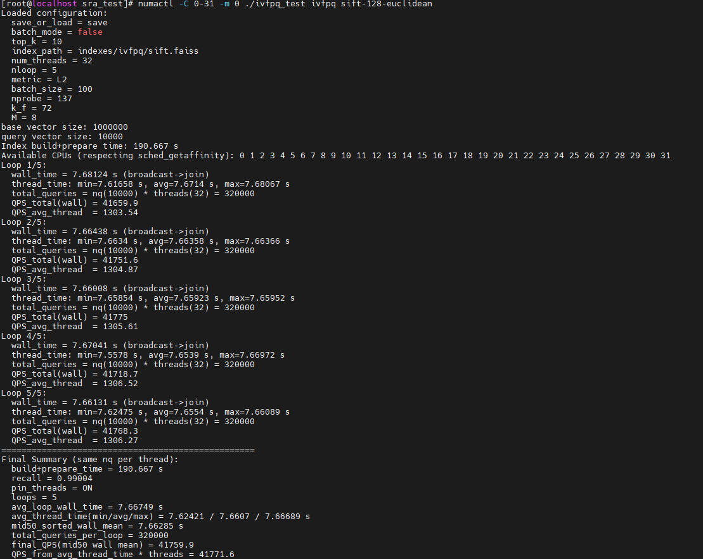

# 快速入门

## Faiss使能KRL

Faiss可对接KRL增强HNSW、PQFS、IVFPQ、IVFPQFS、IVFFLAT算法性能。用户需获取开源Faiss 1.8.0版本代码，合入使能KRL补丁后编译，最后得到KRL性能增强后的动态库文件。

1. 从[GitHub仓](https://github.com/facebookresearch/faiss.git)下载开源Faiss源代码，标签为**v1.8.0**。保存在编译机器可访问的路径中，假设位于“/path/to/faiss-1.8.0“。

    ```bash
    git clone --branch v1.8.0 --single-branch https://github.com/facebookresearch/faiss.git
    ```

2. 安装Make、CMake、GCC 12。GCC 12安装步骤适用于openEuler 22.03 LTS SP3系统，openEuler 24.03 LTS SP3系统自带GCC 12，仅安装Make、CMake。

    ```bash
    yum install make cmake gcc-toolset-12-gcc gcc-toolset-12-gcc-c++ gcc-toolset-12-libstdc++-static gcc-toolset-12-gcc-gfortran
    export PATH=/opt/openEuler/gcc-toolset-12/root/usr/bin/:$PATH
    export LD_LIBRARY_PATH=/opt/openEuler/gcc-toolset-12/root/usr/lib64/:$LD_LIBRARY_PATH
    ```

3. <a name="li84129301112"></a>Faiss依赖数学库，从[Github仓](https://github.com/OpenMathLib/OpenBLAS.git)下载开源OpenBLAS源代码，标签为**v0.3.29**。保存在编译机器可访问的路径中，假设位于“/path/to/OpenBLAS-0.3.29“。

    ```bash
    git clone --branch v0.3.29 --single-branch https://github.com/OpenMathLib/OpenBLAS.git
    ```

4. 编译源代码，生成libopenblas.so动态库文件。

    ```bash
    cd /path/to/OpenBLAS-0.3.29/OpenBLAS
    make
    make install
    ```

    > **说明：** 
    >可通过**make install PREFIX=/path/to/openblas/install**设置“/path/to/openblas/install“以指定安装路径，默认安装路径为“/opt/OpenBLAS“。

5. 解压BoostKit-boostsra-krl\_1.0.0.zip后可获取到使能KRL所需补丁文件0001-faiss-1.8.0-add-krl.patch；若您通过源码编译安装，则补丁文件位于“/path/to/krl“。安装补丁文件。

    ```bash
    cd /path/to/faiss-1.8.0/faiss
    patch -p1 < 0001-faiss-1.8.0-add-krl.patch
    ```

6. 编译Faiss代码获取libfaiss.so。

    ```bash
    export KRL_PATH=/usr/local/sra_krl
    cd /path/to/faiss-1.8.0
    cmake -B build . \
      -DFAISS_ENABLE_GPU=OFF \
      -DBUILD_TESTING=OFF \
      -DBUILD_SHARED_LIBS=ON \
      -DCMAKE_BUILD_TYPE=Release \
      -DFAISS_OPT_LEVEL=generic \
      -DFAISS_ENABLE_PYTHON=OFF \
      -DMKL_LIBRARIES=/opt/OpenBLAS/lib/libopenblas.so
    make -C build -j faiss
    make -C build install
    ```

    > **说明：** 
    >- **KRL_PATH**设置为“/usr/local/sra_krl“。
    >- 可通过在编译时添加编译选项 **-DCMAKE\_INSTALL\_PREFIX=/path/to/faiss/install**设置“/path/to/faiss/install“以指定安装路径，默认安装路径为“/usr/local“。
    >- 编译选项 **-DMKL\_LIBRARIES**需指定为步骤[3](#li84129301112)中OpenBLAS的安装路径。

## 使用示例

本章节提供的示例以使用sift-128-euclidean.hdf5数据集，Faiss（IVFPQ）算法，线程数32为例。使用前请参见[《KRL安装指南》](./installation_guide.md)完成KRL安装与Faiss使能KRL。

**获取数据集与测试程序<a name="section5300679419"></a>**

1. 获取[测试程序](https://atomgit.com/openeuler/sra_test.git)。分支为**v2.0.0**，假设程序运行的目录为“/path/to/sra\_test“，完整的目录结构应如下所示：

    ```text
    ├── configs                                                   // 存放对应算法和数据集配置文件
          └── ivfpq
                └── ivfpq_sift-128-euclidean.config 
    ├── include                                                   // 存放测试框架对应的头文件
          └── algo                                                // 各算法Index定义
          └── core                                                // 数据处理、测试结果处理等头文件
          └── framework                                           // 测试框架相关头文件
    ├── src                                                       // 存放测试框架对应的源文件
          └── algo                                                // 各算法适配层
          └── bench                                               // 统一测试文件
          └── core                                                // 数据处理、测试结果处理等文件
          └── registry                                            // 各算法工厂注册
    ├── Makefile                                                  // 编译脚本文件
    ├── test.sh                                                   // 测试脚本
    ├── test_muti-numas.sh                                        // 并行测试脚本
    ├── data                                                      // 存放数据集（需手动创建并存放数据集）
          └── sift-128-euclidean.hdf5
    ├── indexes
          └── ivfpq                                               // 存放构建好的索引（需手动创建）
                └── sift.faiss                                    // 构建好的索引，当运行可执行文件ivfpq_test且数据集配置文件中save_or_load参数设置为save时生成
    └── ivfpq_test                                                // 编译后生成的可执行文件
    ```

2. <a name="li1673311431218"></a>获取数据集，存放于“/path/to/sra\_test/data“。

    ```bash
    cd /path/to/sra_test
    mkdir -p data
    cd data
    wget http://ann-benchmarks.com/sift-128-euclidean.hdf5 --no-check-certificate
    ```

**性能测试<a name="section183012712414"></a>**

1. 安装相关依赖。

    ```bash
    yum install hdf5 hdf5-devel numactl numactl-devel
    ```

2. 编译可执行文件。根据命令行提示输入Faiss安装路径及其他所需依赖所在路径。在提示“Enter extra compile defines“时输入“-I/path/to/krl/out/include/ -L/path/to/krl/out/lib/ -lkrl“，其中“/path/to/krl/out“为KRL的安装路径。

    ```bash
    make ivfpq_test
    ```

    > **说明：** 
    >测试时不同的算法需要选择不同的编译指令：
    >- HNSW算法：**make hnsw\_test**
    >- PQFS算法：**make pqfs\_test**
    >- IVFPQ算法：**make ivfpq\_test**
    >- IVFPQFS算法：**make ivfpqfs\_test**
    >- IVFFLAT算法：**make ivfflat\_test**

3. 若是第一次执行，确保ivfpq\_sift-128-euclidean.config文件中的“save\_or\_load“为“save“；后续执行时可改为“load“，使用构建好的图索引或检索器查询。
4. 运行可执行文件。将OpenBLAS、Faiss与KRL动态库路径添加至环境变量。

    ```bash
    numactl -C 0-31 -m 0 ./ivfpq_test ivfpq sift-128-euclidean
    ```

运行结果如下所示：


