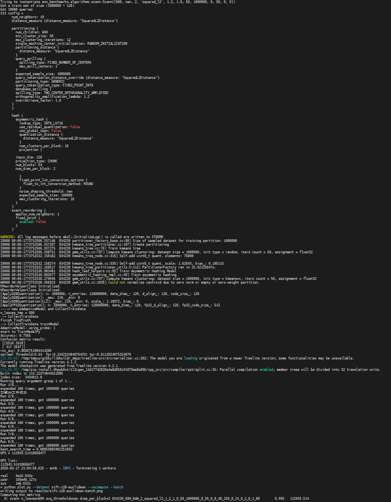
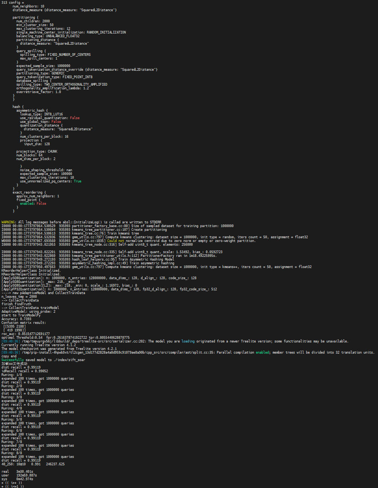

# 最佳实践

## Python

本章节以使用sift-128-euclidean.hdf5数据集为例，提供通过Python调用KScaNN算法接口的完整使用示例。调用前，请确保已安装KScaNN。

**获取测试代码<a name="section25419211384"></a>**

请从[GitCode](https://atomgit.com/openeuler/sra_scann_adapter.git)获取的源代码中的测试框架代码，标签为**v2.2.1**。假设源代码位于“/path/to/scann/sra\_scann\_adapter“，测试框架代码位于“/path/to/scann/sra\_scann\_adapter/ann-benchmarks“下。获取数据集。

```bash
cd /path/to/scann/sra_scann_adapter/ann-benchmarks
mkdir data && cd data
wget http://ann-benchmarks.com/sift-128-euclidean.hdf5 --no-check-certificate
```

主要文件的目录结构如下所示：

```text
├── data                                                    // 存放数据集
      └── sift-128-euclidean.hdf5
├── ann_benchmarks
      └── algorithms
            └── scann
                  └── config-sift-128-euclidean.yml         // 对应数据集配置文件
└── test.sh                                                 // 测试脚本
```

**测试步骤<a name="section25072475424"></a>**

1. 请确保参考[《KScaNN 安装指南》](./installation_guide.md)已安装scann-1.2.10-cp39-cp39-linux\_aarch64.whl。
2. 安装ann-benchmarks所需依赖。

    ```bash
    cd /path/to/scann/sra_scann_adapter/ann-benchmarks
    pip install -r requirements.txt
    yum install numactl numactl-devel
    ```

3. 运行测试脚本。

    ```bash
    sh test.sh 
    ```

测试结果如下所示：



## C++

本章节以使用sift-128-euclidean.hdf5数据集为例，提供通过C++调用KScaNN算法接口的完整使用示例。调用前，请确保已安装KScaNN。

**获取数据集和测试代码<a name="section155352047153818"></a>**

请从[GitCode](https://atomgit.com/openeuler/sra_scann_adapter.git)获取的源代码中测试框架代码，假设源代码位于“/path/to/scann/sra\_scann\_adapter“，测试框架代码位于“/path/to/scann/sra\_scann\_adapter/ann-benchmarks“下。

获取数据集。

```bash
cd /path/to/scann/sra_scann_adapter/ann-benchmarks
mkdir data && cd data
wget http://ann-benchmarks.com/sift-128-euclidean.hdf5 --no-check-certificate
```

主要文件的目录结构如下所示：

```text
├── ann-benchmarks
      ├── data                                                      // 存放数据集
            └── sift-128-euclidean.hdf5
      ├── ann_benchmarks
            └── algorithms
                  └── scann
                        └── cpp_test
                              └── config-sift-128-euclidean.config  // 对应数据集配置文件
            └── test_cpp.sh                                         // 测试脚本
├── scann
            ├── CMakeLists.txt                                      // 编译配置文件
            ├── eval.cpp                                            // 测试代码
            └── cmdline.h                                           // 命令行参数解析库头文件
project.sh                                                          // 编译脚本
```

**测试步骤<a name="section080205934220"></a>**

1. 请确保参考[《KScaNN 安装指南》](./installation_guide.md)已编译成功libscann\_cc.so。
2. 安装CMake。

    ```bash
    yum install cmake
    ```

3. 安装相关依赖。

    ```bash
    yum install numactl numactl-devel hdf5 hdf5-devel gtest-devel gcc-toolset-12-libstdc++-static
    ```

4. 安装Python依赖。

    ```bash
    cd /path/to/scann/sra_scann_adapter/ann-benchmarks
    pip install -r requirements.txt
    pip install treelite==4.2.1 tl2cgen
    ```

5. 安装protobuf。

    ```bash
    wget https://github.com/protocolbuffers/protobuf/archive/refs/tags/v3.21.9.tar.gz --no-check-certificate
    tar -xzf v3.21.9.tar.gz
    cd protobuf-3.21.9
    mkdir build && cd build
    cmake .. -Dprotobuf_BUILD_TESTS=OFF -DCMAKE_INSTALL_PREFIX=/usr/local/protobuf-3.21.9
    make install
    export PATH=/usr/local/protobuf-3.21.9/bin:$PATH
    export LD_LIBRARY_PATH=/usr/local/protobuf-3.21.9/lib:$LD_LIBRARY_PATH
    ```

6. 安装abseil。

    ```bash
    wget https://storage.googleapis.com/mirror.tensorflow.org/github.com/abseil/abseil-cpp/archive/fb3621f4f897824c0dbe0615fa94543df6192f30.tar.gz --no-check-certificate
    tar -xvzf fb3621f4f897824c0dbe0615fa94543df6192f30.tar.gz
    cd abseil-cpp-fb3621f4f897824c0dbe0615fa94543df6192f30
    mkdir build && cd build
    cmake .. && make -j
    make install
    ```

7. 安装eigen。

    ```bash
    git clone https://gitlab.com/libeigen/eigen.git
    cd eigen
    git checkout 33d0937c6bdf5ec999939fb17f2a553183d14a74
    mkdir build && cd build
    cmake .. -DCMAKE_INSTALL_PREFIX=/usr/local/eigen-3.3.7
    make -j && make install
    ```

8. 编译可执行文件。

    ```bash
    cd /path/to/scann/sra_scann_adapter
    sh project.sh --build_eval_cmake_sve
    ```

    > **说明：** 
    >project.sh中包含以下编译选项，可根据需求进行选择：
    >- --prepare：进行Python依赖安装。
    >- --build\_eval\_cmake\_sve：通过cmake使用libscann\_cc.so构建SVE指令版本的可执行文件。
    >- --build\_eval\_cmake\_neon：通过cmake使用libscann\_cc.so构建NEON指令版本的可执行文件。
    >- --build\_eval\_bazel\_sve：通过bazel使用源代码构建SVE指令版本的可执行文件。
    >- --build\_eval\_bazel\_neon：通过bazel使用源代码构建NEON指令版本的可执行文件。

9. 运行测试脚本。

    ```bash
    sh test_cpp.sh 
    ```

    > **说明：** 
    >测试过程中，数据集相关参数（如索引构建、搜索策略等）由配置文件统一控制，配置文件路径为：
    >./algorithms/scann/cpp\_test/config-\*.config，（“\*“为通配符，涵盖所有以config-开头、.config结尾的配置文件，如config-deep-image-96-angular.config等。）
    >通过调整配置文件中的 index\_save\_or\_load 参数，可控制测试过程中索引的处理模式，具体说明如下：
    >- save：从头构建搜索索引，并将索引保存至指定路径，便于后续直接加载使用。
    >- load：跳过索引构建步骤，直接从指定路径读取已保存的索引文件进行搜索，适用于验证索引复用场景。
    >- 其他值（非save/load）：从头构建搜索索引，但不保存索引文件，测试完成后索引仅在当前进程中生效。

测试结果如下所示：



## KScaNN对接Milvus

KScaNN算法可对接Milvus数据库（2.4.5版本）使用，在保证高召回率的前提下，尽可能提高查询效率。

KScaNN算法通过动态库内联、低比特量化、检索算子、向量化指令等优化，进一步提高了开源ScaNN算法的检索能力。具体使用步骤如下：

1. 安装Milvus。

    请参见《[Milvus数据库 安装指南](https://www.hikunpeng.com/document/detail/zh/kunpengdbs/ecosystemEnable/Milvus/kunpeng_milv_ins_42_001.html)》进行安装。

2. 将补丁文件合入到Milvus中全量编译。

    请参见《[Milvus数据库KScaNN优化 特性指南](https://www.hikunpeng.com/document/detail/zh/kunpengdbs/appAccelFeatures/Milvuskscannop/kunpeng_kscann_tx_64_002.html)》。

3. 使用ann-benchmarks测试。

    请参见《[Milvus数据库ann-benchmarks 测试指导](https://www.hikunpeng.com/document/detail/zh/kunpengdbs/testguide/tstg/kunpeng_ann_marks_001.html)》进行测试。
