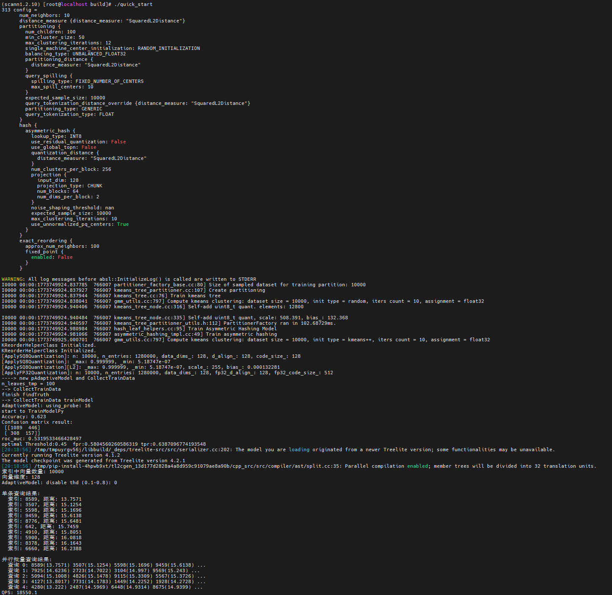

# 快速入门

本节提供快速上手KScaNN核心功能的简易指导。

## 核心概念

KScaNN是基于开源ScaNN算法的优化实现，专门用于高效向量相似性搜索：

- 向量：KScaNN支持float32类型的向量。Python接口使用numpy.ndarray格式，C++接口使用ConstSpan&lt;float&gt;或DenseDataset&lt;float&gt;。
- 索引类型：KScaNN采用IVF+PQ+Reorder的三阶段索引结构，通过聚类分区、乘积量化和精排重排实现高效近似搜索。
- 核心流程：准备数据 → 配置参数 → 构建索引 → 执行搜索 → 获取结果

## 快速入门示例

以下是覆盖KScaNN核心使用场景的完整代码，包含注释和结果解析。覆盖KScaNN最基本的使用流程：构建索引、单条搜索、批量搜索。

```c++
#include <scann/scann_ops/cc/scann.h>
#include <iostream>
#include <vector>
#include <random>
#include <memory>

using namespace research_scann;

int main() {
    // 1. 准备数据
    int d = 128;                              // 向量维度
    int nb = 10000;                           // 底库向量数量
    int nq = 5;                               // 查询向量数量
    int k = 10;                               // 返回最近邻数量

    std::vector<float> db_vectors(nb * d);
    std::vector<float> query_vectors(nq * d);

    std::mt19937 rng(42);
    std::uniform_real_distribution<float> dist(0.0f, 1.0f);
    for (auto& v : db_vectors) v = dist(rng);
    for (auto& v : query_vectors) v = dist(rng);

    // 2. 配置索引参数
    //    - 128维向量，SquaredL2距离
    //    - 100个IVF分区
    //    - PQ量化：每2维一个块，共64块，每块256个聚类中心
    //    - 重排候选数量100
    std::string config = R"(
      num_neighbors: 10
      distance_measure {distance_measure: "SquaredL2Distance"}
      partitioning {
        num_children: 100
        min_cluster_size: 50
        max_clustering_iterations: 12
        single_machine_center_initialization: RANDOM_INITIALIZATION
        balancing_type: UNBALANCED_FLOAT32
        partitioning_distance {
          distance_measure: "SquaredL2Distance"
        }
        query_spilling {
          spilling_type: FIXED_NUMBER_OF_CENTERS
          max_spill_centers: 10
        }
        expected_sample_size: 10000
        query_tokenization_distance_override {distance_measure: "SquaredL2Distance"}
        partitioning_type: GENERIC
        query_tokenization_type: FLOAT
      }
      hash {
        asymmetric_hash {
          lookup_type: INT8
          use_residual_quantization: False
          use_global_topn: False
          quantization_distance {
            distance_measure: "SquaredL2Distance"
          }
          num_clusters_per_block: 256
          projection {
            input_dim: 128
            projection_type: CHUNK
            num_blocks: 64
            num_dims_per_block: 2
          }
          noise_shaping_threshold: nan
          expected_sample_size: 10000
          max_clustering_iterations: 10
          use_unnormalized_pq_centers: True
        }
      }
      exact_reordering {
        approx_num_neighbors: 100
        fixed_point {
          enabled: False
        }
      }
    )";

    // 3. 配置KMeans参数并构建索引
    GmmUtils::KMeansParams kmOpt;
    kmOpt.ivf.iter = 10;
    kmOpt.ivf.sample = 10000;
    kmOpt.ivf.init = 0;
    kmOpt.pq.iter = 10;
    kmOpt.pq.sample = 10000;
    kmOpt.pq.init = 0;

    auto scann = std::make_unique<ScannInterface>();
    ConstSpan<float> dataset(db_vectors.data(), db_vectors.size());

    auto status = scann->Initialize(dataset, nb, config, 8, kmOpt);

    if (!status.ok()) {
        std::cerr << "索引构建失败: " << status.ToString() << std::endl;
        return -1;
    }

    std::cout << "索引中向量数量: " << scann->GetNum() << std::endl;
    std::cout << "向量维度: " << scann->GetDim() << std::endl;

    // 4. 配置搜索参数
    int nprobe = 10;
    int reorder = 100;

    scann->SearchAdditionalParams(0.0f, 0.0f, 0, nprobe);
    scann->SetNumThreads(8);

    // 5. 执行单条查询搜索
    DatapointPtr<float> query(nullptr, query_vectors.data(), d, d);
    NNResultsVector results;

    status = scann->Search(query, &results, k, reorder, nprobe);

    if (status.ok()) {
        std::cout << "\n单条查询结果:" << std::endl;
        for (const auto& result : results) {
            std::cout << "  索引: " << result.first
                      << ", 距离: " << result.second << std::endl;
        }
    }

    // 6. 执行批量搜索
    std::vector<float> q_vec(query_vectors.begin(), query_vectors.end());
    DenseDataset<float> queries(std::move(q_vec), nq);

    std::unique_ptr<NNResultsVector[]> batch_results{new NNResultsVector[nq]};

    scann->SearchBatched(
        queries,
        MutableSpan<NNResultsVector>(&batch_results[0], nq),
        k,
        reorder,
        nprobe
    );

    std::cout << "\n批量查询结果:" << std::endl;
    for (int i = 0; i < nq; ++i) {
        std::cout << "  查询 " << i << ": ";
        for (size_t j = 0; j < std::min((size_t)4, batch_results[i].size()); ++j) {
            std::cout << batch_results[i][j].first
                      << "(" << batch_results[i][j].second << ") ";
        }
        std::cout << "..." << std::endl;
    }

    return 0;
}
```

预期结果如下：



## 进阶扩展

进阶示例展示KMeans++优化构建、非并行搜索、自适应参数配置、并行批量搜索（多轮QPS统计）、索引序列化与反序列化、反序列化后重新搜索验证。高级功能。

```c++
#include <scann/scann_ops/cc/scann.h>
#include <iostream>
#include <vector>
#include <random>
#include <memory>
#include <chrono>

using namespace research_scann;

int main() {
    // 1. 准备数据
    int d = 128;
    int nb = 100000;
    int nq = 1000;
    int k = 10;

    std::vector<float> db_vectors(nb * d);
    std::vector<float> query_vectors(nq * d);

    std::mt19937 rng(42);
    std::uniform_real_distribution<float> dist(0.0f, 1.0f);
    for (auto& v : db_vectors) v = dist(rng);
    for (auto& v : query_vectors) v = dist(rng);

    // 2. 配置索引参数（100000条128维向量，100个IVF分区）
    std::string config = R"(
      num_neighbors: 10
      distance_measure {distance_measure: "SquaredL2Distance"}
      partitioning {
        num_children: 100
        min_cluster_size: 50
        max_clustering_iterations: 12
        single_machine_center_initialization: RANDOM_INITIALIZATION
        balancing_type: UNBALANCED_FLOAT32
        partitioning_distance {
          distance_measure: "SquaredL2Distance"
        }
        query_spilling {
          spilling_type: FIXED_NUMBER_OF_CENTERS
          max_spill_centers: 1
        }
        expected_sample_size: 100000
        query_tokenization_distance_override {distance_measure: "SquaredL2Distance"}
        partitioning_type: GENERIC
        query_tokenization_type: FLOAT
      }
      hash {
        asymmetric_hash {
          lookup_type: INT8
          use_residual_quantization: False
          use_global_topn: False
          quantization_distance {
            distance_measure: "SquaredL2Distance"
          }
          num_clusters_per_block: 256
          projection {
            input_dim: 128
            projection_type: CHUNK
            num_blocks: 64
            num_dims_per_block: 2
          }
          noise_shaping_threshold: nan
          expected_sample_size: 100000
          max_clustering_iterations: 10
          use_unnormalized_pq_centers: True
        }
      }
      exact_reordering {
        approx_num_neighbors: 1
        fixed_point {
          enabled: False
        }
      }
    )";

    // 3. 配置KMeans优化参数并构建索引（对应eval: Build）
    GmmUtils::KMeansParams kmOpt;
    kmOpt.ivf.iter = 10;
    kmOpt.ivf.sample = 10000;
    kmOpt.ivf.init = 2;                    // K-Means++初始化
    kmOpt.pq.iter = 10;
    kmOpt.pq.sample = 10000;
    kmOpt.pq.init = 2;

    auto scann = std::make_unique<ScannInterface>();
    ConstSpan<float> dataset(db_vectors.data(), db_vectors.size());

    auto status = scann->Initialize(dataset, nb, config, 8, kmOpt);

    if (!status.ok()) {
        std::cerr << "索引构建失败: " << status.ToString() << std::endl;
        return -1;
    }

    std::cout << "索引中向量数量: " << scann->GetNum() << std::endl;
    std::cout << "向量维度: " << scann->GetDim() << std::endl;

    // 4. 搜索参数
    int nprobe = 10;
    int reorder = 100;
    float adp_threshold = 0.3f;
    float refine_prm = 0.2f;
    int adp_refined = 0;
    int num_thread = 8;
    int batch_size = 256;

    // 5. 非并行搜索（对应eval: Search → SearchBatchedParallel 第一次调用验证正确性）
    {
        scann->SearchAdditionalParams(adp_threshold, refine_prm, adp_refined, nprobe);
        scann->SetNumThreads(num_thread);

        std::vector<float> q_vec(query_vectors.begin(), query_vectors.end());
        DenseDataset<float> queries(std::move(q_vec), nq);
        std::unique_ptr<NNResultsVector[]> res{new NNResultsVector[nq]};

        scann->SearchBatchedParallel(
            queries,
            MutableSpan<NNResultsVector>(&res[0], nq),
            k, reorder, nprobe, batch_size
        );

        std::cout << "\n非并行搜索结果（前3条）:" << std::endl;
        for (int i = 0; i < std::min(nq, 3); ++i) {
            std::cout << "  查询 " << i << ": ";
            for (size_t j = 0; j < std::min((size_t)4, res[i].size()); ++j) {
                std::cout << res[i][j].first << "(" << res[i][j].second << ") ";
            }
            std::cout << "..." << std::endl;
        }
    }

    // 6. 并行批量搜索 + 多轮QPS统计（对应eval: ParallelSearch多轮循环）
    int numRuns = 3;
    std::vector<float> qps_list;

    for (int run = 0; run < numRuns; ++run) {
        std::cout << "Running: " << run + 1 << "/" << numRuns << std::endl;

        // 每轮重新构造 queries（eval中也是每轮重新构造DenseDataset）
        std::vector<float> q_run(query_vectors.begin(), query_vectors.end());
        DenseDataset<float> queries_run(std::move(q_run), nq);

        std::unique_ptr<NNResultsVector[]> res{new NNResultsVector[nq]};

        // 搜索前重新设置参数（对应eval每轮循环中的 SearchAdditionalParams + SetNumThreads）
        scann->SearchAdditionalParams(adp_threshold, refine_prm, adp_refined, nprobe);
        if (num_thread != 320)
            scann->SetNumThreads(num_thread - 1);

        auto t1 = std::chrono::high_resolution_clock::now();

        scann->SearchBatchedParallel(
            queries_run,
            MutableSpan<NNResultsVector>(&res[0], nq),
            k, reorder, nprobe, batch_size
        );

        auto t2 = std::chrono::high_resolution_clock::now();
        double delta_ns = std::chrono::duration_cast<std::chrono::nanoseconds>(t2 - t1).count();
        float qps = (double)nq * 1e9 / delta_ns;
        qps_list.push_back(qps);
    }

    float max_qps = *std::max_element(qps_list.begin(), qps_list.end());
    printf("%d_%d:\t%d@%d\tQPS: %.3f\n", nprobe, reorder, k, k, max_qps);

    // 7. 索引序列化与反序列化（对应eval: Serialize + Deserialize）
    uint8_t* dataPtr = nullptr;
    size_t length = 0;
    scann->SerializeToMemory(dataPtr, length);
    std::cout << "\n序列化大小: " << length / 1024 << " KB" << std::endl;

    auto loaded = std::make_unique<ScannInterface>();
    loaded->LoadFromMemory(dataPtr, length);
    std::cout << "加载后向量数量: " << loaded->GetNum() << std::endl;
    std::cout << "加载后向量维度: " << loaded->GetDim() << std::endl;

    // 8. 反序列化后重新搜索验证（需要重新配置搜索参数）
    loaded->SearchAdditionalParams(adp_threshold, refine_prm, adp_refined, nprobe);
    loaded->SetNumThreads(num_thread);

    {
        std::vector<float> q_verify(query_vectors.begin(), query_vectors.end());
        DenseDataset<float> queries_verify(std::move(q_verify), nq);
        std::unique_ptr<NNResultsVector[]> res{new NNResultsVector[nq]};

        loaded->SearchBatchedParallel(
            queries_verify,
            MutableSpan<NNResultsVector>(&res[0], nq),
            k, reorder, nprobe, batch_size
        );

        std::cout << "\n反序列化后搜索结果（前3条）:" << std::endl;
        for (int i = 0; i < std::min(nq, 3); ++i) {
            std::cout << "  查询 " << i << ": ";
            for (size_t j = 0; j < std::min((size_t)4, res[i].size()); ++j) {
                std::cout << res[i][j].first << "(" << res[i][j].second << ") ";
            }
            std::cout << "..." << std::endl;
        }
    }

    delete[] dataPtr;
    return 0;
}
```

预期结果如下：


