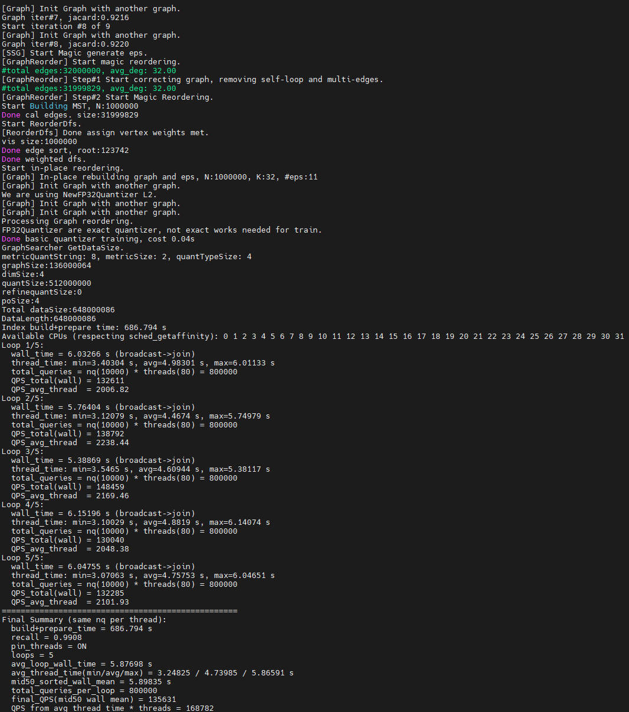

# 最佳实践

## 性能测试

本节以使用sift-128-euclidean.hdf5数据集，线程数32为例，提供通过C++调用KBest算法接口的完整使用示例。调用前，请确保已安装KBest。

**获取数据集与测试程序<a name="section5124167418"></a>**

1. 获取[测试程序](https://atomgit.com/openeuler/sra_test.git)。分支为**v2.0.0**，假设程序运行的目录为“/path/to/sra\_test”，完整的目录结构应如下所示。

    ```text
    ├── configs                                                   // 存放对应算法和数据集配置文件
          └── kbest
                └── kbest_sift-128-euclidean.config 
    ├── include                                                   // 存放测试框架对应的头文件
          └── algo                                                // 各算法Index定义
          └── core                                                // 数据处理、测试结果处理等头文件
          └── framework                                           // 测试框架相关头文件
    ├── src                                                       // 存放测试框架对应的源文件
          └── algo                                                // 各算法适配层
          └── bench                                               // 统一测试文件
          └── core                                                // 数据处理、测试结果处理等文件
          └── registry                                            // 各算法工厂注册
    ├── Makefile                                                  // 编译脚本文件
    ├── test.sh                                                   // 测试脚本
    ├── test_muti-numas.sh                                        // 并行测试脚本
    ├── data                                                      // 存放数据集（需手动创建并存放数据集）
          └── sift-128-euclidean.hdf5
    ├── indexes
          └── kbest                                               // 存放构建好的索引
                └── sift.kbest                                    // 构建好的索引，当运行可执行文件kbest_test且数据集配置文件中save_or_load参数设置为save时生成
    └── kbest_test                                                // 编译后生成的可执行文件
    ```

2. <a name="li1673311431218"></a>获取数据集，存放于“/path/to/sra\_test/data”。

    ```bash
    cd /path/to/sra_test
    mkdir -p data
    cd data
    wget http://ann-benchmarks.com/sift-128-euclidean.hdf5 --no-check-certificate
    ```

**测试示例<a name="section5255174043217"></a>**

1. 安装相关依赖。

    ```bash
    yum install hdf5 hdf5-devel numactl numactl-devel
    ```

2. 请参考《[安装指南](./installation_guide.md)》编译安装KBest。
3. 编译可执行文件。根据命令行提示输入KBest安装路径及其他所需依赖所在路径。

    ```bash
    make kbest_test
    ```

4. 若是第一次执行，确保kbest\_sift-128-euclidean.config文件中的“save\_or\_load”为“save”；后续执行时可改为“load”，使用构建好的图索引查询。
5. 运行可执行文件。

    ```bash
    numactl -C 0-31 -m 0 ./kbest_test kbest sift-128-euclidean
    ```

测试结果如下所示：



## KBest对接Milvus

KBest算法可对接Milvus数据库（2.4.5版本）使用，在保证高召回率的前提下，尽可能提高查询效率。本实践以应用patch文件的方式，将KBest算法接入开源的Milvus数据库中，无缝使用新的图索引算法。

在Milvus支持的所有索引算法中，基于图的索引算法是HNSW，它能进行快速查询，取得较高的召回率，但是消耗的内存资源较大。为了扩展基于图的索引算法，在保证高召回率的前提下，尽可能加速查询效率，KBest算法通过量化、向量指令等方法优化了最近邻搜索的性能和精度，提供了对标开源Faiss HNSW算法的检索能力。具体对接使用步骤如下：

1. 安装Milvus。

    请参见《[Milvus数据库 安装指南](https://www.hikunpeng.com/document/detail/zh/kunpengdbs/ecosystemEnable/Milvus/kunpeng_milv_ins_42_001.html)》进行安装。

2. 将补丁文件合入到Milvus中全量编译。

    请参见《[Milvus KBest优化 特性指南](https://www.hikunpeng.com/document/detail/zh/boostdb/milvus/milvuskbestop/docs/zh/milvus_kbest_optimization_feature_guide.md)》。

3. 使用ann-benchmarks测试。

    请参见《[Milvus数据库ann-benchmarks 测试指导](https://www.hikunpeng.com/document/detail/zh/kunpengdbs/testguide/tstg/kunpeng_ann_marks_001.html)》进行测试。
